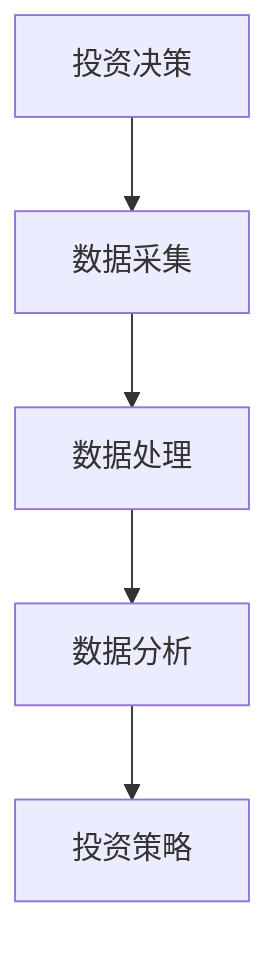
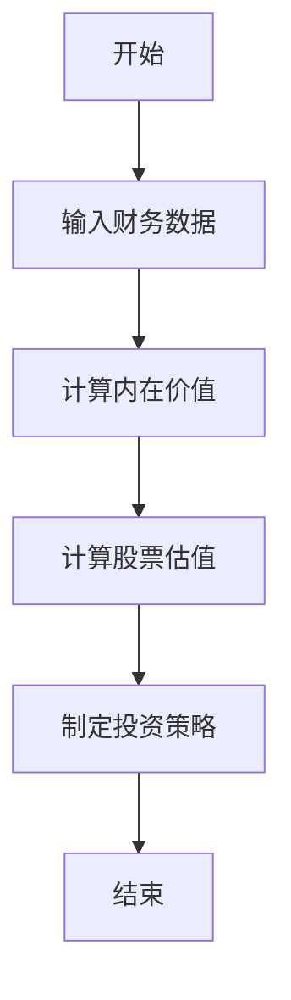

                 


# 巴菲特的时间框架：长期主义的投资优势

> 关键词：巴菲特, 长期主义, 投资策略, 内在价值, 价值投资

> 摘要：本文深入探讨了巴菲特的时间框架和长期主义投资策略，分析了其核心理念、数学模型、系统架构以及实际应用。通过详细的技术分析和案例研究，揭示了长期主义在投资中的优势和实际操作方法。

---

## 第一章: 巴菲特投资理念的背景与核心思想

### 1.1 巴菲特的生平与投资哲学

#### 1.1.1 巴菲特的早年经历与投资启蒙

沃伦·巴菲特，作为世界著名投资者，其投资哲学深受格雷厄姆价值投资理论的影响。他在童年时期展现出对数字和投资的兴趣，进入哥伦比亚大学后，师从本杰明·格雷厄姆，开始系统学习价值投资理论。巴菲特的投资理念强调安全边际和内在价值，这为他后来的长期主义投资奠定了基础。

#### 1.1.2 巴菲特的价值投资理念

巴菲特的价值投资理念强调购买低于其内在价值的股票，并长期持有。他认为市场先生是疯狂的，当市场恐慌时，投资者有机会以低于内在价值的价格买入优质资产。这种逆向投资策略使他能够在市场低迷时积累财富。

#### 1.1.3 巴菲特投资哲学的核心思想

巴菲特的核心思想是：投资的本质是寻找具有持续竞争优势的企业，以合理价格买入并长期持有。他强调企业基本面分析，关注ROE（净资产收益率）和ROA（资产回报率），并注重企业的财务健康状况和管理层质量。

### 1.2 长期主义的定义与内涵

#### 1.2.1 长期主义的定义

长期主义是一种投资策略，强调关注企业的长期价值，而非短期市场波动。巴菲特的长期主义投资策略要求投资者选择具有持续竞争优势和稳定增长前景的企业，并长期持有。

#### 1.2.2 长期主义的核心要素

- **内在价值**：企业未来现金流的现值。
- **竞争优势**：企业相对于竞争对手的核心优势。
- **管理层质量**：管理层的诚信和能力。
- **财务健康**：企业的财务状况是否稳健。

#### 1.2.3 长期主义与短期投资的对比

| 对比维度         | 长期主义               | 短期投资               |
|------------------|------------------------|------------------------|
| 时间框架         | 长期（数年甚至数十年）   | 短期（数月或数年）       |
| 投资目标         | 企业长期价值增长       | 短期价格波动            |
| 风险承受能力     | 较高                   | 较低                   |
| 交易频率         | 低                     | 高                     |

### 1.3 巴菲特长期主义的实践基础

#### 1.3.1 巴菲特的选股标准

巴菲特选股注重以下几点：
1. **强大的竞争优势**：企业能在竞争中持续盈利。
2. **稳健的财务状况**：低负债率和稳定的现金流。
3. **优秀的管理层**：诚实且有能力的管理层。
4. **合理的价格**：买入价格低于内在价值。

#### 1.3.2 巴菲特的持股策略

巴菲特的持股策略是“买入并持有”，他认为市场短期波动不可预测，长期持有优质股票将获得超额收益。他建议投资者每年只做一次投资决策，避免频繁交易。

#### 1.3.3 巴菲特的长期主义投资案例

以可口可乐为例，巴菲特在1988年买入可口可乐股票，并长期持有。他认为可口可乐具有强大的品牌优势和持续增长的潜力。通过长期持有，他获得了可观的复利收益。

### 1.4 本章小结

本章介绍了巴菲特的生平及其投资哲学，重点阐述了长期主义的定义、核心要素和选股策略。通过案例分析，展示了长期主义的实际应用。

---

## 第二章: 长期主义的核心概念与数学模型

### 2.1 长期主义的核心概念

#### 2.1.1 价值投资的数学模型

价值投资的核心在于计算企业的内在价值。巴菲特使用格雷厄姆的内在价值公式：

$$ V = \frac{CF}{r - g} $$

其中，\( CF \) 是企业未来产生的自由现金流，\( r \) 是折现率，\( g \) 是现金流增长率。

#### 2.1.2 内在价值的计算公式

内在价值是企业未来现金流的现值。假设企业未来现金流以固定增长率增长，其内在价值公式为：

$$ V = \frac{CF}{r - g} $$

#### 2.1.3 股票估值公式

股票的公允价值可以通过市盈率（P/E）或市净率（P/B）来估算。公式如下：

$$ P = \frac{E}{E/P} $$

其中，\( P \) 是股票价格，\( E \) 是净利润，\( E/P \) 是市盈率。

### 2.2 长期主义与复利效应的关系

#### 2.2.1 复利效应的数学公式

复利效应是长期投资的重要驱动力，其公式为：

$$ A = P \times (1 + r)^n $$

其中，\( A \) 是终值，\( P \) 是本金，\( r \) 是年化收益率，\( n \) 是投资年数。

#### 2.2.2 复利效应在投资中的应用

长期投资通过复利效应，能够实现财富的指数增长。巴菲特的长期主义正是利用复利效应，通过长期持有优质股票，获得指数级收益。

#### 2.2.3 复利效应的长期影响

复利效应的时间影响可以用以下公式表示：

$$ A = P \times (1 + r)^n $$

长期持有股票，\( n \) 增大时，收益呈指数增长，远超一次性投资收益。

### 2.3 长期主义的数学模型与公式

#### 2.3.1 内在价值公式

$$ V = \frac{CF}{r - g} $$

#### 2.3.2 股票估值公式

$$ P = \frac{E}{E/P} $$

#### 2.3.3 复利公式

$$ A = P \times (1 + r)^n $$

### 2.4 本章小结

本章通过数学模型详细解释了长期主义的核心概念，包括内在价值计算、股票估值和复利效应的应用。这些模型为长期投资决策提供了理论支持。

---

## 第三章: 长期主义的投资策略与系统分析

### 3.1 长期主义的投资策略

#### 3.1.1 价值投资策略

价值投资策略强调寻找市场价格低于内在价值的股票。巴菲特通过分析企业的财务状况和竞争优势，选择具有长期增长潜力的企业。

#### 3.1.2 股票选择策略

股票选择策略包括：
1. 分析企业的财务报表，评估其盈利能力、负债状况和现金流。
2. 评估企业的竞争优势，如品牌、技术壁垒和市场地位。
3. 关注管理层的质量和诚信。

#### 3.1.3 风险管理策略

风险管理策略包括：
1. 分散投资：避免将所有资金投资于单一股票或行业。
2. 保持充足流动性：确保在市场低迷时能够增持优质资产。
3. 定期审视投资组合：评估企业的基本面变化。

### 3.2 投资系统的架构设计

#### 3.2.1 系统功能模块

投资系统主要功能模块包括：
- 数据采集：获取企业的财务数据和市场信息。
- 数据处理：清洗和整理数据。
- 数据分析：计算内在价值和评估企业。
- 投资策略：制定长期投资策略。

#### 3.2.2 系统架构图



### 3.3 投资系统的接口设计

#### 3.3.1 数据接口

数据接口包括：
- 获取企业财务数据的API。
- 获取市场数据的API。

#### 3.3.2 策略接口

策略接口包括：
- 计算内在价值的函数。
- 评估企业竞争优势的函数。

#### 3.3.3 风险控制接口

风险控制接口包括：
- 计算投资组合风险的函数。
- 监控市场波动的函数。

### 3.4 本章小结

本章详细阐述了长期主义的投资策略，并通过系统架构图展示了投资系统的整体架构。系统设计为投资者提供了从数据采集到投资决策的完整流程。

---

## 第四章: 长期主义的数学模型与算法实现

### 4.1 长期主义的数学模型

#### 4.1.1 内在价值模型

内在价值模型用于评估企业的长期价值。公式如下：

$$ V = \frac{CF}{r - g} $$

其中，\( CF \) 是企业未来现金流，\( r \) 是折现率，\( g \) 是现金流增长率。

#### 4.1.2 股票估值模型

股票估值模型用于确定股票的公允价值。公式如下：

$$ P = \frac{E}{E/P} $$

其中，\( P \) 是股票价格，\( E \) 是净利润，\( E/P \) 是市盈率。

### 4.2 算法实现

#### 4.2.1 算法流程



#### 4.2.2 Python实现

以下是计算内在价值的Python代码示例：

```python
def calculate_intrinsic_value(cash_flow, discount_rate, growth_rate):
    return cash_flow / (discount_rate - growth_rate)
```

#### 4.2.3 算法优化

为了提高计算效率，可以采用并行计算和优化算法。例如，使用蒙特卡洛模拟评估内在价值。

### 4.3 本章小结

本章通过数学模型和算法实现，详细解释了长期主义的投资策略。模型和代码为投资者提供了理论支持和实际操作指南。

---

## 第五章: 长期主义的投资系统与实际应用

### 5.1 投资系统的实际应用

#### 5.1.1 系统功能实现

投资系统实现了以下功能：
- 数据采集：获取企业的财务数据和市场信息。
- 数据分析：计算内在价值和评估企业。
- 投资决策：制定长期投资策略。

#### 5.1.2 系统优化

系统优化包括：
- 提高数据处理效率。
- 优化算法计算速度。
- 增强系统的稳定性和可靠性。

### 5.2 投资系统的实际案例

以可口可乐为例，巴菲特通过长期持有股票，获得了稳定的复利收益。系统可以通过分析企业的财务数据和市场信息，评估其长期价值，制定投资策略。

### 5.3 本章小结

本章通过实际案例展示了长期主义的投资策略，并阐述了投资系统的实际应用和优化方法。

---

## 第六章: 长期主义的挑战与风险管理

### 6.1 长期主义的挑战

#### 6.1.1 市场波动的影响

市场波动可能导致短期亏损，但长期持有优质股票将获得超额收益。

#### 6.1.2 管理层变化的风险

管理层的变化可能影响企业的长期发展，投资者需关注管理层的诚信和能力。

### 6.2 风险管理策略

#### 6.2.1 分散投资

分散投资可以降低单一股票的风险，提高整体投资组合的稳定性。

#### 6.2.2 风险控制

通过设定止损点和监控市场波动，可以有效控制投资风险。

### 6.3 本章小结

本章分析了长期主义的挑战，并提出了风险管理策略，帮助投资者应对市场波动和管理层变化的风险。

---

## 第七章: 长期主义的总结与展望

### 7.1 本章总结

长期主义是一种有效的投资策略，通过关注企业的长期价值，实现稳定的投资回报。巴菲特的长期主义投资策略为投资者提供了宝贵的理论和实践指导。

### 7.2 未来展望

随着市场的变化和技术的发展，长期主义投资策略将不断完善。投资者应持续学习和适应市场变化，优化投资组合，以实现长期收益。

### 7.3 本章小结

本章总结了长期主义的核心思想，并展望了其未来的发展方向。

---

## 作者：AI天才研究院/AI Genius Institute & 禅与计算机程序设计艺术 /Zen And The Art of Computer Programming

---

这篇文章系统地阐述了巴菲特的时间框架和长期主义投资策略，从理论分析到实际应用，为读者提供了全面的指导。通过数学模型和系统架构的设计，展示了长期主义的科学性和可行性。希望这篇文章能为投资者提供有价值的见解和实际操作的指导。

