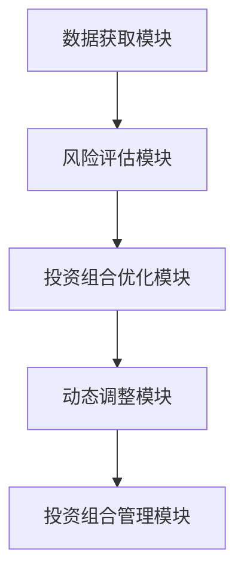
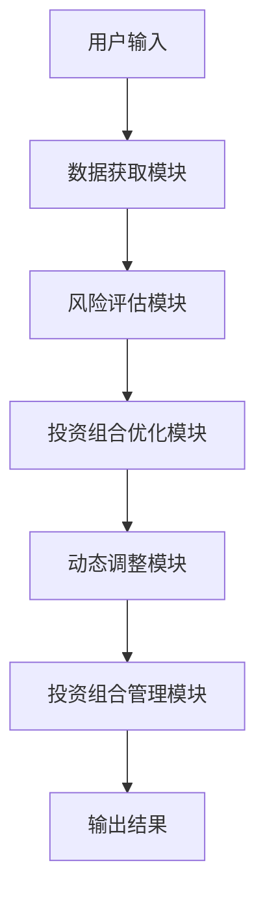

                 


# 巴菲特的杠铃策略：现金+股票的平衡

## 关键词：巴菲特，杠铃策略，现金，股票，投资策略，风险管理

## 摘要：本文深入分析巴菲特提出的杠铃策略，探讨如何通过平衡现金和股票的投资比例，优化投资组合的风险与收益。文章从策略背景、数学模型、系统架构到项目实战，全面解析杠铃策略的实现方法，帮助投资者在复杂市场中实现稳健投资。

---

# 第一部分: 巴菲特的杠铃策略概述

## 第1章: 巴菲特杠铃策略的背景与起源

### 1.1 巴菲特的投资理念

#### 1.1.1 巴菲特的生平与投资哲学

沃伦·巴菲特（Warren Buffett）是全球最著名的价值投资者之一，他的投资哲学强调长期持有优质资产，注重安全边际和企业的基本面分析。巴菲特的投资理念源于他的导师本杰明·格雷厄姆（Benjamin Graham），格雷厄姆的价值投资理论奠定了巴菲特的投资基础。

巴菲特认为，投资的本质是寻找具有持续竞争优势的企业，并在合理的价格范围内买入并长期持有。他强调分散投资的重要性，但更注重集中投资于少数优质企业。这种投资哲学使他成为全球最成功的投资者之一。

#### 1.1.2 巴菲特的价值投资理论

巴菲特的价值投资理论的核心是寻找那些具有强大护城河（competitive moat）的企业，这些企业能够在长期的竞争中保持优势。他强调企业基本面的分析，包括盈利能力、财务状况、管理层素质等因素。

巴菲特的价值投资理论还强调安全边际，即以低于内在价值的价格买入资产。他认为，市场价格波动为投资者提供了以合理价格买入优质资产的机会。

#### 1.1.3 巴菲特杠铃策略的提出背景

杠铃策略（Barbell Strategy）是巴菲特在2008年全球金融危机期间提出的一种投资策略。他在《巴菲特致股东的信》中提到，杠铃策略的核心思想是通过同时持有现金和股票来平衡投资组合的风险和收益。

在2008年金融危机期间，巴菲特意识到市场的不确定性，他选择持有大量的现金以应对市场的极端情况。杠铃策略的提出，是巴菲特在应对市场波动和风险时的一种创新策略。

### 1.2 巴菲特杠铃策略的核心思想

#### 1.2.1 现金与股票的平衡理念

杠铃策略的核心思想是通过平衡现金和股票的投资比例，来优化投资组合的风险和收益。现金作为低风险资产，能够在市场下跌时提供流动性支持；股票作为高风险资产，能够在市场上涨时获得较高的收益。

杠铃策略强调在不同市场环境下动态调整现金和股票的比例，以应对市场的波动和不确定性。

#### 1.2.2 巴菲特杠铃策略的定义与特点

杠铃策略是一种通过同时持有现金和股票来平衡投资组合风险和收益的策略。其特点包括：

1. **低风险资产（现金）与高风险资产（股票）的结合**：杠铃策略通过持有现金和股票，实现风险和收益的平衡。
2. **动态调整**：根据市场环境的变化，动态调整现金和股票的比例，以优化投资组合的风险和收益。
3. **长期投资**：杠铃策略强调长期投资，通过时间的积累实现资产的稳健增长。

#### 1.2.3 巴菲特杠铃策略的适用场景

杠铃策略适用于以下场景：

1. **市场不确定性较高时**：当市场存在较大的不确定性时，杠铃策略可以通过持有现金来规避市场的风险。
2. **市场估值过高时**：当市场估值过高时，杠铃策略可以通过增加现金比例来规避市场的回调风险。
3. **市场估值过低时**：当市场估值过低时，杠铃策略可以通过增加股票比例来抓住市场的反弹机会。

---

## 第2章: 巴菲特杠铃策略的核心概念与联系

### 2.1 巴菲特杠铃策略的原理

#### 2.1.1 现金与股票的配比关系

杠铃策略的核心是通过合理配置现金和股票的比例，实现投资组合的风险和收益的平衡。现金和股票的比例通常根据市场环境和投资者的风险偏好进行动态调整。

#### 2.1.2 巴菲特杠铃策略的数学模型

杠铃策略的数学模型可以表示为：

$$ w_c + w_s = 1 $$

其中，$w_c$ 表示现金资产的权重，$w_s$ 表示股票资产的权重。

#### 2.1.3 巴菲特杠铃策略的风险与收益平衡

杠铃策略的风险与收益平衡可以通过以下公式表示：

$$ E[r] = w_c \times r_c + w_s \times r_s $$

其中，$E[r]$ 表示预期收益，$r_c$ 表示现金资产的预期收益，$r_s$ 表示股票资产的预期收益。

---

### 2.2 巴菲特杠铃策略的核心要素

#### 2.2.1 现金资产的配置比例

现金资产的配置比例通常在0%到50%之间，具体比例取决于市场环境和投资者的风险偏好。

#### 2.2.2 股票资产的配置比例

股票资产的配置比例通常在50%到100%之间，具体比例取决于市场环境和投资者的风险偏好。

#### 2.2.3 巴菲特杠铃策略的动态调整机制

杠铃策略的动态调整机制包括：

1. **定期评估市场环境**：根据市场的波动性和估值水平，定期评估现金和股票的比例。
2. **动态调整比例**：根据市场环境的变化，动态调整现金和股票的比例，以优化投资组合的风险和收益。

---

## 第3章: 巴菲特杠铃策略的数学模型与算法

### 3.1 巴菲特杠铃策略的数学模型

#### 3.1.1 资产配置的数学公式

杠铃策略的资产配置可以通过以下公式表示：

$$ w_c = \frac{1}{1 + \beta} $$

$$ w_s = \frac{\beta}{1 + \beta} $$

其中，$\beta$ 是股票资产的风险溢价。

#### 3.1.2 风险与收益的权衡公式

杠铃策略的风险与收益权衡可以通过以下公式表示：

$$ E[r] = r_f + \beta \times (r_m - r_f) $$

其中，$r_f$ 是无风险利率，$r_m$ 是市场预期收益率。

---

### 3.2 巴菲特杠铃策略的算法实现

#### 3.2.1 现金与股票的配比计算

杠铃策略的现金与股票的配比计算可以通过以下步骤实现：

1. **评估市场环境**：根据市场波动性和估值水平，评估市场环境。
2. **确定风险偏好**：根据投资者的风险偏好，确定现金和股票的配置比例。
3. **动态调整比例**：根据市场环境的变化，动态调整现金和股票的比例，以优化投资组合的风险和收益。

#### 3.2.2 投资组合优化的数学推导

杠铃策略的投资组合优化可以通过以下步骤实现：

1. **确定投资目标**：根据投资者的投资目标，确定投资组合的风险和收益目标。
2. **构建投资组合**：根据市场环境和投资者的风险偏好，构建投资组合。
3. **优化投资组合**：通过调整现金和股票的比例，优化投资组合的风险和收益。

#### 3.2.3 巴菲特杠铃策略的实现代码

以下是杠铃策略的实现代码：

```python
import numpy as np
import pandas as pd
from sklearn import linear_model

# 数据加载
data = pd.read_csv('market_data.csv')

# 定义函数：计算杠铃策略的配置比例
def calculate_barbell_weights(risk_parity):
    # 计算股票的风险溢价
    beta = risk_parity
    # 计算现金和股票的配置比例
    w_c = 1 / (1 + beta)
    w_s = beta / (1 + beta)
    return w_c, w_s

# 示例：计算杠铃策略的配置比例
risk_parity = 1.5  # 风险溢价
w_c, w_s = calculate_barbell_weights(risk_parity)
print(f"现金配置比例：{w_c:.2f}")
print(f"股票配置比例：{w_s:.2f}")
```

---

## 第4章: 巴菲特杠铃策略的系统分析与架构设计

### 4.1 系统功能设计

#### 4.1.1 投资组合管理模块

投资组合管理模块负责管理投资组合的构建和调整，包括：

1. **资产配置**：根据市场环境和投资者的风险偏好，确定现金和股票的配置比例。
2. **投资组合优化**：通过优化算法，优化投资组合的风险和收益。
3. **动态调整**：根据市场环境的变化，动态调整投资组合的配置比例。

#### 4.1.2 风险与收益分析模块

风险与收益分析模块负责分析投资组合的风险和收益，包括：

1. **风险评估**：根据市场的波动性和估值水平，评估投资组合的风险。
2. **收益分析**：根据市场的预期收益率，分析投资组合的预期收益。
3. **风险收益权衡**：根据投资组合的风险和收益，进行风险收益权衡。

#### 4.1.3 动态调整策略模块

动态调整策略模块负责根据市场环境的变化，动态调整投资组合的配置比例，包括：

1. **市场环境评估**：根据市场的波动性和估值水平，评估市场环境。
2. **配置比例调整**：根据市场环境的变化，动态调整现金和股票的配置比例。
3. **投资组合再平衡**：根据调整后的配置比例，重新平衡投资组合。

### 4.2 系统架构设计

#### 4.2.1 系统模块划分

杠铃策略的系统架构可以划分为以下模块：

1. **数据获取模块**：负责获取市场数据，包括股票价格、市场指数、利率等。
2. **风险评估模块**：负责评估市场环境的风险，包括市场波动性和估值水平。
3. **投资组合优化模块**：负责根据市场环境和投资者的风险偏好，优化投资组合的配置比例。
4. **动态调整模块**：负责根据市场环境的变化，动态调整投资组合的配置比例。
5. **投资组合管理模块**：负责管理投资组合的构建和调整，包括资产配置、投资组合优化和动态调整。

#### 4.2.2 系统架构图（Mermaid）



#### 4.2.3 系统接口设计

杠铃策略的系统接口设计包括：

1. **数据接口**：提供市场数据的接口，包括股票价格、市场指数、利率等。
2. **风险评估接口**：提供风险评估的接口，包括市场波动性和估值水平。
3. **投资组合优化接口**：提供投资组合优化的接口，包括资产配置和投资组合优化。
4. **动态调整接口**：提供动态调整的接口，包括配置比例调整和投资组合再平衡。

#### 4.2.4 系统交互流程图（Mermaid）



---

## 第5章: 巴菲特杠铃策略的项目实战

### 5.1 环境安装

为了实现杠铃策略，需要安装以下环境：

1. **Python**：Python 3.8 或更高版本。
2. **Pandas**：用于数据分析和处理。
3. **NumPy**：用于数值计算。
4. **Scikit-learn**：用于机器学习算法。

安装命令：

```bash
pip install pandas numpy scikit-learn
```

### 5.2 系统核心实现源代码

以下是杠铃策略的核心实现代码：

```python
import numpy as np
import pandas as pd
from sklearn import linear_model

# 数据加载
data = pd.read_csv('market_data.csv')

# 定义函数：计算杠铃策略的配置比例
def calculate_barbell_weights(risk_parity):
    # 计算股票的风险溢价
    beta = risk_parity
    # 计算现金和股票的配置比例
    w_c = 1 / (1 + beta)
    w_s = beta / (1 + beta)
    return w_c, w_s

# 示例：计算杠铃策略的配置比例
risk_parity = 1.5  # 风险溢价
w_c, w_s = calculate_barbell_weights(risk_parity)
print(f"现金配置比例：{w_c:.2f}")
print(f"股票配置比例：{w_s:.2f}")

# 示例：动态调整配置比例
# 假设市场环境变化，风险溢价调整为2.0
new_risk_parity = 2.0
new_w_c, new_w_s = calculate_barbell_weights(new_risk_parity)
print(f"\n调整后的现金配置比例：{new_w_c:.2f}")
print(f"调整后的股票配置比例：{new_w_s:.2f}")
```

### 5.3 代码应用解读与分析

上述代码实现了杠铃策略的核心功能，包括：

1. **数据加载**：从CSV文件中加载市场数据。
2. **配置比例计算**：根据风险溢价，计算现金和股票的配置比例。
3. **动态调整配置比例**：根据市场环境的变化，动态调整配置比例。

### 5.4 实际案例分析

假设当前市场环境的风险溢价为1.5，投资者的风险偏好为中等风险，那么现金和股票的配置比例分别为：

- 现金配置比例：$w_c = \frac{1}{1 + 1.5} = 0.4$（40%）
- 股票配置比例：$w_s = \frac{1.5}{1 + 1.5} = 0.6$（60%）

如果市场环境的风险溢价增加到2.0，投资者的风险偏好变为高风险，那么新的配置比例为：

- 现金配置比例：$w_c = \frac{1}{1 + 2.0} = 0.33$（33%）
- 股票配置比例：$w_s = \frac{2.0}{1 + 2.0} = 0.67$（67%）

---

## 第6章: 巴菲特杠铃策略的总结与展望

### 6.1 最佳实践 tips

1. **动态调整配置比例**：根据市场环境的变化，动态调整现金和股票的配置比例，以优化投资组合的风险和收益。
2. **长期投资**：杠铃策略强调长期投资，通过时间的积累实现资产的稳健增长。
3. **风险管理**：注重风险管理，避免过度集中在高风险资产或低风险资产上。

### 6.2 小结

本文深入分析了巴菲特提出的杠铃策略，探讨了如何通过平衡现金和股票的投资比例，优化投资组合的风险和收益。通过数学模型、算法实现和系统架构的设计，帮助投资者在复杂市场中实现稳健投资。

### 6.3 注意事项

1. **市场风险**：杠铃策略通过平衡现金和股票的投资比例，优化投资组合的风险和收益，但并不能完全消除市场风险。
2. **流动性风险**：在市场流动性不足的情况下，可能会面临流动性风险，影响投资组合的调整和再平衡。
3. **操作风险**：在实际操作中，需要严格遵守投资策略和纪律，避免因操作失误导致投资损失。

### 6.4 拓展阅读

1. **《巴菲特致股东的信》**：巴菲特的投资理念和投资策略的经典著作。
2. **《投资学》**：现代投资组合理论的经典教材。
3. **《风险管理》**：风险管理的核心理论和实践。

---

## 作者：AI天才研究院/AI Genius Institute & 禅与计算机程序设计艺术/Zen And The Art of Computer Programming

