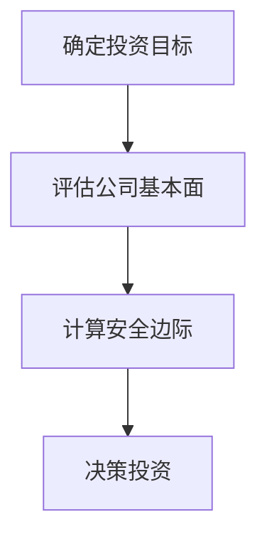
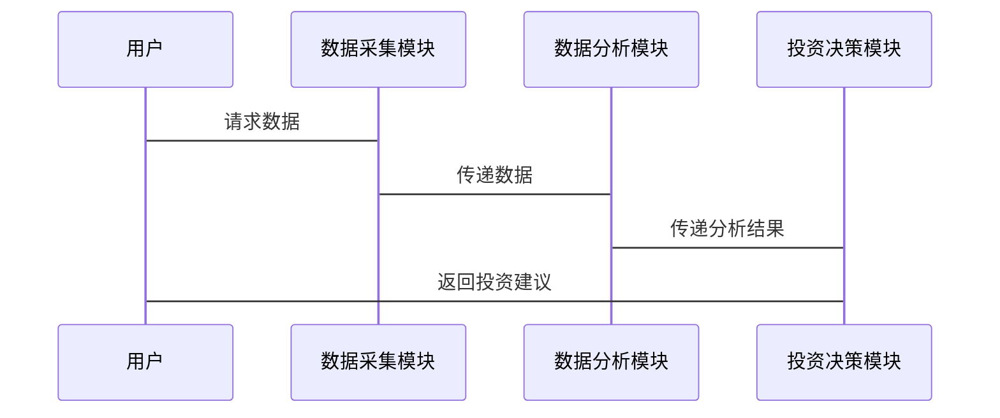

                 


# 巴菲特的焦点投资策略

> 关键词：巴菲特，价值投资，安全边际，投资策略，投资哲学，投资组合

> 摘要：本文详细探讨了巴菲特的焦点投资策略，包括他的投资哲学、核心概念、数学模型、算法流程、系统设计和项目实战。通过分析价值投资、安全边际、护城河等关键要素，结合mermaid流程图、Latex公式和实际案例，帮助读者全面理解并应用巴菲特的投资策略。

---

## 第一部分：巴菲特的焦点投资策略概述

### 第1章：巴菲特投资理念的背景与核心思想

#### 1.1 巴菲特的生平与投资哲学

##### 1.1.1 巴菲特的早年经历与投资启蒙

沃伦·巴菲特（Warren Buffett）于1934年8月31日出生在美国堪萨斯州的奥马哈市。他的父亲霍伊·巴菲特（Hoy Buffett）是一位律师，母亲弗洛伦斯·巴菲特（Flossie Buffett）则负责家庭的经济管理。巴菲特从小就展现出对数字和投资的兴趣。他11岁时购买了他的第一份股票，当时他通过阅读《穆迪手册》来研究公司基本面。

##### 1.1.2 巴菲特的价值投资理念形成

在哥伦比亚大学就读期间，巴菲特师从本杰明·格雷厄姆（Benjamin Graham）和戴维·多德（David Dodd），这两位教授教导他价值投资的核心理念：寻找那些市场价格低于其内在价值的股票进行投资。格雷厄姆的“安全边际”概念对巴菲特的影响深远，他认为投资的本质是寻找市场先生的错误定价。

##### 1.1.3 巴菲特投资哲学的核心思想

巴菲特的投资哲学可以总结为以下几点：
1. **价值投资**：买入低于内在价值的股票，长期持有。
2. **安全边际**：买入价格远低于内在价值的股票，以降低风险。
3. **护城河**：投资那些具有强大竞争优势的公司，这些公司能够长期保持高利润率。
4. **长期投资**：避免频繁交易，减少交易成本和情绪干扰。

#### 1.2 巴菲特投资策略的背景

##### 1.2.1 20世纪70年代美国股市的背景

20世纪70年代，美国股市经历了多次波动，包括1973-1974年的熊市。在这段时间，巴菲特的合伙公司（后来的伯克希尔哈撒韦公司）开始实践他的投资策略，通过买入低估的股票并长期持有，取得了显著的收益。

##### 1.2.2 巴菲特在合伙公司时期的实践

在合伙公司时期，巴菲特开始管理投资者的资金，通过深入分析公司的财务报表和行业地位，寻找那些具有强大竞争优势且被市场低估的公司进行投资。

##### 1.2.3 巴菲特投资策略的演变

随着时间的推移，巴菲特的投资策略逐渐成熟，他开始更加注重公司的护城河和长期盈利能力，而非仅仅关注短期的市场价格波动。

#### 1.3 巴菲特投资策略的核心要素

##### 1.3.1 价值投资的定义与特征

价值投资是一种投资策略，强调买入市场价格低于内在价值的股票。其核心特征包括：
- **内在价值**：公司未来现金流的现值。
- **安全边际**：买入价格与内在价值的折扣。
- **长期视角**：关注公司的长期盈利能力。

##### 1.3.2 长期投资的重要性

长期投资意味着持有股票的时间较长，避免频繁交易。长期投资的重要性体现在：
- 减少交易成本和税费。
- 避免短期市场波动的干扰。
- 享受复利效应带来的收益。

##### 1.3.3 安全边际的概念与应用

安全边际是巴菲特策略中的关键概念，指买入价格远低于内在价值的股票，以确保即使市场出现波动，投资者也能获得正收益。

### 第2章：巴菲特焦点投资策略的核心概念

#### 2.1 价值投资的定义与特征

##### 2.1.1 价值投资的定义

价值投资是一种投资策略，旨在寻找市场价格低于内在价值的股票。其核心在于分析公司的基本面，包括财务状况、行业地位和盈利能力。

##### 2.1.2 价值投资与成长投资的对比

| 比较维度 | 价值投资 | 成长投资 |
|----------|----------|----------|
| 目标     | 买入低于内在价值的股票 | 买入具有高增长潜力的股票 |
| 时间框架 | 长期持有 | 短期持有 |
| 风险     | 较低     | 较高     |

##### 2.1.3 价值投资的核心特征

- **内在价值计算**：通过DCF模型（现金流折现法）估算公司价值。
- **安全边际**：买入价格低于内在价值。
- **长期视角**：关注公司的长期盈利能力。

#### 2.2 安全边际的原理与应用

##### 2.2.1 安全边际的定义

安全边际是买入价格与内在价值之间的差额，确保即使市场低估公司的价值，投资者也能获得正收益。

##### 2.2.2 安全边际的计算方法

假设某公司内在价值为100美元，安全边际为20%，则买入价格应低于80美元。

##### 2.2.3 安全边际在投资决策中的应用

通过计算安全边际，投资者可以避免过度支付，降低投资风险。

#### 2.3 投资组合管理的策略

##### 2.3.1 投资组合的分散化原则

分散化投资可以降低特定股票的风险，通过投资多个行业和公司的股票来分散风险。

##### 2.3.2 投资组合的风险管理

定期评估投资组合的风险，调整持仓，以应对市场变化。

##### 2.3.3 投资组合的长期收益目标

通过长期持有优质股票，获得复利收益，实现财富增值。

#### 2.4 巴菲特投资策略的数学模型

##### 2.4.1 价值评估的数学公式

公司内在价值的计算公式为：
$$
\text{内在价值} = \sum_{t=1}^{\infty} \frac{\text{现金流}_t}{(1 + r)^t}
$$
其中，r为折现率，现金流为公司未来产生的现金流。

##### 2.4.2 安全边际的计算公式

安全边际的计算公式为：
$$
\text{安全边际} = \text{内在价值} \times (1 - \text{折扣率})
$$

##### 2.4.3 投资组合优化模型

投资组合优化模型可以通过现代投资组合理论（MPT）来实现，目标是最大化收益，最小化风险。

### 第3章：巴菲特焦点投资策略的算法原理

#### 3.1 巴菲特选股算法的流程

##### 3.1.1 确定投资目标

明确投资目标，包括投资期限、风险承受能力和收益目标。

##### 3.1.2 评估公司基本面

分析公司的财务报表，评估其盈利能力、资产负债情况和行业地位。

##### 3.1.3 计算安全边际

通过DCF模型计算公司的内在价值，并确定买入价格的安全边际。

##### 3.1.4 决策投资

根据分析结果，决定是否买入、卖出或持有股票。

#### 3.2 巴菲特选股算法的数学模型

##### 3.2.1 公司价值评估公式

$$
\text{内在价值} = \frac{\text{现金流}}{\text{折现率}}
$$

##### 3.2.2 安全边际计算公式

$$
\text{安全边际} = \text{内在价值} \times (1 - \text{折扣率})
$$

##### 3.2.3 投资组合优化模型

使用MPT模型优化投资组合，以实现收益和风险的最佳平衡。

#### 3.3 巴菲特选股算法的mermaid流程图



### 第4章：巴菲特焦点投资策略的系统分析与架构设计

#### 4.1 投资分析系统的功能设计

##### 4.1.1 数据采集模块

负责收集公司的财务数据、行业信息和市场数据。

##### 4.1.2 数据分析模块

使用DCF模型等方法评估公司内在价值，并计算安全边际。

##### 4.1.3 投资决策模块

根据分析结果，生成投资建议，包括买入、卖出或持有股票的决策。

##### 4.1.4 投资组合管理模块

优化投资组合，分散风险，调整持仓。

#### 4.2 系统架构设计

##### 4.2.1 分层架构设计

- **数据层**：负责数据的存储和管理。
- **业务逻辑层**：处理数据分析和投资决策。
- **用户界面层**：提供友好的操作界面。

##### 4.2.2 模块化设计

将系统划分为数据采集、数据分析、投资决策和投资组合管理四个模块，每个模块独立开发和维护。

##### 4.2.3 高可用性设计

通过冗余设计和故障切换机制，确保系统在故障时仍能正常运行。

#### 4.3 系统接口设计

##### 4.3.1 数据接口

定义数据输入和输出的格式，确保模块之间的数据通信顺畅。

##### 4.3.2 用户接口

提供直观的操作界面，方便用户输入指令和查看分析结果。

##### 4.3.3 投资决策接口

将投资决策模块的结果传递给投资组合管理模块，实现自动化投资。

#### 4.4 系统交互的mermaid序列图



### 第5章：巴菲特焦点投资策略的项目实战

#### 5.1 环境安装

需要安装Python编程语言、数据分析库（如Pandas、NumPy）和可视化工具（如Matplotlib）。此外，还需要安装能够生成mermaid图表的工具，如PlantUML或在线mermaid编辑器。

#### 5.2 核心实现源代码

以下是一个简单的DCF模型实现代码：

```python
import pandas as pd
import numpy as np

def calculate_intrinsic_value(cash_flows, discount_rate):
    # 计算未来现金流的现值
    present_value = sum(cash_flow / (1 + discount_rate)**t for t, cash_flow in enumerate(cash_flows))
    return present_value

# 示例数据
cash_flows = [100, 120, 150, 200]  # 假设未来四年的现金流
discount_rate = 0.10  # 折现率10%

intrinsic_value = calculate_intrinsic_value(cash_flows, discount_rate)
print(f"内在价值为：{intrinsic_value:.2f}")
```

#### 5.3 代码应用解读与分析

以上代码通过DCF模型计算公司的内在价值，输入未来现金流和折现率，输出内在价值。这有助于投资者判断股票是否被低估。

#### 5.4 实际案例分析和详细讲解剖析

以可口可乐为例，假设其未来现金流为100、120、150、200百万美元，折现率为10%。计算其内在价值为：

$$
\text{内在价值} = \frac{100}{1.10} + \frac{120}{1.10^2} + \frac{150}{1.10^3} + \frac{200}{1.10^4}
$$

计算结果约为328.67百万美元。

#### 5.5 项目小结

通过实际案例分析，读者可以理解如何应用巴菲特的投资策略，包括计算内在价值和判断安全边际。

### 第6章：最佳实践 tips、小结、注意事项、拓展阅读

#### 6.1 最佳实践 tips

- **持续学习**：不断学习投资知识，提升分析能力。
- **分散投资**：避免过度集中，降低风险。
- **长期持有**：耐心持有优质股票，享受复利效应。

#### 6.2 小结

巴菲特的焦点投资策略强调价值投资、安全边际和长期持有。通过系统的分析和实践，投资者可以有效提升投资决策的科学性和准确性。

#### 6.3 注意事项

- **市场波动**：市场波动可能导致短期亏损，需保持耐心。
- **数据质量**：确保数据的准确性和完整性，避免错误分析。
- **风险管理**：定期评估投资组合，调整持仓，分散风险。

#### 6.4 拓展阅读

- 《聪明的投资者》——沃伦·巴菲特
- 《证券分析》——本杰明·格雷厄姆
- 《投资的艺术》——菲利普·费舍

---

作者：AI天才研究院/AI Genius Institute & 禅与计算机程序设计艺术 /Zen And The Art of Computer Programming

