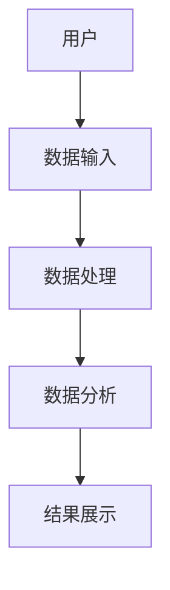

                 

# 巴菲特的现金流分析方法

> 关键词：巴菲特，现金流分析，投资策略，价值投资，自由现金流

> 摘要：现金流分析是巴菲特价值投资体系中的核心方法之一。本文将详细探讨巴菲特的现金流分析方法，包括现金流的基本概念、分析的核心步骤、系统架构设计、数学模型与算法、项目实战以及最佳实践。通过本文的学习，读者将能够掌握现金流分析的精髓，并将其应用于实际投资分析中。

---

## 目录

### 第一部分: 巴菲特的现金流分析方法概述

### 第1章: 巴菲特投资理念与现金流分析的背景

#### 1.1 巴菲特的投资理念

##### 1.1.1 巴菲特的生平与投资风格

沃伦·巴菲特（Warren Buffett）是全球最著名的投资者之一，他的投资理念以“价值投资”为核心。巴菲特认为，投资的本质是寻找那些具有持续竞争优势，并且估值被市场低估的企业。他的投资风格注重长期稳健，而非短期收益的波动。

##### 1.1.2 价值投资的核心原则

1. **安全边际**：巴菲特强调买入股票时，价格应低于其内在价值，这种差异即为安全边际。
2. **长期竞争优势**：投资的企业应具备持续的竞争优势，能够在未来较长一段时间内保持盈利能力和市场地位。
3. **集中投资**：巴菲特建议投资者将资金集中在少数几家具有长期竞争优势的企业上，而不是分散投资。

##### 1.1.3 现金流在投资中的重要性

现金流是巴菲特评估企业内在价值的重要指标。他认为，企业的现金流能够反映其真实的盈利能力，而不仅仅是会计利润。现金流的质量和数量直接关系到企业的财务健康状况和长期发展潜力。

#### 1.2 现金流分析的基本概念

##### 1.2.1 现金流的定义与分类

现金流是指企业在一定时期内，通过经营、投资和筹资活动所获得或支出的现金和现金等价物。根据来源和用途，现金流可以分为三类：

1. **经营活动现金流**：企业日常经营活动中产生的现金流，包括销售商品、提供服务、支付员工工资等。
2. **投资活动现金流**：与企业投资相关的现金流，包括购买或出售固定资产、股权投资等。
3. **筹资活动现金流**：与企业筹资活动相关的现金流，包括发行股票、偿还债务等。

##### 1.2.2 现金流分析的用途与意义

现金流分析的目的是评估企业的财务健康状况、盈利能力和未来发展潜力。通过分析现金流，投资者可以更好地理解企业的经营效率、偿债能力以及分红能力。

##### 1.2.3 现金流分析与企业价值的关系

企业价值的核心在于其未来现金流的现值。巴菲特认为，企业的内在价值可以通过对其未来现金流进行合理贴现来评估。因此，现金流分析是评估企业内在价值的重要工具。

#### 1.3 现金流分析的核心要素

##### 1.3.1 自由现金流的定义与计算

自由现金流（Free Cash Flow, FCF）是指企业在扣除所有成本和支出后，剩余的可用于偿还债务、分红或再投资的资金。计算公式如下：

$$
FCF = \text{净利润} + \text{非现金费用} - \text{资本支出}
$$

其中，非现金费用通常包括折旧和摊销，资本支出是指企业为维持或扩大生产能力而进行的支出。

##### 1.3.2 现金流质量与数量的平衡

现金流的质量是指企业现金流的来源是否稳定、可靠。例如，经营活动现金流通常比投资或筹资活动的现金流更为可靠。现金流的数量则是指企业现金流的规模，这直接关系到企业的偿债能力和分红能力。

##### 1.3.3 现金流分析的边界与外延

现金流分析的边界在于企业的财务报表数据，而其外延则扩展到企业的市场环境、行业竞争状况以及宏观经济因素。这些外部因素会影响企业的现金流质量和数量，因此在分析时需要综合考虑。

### 1.4 本章小结

本章介绍了巴菲特的投资理念，特别是其对现金流分析的重视。现金流分析不仅是评估企业财务健康状况的重要工具，也是价值投资的核心方法之一。通过分析现金流，投资者可以更好地理解企业的内在价值，并做出更明智的投资决策。

---

### 第2章: 现金流分析的核心方法

#### 2.1 现金流分析的基本原理

##### 2.1.1 现金流的来源与流向

现金流的来源包括经营活动、投资活动和筹资活动，而其流向则包括流入和流出两个方面。通过分析现金流的来源和流向，投资者可以更好地理解企业的财务结构和经营效率。

##### 2.1.2 现金流分析的数学模型

现金流分析的数学模型主要基于财务报表数据，特别是现金流量表。通过公式化的方法，可以将现金流量表中的数据转化为可分析的指标。

##### 2.1.3 现金流分析的公式与计算

例如，计算经营活动现金流净额的公式为：

$$
\text{经营活动现金流净额} = \text{营业收入} - \text{经营成本} - \text{税费} + \text{其他经营性现金流入}
$$

#### 2.2 现金流分析的核心指标

##### 2.2.1 自由现金流的计算公式

自由现金流的计算公式如前所述，其核心在于将净利润调整为更符合企业实际现金流的指标。

##### 2.2.2 现金流收益率的计算

现金流收益率（Cash Yield）是指企业现金流与股价之间的关系，计算公式为：

$$
\text{现金流收益率} = \frac{\text{自由现金流}}{\text{股票价格}}
$$

##### 2.2.3 现金流贴现率的确定

现金流贴现率通常基于企业的资本成本，如加权平均资本成本（WACC）。通过将未来现金流贴现至现值，可以评估企业的内在价值。

#### 2.3 现金流分析的步骤与流程

##### 2.3.1 数据收集与整理

首先需要收集企业的财务报表数据，特别是现金流量表。数据来源包括企业的年度报告、季度报告以及其他公开的财务信息。

##### 2.3.2 数据分析与计算

通过公式化的方法，计算关键现金流指标，并进行横向和纵向比较。

##### 2.3.3 结果解读与应用

根据分析结果，评估企业的财务健康状况、盈利能力和未来发展潜力，并据此制定投资策略。

#### 2.4 本章小结

本章详细探讨了现金流分析的核心方法，包括现金流的基本原理、核心指标的计算以及分析步骤与流程。通过这些方法，投资者可以更深入地理解企业的现金流状况，并据此做出更明智的投资决策。

---

### 第3章: 现金流分析的系统架构设计

#### 3.1 系统分析与架构设计

##### 3.1.1 现金流分析系统的功能模块

现金流分析系统通常包括以下几个功能模块：

1. **数据输入模块**：用于输入企业的财务数据。
2. **数据处理模块**：对输入的数据进行清洗和转换。
3. **数据分析模块**：计算关键现金流指标并生成报告。
4. **结果展示模块**：以可视化的方式展示分析结果。

##### 3.1.2 系统架构的Mermaid图

以下是一个简单的现金流分析系统的架构图：

##### 3.1.3 系统接口的设计

系统接口包括数据输入接口和结果输出接口。数据输入接口通常采用API的方式，而结果输出接口则可以是HTML或PDF格式。

#### 3.2 系统功能设计

##### 3.2.1 数据输入模块

数据输入模块需要支持多种数据格式的输入，包括Excel、CSV和数据库连接。

##### 3.2.2 数据处理模块

数据处理模块需要对输入的数据进行清洗和转换，确保数据的准确性和一致性。

##### 3.2.3 结果展示模块

结果展示模块需要以直观的方式展示分析结果，包括图表和报告。

#### 3.3 系统交互设计

##### 3.3.1 用户与系统的交互流程

1. 用户通过数据输入模块上传财务数据。
2. 系统对数据进行处理并生成分析报告。
3. 用户查看分析报告并做出投资决策。

##### 3.3.2 系统的响应机制

系统在接收到用户请求后，会在预设的时间内完成数据处理和结果展示。

##### 3.3.3 系统的错误处理

系统需要具备错误检测和处理机制，例如数据格式错误提示和异常处理。

#### 3.4 本章小结

本章详细探讨了现金流分析系统的架构设计，包括功能模块、系统接口以及系统交互设计。通过合理的系统架构设计，可以提高现金流分析的效率和准确性。

---

### 第4章: 现金流分析的数学模型与算法

#### 4.1 现金流分析的数学模型

##### 4.1.1 自由现金流的公式推导

自由现金流的公式如前所述，其推导基于企业的财务报表数据和经营状况。

##### 4.1.2 现金流贴现率的计算公式

现金流贴现率的计算通常基于企业的资本成本，例如加权平均资本成本（WACC）。

##### 4.1.3 现金流收益率的计算公式

现金流收益率的计算公式如前所述。

#### 4.2 现金流分析的算法原理

##### 4.2.1 数据清洗与转换算法

数据清洗与转换算法用于处理财务数据，确保数据的准确性和一致性。

##### 4.2.2 现金流指标计算算法

现金流指标计算算法基于预设的公式，对数据进行计算和分析。

##### 4.2.3 结果展示算法

结果展示算法用于将分析结果以可视化的方式呈现给用户。

#### 4.3 现金流分析的数学模型

##### 4.3.1 现金流贴现模型

现金流贴现模型用于评估企业的内在价值，公式如下：

$$
\text{内在价值} = \sum_{t=1}^{n} \frac{\text{自由现金流}}{(1 + r)^t}
$$

其中，\( r \) 是贴现率，\( n \) 是企业的生命周期。

##### 4.3.2 现金流收益率模型

现金流收益率模型用于评估企业的分红能力，公式如下：

$$
\text{现金流收益率} = \frac{\text{自由现金流}}{\text{股票价格}}
$$

#### 4.4 本章小结

本章详细探讨了现金流分析的数学模型与算法，包括数据清洗与转换、现金流指标计算以及结果展示算法。通过这些模型和算法，可以更准确地评估企业的内在价值和财务健康状况。

---

### 第5章: 现金流分析的项目实战

#### 5.1 项目介绍

本章将通过一个实际案例，展示如何使用现金流分析方法对企业进行估值。案例将基于某上市公司的真实财务数据进行分析。

#### 5.2 环境安装

首先需要安装必要的工具和软件，例如Python编程语言、Pandas数据处理库、Matplotlib绘图库以及相关财务分析工具。

#### 5.3 核心实现

##### 5.3.1 数据收集

通过企业的财务报表获取现金流数据，包括经营活动、投资活动和筹资活动的现金流。

##### 5.3.2 数据分析

使用Pandas库对数据进行清洗和转换，并计算自由现金流和其他关键指标。

##### 5.3.3 结果展示

使用Matplotlib库生成可视化图表，展示分析结果。

#### 5.4 实际案例分析

通过具体案例分析，展示现金流分析在实际投资中的应用。例如，如何通过现金流分析识别具有长期竞争优势的企业。

#### 5.5 项目小结

本章通过一个实际案例，展示了现金流分析方法在项目实战中的应用。通过本章的学习，读者可以掌握现金流分析的核心技能，并将其应用于实际投资分析中。

---

### 第6章: 现金流分析的最佳实践

#### 6.1 现金流分析的关键点

1. **数据的准确性和完整性**：现金流分析依赖于高质量的财务数据，因此数据的准确性和完整性至关重要。
2. **模型的合理性和适用性**：现金流分析模型需要根据企业的实际情况进行调整和优化。
3. **结果的验证和评估**：分析结果需要通过多种方法进行验证和评估，以确保其准确性和可靠性。

#### 6.2 现金流分析的误区与注意事项

1. **忽视非财务因素**：现金流分析仅基于财务数据，但企业的实际价值还受到市场环境、行业竞争等非财务因素的影响。
2. **过度依赖模型**：现金流分析模型是工具，而非决策的最终依据。投资者需要结合实际情况进行综合判断。

#### 6.3 现金流分析的拓展阅读

建议读者进一步阅读巴菲特的经典著作《聪明的投资者》以及相关的财务分析书籍，以加深对现金流分析的理解。

#### 6.4 本章小结

本章总结了现金流分析的关键点、误区与注意事项，并提供了进一步的阅读建议。通过本章的学习，读者可以更好地理解和应用现金流分析方法。

---

## 作者：AI天才研究院/AI Genius Institute & 禅与计算机程序设计艺术 /Zen And The Art of Computer Programming

---

通过以上内容，读者可以全面掌握巴菲特的现金流分析方法，并将其应用于实际投资分析中。现金流分析不仅是价值投资的核心工具，也是评估企业内在价值的重要方法。希望本文能够为读者提供有价值的参考和启发。

