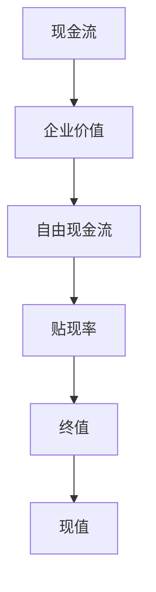
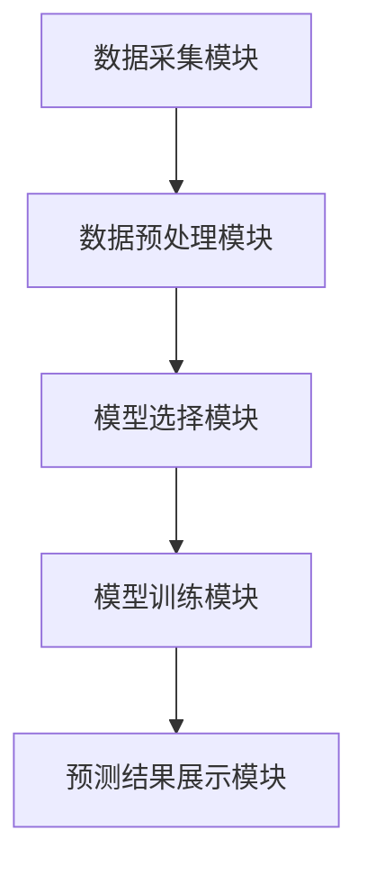

                 


# 巴菲特的现金流评估方法

> 关键词：巴菲特，现金流评估，自由现金流，DCF模型，投资分析，价值投资

> 摘要：本文详细探讨了巴菲特的现金流评估方法，从其核心理念、数学模型到实际应用，全面解析如何通过现金流分析来评估企业价值。文章结合技术语言和实际案例，帮助读者掌握巴菲特的现金流评估方法，提升投资决策能力。

---

# 第1章: 巴菲特现金流评估方法的背景与核心理念

## 1.1 巴菲特投资理念的起源与发展

### 1.1.1 价值投资的起源与发展

价值投资是一种投资策略，强调以低于公平价值的价格购买优质资产。巴菲特是价值投资的代表人物，他的投资理念源于格雷厄姆的价值投资体系，但又有自己的独特见解。巴菲特认为，企业价值的核心在于其未来现金流的现值，而非仅仅看其当前的市场价格或财务报表中的利润。

### 1.1.2 巴菲特投资理念的核心思想

巴菲特的投资理念可以概括为以下几点：

1. **长期投资**：巴菲特主张长期持有优质资产，而非短期交易。
2. **安全边际**：买入价格低于企业内在价值，以确保投资的安全性。
3. **企业基本面分析**：关注企业的盈利能力、财务健康状况和竞争优势。
4. **自由现金流**：企业产生的自由现金流是衡量其价值的重要指标。

### 1.1.3 现金流在投资决策中的重要性

现金流是企业生存和发展的血液，是衡量企业健康状况的核心指标。巴菲特认为，企业的价值最终取决于其未来能够产生的自由现金流。只有能够持续产生高质量现金流的企业，才能为股东创造长期价值。

---

## 1.2 现金流评估的核心要素

### 1.2.1 现金流的定义与分类

现金流是指企业在一定时期内通过经营、投资和筹资活动所获得或支出的现金和现金等价物。现金流可以分为以下三类：

1. **经营活动现金流**：企业日常经营活动中产生的现金流，包括销售商品、提供服务等。
2. **投资活动现金流**：企业投资于长期资产或出售长期资产所产生的现金流。
3. **筹资活动现金流**：企业通过发行债券、股票或偿还债务等方式获得或支出的现金流。

### 1.2.2 现金流评估的核心要素

现金流评估的核心要素包括：

1. **自由现金流（FCF）**：企业在扣除所有支出（包括资本支出）后，剩余的可用于分配给股东的现金。
2. **现金流质量**：现金流的来源和稳定性，高质量的现金流来源于企业的核心业务，而非一次性交易。
3. **现金流贴现率**：用于将未来现金流折现为现值的贴现率，通常使用无风险利率加风险溢价。

### 1.2.3 现金流评估与企业价值的关系

企业价值的评估通常基于未来现金流的现值。巴菲特的现金流评估方法强调，企业价值 = 现金流的现值，而非账面价值或市场价值。通过分析企业的自由现金流和贴现率，投资者可以估算出企业的内在价值，从而做出合理的投资决策。

---

## 1.3 巴菲特现金流评估方法的特点

### 1.3.1 以现金流为核心的估值方法

巴菲特的现金流评估方法以自由现金流为核心，通过现金流贴现模型（DCF模型）来估算企业价值。这种方法强调企业未来现金流的可持续性和稳定性，而非仅仅关注当前的财务报表数据。

### 1.3.2 现金流质量与数量的双重考量

巴菲特不仅关注现金流的数量，还关注现金流的质量。高质量的现金流来源于企业的核心业务，具有持续性和稳定性。例如，一家企业通过销售核心产品获得的现金流质量高于通过出售资产获得的现金流。

### 1.3.3 长期投资视角与安全边际原则

巴菲特的投资理念强调长期视角和安全边际。他主张以低于内在价值的价格买入优质资产，并长期持有，以避免短期市场波动的干扰。

---

## 1.4 本章小结

### 1.4.1 巴菲特现金流评估方法的核心思想

巴菲特的现金流评估方法以自由现金流为核心，强调企业未来现金流的现值是决定企业价值的关键因素。

### 1.4.2 现金流评估方法的关键要素

现金流评估的关键要素包括自由现金流、现金流质量和贴现率。这些要素共同决定了企业的内在价值。

### 1.4.3 现金流评估方法的应用价值

通过现金流评估方法，投资者可以更准确地评估企业的内在价值，从而做出更科学的投资决策。

---

# 第2章: 现金流评估的核心概念与数学模型

## 2.1 现金流评估的核心概念

### 2.1.1 自由现金流的定义与计算公式

自由现金流（FCF）是企业在扣除所有支出（包括资本支出）后，剩余的可用于分配给股东的现金。计算公式如下：

$$\text{自由现金流} = \text{净利润} + \text{非现金费用} - \text{资本支出}$$

### 2.1.2 现金流贴现模型（DCF模型）

现金流贴现模型（DCF模型）是通过将未来现金流贴现为现值，来估算企业内在价值的方法。公式如下：

$$V = \sum_{t=1}^{n} \frac{CF_t}{(1+r)^t} + \frac{TV}{(1+r)^n}$$

其中：
- \( V \)：企业价值
- \( CF_t \)：第 \( t \) 年的现金流
- \( r \)：贴现率
- \( TV \)：终值

### 2.1.3 现金流质量的衡量标准

现金流质量的衡量标准包括：
1. 现金流的来源：来源于核心业务的现金流质量更高。
2. 现金流的稳定性：稳定的现金流更可靠。
3. 现金流的可持续性：能够持续产生的现金流更有价值。

---

## 2.2 现金流评估的数学模型

### 2.2.1 自由现金流公式

$$\text{自由现金流} = \text{净利润} + \text{非现金费用} - \text{资本支出}$$

### 2.2.2 现金流贴现模型公式

$$V = \sum_{t=1}^{n} \frac{CF_t}{(1+r)^t} + \frac{TV}{(1+r)^n}$$

### 2.2.3 现金流质量分析的数学模型

为了分析现金流质量，可以将现金流来源分为以下几类：

| 来源类型 | 现金流入 | 现金流出 |
|----------|----------|----------|
| 经营活动 | 销售收入 | 付账支出 |
| 投资活动 | 处置资产 | 购置资产 |
| 筹资活动 | 融资收入 | 融资支出 |

---

## 2.3 现金流评估的实体关系图



---

## 2.4 现金流预测的算法原理

现金流预测可以通过时间序列分析或机器学习模型实现。以下是两种常见的方法：

### 2.4.1 时间序列分析（ARIMA模型）

ARIMA模型是一种广泛用于时间序列预测的方法。其基本步骤如下：

1. **数据准备**：收集历史现金流数据。
2. **模型选择**：确定ARIMA的参数 \( p \)、\( d \) 和 \( q \)。
3. **模型训练**：使用历史数据训练ARIMA模型。
4. **预测未来现金流**：基于训练好的模型预测未来现金流。

公式如下：

$$\phi(B)(1 - B)^d X_t = \theta(B) Z_t$$

其中：
- \( \phi(B) \) 和 \( \theta(B) \) 是多项式系数。
- \( B \) 是延迟算子。
- \( d \) 是差分的阶数。

### 2.4.2 机器学习模型（LSTM）

长短期记忆网络（LSTM）是一种深度学习模型，适用于时间序列预测。其基本步骤如下：

1. **数据准备**：将历史现金流数据转换为时间序列数据。
2. **模型构建**：设计LSTM网络结构，包括输入层、LSTM层和输出层。
3. **模型训练**：使用历史数据训练模型。
4. **预测未来现金流**：基于训练好的模型预测未来现金流。

LSTM的数学公式如下：

$$f_t = \sigma(g_t \odot s_{t-1} + W_f x_t)$$

其中：
- \( f_t \) 是遗忘门。
- \( g_t \) 是输入门。
- \( s_{t-1} \) 是前一时刻的隐藏状态。
- \( W_f \) 是遗忘门的权重。
- \( x_t \) 是当前输入。

---

## 2.5 本章小结

### 2.5.1 现金流评估的核心公式

自由现金流公式和现金流贴现模型是现金流评估的核心公式，帮助投资者估算企业的内在价值。

### 2.5.2 现金流预测的算法原理

时间序列分析和机器学习模型是常用的现金流预测方法，各有优缺点，适用于不同的场景。

### 2.5.3 现金流质量分析的数学模型

通过分类现金流来源，可以更清晰地分析现金流的质量和可靠性。

---

# 第3章: 现金流预测与分析方法

## 3.1 现金流预测的基本方法

### 3.1.1 历史数据分析法

历史数据分析法是基于企业过去的历史现金流数据，通过统计分析预测未来现金流的方法。常用的方法包括移动平均法和指数平滑法。

### 3.1.2 现金流驱动因素分析法

现金流驱动因素分析法是从企业的经营活动中寻找现金流的主要驱动因素，例如销售收入、成本控制和资本支出等。通过分析这些驱动因素，可以更准确地预测未来现金流。

### 3.1.3 专家判断法

专家判断法是一种定性预测方法，依赖于行业专家的经验和判断。这种方法适用于数据不足或市场环境复杂的情况。

---

## 3.2 现金流预测的数学模型

### 3.2.1 时间序列分析（ARIMA模型）

ARIMA模型是一种常用的时间序列预测方法，适用于具有趋势和季节性特征的现金流数据。

### 3.2.2 机器学习模型（LSTM）

LSTM模型是一种深度学习方法，适用于复杂的时间序列数据，能够捕捉长期依赖关系。

### 3.2.3 现金流预测的Python代码示例

以下是使用Python的ARIMA模型预测现金流的代码示例：

```python
from statsmodels.tsa.arima_model import ARIMA
import pandas as pd

# 加载数据
data = pd.read_csv('cash_flow.csv')

# 训练模型
model = ARIMA(data['Cash Flow'], order=(5, 1, 0))
model_fit = model.fit()

# 预测未来现金流
forecast = model_fit.forecast(steps=10)
print(forecast)
```

---

## 3.3 现金流预测的系统架构设计

### 3.3.1 系统功能设计

现金流预测系统的功能模块包括：
1. 数据采集模块：从数据库中获取历史现金流数据。
2. 模型选择模块：选择适合的预测模型（ARIMA或LSTM）。
3. 模型训练模块：基于历史数据训练预测模型。
4. 预测结果展示模块：将预测结果可视化并输出。

### 3.3.2 系统架构设计

以下是现金流预测系统的架构图：



---

## 3.4 本章小结

### 3.4.1 现金流预测的基本方法

历史数据分析法、现金流驱动因素分析法和专家判断法是常用的现金流预测方法，各有优缺点。

### 3.4.2 现金流预测的数学模型

ARIMA模型和LSTM模型是常用的现金流预测模型，适用于不同的场景。

### 3.4.3 现金流预测的系统架构设计

现金流预测系统通常包括数据采集、模型选择、模型训练和结果展示四个功能模块。

---

# 第4章: 现金流质量分析与企业价值评估

## 4.1 现金流质量分析的核心要素

### 4.1.1 现金流来源分析

现金流的来源包括经营活动、投资活动和筹资活动。高质量的现金流来源于经营活动，尤其是核心业务。

### 4.1.2 现金流稳定性分析

现金流的稳定性是衡量其质量的重要指标。稳定的现金流表明企业具有持续的盈利能力。

### 4.1.3 现金流可持续性分析

现金流的可持续性分析关注未来现金流的持续能力，通常与企业的竞争优势和市场地位相关。

---

## 4.2 现金流贴现模型的应用

### 4.2.1 现金流贴现模型的实现步骤

1. **确定贴现率**：通常使用无风险利率加风险溢价。
2. **预测未来现金流**：基于企业历史数据和行业趋势预测未来现金流。
3. **计算终值**：使用永续增长模型或清算价值法估算终值。
4. **计算现值**：将未来现金流和终值贴现为现值。
5. **估算企业价值**：现值加终值的现值即为企业价值。

---

## 4.3 现金流质量分析的数学模型

### 4.3.1 现金流质量指数

可以通过以下公式计算现金流质量指数：

$$\text{现金流质量指数} = \frac{\text{经营活动现金流}}{\text{净利润}}$$

---

## 4.4 本章小结

### 4.4.1 现金流质量分析的核心要素

现金流质量分析的核心要素包括现金流来源、稳定性和可持续性。

### 4.4.2 现金流贴现模型的应用步骤

现金流贴现模型的实现步骤包括确定贴现率、预测未来现金流、计算终值和现值，以及估算企业价值。

### 4.4.3 现金流质量指数的计算公式

现金流质量指数的计算公式为：

$$\text{现金流质量指数} = \frac{\text{经营活动现金流}}{\text{净利润}}$$

---

# 第5章: 现金流驱动因素分析与投资策略

## 5.1 现金流驱动因素分析

### 5.1.1 收入驱动因素

销售收入是现金流的主要驱动因素，企业应关注销售收入的增长潜力。

### 5.1.2 成本控制因素

成本控制是影响现金流的重要因素，企业应通过降低成本提高利润率。

### 5.1.3 资本支出因素

资本支出是影响现金流的重要因素，企业应合理规划资本支出，避免过度投资。

---

## 5.2 现金流驱动因素分析的数学模型

### 5.2.1 现金流驱动因素分析的步骤

1. **识别驱动因素**：确定影响现金流的主要因素。
2. **量化影响程度**：通过回归分析等方法量化各因素对现金流的影响程度。
3. **制定优化策略**：根据分析结果制定优化策略。

---

## 5.3 现金流驱动因素分析的Python代码示例

以下是使用Python进行现金流驱动因素分析的代码示例：

```python
import statsmodels.api as sm

# 数据准备
data = pd.read_csv('cash_flow.csv')
X = data[['收入', '成本', '资本支出']]
y = data['现金流']

# 建立多元线性回归模型
model = sm.OLS(y, sm.add_constant(X))
result = model.fit()

# 输出回归结果
print(result.summary())
```

---

## 5.4 本章小结

### 5.4.1 现金流驱动因素分析的核心要素

现金流驱动因素分析的核心要素包括收入、成本和资本支出。

### 5.4.2 现金流驱动因素分析的数学模型

多元线性回归模型是常用的现金流驱动因素分析方法，可以帮助投资者量化各因素对现金流的影响程度。

### 5.4.3 现金流驱动因素分析的Python代码示例

通过多元线性回归模型，投资者可以量化各驱动因素对现金流的影响程度，并制定优化策略。

---

# 第6章: 现金流风险评估与投资策略

## 6.1 现金流风险评估的核心要素

### 6.1.1 现金流波动性风险

现金流的波动性风险是指现金流的不确定性对投资价值的影响。

### 6.1.2 现金流流动性风险

现金流流动性风险是指企业在短期内无法满足现金需求的风险。

### 6.1.3 现金流可持续性风险

现金流可持续性风险是指未来现金流的持续能力受到威胁的风险。

---

## 6.2 现金流风险评估的数学模型

### 6.2.1 现金流风险评估的步骤

1. **识别风险因素**：确定影响现金流的主要风险因素。
2. **量化风险程度**：通过概率分布模型量化各风险因素的影响程度。
3. **制定风险管理策略**：根据风险评估结果制定风险管理策略。

---

## 6.3 现金流风险评估的Python代码示例

以下是使用Python进行现金流风险评估的代码示例：

```python
import numpy as np
import pandas as pd

# 数据准备
data = pd.read_csv('cash_flow.csv')

# 计算现金流波动性
cash_flow = data['现金流']
mean = cash_flow.mean()
std_dev = cash_flow.std()

# 计算风险价值（VaR）
# 假设95%置信水平
alpha = 0.05
VaR = np.percentile(cash_flow, alpha * 100)

print(f"现金流波动性标准差：{std_dev}")
print(f"95%置信水平的风险价值（VaR）：{VaR}")
```

---

## 6.4 本章小结

### 6.4.1 现金流风险评估的核心要素

现金流风险评估的核心要素包括现金流的波动性、流动性和可持续性。

### 6.4.2 现金流风险评估的数学模型

现金流风险评估可以通过概率分布模型量化各风险因素的影响程度。

### 6.4.3 现金流风险评估的Python代码示例

通过Python代码，投资者可以量化现金流的波动性风险和流动性风险，并制定相应的风险管理策略。

---

# 第7章: 现金流评估的实践与案例分析

## 7.1 现金流评估的实践步骤

### 7.1.1 数据收集与清洗

收集企业的历史财务数据，包括销售收入、成本、资本支出等，并进行数据清洗和预处理。

### 7.1.2 现金流预测与分析

基于历史数据预测未来现金流，并分析现金流的质量和可持续性。

### 7.1.3 现金流贴现模型的应用

使用现金流贴现模型估算企业的内在价值，并与市场价格进行比较。

---

## 7.2 现金流评估的案例分析

### 7.2.1 案例背景

以某制造企业为例，分析其现金流情况，并评估其内在价值。

### 7.2.2 数据分析

以下是该企业的历史现金流数据：

| 年份 | 现金流（万元） |
|------|----------------|
| 2018 | 100            |
| 2019 | 120            |
| 2020 | 150            |
| 2021 | 180            |

### 7.2.3 现金流预测

基于历史数据，预测未来三年的现金流分别为200万元、220万元和240万元。

### 7.2.4 现金流贴现模型的应用

假设贴现率为8%，终值为250万元，则企业价值计算如下：

$$V = \sum_{t=1}^{3} \frac{CF_t}{(1+0.08)^t} + \frac{250}{(1+0.08)^3}$$

计算结果如下：

$$V = \frac{200}{1.08} + \frac{220}{1.08^2} + \frac{240}{1.08^3} + \frac{250}{1.08^3}$$

---

## 7.3 本章小结

### 7.3.1 现金流评估的实践步骤

现金流评估的实践步骤包括数据收集与清洗、现金流预测与分析以及现金流贴现模型的应用。

### 7.3.2 现金流评估的案例分析

通过案例分析，投资者可以更好地理解现金流评估的实际应用，并掌握如何通过现金流预测和贴现模型估算企业价值。

---

# 第8章: 现金流评估工具与实践技巧

## 8.1 现金流评估工具

### 8.1.1 Excel

Excel是常用的现金流评估工具，提供了丰富的函数和工具，例如NPV、IRR和PV函数。

### 8.1.2 Python

Python提供了许多优秀的库，例如Pandas、NumPy和statsmodels，可以用于现金流预测和分析。

### 8.1.3 其他工具

其他常用的现金流评估工具包括Power BI、Tableau和Matplotlib等。

---

## 8.2 现金流评估的实践技巧

### 8.2.1 数据清洗与预处理

在进行现金流评估之前，需要对数据进行清洗和预处理，例如处理缺失值和异常值。

### 8.2.2 模型选择与优化

选择适合的现金流预测模型，并通过交叉验证等方法优化模型性能。

### 8.2.3 结果验证与解释

验证预测结果的准确性，并通过可视化等方式解释结果，帮助投资者做出决策。

---

## 8.3 本章小结

### 8.3.1 现金流评估工具

常用的现金流评估工具包括Excel、Python和可视化工具。

### 8.3.2 现金流评估的实践技巧

数据清洗与预处理、模型选择与优化以及结果验证与解释是现金流评估的重要实践技巧。

### 8.3.3 现金流评估工具的优缺点

不同工具和方法各有优缺点，投资者应根据具体需求选择合适的工具和方法。

---

# 第9章: 现金流评估的未来趋势与总结

## 9.1 现金流评估的未来趋势

### 9.1.1 人工智能与机器学习的进一步应用

人工智能和机器学习技术将在现金流预测和风险评估中发挥更重要的作用。

### 9.1.2 大数据技术的融合

大数据技术将与现金流评估进一步融合，提供更精准的预测和分析。

### 9.1.3 可持续发展与绿色金融

可持续发展和绿色金融将成为现金流评估的重要方向，企业社会责任和环境影响将被纳入现金流评估体系。

---

## 9.2 本章小结

### 9.2.1 现金流评估的未来趋势

人工智能、大数据和可持续发展将成为现金流评估的重要发展方向。

### 9.2.2 现金流评估方法的总结

现金流评估方法是投资分析的重要工具，通过分析企业的自由现金流和贴现率，可以帮助投资者估算企业的内在价值。

### 9.2.3 现金流评估方法的展望

随着技术的进步和市场环境的变化，现金流评估方法将不断创新和优化，为投资者提供更准确的决策支持。

---

# 作者：AI天才研究院/AI Genius Institute & 禅与计算机程序设计艺术 /Zen And The Art of Computer Programming

