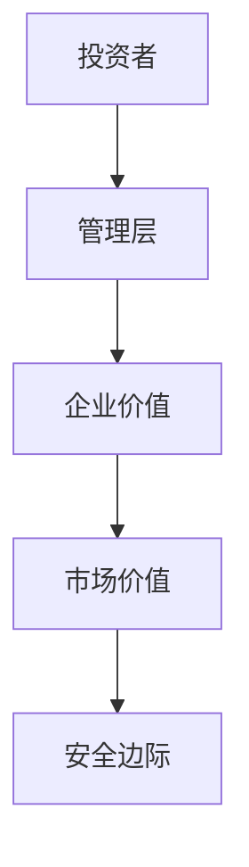

                 

# 巴菲特的看人下注投资理念

## 关键词：
巴菲特，价值投资，安全边际，管理层评估，投资理念

## 摘要：
本文深入分析了巴菲特的“看人下注”投资理念，从其核心概念、数学模型、系统架构到实际案例，全面解析其在现代投资中的应用。通过详细的理论分析和实践案例，揭示了如何通过深入分析管理层和企业价值，实现长期稳健的投资回报。

---

# 第一部分: 巴菲特的看人下注投资理念基础

## 第1章: 巴菲特投资理念概述

### 1.1 巴菲特的生平与投资哲学

#### 1.1.1 巴菲特的早年经历与投资启蒙
沃伦·巴菲特，1934年生于美国内布拉斯州，从小展现出对数字和投资的浓厚兴趣。他在青少年时期通过阅读格雷厄姆的《证券分析》开始接触价值投资理念，并在1950年代建立了自己的投资公司，逐步形成了独特的投资哲学。

#### 1.1.2 巴菲特的投资哲学核心思想
巴菲特的投资哲学以价值投资为核心，强调寻找具有持续竞争优势、良好治理结构和优秀管理层的企业。他主张以合理的价格买入优质资产，并长期持有，而非频繁交易。

#### 1.1.3 巴菲特投资理念的演变与影响
巴菲特的投资理念从早期的“烟屁股”策略逐渐转向注重管理层信任和企业竞争优势。他的成功投资案例（如可口可乐、美国运通）为价值投资奠定了坚实基础，并影响了全球投资界。

---

## 第2章: "看人下注"投资理念的核心概念与联系

### 2.1 核心概念原理

#### 2.1.1 价值投资的定义与本质
价值投资是寻找市场价格低于内在价值的股票。内在价值是企业未来现金流的现值，计算公式为：
$$ V = \frac{CF}{r - g} $$
其中，\( CF \) 是现金流，\( r \) 是折现率，\( g \) 是增长率。

#### 2.1.2 安全边际的概念与作用
安全边际是市场价格与内在价值的差额，提供一个缓冲区以应对市场波动和不确定性。公式为：
$$ Margin\ of\ Safety = V_{市场价} - V_{内在价值} $$

#### 2.1.3 管理层评估的关键要素
管理层评估包括管理层的信任度、决策能力、企业治理和透明度。评分模型如下：
$$ Trust\ Score = \sum (评分项权重 \times 评分项得分) $$

### 2.2 核心概念属性对比表格

#### 表2-1: 价值投资与成长投资的对比
| 对比维度 | 价值投资 | 成长投资 |
|----------|----------|----------|
| 核心目标 | 买入低于内在价值的股票 | 寻找高增长潜力的企业 |
| 风险偏好 | 低风险，注重安全边际 | 高风险，注重增长潜力 |

#### 表2-2: 安全边际与风险控制的对比
| 对比维度 | 安全边际 | 风险控制 |
|----------|----------|----------|
| 方法 | 通过价格折扣降低风险 | 通过分散投资降低风险 |
| 重点 | 内在价值与市场价差 | 多样化投资组合 |

#### 表2-3: 管理层评估与财务分析的对比
| 对比维度 | 管理层评估 | 财务分析 |
|----------|----------|----------|
| 目标 | 评估管理层能力 | 分析企业财务状况 |
| 工具 | 信任评分模型 | 财务指标（ROE、ROA） |

### 2.3 实体关系图（Mermaid流程图）

---

## 第3章: "看人下注"投资理念的算法原理

### 3.1 算法原理概述

#### 3.1.1 价值评估的数学模型
内在价值公式：
$$ V = \frac{CF}{r - g} $$

#### 3.1.2 安全边际的计算方法
$$ Margin\ of\ Safety = V_{市场价} - V_{内在价值} $$

#### 3.1.3 管理层信任度的评分模型
$$ Trust\ Score = \sum (评分项权重 \times 评分项得分) $$

### 3.2 数学模型与公式

#### 3.2.1 内在价值计算案例
假设某企业未来现金流为$100万，折现率为10%，增长率5%，其内在价值为：
$$ V = \frac{100}{0.10 - 0.05} = 2000万 $$

#### 3.2.2 安全边际的实际应用
若市场价为1800万，则安全边际为：
$$ 2000 - 1800 = 200万 $$

#### 3.2.3 管理层评估案例分析
某公司管理层信任评分：
- 战略能力：权重0.4，得分为80
- 财务纪律：权重0.3，得分为70
- 透明度：权重0.3，得分为85
Trust Score = 0.4×80 + 0.3×70 + 0.3×85 = 75.5

---

## 第4章: "看人下注"投资理念的系统分析与架构设计

### 4.1 问题场景介绍

#### 4.1.1 投资者面临的决策问题
投资者需在市场中选择具有长期竞争优势和优秀管理层的企业，同时考虑安全边际和风险控制。

#### 4.1.2 "看人下注"理念的应用场景
适用于寻找长期投资目标的企业，尤其是那些具有稳定现金流和优秀管理层的企业。

### 4.2 系统功能设计

#### 4.2.1 领域模型（Mermaid类图）

---

## 第5章: 投资策略与风险管理

### 5.1 长期投资策略

#### 5.1.1 长期投资的优势
- 稳定的现金流
- 通货膨胀的抵御能力
- 长期复合收益

#### 5.1.2 长期投资的风险
- 市场波动
- 管理层变化
- 经济周期影响

### 5.2 价值发现策略

#### 5.2.1 价值发现的关键步骤
- 寻找低于内在价值的企业
- 评估管理层信任度
- 计算安全边际

### 5.3 集中投资策略

#### 5.3.1 集中投资的优势
- 高关注度和深入研究
- 简化决策过程

#### 5.3.2 集中投资的风险
- 高度依赖特定企业
- 市场波动影响较大

### 5.4 风险管理策略

#### 5.4.1 安全边际的使用
- 通过安全边际降低投资风险
- 安全边际的动态调整

#### 5.4.2 分散投资的应用
- 通过多样化降低特定企业风险
- 行业和地区的分散

---

## 第6章: 案例分析与实战技巧

### 6.1 案例分析

#### 6.1.1 可口可乐案例分析
- 投资背景：可口可乐具备强大的品牌和分销网络
- 管理层评估：信任度高，财务纪律性强
- 安全边际：市场价格低于内在价值

#### 6.1.2 美国运通案例分析
- 投资背景：美国运通在信用卡市场占据领先地位
- 管理层评估：战略能力强，财务稳健
- 安全边际：合理的价格提供足够的安全空间

### 6.2 投资组合管理

#### 6.2.1 投资组合构建步骤
1. 确定投资目标和风险承受能力
2. 选择具有竞争优势的企业
3. 评估管理层信任度
4. 计算安全边际
5. 构建投资组合并定期调整

#### 6.2.2 投资组合再平衡
- 定期评估投资组合
- 根据市场变化调整权重
- 保持安全边际

### 6.3 投资决策技巧

#### 6.3.1 独立思考的重要性
- 不随市场波动改变决策
- 坚持价值投资理念

#### 6.3.2 耐心与纪律的重要性
- 长期持有优质资产
- 避免频繁交易

---

## 第7章: 总结与展望

### 7.1 总结

- 巴菲特的“看人下注”理念强调了对企业内在价值、管理层能力和安全边际的重视
- 通过深入分析和长期持有，实现稳健的投资回报
- 在实际投资中，需结合市场环境和企业具体情况，灵活调整策略

### 7.2 展望

- 价值投资理念在科技和新兴行业中的应用
- 技术手段（如大数据分析）在投资决策中的作用
- 全球化背景下的跨市场投资机会

---

## 作者：AI天才研究院/AI Genius Institute & 禅与计算机程序设计艺术 /Zen And The Art of Computer Programming

---

**附录：相关书籍推荐**
1. 《巴菲特传：一个美国资本家的成功之路》
2. 《证券分析》
3. 《投资的艺术》

