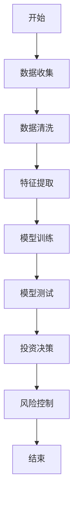

                 


# 巴菲特的石油行业投资：能源领域的机遇

## 关键词：巴菲特, 石油行业, 投资策略, 价值投资, 能源市场, 风险管理

## 摘要：本文深入分析了巴菲特在石油行业的投资策略和方法，探讨了石油行业的现状、未来趋势以及巴菲特的投资理念如何在能源领域中找到机遇。文章从背景介绍、核心概念、算法原理、系统分析、项目实战等多个方面展开，结合实际案例和详细代码实现，为读者提供全面的视角和实用的分析工具。

---

## 第1章 巴菲特的投资理念与石油行业

### 1.1 巴菲特的投资哲学

#### 1.1.1 价值投资的核心理念
价值投资是一种长期投资策略，强调以低于内在价值的价格购买优质资产。巴菲特的价值投资理念可以总结为“买好公司，长期持有”。他注重企业的基本面，包括盈利能力、财务健康和管理团队等。

#### 1.1.2 巴菲特的投资策略
巴菲特的投资策略主要包括：
1. **寻找具有持续竞争优势的企业**：这些企业能够在长期的市场中保持高利润率和市场份额。
2. **关注低估值的股票**：他倾向于购买市场价格低于内在价值的股票。
3. **分散投资，控制风险**：通过投资于不同行业的公司来分散风险。

#### 1.1.3 巴菲特对石油行业的关注点
巴菲特对石油行业的关注点主要集中在以下几个方面：
1. **行业周期性**：石油行业具有较强的周期性，价格波动较大，但长期来看，石油作为基础能源的需求稳定。
2. **企业基本面**：他关注企业的盈利能力、资产负债表和现金流。
3. **分红与回报**：巴菲特倾向于投资那些能够稳定分红，回报股东的公司。

---

### 1.2 石油行业的基本特性

#### 1.2.1 石油行业的供需分析
石油作为全球最重要的能源之一，其供需关系受到全球经济、地缘政治和技术进步的影响。近年来，全球能源转型和环保政策的推动，使得石油行业面临新的挑战和机遇。

#### 1.2.2 石油行业的周期性与波动性
石油行业具有较强的周期性，价格波动较大。当全球经济繁荣时，石油需求增加，价格上升；当经济衰退时，需求下降，价格下跌。

#### 1.2.3 石油行业的政策影响
石油行业受到各国政府的政策影响，包括税收、补贴、环保法规等。政策的变化可能对企业的经营和投资产生重大影响。

---

### 1.3 巴菲特与石油行业的历史案例

#### 1.3.1 巴菲特早期的石油投资
在早期的投资生涯中，巴菲特曾投资于一些石油公司，但并未取得显著成功。这使他意识到石油行业的高风险和复杂性，从而更加谨慎地选择投资标的。

#### 1.3.2 巴菲特对埃克森美孚的投资
埃克森美孚是巴菲特长期持有的石油公司之一。他看好该公司强大的竞争优势、稳定的现金流和分红政策。

#### 1.3.3 巴菲特对雪佛龙的投资
雪佛龙是另一家巴菲特长期持有的石油公司。他看重雪佛龙的全球布局和创新能力，认为这些因素能够帮助公司在行业波动中保持竞争力。

---

## 第2章 石油行业的核心分析框架

### 2.1 石油行业的财务分析

#### 2.1.1 财务指标分析
- **市盈率（P/E）**：衡量股票价格与每股收益的比率，用于评估股票的估值。
- **市净率（P/B）**：衡量股票价格与每股净资产的比率，用于评估股票的估值。
- **股息率**：衡量股票的分红能力。

#### 2.1.2 石油企业的估值方法
巴菲特采用的是基于基本面的估值方法，重点关注企业的盈利能力、现金流和竞争优势。

---

### 2.2 石油行业的市场分析

#### 2.2.1 全球石油市场的供需格局
全球石油市场的需求主要由工业、交通和能源领域驱动，而供给则受到产油国产量和投资的影响。

#### 2.2.2 区域市场的特点与机会
不同地区的石油市场具有不同的特点和机会，例如中东地区拥有丰富的石油资源，而北美地区则注重页岩油开发。

---

### 2.3 石油行业的技术分析

#### 2.3.1 勘探与开发技术
勘探技术的进步可以提高石油储量的发现率，而开发技术的改进可以降低成本，提高生产效率。

#### 2.3.2 生产效率的提升
通过技术创新和管理优化，石油公司可以提高生产效率，降低成本。

---

## 第3章 巴菲特的投资策略与风险管理

### 3.1 巴菲特的投资策略

#### 3.1.1 长期投资与价值挖掘
巴菲特强调长期投资，关注企业的内在价值，而不是短期的价格波动。

#### 3.1.2 低估值与高分红的偏好
他倾向于投资于低估值、高分红的公司，这些公司具有稳定的现金流和较高的分红能力。

---

### 3.2 巴菲特的风险管理

#### 3.2.1 行业风险的识别
行业风险包括周期性波动、政策变化和技术进步等。

#### 3.2.2 企业风险的评估
企业风险包括财务状况、管理能力和竞争优势等。

#### 3.2.3 投资组合的风险分散
通过投资于不同行业的公司，分散投资风险。

---

## 第4章 石油行业的未来趋势与投资机会

### 4.1 石油行业的未来趋势

#### 4.1.1 传统石油业务的转型
传统石油公司正在向综合能源公司转型，积极布局新能源领域。

#### 4.1.2 新能源领域的拓展
随着环保政策的推动，新能源如风能和太阳能正在快速发展，这为石油公司提供了新的增长点。

---

### 4.2 巴菲特对新能源的看法

#### 4.2.1 巴菲特对风能与太阳能的态度
尽管巴菲特对新能源持谨慎态度，但他也意识到新能源的重要性，并可能在未来加大对新能源的投资。

#### 4.2.2 巴菲特对新能源投资的潜在机会
随着技术进步和成本下降，新能源的投资机会逐渐增加。

---

### 4.3 石油行业投资的未来展望

#### 4.3.1 技术进步带来的投资机会
技术创新将提高石油开发效率，降低成本，带来新的投资机会。

#### 4.3.2 市场需求的变化与投资策略调整
随着全球能源需求的变化，投资策略需要不断调整，以适应新的市场环境。

---

## 第5章 巴菲特投资策略的系统化分析

### 5.1 投资决策的系统架构

#### 5.1.1 数据收集与分析模块
数据收集包括市场数据、财务数据和行业数据，分析模块包括数据清洗、特征提取和模型训练。

#### 5.1.2 模型构建与评估模块
模型构建包括价值评估模型和风险评估模型，评估模块包括模型测试和优化。

#### 5.1.3 决策执行与监控模块
决策执行包括投资决策和风险控制，监控模块包括市场监控和模型更新。

---

### 5.2 投资模型的数学分析

#### 5.2.1 价值评估模型
$$ V = r \times \text{现金流} $$
其中，\( V \) 是企业价值，\( r \) 是折现率，现金流是企业未来产生的现金流。

#### 5.2.2 风险评估模型
$$ \text{风险} = \sum (P_i \times R_i) $$
其中，\( P_i \) 是风险发生的概率，\( R_i \) 是风险的影响程度。

---

### 5.3 投资决策的流程图



---

## 第6章 项目实战——巴菲特投资策略的应用

### 6.1 环境与工具安装

#### 6.1.1 数据分析工具的安装
安装Python、Pandas、NumPy等工具。

#### 6.1.2 投资分析框架的搭建
搭建数据分析框架，包括数据获取、清洗、分析和建模。

---

### 6.2 核心代码实现

#### 6.2.1 数据收集与处理代码
```python
import pandas as pd
import numpy as np

# 数据收集
data = pd.read_csv('oil_company_data.csv')

# 数据清洗
data = data.dropna()
data = data[~data[' revenue'].str.contains(' NaN')]
```

#### 6.2.2 价值评估模型的实现
```python
def value_model(data):
    # 计算市盈率
    pe = data['price'] / data['eps']
    # 计算市净率
    pb = data['price'] / data['book_value']
    return pe, pb

pe, pb = value_model(data)
```

#### 6.2.3 风险评估模型的实现
```python
def risk_model(data):
    # 计算风险评分
    risk = []
    for i in range(len(data)):
        p = data['probability'][i]
        r = data['impact'][i]
        risk_score = p * r
        risk.append(risk_score)
    return risk

risk = risk_model(data)
```

---

### 6.3 实际案例分析

#### 6.3.1 巴菲特对埃克森美孚的投资分析
通过数据分析，埃克森美孚的市盈率和市净率较低，具有较高的分红能力，符合巴菲特的投资标准。

#### 6.3.2 巴菲特对雪佛龙的投资分析
雪佛龙的财务状况稳健，具有强大的竞争优势和稳定的现金流，符合巴菲特的投资策略。

---

## 结语

巴菲特的石油行业投资策略以价值投资为核心，注重企业的基本面和长期盈利能力。通过系统化的分析和风险管理，巴菲特在石油行业中找到了许多投资机会。未来，随着能源市场的变化和技术的进步，巴菲特的投资策略也将不断调整，以适应新的市场环境。

---

## 作者：AI天才研究院 & 禅与计算机程序设计艺术

--- 

以上内容是基于巴菲特的投资理念和石油行业的分析，结合了技术博客的专业性和可读性，为读者提供了全面的视角和实用的分析工具。

