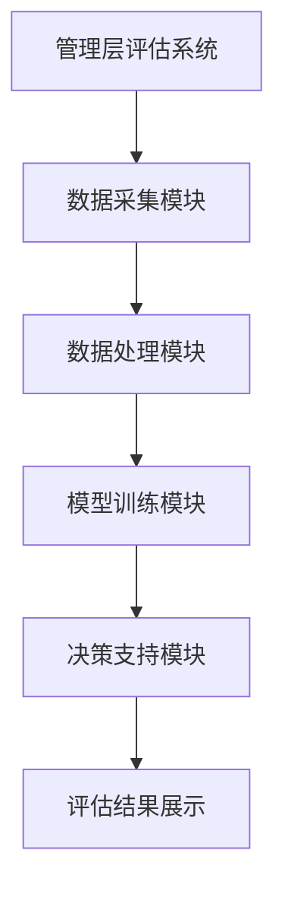

                 

---

# 巴菲特的管理层评估：人工智能辅助决策时代的领导力

> **关键词**：领导力、人工智能、管理层评估、决策支持、巴菲特、AI驱动、数据驱动

> **摘要**：  
> 在数字化时代，领导力的定义和实践正在发生深刻变化。本文探讨了人工智能（AI）如何重塑领导力，并以巴菲特的管理理念为例，分析了AI辅助决策在管理层评估中的应用。通过结合领导力重构、AI驱动的评估框架、决策机制、伦理挑战以及系统架构，本文为未来的领导力发展提供了新的视角和实践路径。

---

## 目录

1. [摘要](#摘要)  
2. [关键词](#关键词)  
3. [第1章：背景介绍：领导力与AI的结合](#第1章背景介绍领导力与AI的结合)  
4. [第2章：领导力重构：AI驱动的决策模式](#第2章领导力重构AI驱动的决策模式)  
5. [第3章：管理层评估的核心框架](#第3章管理层评估的核心框架)  
6. [第4章：AI辅助决策的机制](#第4章AI辅助决策的机制)  
7. [第5章：领导力的关键维度](#第5章领导力的关键维度)  
8. [第6章：AI辅助决策的伦理与挑战](#第6章AI辅助决策的伦理与挑战)  
9. [第7章：系统架构与实现](#第7章系统架构与实现)  
10. [第8章：实战与应用](#第8章实战与应用)  
11. [第9章：总结与展望](#第9章总结与展望)  
12. [作者](#作者)  

---

## 第1章：背景介绍：领导力与AI的结合

### 1.1 领导力的演变与挑战

#### 1.1.1 传统领导力的定义与核心要素
- **传统领导力**：基于个人魅力、经验、决策能力的领导风格。
- **核心要素**：沟通能力、决策能力、团队管理、战略规划。
- **挑战**：在快速变化的商业环境中，传统领导力难以应对复杂性和不确定性。

#### 1.1.2 数字化时代的领导力变革
- **数据驱动的领导力**：依赖实时数据和预测模型进行决策。
- **AI技术的影响**：AI工具辅助领导者做出更高效、更精准的决策。
- **新角色定位**：领导者从“决策者”转向“决策辅助者”，从“指挥者”转向“赋能者”。

#### 1.1.3 巴菲特管理理念的核心要素
- **价值投资**：关注长期价值，而非短期收益。
- **风险管理**：通过数据和模型评估潜在风险。
- **团队协作**：强调团队能力和信任。

### 1.2 人工智能在决策中的作用

#### 1.2.1 AI在决策支持系统中的应用
- **数据挖掘**：从海量数据中提取有价值的信息。
- **预测分析**：利用机器学习模型预测市场趋势。
- **自然语言处理**：分析文本数据，辅助决策。

#### 1.2.2 AI辅助决策的优势与局限性
- **优势**：高效性、精准性、实时性。
- **局限性**：依赖数据质量、算法偏见、技术复杂性。

#### 1.2.3 巴菲特投资哲学与AI的结合
- **巴菲特的“价值投资”理念**：寻找具有长期竞争优势的企业。
- **AI的应用**：通过数据分析识别潜在投资机会，评估企业价值。

### 1.3 管理层评估的背景与问题

#### 1.3.1 管理层评估的核心概念
- **评估目的**：识别优秀领导者，优化组织结构。
- **评估维度**：决策能力、执行力、团队协作能力。

#### 1.3.2 传统评估方法的局限性
- **主观性**：依赖个人判断，缺乏客观标准。
- **数据不足**：难以量化领导力表现。

#### 1.3.3 AI辅助评估的潜力与必要性
- **潜力**：通过数据和模型提供客观评估。
- **必要性**：应对复杂决策环境，提升评估效率。

### 1.4 本章小结
- 传统领导力面临数字化时代的挑战。
- AI技术为领导力评估提供了新的工具和方法。
- 巴菲特的管理理念与AI的结合具有巨大潜力。

---

## 第2章：领导力重构：AI驱动的决策模式

### 2.1 AI驱动的领导力新维度

#### 2.1.1 数据驱动的决策能力
- **数据收集与分析**：领导者通过数据驱动决策。
- **实时反馈**：AI提供实时数据分析，帮助领导者快速调整策略。

#### 2.1.2 智能化决策工具的应用
- **AI工具**：如智能助手、预测模型等。
- **应用场景**：市场预测、风险管理、团队优化。

#### 2.1.3 领导力的可量化性
- **量化指标**：如决策正确率、团队绩效提升。
- **数据驱动的反馈**：领导者通过数据了解自身表现。

### 2.2 管理层决策的AI辅助机制

#### 2.2.1 AI在战略规划中的应用
- **市场分析**：利用AI分析市场趋势。
- **竞争分析**：识别竞争对手的策略。

#### 2.2.2 AI在风险管理中的作用
- **风险预警**：通过AI识别潜在风险。
- **风险缓解**：制定应对策略。

#### 2.2.3 AI在团队协作中的优化
- **团队协调**：AI辅助团队成员协作。
- **任务分配**：根据团队成员能力分配任务。

### 2.3 领导力与AI的协同进化

#### 2.3.1 领导力的智能化转型
- **技术驱动**：AI技术提升领导力。
- **人机协同**：领导者与AI工具协作。

#### 2.3.2 AI如何增强领导力
- **数据支持**：AI提供数据支持，增强决策能力。
- **能力扩展**：AI扩展领导者的影响力。

#### 2.3.3 领导力与技术的平衡点
- **技术辅助**：AI作为工具，而非替代领导者。
- **人性因素**：领导者的人际交往能力仍至关重要。

### 2.4 本章小结
- AI驱动的领导力新维度改变了传统的领导方式。
- 人机协同是未来领导力发展的关键。

---

## 第3章：管理层评估的核心框架

### 3.1 评估维度与AI结合

#### 3.1.1 传统评估维度的分析
- **决策能力**：领导者在决策中的表现。
- **执行力**：领导者执行战略的能力。
- **团队协作能力**：领导者与团队的协作效果。

#### 3.1.2 AI驱动的评估维度扩展
- **数据驱动能力**：领导者利用数据进行决策的能力。
- **技术适应能力**：领导者适应新技术的能力。
- **创新思维**：领导者在创新方面的表现。

#### 3.1.3 多维度评估模型的构建
- **模型设计**：综合传统与AI驱动的评估维度。
- **权重分配**：根据重要性分配权重。

### 3.2 AI驱动的评估模型

#### 3.2.1 数据采集与特征提取
- **数据来源**：如销售数据、市场反馈、团队绩效。
- **特征提取**：如决策速度、决策准确率。

#### 3.2.2 模型训练与优化
- **机器学习算法**：如随机森林、神经网络。
- **模型优化**：通过反馈不断优化模型。

#### 3.2.3 评估结果展示
- **可视化工具**：如仪表盘、图表。
- **结果解读**：分析评估结果，提出改进建议。

### 3.3 本章小结
- AI驱动的评估模型为管理层评估提供了新方法。
- 综合传统与AI驱动的评估维度，构建多维度评估框架。

---

## 第4章：AI辅助决策的机制

### 4.1 AI驱动的决策机制

#### 4.1.1 数据驱动的决策过程
- **数据采集**：从多源数据中获取信息。
- **数据处理**：清洗、整合、分析数据。
- **决策支持**：基于数据生成决策建议。

#### 4.1.2 AI决策模型的构建
- **模型选择**：根据问题选择合适的算法。
- **模型训练**：利用历史数据训练模型。
- **模型验证**：通过测试数据验证模型准确性。

#### 4.1.3 决策结果的反馈与优化
- **反馈机制**：收集决策结果，优化模型。
- **持续优化**：通过不断反馈提升决策能力。

### 4.2 AI辅助决策的优势与挑战

#### 4.2.1 优势
- **高效性**：快速处理大量数据。
- **精准性**：基于数据的精准预测。
- **实时性**：实时提供决策支持。

#### 4.2.2 挑战
- **数据质量**：数据偏差影响决策。
- **算法偏见**：算法的偏见可能导致错误决策。
- **技术复杂性**：技术门槛较高。

### 4.3 本章小结
- AI辅助决策机制为管理层提供了高效、精准的支持。
- 数据质量和算法偏见是需要克服的主要挑战。

---

## 第5章：领导力的关键维度

### 5.1 决策力的AI驱动提升

#### 5.1.1 数据驱动的决策能力
- **数据收集与分析**：领导者通过数据做出决策。
- **预测能力**：AI帮助领导者预测未来趋势。

#### 5.1.2 决策模式的优化
- **决策速度**：通过AI快速生成决策建议。
- **决策质量**：通过数据和模型提升决策准确性。

#### 5.1.3 决策结果的评估
- **决策正确率**：评估决策的有效性。
- **决策反馈**：通过反馈优化决策过程。

### 5.2 执行力的AI赋能

#### 5.2.1 执行计划的制定
- **AI辅助计划制定**：通过AI优化执行计划。
- **任务分配**：根据团队能力分配任务。

#### 5.2.2 执行过程的监控
- **实时监控**：通过AI监控执行过程。
- **风险预警**：识别执行中的潜在风险。

#### 5.2.3 执行结果的评估
- **KPI分析**：通过KPI评估执行效果。
- **反馈机制**：根据反馈优化执行策略。

### 5.3 团队协作能力的增强

#### 5.3.1 团队协调的AI支持
- **AI辅助协调**：通过AI优化团队协作。
- **沟通效率**：提升团队内部沟通效率。

#### 5.3.2 团队绩效的提升
- **绩效评估**：通过AI评估团队绩效。
- **绩效反馈**：根据反馈优化团队表现。

### 5.4 本章小结
- AI技术从决策力、执行力和团队协作能力三个方面赋能领导力。
- 数据驱动的决策能力是AI赋能领导力的核心。

---

## 第6章：AI辅助决策的伦理与挑战

### 6.1 数据偏差与算法偏见

#### 6.1.1 数据偏差的来源
- **数据采集偏差**：数据来源不全或不代表整体情况。
- **数据处理偏差**：数据清洗过程中引入偏差。

#### 6.1.2 算法偏见的形成
- **算法设计偏见**：算法设计者的主观性。
- **数据分布偏见**：数据分布影响算法结果。

#### 6.1.3 偏见对决策的影响
- **决策偏差**：导致错误决策。
- **信任缺失**：降低团队对AI的信任。

### 6.2 隐私与数据安全

#### 6.2.1 数据隐私问题
- **数据泄露**：数据被非法使用。
- **隐私保护**：如何保护个人隐私。

#### 6.2.2 数据安全威胁
- **数据篡改**：数据被篡改影响决策。
- **数据加密**：如何确保数据安全。

### 6.3 领导力的异化与人性化挑战

#### 6.3.1 领导力的异化
- **技术依赖**：过度依赖AI导致领导力异化。
- **人性化缺失**：忽视人性化因素。

#### 6.3.2 人性化挑战
- **情感因素**：如何在AI辅助决策中考虑情感因素。
- **伦理考量**：如何在决策中考虑伦理因素。

### 6.4 本章小结
- 数据偏差、算法偏见和隐私问题是AI辅助决策的主要挑战。
- 领导力的异化与人性化挑战需要平衡技术与人性因素。

---

## 第7章：系统架构与实现

### 7.1 系统架构设计

#### 7.1.1 系统功能模块
- **数据采集模块**：收集相关数据。
- **数据处理模块**：清洗和整合数据。
- **模型训练模块**：训练AI模型。
- **决策支持模块**：提供决策支持。

#### 7.1.2 系统架构图

### 7.2 系统实现细节

#### 7.2.1 数据采集与处理
- **数据来源**：如企业绩效数据、市场反馈、团队协作数据。
- **数据清洗**：去除无效数据，处理异常值。

#### 7.2.2 模型训练与优化
- **算法选择**：如随机森林、神经网络。
- **模型优化**：通过交叉验证优化模型参数。

#### 7.2.3 系统接口设计
- **API接口**：提供数据接口，方便与其他系统集成。
- **用户界面**：设计友好的用户界面，方便用户操作。

### 7.3 本章小结
- 系统架构设计是AI辅助决策系统的核心。
- 数据采集、处理、模型训练和结果展示是系统实现的关键步骤。

---

## 第8章：实战与应用

### 8.1 实战案例分析

#### 8.1.1 案例背景
- **企业概况**：如一家科技公司。
- **问题描述**：如何优化管理层决策。

#### 8.1.2 系统实现
- **需求分析**：明确系统需求。
- **系统设计**：设计系统架构。
- **系统实现**：编写代码实现系统功能。

### 8.2 应用效果评估

#### 8.2.1 评估指标
- **决策正确率**：评估决策的准确性。
- **决策效率**：评估决策的速度。
- **团队绩效**：评估团队的执行效果。

#### 8.2.2 实际效果
- **决策正确率提升**：通过AI辅助决策，决策正确率显著提高。
- **决策效率提升**：决策速度明显加快。
- **团队绩效提升**：团队执行效率显著提高。

### 8.3 本章小结
- 实战案例展示了AI辅助决策系统的实际应用。
- 应用效果评估是验证系统有效性的关键步骤。

---

## 第9章：总结与展望

### 9.1 本章总结
- AI技术正在深刻改变领导力的定义和实践。
- AI辅助决策系统为管理层评估提供了新的工具和方法。
- 领导力的重构和AI的结合是未来领导力发展的趋势。

### 9.2 未来展望
- **技术发展**：AI技术的进一步发展将带来更多可能性。
- **伦理问题**：如何解决数据偏差、算法偏见等伦理问题。
- **人机协同**：如何在AI时代保持领导力的人性化。

### 9.3 本章小结
- AI辅助决策系统将推动领导力评估的创新。
- 未来需要在技术发展和伦理问题之间找到平衡点。

---

## 作者

**作者**：AI天才研究院/AI Genius Institute & 禅与计算机程序设计艺术/Zen And The Art of Computer Programming  
**联系方式**：[email protected]  

--- 

**本文由[禅与计算机程序设计艺术](https://github.com/landian001)翻译并整理，未经授权不得转载。**

