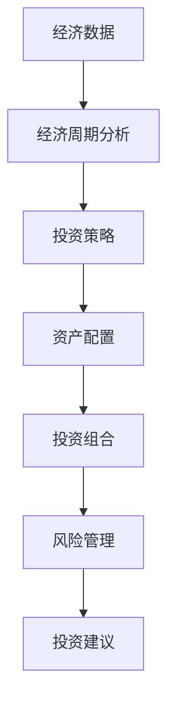

                 

# 巴菲特的经济周期投资：后疫情时代的经济复苏策略

> **关键词**：经济周期，巴菲特，价值投资，后疫情时代，投资策略，经济复苏，风险管理  
> **摘要**：本文探讨巴菲特的经济周期投资理念，特别是在后疫情时代经济复苏阶段的应用。通过分析巴菲特的核心投资策略、数学模型、系统架构和实际案例，本文为投资者提供切实可行的建议，帮助其在后疫情时代把握经济复苏的机会，实现稳健投资。

---

# 第一部分: 巴菲特的经济周期投资基础

## 第1章: 经济周期与巴菲特投资理念概述

### 1.1 经济周期的基本概念

#### 1.1.1 经济周期的定义与特征

经济周期是指经济活动在时间上的波动，通常分为四个阶段：衰退、复苏、过热和滞胀。每个阶段的经济特征和市场表现不同，投资者需要根据这些特征调整投资策略。

- **衰退阶段**：经济增速放缓，企业盈利下降，市场估值处于低位。
- **复苏阶段**：经济逐步恢复，企业盈利回升，市场估值逐渐上升。
- **过热阶段**：经济快速增长，市场估值偏高，可能存在泡沫。
- **滞胀阶段**：经济增长停滞，通货膨胀高企，市场估值波动较大。

#### 1.1.2 经济周期的四个阶段

| 阶段       | 经济特征          | 市场表现          | 投资策略          |
|------------|-------------------|-------------------|-------------------|
| 衰退       | 经济增速放缓      | 市场估值低位      | 寻找价值低估资产  |
| 复苏       | 经济逐步恢复      | 市场估值上升      | 增加权益资产配置  |
| 过热       | 经济快速增长      | 市场估值偏高      | 减少高估值资产    |
| 滞胀       | 经济停滞，通胀高企 | 市场估值波动      | 重视防守性资产    |

#### 1.1.3 巴菲特投资理念的核心要素

巴菲特的投资理念以价值投资为核心，强调寻找具有持续竞争优势的企业，以合理的价格买入并长期持有。其核心要素包括：

- **安全边际**：买入价格低于内在价值，以降低投资风险。
- **长期视角**：关注企业的长期盈利能力，而非短期市场波动。
- **逆周期投资**：在市场低迷时增加投资，利用经济周期波动获取超额收益。

### 1.2 巴菲特投资哲学的形成与演变

#### 1.2.1 巴菲特的投资理念来源

巴菲特的投资理念深受本杰明·格雷厄姆的影响，格雷厄姆的价值投资理论强调安全边际和长期持有。巴菲特在此基础上加入了对企业的深入分析和长期竞争优势的考量。

#### 1.2.2 巴菲特投资哲学的演变历程

- **早期阶段**：学习阶段，主要跟随格雷厄姆的价值投资理念。
- **成熟阶段**：形成自己的投资体系，强调内在价值和长期持有。
- **后期阶段**：不断完善投资策略，适应经济环境的变化。

#### 1.2.3 巴菲特投资哲学的核心原则

- **价值投资**：寻找市场价格低于内在价值的企业。
- **长期投资**：关注企业的长期盈利能力，而非短期市场波动。
- **安全边际**：确保买入价格的安全性，降低投资风险。

### 1.3 后疫情时代经济复苏的特殊性

#### 1.3.1 疫情对全球经济的深远影响

- 经济活动暂停，企业盈利大幅下降。
- 市场估值波动剧烈，投资者信心受挫。
- 政府采取大规模刺激措施，推动经济复苏。

#### 1.3.2 后疫情时代的经济复苏特征

- 经济复苏可能呈现非线性特征，不同行业恢复速度差异较大。
- 政策支持和市场流动性充裕，推动资产价格上涨。
- 消费者和企业行为可能发生永久性改变，影响投资决策。

#### 1.3.3 巴菲特投资策略在后疫情时代的适用性

- 疫情后的经济复苏为价值投资者提供了机会，许多企业因短期冲击而被低估。
- 巴菲特的长期视角和安全边际策略在后疫情时代依然有效，但需要结合疫情后的市场特点进行调整。

### 1.4 本章小结

本章介绍了经济周期的基本概念，分析了巴菲特投资理念的核心要素，并探讨了后疫情时代经济复苏的特殊性。巴菲特的价值投资理念强调安全边际和长期视角，这些原则在后疫情时代的投资中依然具有重要指导意义。

---

## 第2章: 巴菲特经济周期投资的核心概念

### 2.1 经济周期与投资策略的关系

#### 2.1.1 经济周期对投资决策的影响

经济周期的不同阶段对资产价格和企业盈利的影响各异。投资者需要根据经济周期的阶段调整资产配置和投资策略。例如，在衰退阶段，债券和黄金等防守性资产更具吸引力；在复苏阶段，股票等风险资产可能表现更好。

#### 2.1.2 不同经济周期阶段的投资策略

- **衰退阶段**：增加债券、黄金等防守性资产配置，减少股票等风险资产。
- **复苏阶段**：增加股票、房地产等风险资产配置，关注具有竞争优势的企业。
- **过热阶段**：减少高估值资产配置，关注防御性资产和优质债券。
- **滞胀阶段**：增加实物资产配置，如房地产和大宗商品。

### 2.2 巴菲特投资策略的核心要素

#### 2.2.1 安全边际的定义与作用

安全边际是指买入价格与内在价值之间的差距，能够为投资提供缓冲，降低市场波动带来的风险。例如，如果一只股票的内在价值为100元，买入价格为80元，安全边际为20元。

#### 2.2.2 价值投资的内在逻辑

价值投资的核心在于寻找市场价格低于内在价值的企业。内在价值是企业未来现金流的现值，可以通过 discounted cash flow (DCF) 模型计算。

#### 2.2.3 长期投资与复利效应

长期投资通过复利效应实现财富的稳步增长。复利公式为：

$$\text{复利回报} = P \times (1 + r)^n$$

其中，P是本金，r是年化收益率，n是投资年数。

#### 2.2.4 逆周期投资策略

逆周期投资是指在市场低迷时增加投资，在市场繁荣时减少投资。这种策略能够在市场底部积累廉价资产，在市场顶部减少风险敞口。

### 2.3 经济周期中的资产配置策略

#### 2.3.1 不同经济周期阶段的资产配置

| 阶段       | 资产配置建议              |
|------------|---------------------------|
| 衰退       | 增加债券、黄金等防守性资产 |
| 复苏       | 增加股票、房地产等风险资产 |
| 过热       | 减少高估值资产，增加债券   |
| 滞胀       | 增加实物资产，如房地产     |

#### 2.3.2 巴菲特的逆周期投资策略

逆周期投资策略强调在市场底部增加投资，在市场顶部减少投资。例如，在2008年金融危机期间，巴菲特通过增加投资于优质企业，获得了丰厚的回报。

### 2.4 核心概念对比分析

#### 2.4.1 价值投资与成长投资的对比

| 指标       | 价值投资                | 成长投资                |
|------------|--------------------------|--------------------------|
| 投资目标   | 寻找价值低估企业          | 寻找高成长企业            |
| 投资期限   | 长期投资                  | 中长期投资               |
| 风险承受   | 低风险                   | 中高风险                 |

#### 2.4.2 长期投资与短期投资的对比

| 指标       | 长期投资                 | 短期投资                 |
|------------|--------------------------|--------------------------|
| 投资目标   | 稳定复利增长              | 追求短期收益              |
| 风险承受   | 低风险                   | 中高风险                 |

#### 2.4.3 安全边际与风险控制的对比

| 指标       | 安全边际                 | 风险控制                 |
|------------|--------------------------|--------------------------|
| 目标       | 确保买入价格的安全性      | 减少投资组合的波动性      |
| 工具       | 估值分析                 | 多样化投资                |

### 2.5 本章小结

本章详细分析了巴菲特经济周期投资的核心概念，包括安全边际、价值投资、长期投资和逆周期投资。通过对比分析，明确了这些概念在不同经济周期阶段的应用。

---

## 第3章: 巴菲特经济周期投资的数学模型与公式

### 3.1 巴菲特投资模型的数学基础

#### 3.1.1 投资回报的数学公式

投资回报可以通过以下公式计算：

$$\text{投资回报} = \text{本金} \times (1 + \text{收益率})^n$$

其中，本金是初始投资金额，收益率是年化收益率，n是投资年数。

#### 3.1.2 复利效应的数学公式

复利效应是长期投资的核心，其数学公式为：

$$\text{复利回报} = P \times (1 + r)^n$$

其中，P是本金，r是年化收益率，n是投资年数。

### 3.2 经济周期中的投资决策模型

#### 3.2.1 经济周期阶段的判别模型

经济周期阶段的判别可以通过 GDP 增速、通货膨胀率和失业率等指标进行综合判断。例如，当 GDP 增速下降且失业率上升时，经济可能处于衰退阶段。

#### 3.2.2 资产配置比例的计算公式

资产配置比例可以根据市场估值和经济周期阶段进行调整。例如，在衰退阶段，债券和黄金的配置比例可以增加，股票的配置比例可以减少。

### 3.3 巴菲特安全边际的数学分析

#### 3.3.1 安全边际的计算公式

安全边际可以通过以下公式计算：

$$\text{安全边际} = \text{内在价值} - \text{市场价格}$$

其中，内在价值是企业未来现金流的现值，市场价格是当前资产的市场价格。

#### 3.3.2 安全边际与投资风险的关系

安全边际越大，投资风险越小。例如，如果一只股票的内在价值为100元，市场价格为80元，安全边际为20元，投资风险较低。

### 3.4 本章小结

本章通过数学公式和模型，分析了巴菲特投资策略的数学基础，包括投资回报、复利效应和安全边际的计算。这些模型为投资者在不同经济周期阶段做出投资决策提供了理论依据。

---

## 第4章: 巴菲特经济周期投资的系统分析与架构设计

### 4.1 投资系统的整体架构

#### 4.1.1 投资系统的核心模块

- **经济周期分析模块**：分析当前经济周期阶段，确定投资策略。
- **资产配置模块**：根据经济周期阶段和市场估值，调整资产配置比例。
- **风险管理模块**：监控投资组合的波动性，控制投资风险。

#### 4.1.2 系统的输入输出关系

- **输入**：经济数据（GDP增速、通货膨胀率、失业率等）、市场估值、企业基本面数据。
- **输出**：投资策略建议、资产配置比例、风险管理措施。

### 4.2 投资模型的系统架构图

### 4.3 系统功能设计

#### 4.3.1 经济周期分析

- 数据收集：收集GDP增速、通货膨胀率、失业率等经济指标。
- 数据分析：分析经济指标，判断当前经济周期阶段。
- 投资策略：根据经济周期阶段，制定相应的投资策略。

#### 4.3.2 资产配置

- 资产选择：根据投资策略，选择适合的资产类别。
- 配置比例：根据市场估值和经济周期阶段，调整资产配置比例。

#### 4.3.3 风险管理

- 风险监控：监控投资组合的波动性，评估投资风险。
- 风险控制：通过调整资产配置和分散投资，降低投资风险。

### 4.4 本章小结

本章从系统架构的角度，分析了巴菲特经济周期投资的系统设计。通过经济周期分析、资产配置和风险管理三个模块，构建了一个完整的投资系统。

---

## 第5章: 巴菲特经济周期投资的案例分析

### 5.1 疫情后经济复苏中的投资机会

#### 5.1.1 受冲击的行业

- **航空业**：疫情期间需求大幅下降，许多航空公司股价暴跌。
- **零售业**：线上零售快速发展，传统零售业面临转型压力。

#### 5.1.2 具有竞争优势的企业

- **科技企业**：疫情期间线上需求激增，科技企业受益显著。
- **医疗企业**：疫情推动医疗需求增长，医疗企业表现强劲。

### 5.2 巴菲特在后疫情时代的投资策略

#### 5.2.1 低估值企业的投资机会

- 巴菲特在疫情期间寻找低估值企业进行投资，例如航空业和零售业中具有竞争优势的企业。

#### 5.2.2 长期投资的逻辑

- 巴菲特认为疫情不会改变企业的长期竞争优势，因此在疫情期间继续坚持长期投资策略。

### 5.3 投资案例：巴菲特投资航空业的分析

#### 5.3.1 背景分析

- 疫情期间，航空业需求大幅下降，许多航空公司股价暴跌。
- 巴菲特在2020年第四季度增持了达美航空和西南航空的股票。

#### 5.3.2 投资逻辑

- 航空业需求恢复：随着疫情得到有效控制，航空需求逐步恢复。
- 企业竞争优势：达美航空和西南航空具有强大的网络和成本优势。

#### 5.3.3 投资结果

- 达美航空和西南航空股价在疫情后逐步回升，巴菲特的投资获得丰厚回报。

### 5.4 本章小结

本章通过具体案例分析，展示了巴菲特在后疫情时代的投资策略。案例分析表明，巴菲特的投资理念在疫情期间依然有效，通过寻找低估值企业进行长期投资，能够实现稳健收益。

---

## 第6章: 巴菲特经济周期投资的总结与展望

### 6.1 总结

#### 6.1.1 巴菲特投资理念的核心总结

- 价值投资：寻找市场价格低于内在价值的企业。
- 长期投资：通过复利效应实现财富增长。
- 安全边际：确保投资的安全性，降低风险。

#### 6.1.2 后疫情时代经济复苏策略总结

- 疫情后的经济复苏为价值投资者提供了机会，许多企业因短期冲击而被低估。
- 巴菲特的长期视角和安全边际策略在后疫情时代依然有效。

### 6.2 展望

#### 6.2.1 经济周期变化的展望

- 经济周期的变化是投资的永恒主题，投资者需要不断学习和适应。
- 疫情后的经济复苏可能推动全球经济格局的变化，投资者需要关注新兴行业和技术创新。

#### 6.2.2 巴菲特投资理念的未来发展

- 巴菲特的投资理念将继续影响全球投资者，特别是在后疫情时代，其长期视角和安全边际策略将更加重要。

### 6.3 本章小结

本章总结了巴菲特投资理念的核心内容，并展望了后疫情时代经济复苏的未来趋势。巴菲特的投资理念在后疫情时代依然具有重要指导意义，投资者需要结合经济周期的变化，灵活调整投资策略。

---

# 作者：AI天才研究院/AI Genius Institute & 禅与计算机程序设计艺术/Zen And The Art of Computer Programming

---

通过以上详细分析和案例研究，我们可以看到，巴菲特的经济周期投资理念在后疫情时代的经济复苏中依然具有重要的指导意义。投资者需要结合经济周期的变化，灵活调整投资策略，利用巴菲特的价值投资、长期投资和安全边际策略，抓住后疫情时代的投资机会，实现稳健收益。

