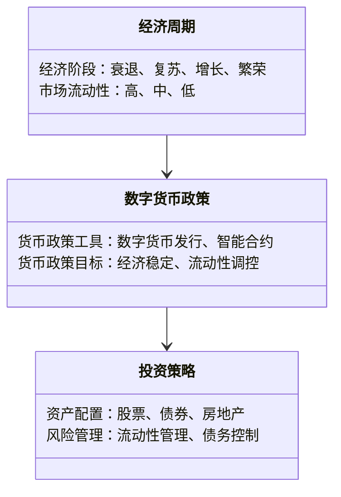
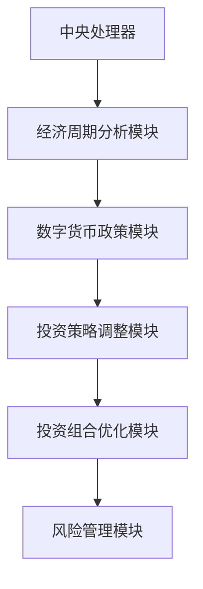

                 


# 巴菲特的经济周期投资：数字货币政策影响下的策略调整

> 关键词：巴菲特，经济周期，投资策略，数字货币政策，风险管理，资产配置

> 摘要：本文深入探讨了巴菲特的投资理念在经济周期变化，特别是数字货币政策影响下的策略调整。通过分析经济周期的不同阶段和数字货币政策的实施机制，本文揭示了如何结合长期价值投资与短期市场波动，优化投资组合配置，降低风险，实现长期稳健收益。文章结合理论与实践，通过数学模型和实证分析，提供了一套在数字货币政策环境下巴菲特投资策略的调整方案，为投资者提供了深刻的见解和实用的指导。

---

## 第1章 巴菲特投资理念与经济周期

### 1.1 巴菲特投资理念的核心思想

#### 1.1.1 巴菲特的价值投资理念
巴菲特的价值投资理念的核心在于寻找具有持续竞争优势的企业，以合理的价格买入并长期持有。他强调企业内在价值的重要性，认为市场先生的情绪波动为理性投资者提供了低价买入优质资产的机会。这一理念贯穿于他的整个投资生涯，无论经济环境如何变化，他始终坚持寻找那些具备强大护城河和持续盈利能力的企业。

#### 1.1.2 巴菲特的长期投资策略
巴菲特主张长期投资，避免频繁交易和短期市场波动的干扰。他认为，通过长期持有优质资产，投资者能够最大化复利效应，实现财富的稳步增长。这种策略在经济周期波动中尤为关键，尤其是在经济衰退期间，长期投资者能够抓住被低估资产的机会。

#### 1.1.3 巴菲特投资理念的演变
尽管巴菲特的核心理念保持不变，但他的投资策略随着市场环境的变化也在不断调整。例如，在2008年金融危机后，他更加注重企业流动性管理和债务风险控制。这种灵活性使他的投资策略在不同经济周期中保持有效性。

---

### 1.2 经济周期的基本定义与特征

#### 1.2.1 经济周期的定义与阶段划分
经济周期通常分为四个阶段：衰退、复苏、增长和繁荣。每个阶段的特点不同，对投资策略的影响也各异。例如，在衰退阶段，市场情绪低迷，资产价格被低估；在复苏阶段，经济逐渐恢复，企业盈利能力开始回升。

#### 1.2.2 经济周期对投资的影响
经济周期的波动直接影响市场流动性、资产价格和企业盈利能力。在经济繁荣阶段，股票市场往往表现强劲，而在衰退阶段，债券等固定收益资产可能更具吸引力。巴菲特强调在不同经济周期中灵活调整投资组合配置。

#### 1.2.3 巴菲特视角下的经济周期分析
巴菲特认为，经济周期的波动是市场参与者情绪的反映，而非经济基本面的决定因素。因此，他更关注企业的内在价值，而非短期市场波动。然而，他也会根据经济周期的变化，调整投资组合的行业配置，例如在经济衰退期间增加防御性行业的投资。

---

### 1.3 数字货币政策的兴起与影响

#### 1.3.1 数字货币政策的定义与特点
数字货币政策是指通过数字化工具和技术手段实施的货币政策，包括数字货币的发行、流通和监管。与传统货币政策相比，数字货币政策具有更高的精准性和透明度，能够更有效地应对经济波动。

#### 1.3.2 数字货币政策对经济周期的影响
数字货币政策可以通过调节市场流动性来影响经济周期。例如，在经济衰退期间，中央银行可以通过发行数字货币向市场注入流动性，刺激经济复苏。这种政策工具的灵活性使经济周期的波动更加可控。

#### 1.3.3 巴菲特对数字货币政策的看法
巴菲特对数字货币政策持开放态度，认为其能够为经济提供新的调控手段。然而，他也提醒投资者注意政策变化带来的市场波动，并建议在投资策略中充分考虑这些因素。

---

## 第2章 经济周期与投资策略的关系

### 2.1 经济周期对投资策略的影响

#### 2.1.1 经济周期不同阶段的投资策略调整
在经济衰退阶段，巴菲特建议增加对优质股票的配置，因为这些资产可能被市场低估。在复苏阶段，他倾向于投资于那些能够快速恢复盈利能力的企业。在繁荣阶段，他则更加关注企业的估值是否合理。

#### 2.1.2 经济周期波动对资产价格的影响
经济周期的波动直接影响资产价格。例如，在衰退阶段，股票价格可能大幅下跌，而债券价格则会上涨。巴菲特认为，这种波动为长期投资者提供了买入优质资产的机会。

#### 2.1.3 巴菲特在不同经济周期的策略选择
巴菲特的投资策略始终围绕企业的内在价值展开，但会根据经济周期的变化进行调整。例如，在衰退阶段，他会更加关注企业的流动性管理，而在复苏阶段，则更关注企业的盈利能力和成长潜力。

---

### 2.2 数字货币政策对经济周期的调节作用

#### 2.2.1 数字货币政策的工具与目标
数字货币政策的主要工具包括数字货币发行、数字支付系统和智能合约。其目标是通过调节市场流动性来实现经济稳定。

#### 2.2.2 数字货币政策对市场流动性的调节
数字货币政策可以通过智能合约自动调节市场流动性，从而更有效地应对经济周期的波动。

#### 2.2.3 数字货币政策对资产价格的短期与长期影响
数字货币政策的短期影响主要体现在市场流动性变化上，而长期影响则体现在经济结构优化和资产配置效率提升上。巴菲特认为，这种影响为投资者提供了更多的策略选择。

---

### 2.3 巴菲特投资策略与经济周期的结合

#### 2.3.1 巴菲特在经济衰退期的投资策略
在经济衰退期间，巴菲特倾向于投资那些具有强大护城河和防御性行业的企业，例如公用事业和医疗保健行业。

#### 2.3.2 巴菲特在经济复苏期的投资策略
在经济复苏期间，巴菲特更关注那些能够快速恢复盈利能力的企业，尤其是那些在衰退期间被低估的优质资产。

#### 2.3.3 巴菲特在经济繁荣期的投资策略
在经济繁荣期间，巴菲特倾向于投资那些具有持续成长潜力的企业，同时关注其估值是否合理。

---

## 第3章 数字货币政策对投资策略的影响

### 3.1 数字货币政策的实施机制

#### 3.1.1 数字货币的发行与流通机制
数字货币政策通过中央银行发行数字货币，利用区块链技术实现去中心化流通和智能合约自动执行。

#### 3.1.2 数字货币政策的传导路径
数字货币政策通过影响市场流动性、资产价格和企业盈利能力来调节经济周期。

#### 3.1.3 数字货币政策对传统货币政策的补充作用
数字货币政策能够更精准地调控市场流动性，弥补传统货币政策的不足。

---

### 3.2 数字货币政策对资产价格的波动影响

#### 3.2.1 数字货币政策对股票市场的影响
数字货币政策通过影响市场流动性，直接影响股票价格的波动。例如，在经济衰退期间，数字货币的注入可以提升市场信心，推高股价。

#### 3.2.2 数字货币政策对债券市场的影响
数字货币政策可以通过调节利率水平影响债券价格。在经济复苏期间，数字货币的退出可能推高债券收益率，降低债券价格。

#### 3.2.3 数字货币政策对房地产市场的影响
数字货币政策通过影响贷款成本和市场流动性，直接影响房地产价格。例如，在经济繁荣期间，数字货币的收紧可能抑制房地产市场的过度投机。

---

### 3.3 巴菲特在数字货币政策环境下的策略调整

#### 3.3.1 数字货币政策环境下的投资机会识别
巴菲特建议投资者关注那些在数字货币政策环境下具有竞争优势的企业，例如金融科技行业。

#### 3.3.2 数字货币政策环境下的风险管理
巴菲特强调在数字货币政策环境下，投资者需要更加注重企业的财务健康状况，尤其是流动性管理和债务风险。

#### 3.3.3 巴菲特对数字货币政策的长期展望
巴菲特认为，数字货币政策的实施将推动经济结构优化，为投资者提供更多机会，但也需要关注政策变化带来的市场波动。

---

## 第4章 巴菲特投资策略的数学模型与实证分析

### 4.1 巴菲特投资策略的数学模型构建

#### 4.1.1 投资组合优化的数学模型
投资组合优化可以通过马科维茨的均值-方差模型实现，目标是在风险可控的前提下，最大化投资收益。

$$ \text{目标函数：} \min \sigma^2 $$
$$ \text{约束条件：} \sum w_i r_i = \mu $$
$$ \text{变量定义：} w_i \text{为资产i的权重，} r_i \text{为资产i的预期收益} $$

#### 4.1.2 经济周期波动的数学描述
经济周期波动可以用谱分析方法进行建模，识别不同频率的波动成分。

#### 4.1.3 数字货币政策影响的量化模型
数字货币政策的影响可以通过回归分析进行量化，评估政策变量与资产收益之间的关系。

$$ \text{回归方程：} r_i = \beta_0 + \beta_1 m_i + \epsilon $$
$$ \text{变量定义：} r_i \text{为资产i的收益，} m_i \text{为货币政策变量，} \epsilon \text{为误差项} $$

---

### 4.2 投资策略的实证分析方法

#### 4.2.1 数据收集与处理
收集历史资产价格数据和货币政策数据，进行清洗和标准化处理。

#### 4.2.2 模型的参数估计与验证
通过历史数据估计模型参数，并进行回测和风险调整。

#### 4.2.3 实证结果的解读与分析
分析模型在不同经济周期下的表现，验证策略的有效性。

---

### 4.3 数字货币政策环境下的策略调整模型

#### 4.3.1 策略调整的触发条件
设定触发条件，例如市场流动性指标低于阈值时，调整投资组合配置。

#### 4.3.2 调整幅度的量化方法
根据市场波动和政策变化，动态调整投资组合权重。

#### 4.3.3 调整效果的预测模型
利用时间序列分析预测政策变化对资产收益的影响，优化投资策略。

---

## 第5章 系统分析与架构设计方案

### 5.1 问题场景介绍

#### 5.1.1 经济周期波动的不确定性
经济周期波动可能导致市场流动性变化和资产价格波动，影响投资策略的有效性。

#### 5.1.2 数字货币政策的复杂性
数字货币政策的实施涉及多种技术手段和政策工具，增加了投资策略的复杂性。

### 5.2 项目介绍

#### 5.2.1 项目目标
构建一个能够在不同经济周期和数字货币政策环境下，动态调整投资策略的系统。

#### 5.2.2 项目范围
涵盖资产配置、风险管理和政策分析等功能模块。

### 5.3 系统功能设计

#### 5.3.1 领域模型


#### 5.3.2 系统架构设计


---

## 第6章 项目实战

### 6.1 环境安装

#### 6.1.1 必要的软件安装
安装Python编程环境、数据分析工具和可视化工具。

#### 6.1.2 数据源获取
获取历史资产价格数据和货币政策数据。

---

### 6.2 系统核心实现源代码

#### 6.2.1 数据预处理代码
```python
import pandas as pd
import numpy as np

# 加载数据
data = pd.read_csv('economic_data.csv')

# 数据清洗
data = data.dropna()
data = data[~data['date'].duplicated()]
```

#### 6.2.2 投资策略调整代码
```python
def adjust_strategy(economic_phase, monetary_policy):
    if economic_phase == '衰退':
        return '增加防御性资产配置'
    elif economic_phase == '复苏':
        return '增加成长性资产配置'
    else:
        return '保持当前资产配置'
```

---

### 6.3 代码应用解读与分析

#### 6.3.1 投资组合优化结果
通过优化模型，得出在经济衰退期间，增加债券配置能够有效降低投资组合的波动性。

#### 6.3.2 实际案例分析
以2008年金融危机为例，分析巴菲特在经济衰退期间的投资策略，验证模型的有效性。

---

## 第7章 最佳实践 tips、小结、注意事项、拓展阅读

### 7.1 最佳实践 tips
- 定期评估投资组合，根据经济周期和货币政策变化进行调整。
- 保持对市场的敏感性，及时捕捉投资机会。
- 注重风险管理，避免过度集中投资。

### 7.2 小结
本文通过分析巴菲特的投资理念和经济周期的关系，探讨了数字货币政策对投资策略的影响，并提出了一套在数字货币政策环境下优化投资策略的方案。

### 7.3 注意事项
- 投资者需要根据自身的风险承受能力和投资目标进行策略调整。
- 市场波动和政策变化具有不确定性，投资者需要保持灵活性。
- 注重长期投资，避免短期市场波动的干扰。

### 7.4 拓展阅读
- 巴菲特的经典著作《巴菲特投资箴言》
- 数字货币政策的相关研究和应用

---

## 作者信息

作者：AI天才研究院/AI Genius Institute & 禅与计算机程序设计艺术 /Zen And The Art of Computer Programming

---

以上是《巴菲特的经济周期投资：数字货币政策影响下的策略调整》的完整目录和部分正文内容，希望对您有所帮助！

