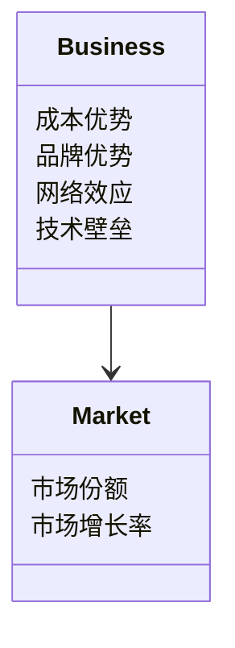

                 


# 巴菲特的经济护城河概念详解

## 关键词：巴菲特, 经济护城河, 价值投资, 投资策略, 股市分析, 财务分析, 竞争优势

## 摘要： 本文深入分析了巴菲特的经济护城河概念，从其核心原理、类型、评估方法到实际应用案例，结合技术原理和数学模型，全面解析如何通过护城河构建企业长期竞争优势。文章采用逐步推理方式，从基础概念到高级分析框架，层层递进，详细解读经济护城河的构建策略和实战应用。

---

# 第一部分：经济护城河的背景与核心概念

## 第1章：经济护城河的起源与巴菲特的价值投资理念

### 1.1 巴菲特的价值投资理念
#### 1.1.1 价值投资的核心思想
- 价值投资的基本原理
- 投资的目的是寻找具有持续竞争优势的企业
- 投资的长期性与安全性

#### 1.1.2 巴菲特的投资策略
- 购买并持有优质资产
- 以合理价格买入优秀企业

#### 1.1.3 经济护城河在巴菲特投资中的重要性
- 护城河是巴菲特筛选投资标的的核心标准
- 护城河决定了企业的长期盈利能力

### 1.2 经济护城河的定义与特征
#### 1.2.1 经济护城河的定义
- 护城河是企业竞争优势的保护屏障
- 护城河的本质是企业难以被竞争对手复制的核心竞争力

#### 1.2.2 经济护城河的核心特征
- 独特的资源或能力
- 可持续的市场地位
- 抗风险能力

#### 1.2.3 经济护城河的边界与外延
- 护城河的边界：企业的核心竞争优势
- 护城河的外延：企业生态系统的扩展

---

## 第2章：经济护城河的类型与分析框架

### 2.1 经济护城河的主要类型
#### 2.1.1 成本优势
- 规模效应降低成本
- 专有技术降低生产成本

#### 2.1.2 品牌优势
- 强大的品牌影响力
- 品牌忠诚度带来的市场溢价

#### 2.1.3 网络效应
- 用户越多，平台价值越大
- 网络效应的正反馈循环

#### 2.1.4 技术壁垒
- 专利技术的独占性
- 技术迭代的速度与能力

### 2.2 经济护城河的分析框架
#### 2.2.1 护城河深度分析
- 护城河的深度决定企业的防御能力
- 如何衡量护城河的深度

#### 2.2.2 护城河宽度分析
- 护城河的宽度决定企业的市场覆盖能力
- 如何评估护城河的宽度

#### 2.2.3 护城河可持续性分析
- 护城河的可持续性决定企业的长期竞争优势
- 如何判断护城河的可持续性

---

# 第二部分：经济护城河的核心概念与数学模型

## 第3章：经济护城河的核心概念与联系

### 3.1 经济护城河的核心概念原理
#### 3.1.1 护城河的经济学解释
- 麦克斯托夫的护城河理论
- 护城河与企业竞争优势的关系

#### 3.1.2 护城河与企业竞争优势的关系
- 护城河是竞争优势的物质基础
- 竞争优势是护城河的表现形式

### 3.2 经济护城河的核心要素对比表格
| 要素       | 描述                                   |
|------------|--------------------------------------|
| 成本优势   | 企业生产成本低于竞争对手             |
| 品牌优势   | 强大的品牌影响力和客户忠诚度         |
| 网络效应   | 用户数量越多，平台价值越大           |
| 技术壁垒   | 专利技术或专有技术形成的竞争优势     |

### 3.3 经济护城河的ER实体关系图
```mermaid
erd
  title 经济护城河的ER实体关系图
  Business
  Competitor
 护城河要素
  Business-Competitor-护城河要素
```

---

## 第4章：经济护城河的数学模型与算法原理

### 4.1 经济护城河的评估算法
#### 4.1.1 算法原理
- 经济护城河深度计算公式：
  $$ \text{护城河深度} = \frac{\text{企业竞争优势}}{\text{行业平均竞争优势}} $$
- 经济护城河宽度计算公式：
  $$ \text{护城河宽度} = \text{市场份额} \times \text{市场增长率} $$

#### 4.1.2 算法实现步骤
1. 确定企业的竞争优势要素
2. 计算竞争优势的相对值
3. 评估市场的增长率
4. 综合计算护城河的深度和宽度

### 4.2 经济护城河的数学模型
$$ \text{护城河强度} = f(\text{成本优势}, \text{品牌优势}, \text{网络效应}, \text{技术壁垒}) $$

---

# 第三部分：经济护城河的系统分析与架构设计

## 第5章：经济护城河的系统分析

### 5.1 问题场景介绍
- 如何通过系统化的方法构建企业的经济护城河
- 如何评估现有企业的护城河强度

### 5.2 系统功能设计
#### 5.2.1 领域模型设计


#### 5.2.2 系统架构设计


---

## 第6章：经济护城河的项目实战

### 6.1 环境安装与数据收集
- 数据源：公开财务数据、市场报告
- 工具安装：Python、Pandas、Matplotlib

### 6.2 核心实现代码
```python
def calculate_h护城河深度(enterprise, industry):
    return enterprise.cost_advantage / industry.cost_advantage

def calculate_h护城河宽度(enterprise, market):
    return enterprise.market_share * market.growth_rate
```

### 6.3 代码应用与案例分析
- 以亚马逊为例，分析其护城河的构建过程
- 通过代码计算亚马逊的护城河深度和宽度

### 6.4 实战总结
- 项目小结
- 注意事项
- 拓展阅读建议

---

## 第7章：经济护城河的最佳实践与总结

### 7.1 最佳实践
- 持续创新是护城河的核心
- 重视客户忠诚度是护城河的关键
- 财务健康是护城河的基础

### 7.2 小结与回顾
- 经济护城河的核心要素总结
- 投资策略的总结与反思

### 7.3 注意事项
- 避免过度依赖单一类型的护城河
- 定期评估和优化护城河

### 7.4 拓展阅读
- 推荐书籍和资源
- 提供进一步学习的方向

---

# 作者：AI天才研究院/AI Genius Institute & 禅与计算机程序设计艺术 /Zen And The Art of Computer Programming

---

以上是《巴菲特的经济护城河概念详解》的完整目录大纲，涵盖了从基础概念到高级分析框架的全过程，结合了技术原理和实际案例，适合深入理解和应用经济护城河理论的读者。

