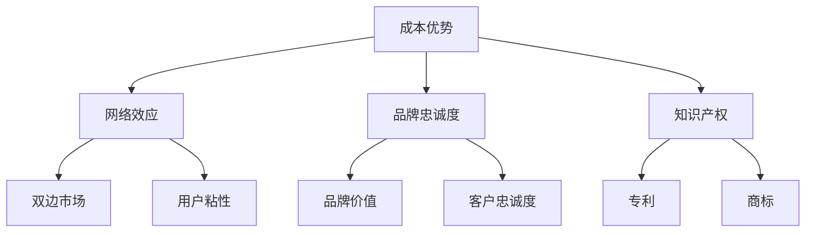
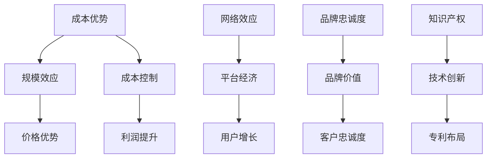

                 


# 巴菲特的经济护城河概念：寻找长期优势

> 关键词：巴菲特, 经济护城河, 长期竞争优势, 企业价值, 投资策略

> 摘要：本文深入探讨了巴菲特提出的经济护城河概念，分析其核心要素、构建方法及实际应用。通过案例分析和系统架构设计，揭示了护城河在企业长期竞争优势中的关键作用，并提供了投资策略和最佳实践建议。

---

## 第一部分：巴菲特的经济护城河概念背景

### 第1章：经济护城河的起源与核心思想

#### 1.1 经济护城河的定义与背景

##### 1.1.1 什么是经济护城河

经济护城河是巴菲特提出的一个核心投资概念，指企业通过某种竞争优势形成一道“护城河”，使其能够在市场中长期保持领先地位，抵御竞争对手的侵蚀。这种竞争优势可以是成本优势、网络效应、品牌忠诚度或知识产权等。

护城河的存在意味着企业能够在竞争中获得超额利润，从而为股东创造长期价值。巴菲特认为，拥有强大护城河的企业更有可能在长期内保持竞争优势，成为优秀的投资标的。

##### 1.1.2 巴菲特投资理念的核心

巴菲特的投资理念以“寻找那些拥有持续竞争优势的企业”为核心。他认为，市场波动和短期因素不应影响投资者的决策，而企业是否具备长期竞争优势才是关键。经济护城河正是这种竞争优势的集中体现。

##### 1.1.3 经济护城河与企业竞争优势

经济护城河是企业竞争优势的核心来源。它不仅帮助企业抵御竞争对手，还能在市场中占据主导地位。护城河的存在使得企业在定价、市场份额和技术进步等方面具备更强的控制力。

---

#### 1.2 经济护城河的核心思想

##### 1.2.1 护城河的形成与可持续性

护城河的形成通常需要时间的积累和资源的投入。企业通过不断优化自身的能力，逐步构建起竞争优势。护城河的可持续性取决于其核心要素的强度和市场的变化趋势。

##### 1.2.2 护城河的四种类型：成本优势、网络效应、品牌忠诚度、知识产权

- **成本优势**：企业通过规模效应或技术创新降低成本，从而在价格上占据优势。
- **网络效应**：随着用户数量的增加，平台的价值不断提升，形成正反馈效应。
- **品牌忠诚度**：强大的品牌影响力使得消费者更倾向于选择该品牌的产品或服务。
- **知识产权**：专利、商标等无形资产为企业提供技术壁垒，防止竞争对手模仿。

##### 1.2.3 护城河的边界与外延

护城河并非无懈可击，其边界受到市场环境、技术进步和消费者偏好的影响。企业需要不断审视和优化其护城河要素，以应对变化。

---

## 第二部分：经济护城河的核心要素分析

### 第2章：经济护城河的核心要素分析

#### 2.1 经济护城河的构成要素

##### 2.1.1 成本优势： economies of scale与范围经济

- **规模经济**：随着生产量的增加，单位成本下降。企业通过扩大生产规模降低成本，增强价格竞争优势。
- **范围经济**：企业通过扩大产品线或服务范围，降低单位产品的固定成本。

##### 2.1.2 网络效应：平台的双边市场与用户粘性

- **双边市场**：平台连接供需双方，随着用户数量的增加，平台的价值呈指数级增长。
- **用户粘性**：用户迁移到其他平台的成本较高，从而形成用户粘性。

##### 2.1.3 品牌忠诚度：品牌价值与客户忠诚度的构建

- **品牌价值**：强大的品牌能够吸引更多的消费者，提高市场地位。
- **客户忠诚度**：客户对企业产品或服务的长期支持，形成稳定的收入来源。

##### 2.1.4 知识产权：专利、商标与技术壁垒

- **专利**：技术专利为企业提供法律保护，防止竞争对手复制技术。
- **商标**：独特的品牌标识为企业提供市场区分度。

##### 2.1.5 ER实体关系图

以下是护城河核心要素的ER实体关系图：

```mermaid
erDiagram
    class 经济护城河 {
        成本优势
        网络效应
        品牌忠诚度
        知识产权
    }
    class 成本优势 {
        scale经济
        范围经济
    }
    class 网络效应 {
        双边市场
        用户粘性
    }
    class 品牌忠诚度 {
        品牌价值
        客户忠诚度
    }
    class 知识产权 {
        专利
        商标
    }
    经济护城河 --> 成本优势
    经济护城河 --> 网络效应
    经济护城河 --> 品牌忠诚度
    经济护城河 --> 知识产权
```

---

#### 2.2 经济护城河要素的特征对比

##### 2.2.1 成本优势与网络效应的对比分析

| 特性                | 成本优势                | 网络效应                |
|---------------------|------------------------|------------------------|
| 核心来源            | 规模经济与技术创新      | 用户数量与平台价值      |
| 影响范围            | 价格竞争               | 用户粘性与市场扩展      |
| 可持续性            | 较强                   | 较强                   |

##### 2.2.2 品牌忠诚度与知识产权的对比分析

| 特性                | 品牌忠诚度             | 知识产权             |
|---------------------|-----------------------|-----------------------|
| 核心来源            | 品牌影响力             | 技术壁垒             |
| 影响范围            | 消费者选择             | 技术应用与市场准入    |
| 可持续性            | 中等                   | 较强                   |

##### 2.2.3 ER实体关系图

以下是护城河要素的对比分析图：



---

## 第三部分：经济护城河的分析框架

### 第3章：经济护城河的分析框架

#### 3.1 护城河的形成机制

##### 3.1.1 护城河的动态演进过程

护城河的形成是一个动态过程，通常包括以下几个阶段：

1. **种子阶段**：企业通过创新或差异化初步建立竞争优势。
2. **成长阶段**：企业通过规模效应或网络效应进一步扩大优势。
3. **成熟阶段**：企业形成稳定的竞争优势，进入持续优化阶段。

##### 3.1.2 护城河的强度评估模型

护城河的强度可以通过以下几个指标进行评估：

- **市场占有率**：企业在目标市场的份额。
- **竞争对手的威胁**：竞争对手进入市场的难度。
- **客户忠诚度**：客户对企业产品或服务的依赖程度。

##### 3.1.3 护城河的生命周期分析

护城河的生命周期通常包括以下几个阶段：

1. **形成阶段**：企业通过创新或差异化初步建立竞争优势。
2. **成长阶段**：企业通过规模效应或网络效应进一步扩大优势。
3. **成熟阶段**：企业形成稳定的竞争优势，进入持续优化阶段。

##### 3.1.4 护城河的动态优化策略

企业需要不断审视和优化其护城河要素，以应对变化的市场环境。优化策略包括：

- **持续创新**：通过技术创新保持竞争优势。
- **扩展网络效应**：通过增加用户数量或扩展服务范围提升平台价值。
- **强化品牌忠诚度**：通过提升客户体验增强品牌影响力。

---

#### 3.2 经济护城河的系统性分析方法

##### 3.2.1 护城河的系统构成：资源、能力、市场、技术

护城河的系统构成包括以下几个方面：

- **资源**：企业的资金、人才和基础设施。
- **能力**：企业的技术创新能力和管理能力。
- **市场**：目标市场的规模和竞争情况。
- **技术**：企业的技术水平和专利储备。

##### 3.2.2 护城河的系统性评估框架

系统性评估框架包括以下几个步骤：

1. **资源评估**：评估企业的资源储备。
2. **能力评估**：评估企业的技术创新能力和管理能力。
3. **市场评估**：评估目标市场的规模和竞争情况。
4. **技术评估**：评估企业的技术水平和专利储备。

##### 3.2.3 护城河的动态优化策略

企业需要不断审视和优化其护城河要素，以应对变化的市场环境。优化策略包括：

- **持续创新**：通过技术创新保持竞争优势。
- **扩展网络效应**：通过增加用户数量或扩展服务范围提升平台价值。
- **强化品牌忠诚度**：通过提升客户体验增强品牌影响力。

---

## 第四部分：经济护城河的构建与维护

### 第4章：经济护城河的构建与维护

#### 4.1 护城河的构建策略

##### 4.1.1 成本优势的构建：规模效应与成本控制

- **规模效应**：通过扩大生产规模降低成本。
- **成本控制**：通过优化管理流程降低成本。

##### 4.1.2 网络效应的构建：平台经济与用户增长

- **平台经济**：构建双边市场，吸引用户和供应商。
- **用户增长**：通过营销和推广吸引更多用户。

##### 4.1.3 品牌忠诚度的构建：品牌价值与客户体验

- **品牌价值**：通过广告和市场推广提升品牌知名度。
- **客户体验**：通过提供优质服务提升客户满意度。

##### 4.1.4 知识产权的构建：技术创新与专利布局

- **技术创新**：通过研发投入开发新技术。
- **专利布局**：通过申请专利保护技术创新成果。

##### 4.1.5 系统架构图

以下是护城河构建的系统架构图：



#### 4.2 护城河的维护与强化

##### 4.2.1 成本优势的持续优化

- **持续创新**：通过技术创新进一步降低成本。
- **流程优化**：通过优化管理流程提高效率。

##### 4.2.2 网络效应的扩展与深化

- **用户扩展**：通过市场推广吸引更多用户。
- **服务深化**：通过提供更多服务增加用户粘性。

##### 4.2.3 品牌忠诚度的维护与提升

- **品牌维护**：通过广告和市场推广维护品牌形象。
- **客户体验优化**：通过提供优质服务提升客户满意度。

##### 4.2.4 知识产权的保护与创新

- **专利保护**：通过法律手段保护专利权益。
- **持续创新**：通过研发投入开发新技术。

---

## 第五部分：经济护城河的评估与投资策略

### 第5章：经济护城河的评估与投资策略

#### 5.1 护城河的评估指标

##### 5.1.1 护城河强度的量化评估

护城河强度可以通过以下几个指标进行量化评估：

- **市场占有率**：企业在目标市场的份额。
- **竞争对手的威胁**：竞争对手进入市场的难度。
- **客户忠诚度**：客户对企业产品或服务的依赖程度。

##### 5.1.2 护城河可持续性的评估

护城河的可持续性可以通过以下几个指标进行评估：

- **技术壁垒**：企业的技术水平和专利储备。
- **市场地位**：企业在目标市场的地位。
- **客户粘性**：客户对企业产品或服务的依赖程度。

##### 5.1.3 护城河的动态评估模型

护城河的动态评估模型包括以下几个步骤：

1. **资源评估**：评估企业的资源储备。
2. **能力评估**：评估企业的技术创新能力和管理能力。
3. **市场评估**：评估目标市场的规模和竞争情况。
4. **技术评估**：评估企业的技术水平和专利储备。

#### 5.2 投资策略的制定

##### 5.2.1 护城河投资的长期视角

- **长期视角**：关注企业的长期竞争优势。
- **风险管理**：通过分散投资降低风险。

##### 5.2.2 护城河投资的风险管理

- **风险管理**：通过分散投资降低风险。
- **监控与调整**：定期评估投资组合并进行调整。

##### 5.2.3 护城河投资的组合策略

- **组合策略**：通过分散投资降低风险。
- **长期视角**：关注企业的长期竞争优势。

---

## 第六部分：经济护城河的案例分析

### 第6章：经济护城河的案例分析

#### 6.1 成功案例：苹果公司的护城河

##### 6.1.1 苹果的成本优势：制造与供应链管理

苹果通过全球化的供应链管理和严格的质量控制，确保产品成本的最优。其制造合作伙伴遍布全球，形成了高效的成本控制体系。

##### 6.1.2 苹果的网络效应：生态系统与用户粘性

苹果通过构建iOS生态系统，形成了强大的网络效应。用户的迁移成本较高，从而形成了较高的用户粘性。

##### 6.1.3 苹果的品牌忠诚度：品牌价值与用户体验

苹果通过不断创新和提供优质用户体验，建立了强大的品牌忠诚度。消费者对苹果产品的高度依赖，使得其品牌价值持续增长。

---

## 结语

经济护城河是巴菲特投资理念的核心，也是企业长期竞争优势的关键。通过构建和维护强大的护城河，企业可以在激烈的市场竞争中占据优势地位，为股东创造长期价值。投资者也需要深入理解护城河的概念，选择那些具有强大护城河的企业进行投资。

---

## 作者

作者：AI天才研究院/AI Genius Institute & 禅与计算机程序设计艺术/Zen And The Art of Computer Programming

---

希望这篇文章能够帮助您理解巴菲特的经济护城河概念，并为企业寻找长期竞争优势提供有价值的见解。

