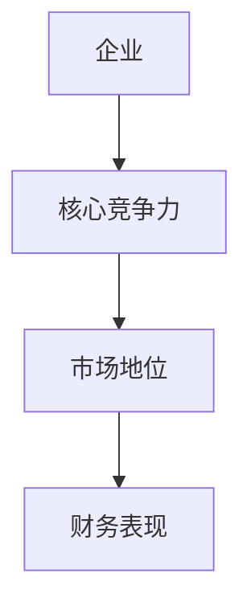

                 

# 巴菲特的经济护城河理论：持久竞争优势的来源

## 关键词：经济护城河，巴菲特，竞争优势，企业战略，投资分析

## 摘要：  
本文深入探讨了巴菲特的经济护城河理论，分析了企业如何通过构建持久的竞争优势来实现长期成功。文章从理论背景、核心概念、评估方法、构建策略、系统分析等多个维度展开，结合实际案例和数学模型，为读者提供全面而深入的见解。

---

# 第一部分：经济护城河的基本概念

## 第1章：经济护城河的定义与起源

### 1.1 什么是经济护城河  
经济护城河是指企业在市场上形成的持久竞争优势，使竞争对手难以模仿或超越。这一概念由沃伦·巴菲特首次提出，强调企业通过独特的资源、技术或商业模式，形成一道“护城河”，保护其市场份额和盈利能力。

### 1.2 巴菲特对经济护城河的诠释  
巴菲特认为，真正的经济护城河来源于企业的核心竞争力，包括成本优势、品牌影响力和市场准入壁垒。他强调，只有具备这些护城河的企业，才能在长期内实现稳定的收益和增长。

### 1.3 经济护城河的理论发展  
经济护城河理论的发展经历了多个阶段，从最初的行业垄断到后来的创新和技术驱动。随着市场竞争的加剧，企业需要不断创新和优化，才能保持其护城河的有效性。

---

## 第2章：经济护城河的核心要素

### 2.1 企业的核心竞争力  
核心竞争力是企业区别于竞争对手的关键能力，例如技术创新、生产效率或客户服务。这些能力构成了企业护城河的基础。

### 2.2 市场地位与品牌价值  
强大的市场地位和品牌价值能够为企业带来客户忠诚度和议价能力。品牌是企业与竞争对手区分开的重要标志，也是护城河的重要组成部分。

### 2.3 财务表现与盈利能力  
健康的财务状况和持续的盈利能力是企业护城河的重要体现。稳定的财务表现能够支持企业的持续投资和扩张，进一步巩固其市场地位。

---

## 第3章：经济护城河的类型

### 3.1 成本优势型  
成本优势型企业通过优化生产流程或采购成本，实现低于行业平均水平的成本结构。例如，零售巨头沃尔玛通过规模效应和供应链管理，形成了强大的成本优势。

### 3.2 品牌优势型  
品牌优势型企业依靠强大的品牌影响力和客户忠诚度，吸引消费者愿意支付溢价。例如，苹果公司通过创新的产品设计和品牌营销，建立了强大的品牌护城河。

### 3.3 资源垄断型  
资源垄断型企业通过拥有独特的资源或技术，形成市场准入壁垒。例如，石油公司通过控制上游资源，形成了难以被复制的护城河。

---

## 第4章：经济护城河与企业生命周期

### 4.1 企业生命周期的各个阶段  
企业生命周期包括初创期、成长期、成熟期和衰退期。在每个阶段，企业需要根据自身特点，构建和维护适合其发展阶段的护城河。

### 4.2 经济护城河在不同阶段的作用  
在初创期，企业需要通过创新和差异化快速建立市场地位；在成长期，企业需要扩大市场份额并巩固竞争优势；在成熟期，企业需要通过持续优化和创新维持护城河。

### 4.3 如何在不同阶段构建和维护经济护城河  
企业需要根据自身发展阶段，灵活调整策略。例如，在初创期，企业应注重产品创新和市场拓展；在成熟期，企业应注重品牌建设和成本控制。

---

## 第5章：经济护城河的核心概念与联系

### 5.1 核心概念原理  
经济护城河的核心在于企业通过独特的能力和资源，形成竞争优势。这种优势可以是成本优势、品牌影响力或资源垄断等，不同类型的护城河具有不同的特征和作用。

### 5.2 核心概念对比表格  
| 类型       | 特征描述               |
|------------|------------------------|
| 成本优势   | 低成本生产，价格优势   |
| 品牌优势   | 强品牌认知，客户忠诚度 |
| 资源垄断   | 独有资源，难以复制     |

### 5.3 ER实体关系图  

---

## 第6章：经济护城河的评估与分析

### 6.1 企业竞争优势的评估方法  
评估企业竞争优势的方法包括SWOT分析、波特五力模型和市场占有率分析。这些方法帮助企业识别自身优势和劣势，了解市场环境和竞争态势。

### 6.2 经济护城河的量化评估  
量化评估可以通过财务指标分析、市场地位指数和竞争优势指数等方法进行。例如，计算企业的净利率、ROE（净资产收益率）等指标，评估其盈利能力。

### 6.3 经济护城河的动态分析  
市场竞争环境不断变化，企业需要动态调整其护城河策略。例如，随着技术进步，企业需要不断进行产品创新和技术升级，以应对新的竞争挑战。

---

## 第7章：经济护城河的构建与维护

### 7.1 核心竞争力的构建  
企业需要通过技术创新、研发投入和优化生产流程，构建核心竞争力。例如，科技公司通过持续的研发投入，保持技术领先地位。

### 7.2 市场地位的提升  
提升市场地位需要加强品牌建设、优化客户关系和扩大市场份额。例如，通过广告宣传、品牌推广和客户忠诚计划，增强品牌影响力。

### 7.3 财务表现的优化  
优化财务表现需要通过成本控制、资本结构优化和股东价值最大化。例如，企业可以通过精益管理降低成本，通过并购和资本运作优化资本结构。

### 7.4 经济护城河的动态维护  
企业需要持续创新和适应变化，应对竞争策略。例如，随着市场需求变化，企业需要及时调整产品策略和市场定位。

---

## 第8章：项目实战与案例分析

### 8.1 项目环境与目标  
以某零售企业为例，分析其竞争优势，并构建经济护城河。

### 8.2 系统功能设计  
设计一个竞争优势分析系统，包括数据采集、分析模块和结果展示模块。

### 8.3 系统架构设计  
使用分层架构，包括数据层、业务逻辑层和用户界面层。

### 8.4 系统接口设计  
定义数据接口和API，确保各模块之间的数据交互。

### 8.5 系统交互设计  
使用Mermaid序列图展示用户与系统的交互流程。

---

## 第9章：最佳实践与总结

### 9.1 小结  
经济护城河是企业在市场竞争中保持优势的关键。通过构建核心竞争力、提升市场地位和优化财务表现，企业能够形成持久的竞争优势。

### 9.2 注意事项  
企业在构建护城河时，需要考虑外部环境的变化和内部资源的优化。同时，需要关注创新和灵活性，以应对市场的不确定性。

### 9.3 拓展阅读  
推荐阅读《巴菲特的护城河》、《竞争优势论》等书籍，深入理解经济护城河的理论和实践。

---

## 作者：AI天才研究院/AI Genius Institute & 禅与计算机程序设计艺术 /Zen And The Art of Computer Programming

---

这篇文章系统地分析了巴菲特的经济护城河理论，从理论基础到实际应用，结合了技术语言和逻辑推理，为读者提供了全面而深入的见解。希望对您理解经济护城河的构建与维护有所帮助。

