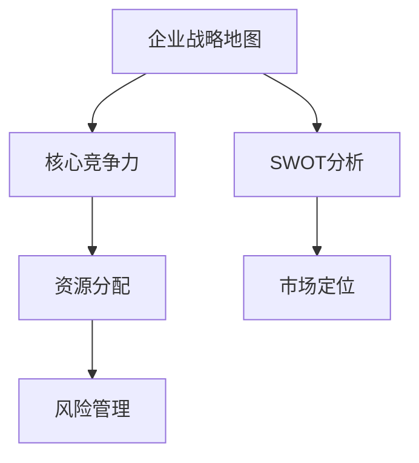

                 

# 巴菲特的经济护城河：持久竞争优势的重要性

## 关键词
经济护城河, 巴菲特投资理念, 持久竞争优势, 企业竞争力, 投资策略

## 摘要
本文深入分析了巴菲特的经济护城河概念，探讨了其在企业持久竞争优势中的重要性。通过详细阐述经济护城河的定义、类型及其对投资决策的影响，本文为投资者提供了在选择企业时的关键视角。通过实际案例分析和数学模型，本文帮助读者理解如何识别和评估企业的经济护城河，从而做出更明智的投资决策。

---

# 第一部分: 经济护城河的背景与定义

## 第1章: 经济护城河的背景与重要性

### 1.1 经济护城河的定义

#### 1.1.1 经济护城河的核心概念
经济护城河是企业在行业中建立的竞争优势，使其能够在长期竞争中保持领先地位。这种优势可以是成本优势、品牌优势、技术优势或网络效应等。

#### 1.1.2 经济护城河的特征
- **持久性**：能够抵御市场变化和竞争对手的侵蚀。
- **可扩展性**：能够随着企业规模扩大而增强。
- **防御性**：能够有效阻止竞争对手进入市场或削弱企业的地位。

#### 1.1.3 经济护城河的分类
- **成本优势**：企业通过规模经济或效率优势降低生产成本。
- **品牌优势**：强大的品牌认知度和客户忠诚度。
- **技术优势**：拥有独特的技术或专利。
- **网络效应**：用户数量的增加会增强产品的价值。

### 1.2 经济护城河的重要性

#### 1.2.1 经济护城河与企业竞争力
经济护城河是企业在市场中立于不败之地的关键。它不仅能够抵御竞争压力，还能为企业创造超额利润。

#### 1.2.2 经济护城河与投资策略
对于投资者来说，识别具有强大经济护城河的企业是实现长期收益的关键。巴菲特的投资理念强调选择具有持久竞争优势的企业。

#### 1.2.3 经济护城河的动态性
经济护城河并非一成不变，企业需要不断创新和调整以维持其竞争优势。

---

## 第2章: 经济护城河的核心概念

### 2.1 经济护城河的构建要素

#### 2.1.1 核心竞争力
企业必须具备独特的竞争优势，使其能够在市场中脱颖而出。

#### 2.1.2 资源壁垒
企业通过拥有独特的资源（如专利、原材料）来建立竞争优势。

#### 2.1.3 能力壁垒
企业的组织能力和管理水平也是建立经济护城河的重要因素。

### 2.2 经济护城河的属性特征对比

| 属性       | 成本优势       | 品牌优势       | 技术优势       | 网络效应       |
|------------|---------------|---------------|---------------|---------------|
| 描述       | 通过规模经济降低生产成本。 | 强大的品牌认知度和客户忠诚度。 | 拥有独特的技术或专利。 | 用户数量的增加会增强产品的价值。 |
| 示例       | 制造业企业通过自动化生产降低成本。 | 软件公司通过长期积累形成品牌忠诚度。 | 生物科技公司拥有独家药品专利。 | 社交媒体平台通过用户网络效应增强竞争力。 |

---

## 第3章: 经济护城河的数学模型与分析

### 3.1 经济护城河的定量分析

#### 3.1.1 净利润率（Net Profit Margin）
利润率是衡量企业盈利能力的重要指标。公式如下：
$$ \text{净利润率} = \frac{\text{净利润}}{\text{营业收入}} \times 100\% $$

#### 3.1.2 投资回报率（Return on Equity，ROE）
ROE是衡量企业投资回报的重要指标。公式如下：
$$ \text{ROE} = \frac{\text{净利润}}{\text{股东权益}} \times 100\% $$

#### 3.1.3 资产周转率（Asset Turnover）
资产周转率是衡量企业资产使用效率的指标。公式如下：
$$ \text{资产周转率} = \frac{\text{营业收入}}{\text{平均总资产}} $$

### 3.2 经济护城河的动态分析

#### 3.2.1 市场地位的变化
企业通过持续创新和优化，保持其市场地位。

#### 3.2.2 竞争对手的应对策略
竞争对手可能会采取模仿或创新策略来削弱企业的竞争优势。

#### 3.2.3 行业环境的变化
行业政策、技术进步和消费者需求的变化都会影响经济护城河的有效性。

---

## 第4章: 经济护城河的系统分析与架构设计

### 4.1 系统分析

#### 4.1.1 问题场景介绍
企业需要通过构建经济护城河来抵御竞争压力并实现可持续发展。

#### 4.1.2 系统功能设计
- **核心竞争力分析**：识别企业的核心优势。
- **资源分配优化**：合理分配资源以增强竞争优势。
- **风险管理**：制定应对竞争对手和市场变化的策略。

#### 4.1.3 系统架构设计
- **企业战略地图**：展示企业在市场中的定位和竞争优势。
- **SWOT分析**：识别企业的优势、劣势、机会和威胁。

### 4.2 系统架构设计

---

## 第5章: 项目实战——经济护城河的案例分析

### 5.1 案例分析：可口可乐的经济护城河

#### 5.1.1 可口可乐的市场地位
可口可乐通过强大的品牌影响力和全球分销网络建立经济护城河。

#### 5.1.2 核心竞争优势
- 强大的品牌认知度。
- 全球分销网络。

### 5.2 案例分析：谷歌的经济护城河

#### 5.2.1 谷歌的核心竞争优势
- 技术优势：搜索引擎算法的领先地位。
- 网络效应：庞大的用户基数和生态系统。

### 5.3 实际应用与投资策略

#### 5.3.1 投资策略
- 选择具有强大经济护城河的企业。
- 长期持有，避免短期波动干扰。

#### 5.3.2 风险管理
- 定期评估企业的竞争优势。
- 保持对行业变化的敏感性。

---

## 第6章: 经济护城河的最佳实践

### 6.1 投资者的注意事项

#### 6.1.1 长期视角
经济护城河的价值在于长期的竞争优势。

#### 6.1.2 持续学习
市场环境不断变化，投资者需要持续学习和调整。

### 6.2 企业的最佳实践

#### 6.2.1 不断创新
企业需要不断创新以维持其竞争优势。

#### 6.2.2 优化资源配置
合理分配资源以增强经济护城河的强度。

---

## 结语

经济护城河是企业长期竞争优势的关键。通过深入理解经济护城河的构建要素和类型，投资者可以更好地选择具有持久竞争优势的企业。同时，企业也需要不断优化自身的竞争优势，以应对市场变化和竞争压力。

---

## 作者：AI天才研究院/AI Genius Institute & 禅与计算机程序设计艺术 /Zen And The Art of Computer Programming

