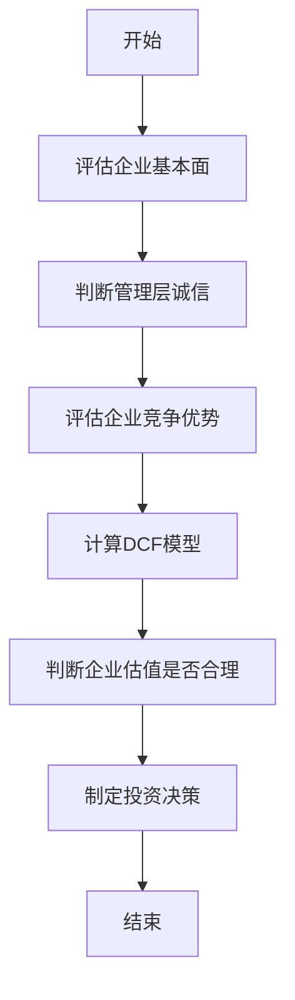
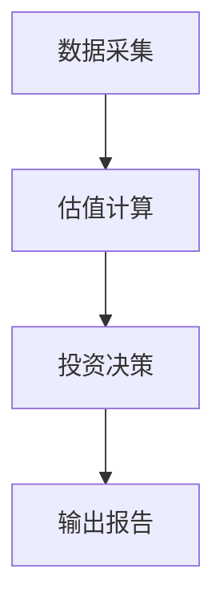
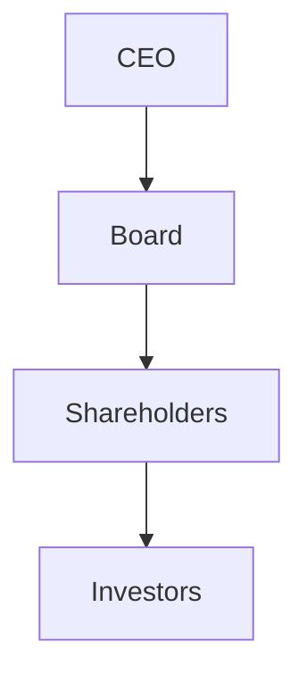
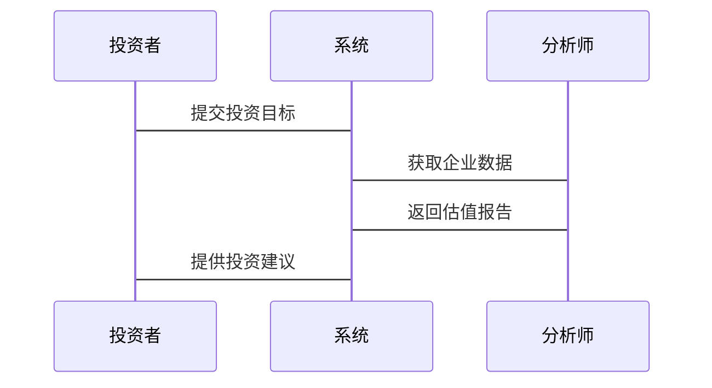

                 


# 巴菲特的股东友好政策

## 关键词

- 巴菲特
- 股东友好政策
- 企业治理
- 长期投资
- 股东价值

## 摘要

本文深入分析巴菲特的股东友好政策，探讨其在企业治理、长期投资和股东价值最大化中的作用。通过详细讲解巴菲特的投资理念、股东友好政策的核心概念、算法模型和实际案例，结合系统分析与架构设计，为读者提供全面的理论与实践指导。文章最后总结最佳实践，提供实用建议和注意事项，帮助读者更好地理解和应用巴菲特的股东友好政策。

---

# 第一部分: 巴菲特的股东友好政策背景与核心概念

## 第1章: 巴菲特的生平与投资理念

### 1.1 巴菲特的早年经历
- 1.1.1 巴菲特的早年生活与教育背景
- 1.1.2 巴菲特的投资启蒙与早期成就
- 1.1.3 巴菲特的合伙企业与事业起步

### 1.2 巴菲特的投资哲学
- 1.2.1 价值投资的核心思想
- 1.2.2 股东价值最大化的目标
- 1.2.3 长期持有优质企业的策略

### 1.3 股东友好政策的背景
- 1.3.1 股东友好政策的定义与意义
- 1.3.2 股东友好政策的起源与发展
- 1.3.3 股东友好政策的现状与挑战

## 第2章: 股东友好政策的核心概念

### 2.1 股东友好政策的定义与特点
- 2.1.1 股东友好政策的定义
- 2.1.2 股东友好政策的核心特点
- 2.1.3 股东友好政策与企业治理的关系

### 2.2 巴菲特的长期投资策略
- 2.2.1 长期投资的核心要素
- 2.2.2 优质企业的识别标准
- 2.2.3 股东价值的持续增长

### 2.3 股东友好政策与企业治理
- 2.3.1 企业治理的基本框架
- 2.3.2 股东友好政策在企业治理中的作用
- 2.3.3 股东友好政策与企业社会责任

---

# 第二部分: 巴菲特的股东友好政策算法与系统分析

## 第3章: 巴菲特的股东友好政策算法

### 3.1 巴菲特的价值评估模型
- 3.1.1 DCF模型的数学公式
  $$DCF = \frac{CF}{(r - g)}$$
- 3.1.2 企业价值评估的步骤
  1. 确定自由现金流
  2. 确定贴现率
  3. 计算终值
  4. 累加现值

### 3.2 巴菲特的股东友好政策算法流程图


### 3.3 巴菲特的长期投资策略与算法优化
- 3.3.1 投资组合优化的数学模型
  $$ \text{最优投资组合} = \arg \min_w \left( w^T \Sigma w \right) \text{ s.t. } \mathbb{E}[r] \geq r_{\text{target}} $$
- 3.3.2 算法优化与风险控制

## 第4章: 巴菲特的股东友好政策系统分析

### 4.1 系统架构设计
- 4.1.1 系统功能模块
  - 数据采集模块
  - 估值计算模块
  - 投资决策模块
- 4.1.2 系统架构图


### 4.2 企业治理结构分析
- 4.2.1 企业治理的实体关系图


### 4.3 系统接口设计
- 4.3.1 数据接口
  - 输入：企业财务数据、市场数据
  - 输出：估值报告
- 4.3.2 用户接口
  - 输入：投资目标
  - 输出：投资建议

### 4.4 系统交互设计


---

# 第三部分: 巴菲特的股东友好政策项目实战

## 第5章: 巴菲特的股东友好政策项目实战

### 5.1 项目背景与目标
- 5.1.1 项目背景
- 5.1.2 项目目标
- 5.1.3 项目范围

### 5.2 项目实施步骤
- 5.2.1 确定目标企业
- 5.2.2 数据采集与清洗
- 5.2.3 应用巴菲特的股东友好政策算法进行评估
- 5.2.4 制定投资策略

### 5.3 项目核心代码实现
- 5.3.1 数据采集模块
  ```python
  import pandas as pd
  def fetch_data(ticker):
      # 从数据库或API获取数据
      return pd.DataFrame()
  ```
- 5.3.2 估值计算模块
  ```python
  def calculate_dcf(cf, r, g):
      return cf / (r - g)
  ```
- 5.3.3 投资决策模块
  ```python
  def make_investment_decision(dcf, market_price):
      if dcf > market_price:
          return "买入"
      else:
          return "卖出"
  ```

### 5.4 实际案例分析
- 5.4.1 案例选择
- 5.4.2 数据分析与计算
- 5.4.3 投资决策与结果评估

### 5.5 项目小结
- 5.5.1 项目成果
- 5.5.2 经验总结
- 5.5.3 改进建议

---

# 第四部分: 巴菲特的股东友好政策总结与建议

## 第6章: 巴菲特的股东友好政策总结

### 6.1 核心概念总结
- 6.1.1 股东友好政策的核心要素
- 6.1.2 巴菲特投资策略的精髓
- 6.1.3 股东友好政策与企业治理的关系

### 6.2 系统分析总结
- 6.2.1 系统架构的合理性
- 6.2.2 算法模型的有效性
- 6.2.3 系统交互的流畅性

### 6.3 项目实战总结
- 6.3.1 实战项目的成功经验
- 6.3.2 实战项目的改进建议
- 6.3.3 实战项目的未来展望

## 第7章: 巴菲特的股东友好政策最佳实践与注意事项

### 7.1 最佳实践
- 7.1.1 投资者如何选择企业
- 7.1.2 管理层如何实施股东友好政策
- 7.1.3 投资机构如何优化投资策略

### 7.2 小结
- 7.2.1 股东友好政策的重要性
- 7.2.2 长期投资的价值
- 7.2.3 企业治理的关键性

### 7.3 注意事项
- 7.3.1 投资风险的防范
- 7.3.2 股东权益的保护
- 7.3.3 企业治理的持续优化

### 7.4 拓展阅读
- 7.4.1 推荐书籍
- 7.4.2 推荐文章
- 7.4.3 推荐视频

---

# 作者

作者：AI天才研究院/AI Genius Institute & 禅与计算机程序设计艺术 /Zen And The Art of Computer Programming

