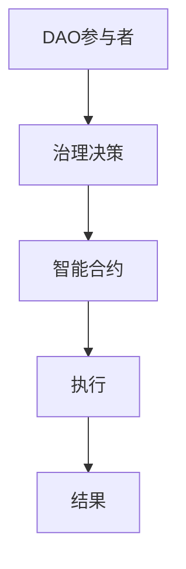
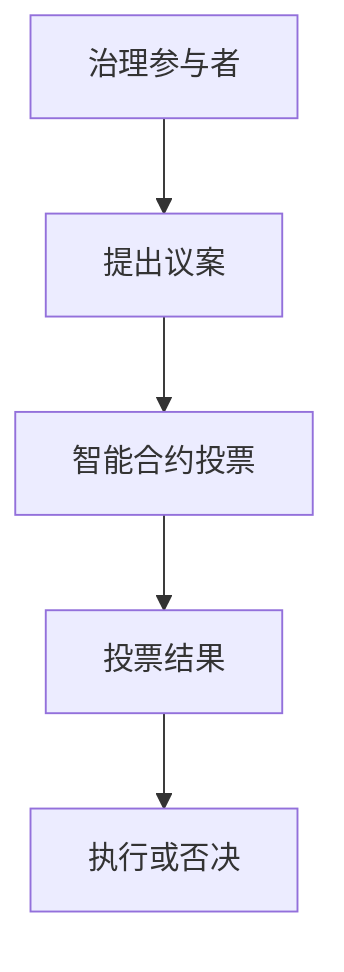
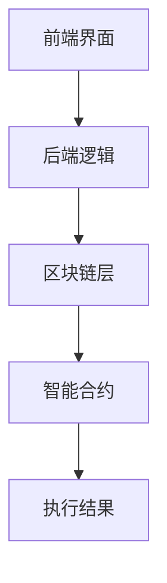
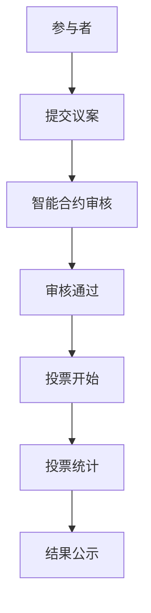
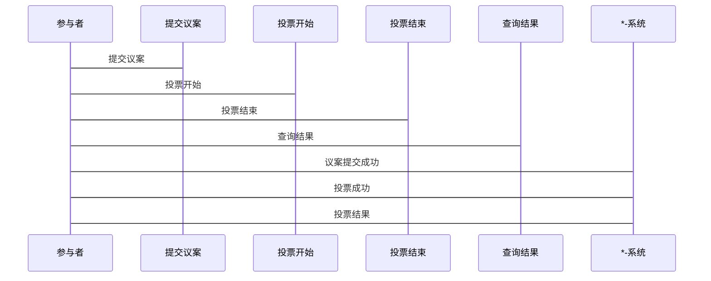

                 


# 巴菲特的股东沟通艺术：去中心化自治组织的治理模式

---

## 关键词：
- 巴菲特
- 股东沟通艺术
- 去中心化自治组织（DAO）
- 治理模式
- 信任构建
- 透明化

---

## 摘要：
本文探讨了巴菲特的股东沟通艺术与去中心化自治组织（DAO）治理模式的结合。通过分析DAO的核心概念、治理机制以及巴菲特的沟通理念，本文揭示了如何将传统的股东沟通艺术应用于去中心化环境下的组织治理。文章从理论、实践和未来趋势三个维度展开，详细分析了DAO的治理结构、股东角色、沟通挑战以及治理决策的长期视角。

---

# 第1章: 背景介绍：股东沟通与去中心化自治组织的结合

## 1.1 什么是去中心化自治组织（DAO）
### 1.1.1 DAO的定义与核心概念
去中心化自治组织（Decentralized Autonomous Organization，DAO）是一种基于区块链技术的组织形式，其特点是没有中心化的控制机构，而是通过智能合约和分布式决策机制来实现自治。DAO的核心概念包括：
- **去中心化**：权力和决策分散到各个参与者，避免单一中心化机构的控制。
- **自治性**：组织通过智能合约自动执行规则和决策。
- **透明性**：所有交易和决策过程公开可查，确保信任。
- **不可篡改性**：区块链技术确保数据的安全性和不可篡改性。

**图1-1: DAO的治理架构图**


### 1.1.2 DAO的起源与发展
DAO的概念起源于区块链技术的发展，最早可以追溯到2016年的The DAO事件，这是第一个尝试通过以太坊智能合约构建的去中心化自治组织。尽管该事件因漏洞攻击而失败，但它为DAO的治理模式提供了重要的经验和教训。近年来，随着区块链技术的成熟和智能合约的完善，DAO逐渐应用于多个领域，包括社区治理、去中心化金融（DeFi）和去中心化企业。

### 1.1.3 DAO与传统组织的区别
与传统组织相比，DAO具有以下显著特点：
- **去中心化**：没有传统的层级结构，决策由参与者共同完成。
- **透明化**：所有决策和交易记录在区块链上，公开透明。
- **自治性**：通过智能合约自动执行规则，减少人为干预。
- **信任机制**：依赖区块链技术和智能合约确保信任。

---

## 1.2 巴菲特的股东沟通艺术
### 1.2.1 巴菲特的股东价值理念
沃伦·巴菲特（Warren Buffett）作为全球最著名的投资者之一，他的股东价值理念的核心是“长期为股东创造价值”。巴菲特认为，股东不仅是资金提供者，更是企业的重要利益相关者，企业应当通过透明和诚信的沟通，赢得股东的信任和支持。

### 1.2.2 巴菲特的沟通风格与技巧
巴菲特的沟通风格以简洁、坦诚和逻辑清晰著称。他通过以下方式实现高效的股东沟通：
- **透明化**：巴菲特始终坚持公开披露企业的财务状况和经营策略。
- **长期视角**：他强调与股东建立长期信任关系，而非短期利益驱动。
- **简洁明了**：巴菲特的沟通风格避免复杂的术语，用简单易懂的语言传达信息。

### 1.2.3 巴菲特股东沟通的核心原则
巴菲特的股东沟通艺术可以总结为以下几点：
- **以股东为中心**：始终将股东利益放在首位。
- **长期价值导向**：通过长期的沟通和合作，实现共赢。
- **诚信与透明**：通过公开透明的信息披露，建立信任。

---

## 1.3 为什么DAO需要巴菲特的股东沟通艺术
### 1.3.1 DAO治理中的信任问题
DAO的治理模式依赖于参与者的信任，而区块链技术虽然提供了技术上的信任，但人性的复杂性和利益冲突仍然可能导致治理失败。因此，如何通过有效的沟通建立信任，是DAO治理的核心挑战。

### 1.3.2 巴菲特沟通理念对DAO治理的启示
巴菲特的沟通理念为DAO治理提供了以下重要启示：
- **信任构建**：通过透明化和诚信的沟通，建立参与者之间的信任。
- **长期视角**：在治理中注重长期价值，而非短期利益。
- **参与与协作**：鼓励参与者积极参与决策，实现协作共赢。

### 1.3.3 股东沟通与DAO治理的结合意义
将巴菲特的股东沟通艺术应用于DAO治理，可以有效解决以下问题：
- **治理效率低下**：通过优化沟通机制，提升决策效率。
- **信任缺失**：通过透明化的沟通，增强参与者之间的信任。
- **利益冲突**：通过长期视角和协作，减少利益冲突。

---

# 第2章: 去中心化自治组织的核心概念与治理机制

## 2.1 DAO的治理结构
### 2.1.1 DAO的治理模型
DAO的治理模型通常包括以下组件：
- **治理决策机制**：通过投票或智能合约实现决策。
- **治理参与者**：包括股东、治理者和技术开发者。
- **治理工具**：如智能合约、治理平台和区块链技术。

**图2-1: DAO的治理流程图**


### 2.1.2 DAO的决策流程
DAO的决策流程通常包括以下步骤：
1. **议案提出**：由治理参与者提出决策议案。
2. **议案投票**：通过智能合约进行投票，确保过程的透明和公正。
3. **结果执行**：根据投票结果，智能合约自动执行决策。

### 2.1.3 DAO的治理工具与技术
 DAO的治理工具通常依赖于以下技术：
- **智能合约**：用于自动执行治理规则和决策。
- **区块链技术**：确保数据的不可篡改性和透明性。
- **治理平台**：提供议案提出、投票和结果公示的平台。

---

## 2.2 股东在DAO治理中的角色
### 2.2.1 股东的权利与责任
在DAO中，股东通常享有以下权利：
- **投票权**：参与重要决策的投票。
- **知情权**：了解企业的财务状况和经营策略。
- **收益权**：分享企业的收益。

### 2.2.2 股东的决策影响力
在DAO中，股东的决策影响力取决于其持股比例和治理规则。通常，持股比例越高，决策影响力越大。

### 2.2.3 股东的沟通与协作
股东在DAO治理中的沟通与协作至关重要。通过有效的沟通，股东可以更好地理解彼此的立场，减少冲突，提高决策效率。

---

## 2.3 巴菲特沟通艺术对DAO治理的启示
### 2.3.1 沟通透明化的重要性
 DAO治理的核心问题之一是信任缺失。通过透明化的沟通，可以有效解决这一问题。

### 2.3.2 治理中的信任构建
 巴菲特的沟通艺术强调诚信和透明，这在DAO治理中尤为重要。通过建立信任，可以提高治理效率和参与者积极性。

### 2.3.3 治理决策的长期视角
 巴菲特的长期价值导向对DAO治理具有重要启示。在治理中，应注重长期利益，而非短期收益。

---

# 第3章: 巴菲特的股东沟通艺术与DAO治理的结合

## 3.1 巴菲特沟通艺术的核心要素
### 3.1.1 以股东利益为核心的沟通理念
 巴菲特的沟通理念始终以股东利益为核心，强调长期价值。

### 3.1.2 长期价值导向的沟通策略
 巴菲特通过长期视角的沟通策略，赢得股东的信任和支持。

### 3.1.3 沟通中的诚信与透明
 巴菲特的沟通艺术强调诚信和透明，这在DAO治理中尤为重要。

---

## 3.2 DAO治理中的沟通挑战
### 3.2.1 去中心化环境下的沟通障碍
 在去中心化的环境中，沟通障碍可能更加复杂，需要通过技术创新和制度设计来解决。

### 3.2.2 技术与人性的平衡
 DAO治理需要在技术实现和人性需求之间找到平衡点。

### 3.2.3 沟通效率与治理成本的优化
 在DAO治理中，如何优化沟通效率和降低治理成本，是一个重要挑战。

---

## 3.3 巴菲特沟通艺术在DAO治理中的应用
### 3.3.1 沟通机制的设计与优化
 通过优化沟通机制，提高DAO治理的效率和透明性。

### 3.3.2 治理决策的透明化实践
 通过公开透明的决策过程，增强参与者之间的信任。

### 3.3.3 股东参与度的提升策略
 通过激励机制和沟通策略，提高股东的参与度和积极性。

---

# 第4章: 巴菲特股东沟通艺术的数学模型与治理机制

## 4.1 沟通价值的数学模型
### 4.1.1 沟通价值的量化公式
 沟通价值可以通过以下公式量化：
 $$ 沟通价值 = \text{透明度} \times \text{信任度} \times \text{参与度} $$

### 4.1.2 沟通效率的评估指标
 沟通效率的评估指标包括：
 - 响应时间
 - 参与者满意度
 - 决策通过率

### 4.1.3 沟通成本的优化模型
 沟通成本的优化模型可以通过以下步骤实现：
 1. **识别关键沟通节点**
 2. **优化信息传递路径**
 3. **减少冗余信息**

---

## 4.2 治理机制的系统架构
### 4.2.1 治理流程的系统化设计
 治理流程的系统化设计包括：
 - 议案提出与审核
 - 投票机制设计
 - 决策执行与反馈

### 4.2.2 系统架构设计
 DAO的系统架构通常包括以下部分：
 - **前端界面**：供参与者提交议案和投票。
 - **后端逻辑**：处理议案审核、投票统计和结果执行。
 - **区块链层**：存储数据和智能合约。

**图4-1: DAO的系统架构图**


---

## 4.3 系统交互设计
### 4.3.1 系统交互的流程图


### 4.3.2 代码实现
以下是一个简单的DAO治理系统的核心代码示例：
```python
class DaoGovernance:
    def __init__(self):
        self.proposals = []  # 议案列表
        self.voters = []     # 参与者列表
        self.ballots = {}    # 投票结果

    def submit_proposal(self, proposer):
        # 提交议案
        self.proposals.append({'proposer': proposer, 'votes': {}})
    
    def vote(self, voter, proposal_index, vote_choice):
        # 投票
        proposal = self.proposals[proposal_index]
        if voter not in self.voters:
            raise ValueError("Invalid voter")
        proposal['votes'][voter] = vote_choice
    
    def tally_votes(self, proposal_index):
        # 统计投票
        proposal = self.proposals[proposal_index]
        total_yes = 0
        total_no = 0
        for vote in proposal['votes'].values():
            if vote == 'yes':
                total_yes += 1
            else:
                total_no += 1
        return {'yes': total_yes, 'no': total_no}
```

---

## 4.4 系统接口设计
 DAO治理系统的接口设计需要考虑以下方面：
 - **议案提交接口**：允许参与者提交议案。
 - **投票接口**：允许参与者进行投票。
 - **结果查询接口**：允许参与者查询投票结果。

---

## 4.5 系统交互的序列图


---

# 第5章: 未来展望与最佳实践

## 5.1 未来展望
 DAO治理模式的发展方向包括：
 - **技术优化**：进一步完善智能合约和区块链技术，提高治理效率。
 - **制度创新**：探索新的治理规则和机制，适应复杂环境。
 - **应用扩展**：将DAO应用于更多领域，如教育、医疗和慈善。

## 5.2 最佳实践
### 5.2.1 沟通机制优化
 - 建立透明的沟通渠道
 - 定期发布治理报告
 - 鼓励参与者积极参与

### 5.2.2 信任构建
 - 通过区块链技术确保信任
 - 建立激励机制
 - 提高参与者的责任感

### 5.2.3 长期视角
 - 注重长期价值
 - 减少短期利益冲突
 - 建立可持续的治理模式

---

## 5.3 小结
 通过将巴菲特的股东沟通艺术应用于DAO治理，可以有效解决去中心化环境下的信任和沟通问题。未来，随着技术的发展和制度的完善，DAO治理模式将更加成熟和普及。

---

## 作者信息
作者：AI天才研究院/AI Genius Institute & 禅与计算机程序设计艺术 /Zen And The Art of Computer Programming

