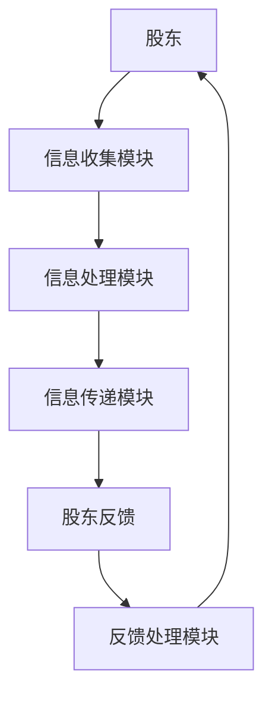

                 


# 巴菲特的股东沟通艺术：透明度和诚信的重要性

## 关键词：巴菲特，股东沟通，透明度，诚信，投资哲学，长期价值

## 摘要：  
本文深入探讨了巴菲特在股东沟通中的艺术，强调透明度和诚信的重要性。通过分析巴菲特的核心理念、沟通技巧及其实际应用案例，本文揭示了透明度和诚信如何构建信任，提升股东价值，并在长期投资中发挥关键作用。结合技术视角，本文构建了沟通模型，展示了透明度和诚信如何通过系统设计实现，为现代企业沟通提供了新的思路。

---

# 第一部分：背景介绍

## 第1章：巴菲特的沟通理念概述

### 1.1 巴菲特的生平与投资哲学

#### 1.1.1 巴菲特的早期经历与投资起步  
沃伦·巴菲特（Warren Buffett）出生于1934年，从小就展现出对数字和投资的敏锐洞察力。他在青少年时期通过购买报纸摊和房地产信托积累了第一桶金，这为他后来的投资生涯奠定了基础。  

#### 1.1.2 巴菲特的价值投资理念  
巴菲特的价值投资理念强调“以合理的价格买入优秀的公司”。他认为，投资的本质是寻找那些具有持续竞争优势、良好管理和稳定盈利的企业。这种理念贯穿于他的投资实践和股东沟通中。  

#### 1.1.3 巴菲特与股东沟通的核心价值观  
巴菲特始终认为，股东是企业的“合伙人”。他通过透明的沟通方式，将企业的发展战略、财务状况和潜在风险向股东坦诚相告，这种做法不仅增强了股东的信任，也巩固了股东对企业长期价值的认同。  

---

## 第2章：透明度与诚信的核心原则

### 2.1 透明度的定义与特征

#### 2.1.1 透明度的多维度分析  
透明度是指企业在信息传递过程中，主动向利益相关者披露真实、完整和及时信息的程度。透明度不仅体现在财务数据的披露上，还包括企业战略、管理决策和潜在风险的公开。  

#### 2.1.2 透明度与企业治理的关系  
透明度是企业治理的重要组成部分。通过透明的治理结构和信息披露，企业能够赢得股东和其他利益相关者的信任，从而提升企业的声誉和市场地位。  

#### 2.1.3 透明度对股东决策的影响  
透明的信息披露能够帮助股东更好地理解企业的经营状况和未来前景，从而做出更明智的投资决策。透明度的缺失可能导致股东对企业的不信任，进而影响企业的长期发展。  

### 2.2 诚信在沟通中的作用

#### 2.2.1 诚信的内涵与外延  
诚信是企业与股东之间建立信任的基石。它不仅包括企业在信息披露中的真实性，还包括企业在日常经营中的道德行为和责任履行。  

#### 2.2.2 诚信与企业声誉的关系  
企业的声誉是其长期发展的关键资产。通过诚信的沟通，企业能够积累良好的声誉，从而吸引更多的投资者和合作伙伴。  

#### 2.2.3 诚信对长期股东价值的影响  
诚信的沟通能够增强股东对企业的信任，从而推动企业长期价值的实现。当企业面临危机或挑战时，诚信的沟通能够帮助企业度过难关，实现可持续发展。  

---

# 第二部分：沟通技巧与实践

## 第3章：巴菲特的沟通技巧与策略

### 3.1 沟通的简洁性与直接性

#### 3.1.1 简洁表达的重要性  
巴菲特以其简洁、清晰的表达方式著称。他在股东信中避免使用复杂的术语和冗长的句子，而是用通俗易懂的语言传达关键信息。  

#### 3.1.2 直接沟通的优势  
巴菲特在沟通中始终坚持直接了当的方式。他不会拐弯抹角地掩盖问题，而是坦诚地面对挑战，这种直接性增强了股东对他的信任。  

#### 3.1.3 简洁与直接在股东沟通中的应用  
通过简洁和直接的沟通方式，巴菲特能够快速传达信息的核心内容，避免股东因信息过载而产生误解。这种风格不仅节省了沟通时间，还提高了信息的可理解和可操作性。  

### 3.2 沟通的个性化与针对性

#### 3.2.1 根据股东需求定制沟通方式  
巴菲特意识到不同股东的需求和关注点可能不同。他会根据股东的背景和投资目标，采取个性化的沟通策略，以满足不同股东的需求。  

#### 3.2.2 针对不同类型股东的沟通策略  
对于机构投资者，巴菲特可能会提供详细的财务数据和行业分析；而对于个人投资者，他可能会用更通俗的语言解释企业的经营状况和未来前景。  

#### 3.2.3 个性化沟通的实际案例分析  
例如，巴菲特在面对机构投资者时，会详细讨论企业的财务状况和市场策略；而在面对个人投资者时，他会用简单易懂的语言解释企业的投资价值和潜在风险。  

---

## 第4章：巴菲特的沟通案例分析

### 4.1 著名投资案例的沟通策略

#### 4.1.1 可口可乐的收购与股东沟通  
在收购可口可乐的过程中，巴菲特通过详细的财务分析和市场研究，向股东展示了这笔交易的潜在价值和风险。他坦诚地讨论了收购的动机、潜在挑战以及应对措施，赢得了股东的支持。  

#### 4.1.2 苹果公司的投资与股东沟通  
巴菲特在投资苹果公司时，通过股东信和公开演讲，向股东解释了苹果公司的市场地位、创新能力和未来增长潜力。他的沟通策略不仅增强了股东对苹果公司的信心，也推动了苹果股价的上涨。  

#### 4.1.3 其他经典投资案例的沟通分析  
例如，在投资富国银行时，巴菲特详细披露了银行的财务状况、管理层能力和行业前景，这种透明的沟通方式为股东提供了充分的信息，帮助他们做出明智的投资决策。  

### 4.2 危机时期的沟通艺术

#### 4.2.1 危机中的透明度与诚信  
在面对危机时，巴菲特始终坚持透明和诚信的沟通原则。例如，在2008年金融危机期间，他通过股东信坦诚地讨论了伯克希尔哈撒韦的投资损失，并提出了应对危机的具体措施。  

#### 4.2.2 危机沟通的实际操作步骤  
1. **坦诚承认问题**：在危机发生时，巴菲特首先承认问题的存在，并向股东解释问题的根源和影响。  
2. **提供解决方案**：他提出具体的应对措施，并向股东说明这些措施如何帮助企业走出困境。  
3. **持续沟通**：在危机期间，巴菲特保持与股东的定期沟通，及时更新企业的最新进展和应对策略。  

#### 4.2.3 透明度与诚信对危机管理的影响  
透明和诚信的沟通能够增强股东对企业的信任，从而在危机期间为企业提供更多的支持。同时，这种沟通方式也有助于企业在危机中积累更多的资源和合作伙伴，为未来的复苏奠定基础。  

---

## 第5章：系统分析与架构设计方案

### 5.1 沟通系统概述

#### 5.1.1 沟通系统目标  
构建一个透明、高效、个性化的股东沟通系统，满足不同股东的需求和期望。  

#### 5.1.2 沟通系统的核心功能  
- **信息收集**：通过问卷调查、股东大会和投资者会议收集股东的需求和反馈。  
- **信息处理**：对收集到的信息进行分类和分析，生成个性化的沟通内容。  
- **信息传递**：通过多种渠道（如电子邮件、电话、社交媒体）将信息传递给股东。  
- **反馈处理**：收集股东的反馈，并将其用于改进沟通策略和系统设计。  

#### 5.1.3 沟通系统的架构设计  
使用Mermaid图展示沟通系统的架构设计：  



### 5.2 沟通系统的核心实现

#### 5.2.1 信息收集模块

##### 5.2.1.1 实现步骤  
1. **设计调查问卷**：根据股东的背景和需求设计个性化的调查问卷。  
2. **收集反馈**：通过电子邮件、在线平台和股东大会等多种渠道收集股东的反馈。  
3. **数据存储**：将收集到的信息存储在数据库中，便于后续处理和分析。  

##### 5.2.1.2 源代码实现  
```python
import pandas as pd

# 设计调查问卷
def design_survey_questions():
    questions = {
        'investor_type': ['个人投资者', '机构投资者'],
        'investment_goals': ['长期增值', '短期收益'],
        'risk_tolerance': ['高', '中', '低']
    }
    return questions

# 收集反馈
def collect_feedback():
    feedback = pd.DataFrame(columns=['investor_id', 'question', 'response'])
    return feedback
```

#### 5.2.2 信息处理模块

##### 5.2.2.1 实现步骤  
1. **数据分类**：根据股东的背景和需求对反馈进行分类。  
2. **生成个性化报告**：基于分类结果，生成个性化的股东沟通报告。  
3. **验证与优化**：对生成的报告进行验证和优化，确保其准确性和可读性。  

##### 5.2.2.2 源代码实现  
```python
import pandas as pd

# 数据分类
def categorize_feedback(feedback_df):
    categorized = feedback_df.groupby('investor_type')
    return categorized

# 生成个性化报告
def generate_report(categorized_data):
    report = {}
    for investor_type, group in categorized_data:
        report[investor_type] = group['response'].value_counts().to_dict()
    return report
```

#### 5.2.3 信息传递模块

##### 5.2.3.1 实现步骤  
1. **选择传递渠道**：根据股东的偏好选择合适的传递渠道（如电子邮件、电话、社交媒体）。  
2. **发送沟通内容**：将个性化报告通过选择的渠道发送给股东。  
3. **记录传递结果**：记录每次传递的结果，包括成功和失败的情况。  

##### 5.2.3.2 源代码实现  
```python
import smtplib
from email.mime.text import MIMEText

# 发送电子邮件
def send_email(investor_email, report):
    msg = MIMEText(str(report))
    msg['Subject'] = '个性化股东沟通报告'
    msg['From'] = 'communication@company.com'
    msg['To'] = investor_email
    server = smtplib.SMTP('smtp.company.com', 587)
    server.starttls()
    server.login('communication@company.com', 'password')
    server.sendmail('communication@company.com', investor_email, msg.as_string())
    server.quit()
```

---

## 第6章：项目实战与案例分析

### 6.1 案例分析：巴菲特与可口可乐的沟通策略

#### 6.1.1 项目背景  
巴菲特在收购可口可乐的过程中，通过详细的财务分析和市场研究，向股东展示了这笔交易的潜在价值和风险。他坦诚地讨论了收购的动机、潜在挑战以及应对措施，赢得了股东的支持。  

#### 6.1.2 项目实现  
1. **信息收集**：收集可口可乐的财务数据、市场地位和潜在风险。  
2. **信息处理**：分析这些数据，生成收购的可行性报告。  
3. **信息传递**：通过股东会议和公开声明，向股东解释收购的动机和潜在影响。  

#### 6.1.3 实际效果  
通过透明和诚信的沟通，巴菲特成功说服了股东支持这笔收购，为伯克希尔哈撒韦带来了长期的收益。  

---

## 第7章：总结与展望

### 7.1 总结

#### 7.1.1 巴菲特沟通艺术的核心要素  
透明度和诚信是巴菲特股东沟通艺术的核心要素。通过简洁、直接和个性化的沟通方式，他成功构建了与股东的信任关系，推动了企业的长期发展。  

#### 7.1.2 沟通系统的实际应用价值  
通过构建透明、高效、个性化的沟通系统，企业能够更好地满足股东的需求和期望，增强股东的信任和忠诚度，从而实现长期的共赢发展。  

### 7.2 未来展望

#### 7.2.1 沟通技术的未来发展  
随着人工智能和大数据技术的发展，未来的沟通系统将更加智能化和个性化。通过自然语言处理和机器学习技术，企业可以实现更精准的沟通策略和更高效的沟通效果。  

#### 7.2.2 投资者的期望变化  
随着投资者对透明度和诚信的要求不断提高，未来的股东沟通将更加注重个性化和实时性。企业需要不断优化其沟通策略，以满足投资者的多样化需求。  

---

# 作者：AI天才研究院/AI Genius Institute & 禅与计算机程序设计艺术 /Zen And The Art of Computer Programming

