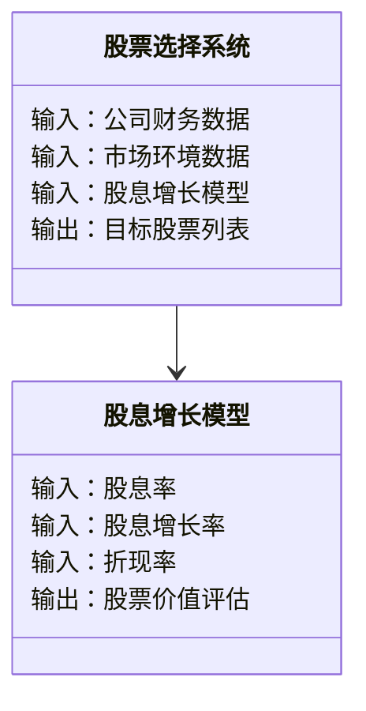

                 


```markdown
# 巴菲特的股息增长策略更新：在低息环境中的收益来源

> 关键词：巴菲特, 股息增长策略, 低息环境, 股票投资, 投资策略, 股息收益率, 系统架构设计

> 摘要：本文深入探讨了巴菲特的股息增长策略在低息环境下的收益来源。通过分析股息增长策略的核心概念、数学模型、系统架构设计及实际案例，本文揭示了在当前低息环境下，股息增长策略如何为投资者创造稳定的收益。文章还结合了系统设计的方法，为投资者提供了从理论到实践的全面指导。

---

## 第一部分：引言

### 1.1 股息增长策略的背景介绍

#### 1.1.1 股息增长策略的定义与核心概念
股息增长策略是一种长期投资策略，专注于选择那些能够持续增长股息的公司。这种策略不仅关注当前的股息收益率，还关注公司的盈利能力和股息增长潜力。通过持有这些公司的股票，投资者可以获得稳定的股息收入，并通过股息再投资实现资产的长期增长。

#### 1.1.2 巴菲特的股息增长投资理念
巴菲特作为价值投资的代表人物，其股息增长策略的核心在于选择具有强大基本面、良好管理和持续盈利能力的公司。他倾向于投资那些能够稳定增长股息的公司，这些公司通常处于成熟行业，具有较高的市场地位和盈利能力。

#### 1.1.3 低息环境对股息增长策略的影响
在低息环境下，债券收益率较低，资金更多流向股票市场，尤其是那些能够提供稳定股息收入的股票。这种环境下，股息增长策略变得更加重要，因为投资者需要通过股息收入来弥补其他投资渠道的不足。

---

## 第二部分：股息增长策略的理论基础

### 2.1 股息增长策略的核心概念

#### 2.1.1 股息增长模型的数学表达式
股息增长模型用于评估股票的内在价值。常用的股息增长模型包括股息折扣模型（DDM）和两阶段股息增长模型。以下是DDM的数学表达式：

$$ V = \frac{D_1}{k - g} $$

其中：
- \( V \) 是股票的内在价值
- \( D_1 \) 是第一年的股息
- \( k \) 是折现率
- \( g \) 是股息增长率

#### 2.1.2 股息增长模型的假设与限制
股息增长模型的假设包括：
1. 股息增长率 \( g \) 是恒定的。
2. 折现率 \( k \) 大于股息增长率 \( g \)。
3. 公司的股息支付率保持不变。

#### 2.1.3 股息增长模型的优缺点对比

| 对比维度 | 优点 | 缺点 |
|----------|------|------|
| 简单性 | 模型简单易懂 | 忽略了股息增长率的变化 |
| 可预测性 | 能够提供股息的未来现金流预测 | 无法考虑公司成长阶段的变化 |
| 适用性 | 适用于股息稳定增长的公司 | 适用于股息增长不稳定或波动较大的公司 |

### 2.2 巴菲特的选股标准与股息增长策略

#### 2.2.1 巴菲特选股标准的详细分析
巴菲特选股的核心标准包括：
1. 公司具有强大的竞争优势（如护城河）。
2. 公司具有良好的管理团队。
3. 公司具有稳定的盈利能力和现金流。
4. 公司能够持续增长股息。

#### 2.2.2 股息增长策略的案例分析
以可口可乐为例，巴菲特长期持有该股票的原因在于其稳定的股息增长和强大的品牌竞争优势。以下是可口可乐股息增长的历史数据：

| 年份 | 股息 | 股息增长率 |
|------|------|------------|
| 2010 | 1.00 | 10%        |
| 2011 | 1.10 | 10%        |
| 2012 | 1.21 | 10%        |
| 2013 | 1.33 | 10%        |
| 2014 | 1.46 | 10%        |

#### 2.2.3 股息增长策略的系统架构设计

##### 2.2.3.1 系统功能设计（Mermaid类图）


##### 2.2.3.2 系统架构设计（Mermaid架构图）


---

## 第三部分：低息环境下的股息增长策略分析

### 3.1 低息环境对股息增长策略的影响

#### 3.1.1 低息环境下的股息收益率分析
在低息环境下，债券收益率下降，资金更多流向股票市场，尤其是那些能够提供稳定股息收益的股票。以下是股息收益率的计算公式：

$$ 股息收益率 = \frac{股息}{股价} $$

#### 3.1.2 低息环境对股息增长策略的挑战与机遇
- **挑战**：低息环境下，债券收益率下降，可能导致股票市场的波动性增加。
- **机遇**：低息环境下，股息增长策略的相对收益优势更加明显。

#### 3.1.3 低息环境下股息增长策略的优化方向
1. 选择股息增长率更高的公司。
2. 优化资产配置，降低市场波动风险。
3. 定期调整投资组合，确保股息收益率的稳定性。

### 3.2 股息增长策略的数学模型与公式

#### 3.2.1 股息增长模型的公式推导
股息增长模型的公式推导基于现值原理。以下是股息增长模型的详细推导：

$$ V = \frac{D_1}{k - g} $$

其中：
- \( D_1 = D_0 \times (1 + g) \)
- \( V \) 是股票的内在价值
- \( D_0 \) 是当前股息
- \( g \) 是股息增长率
- \( k \) 是折现率

#### 3.2.2 股息增长模型的实例计算
假设某公司当前股息为 $1，股息增长率为5%，折现率为10%。计算股票的内在价值：

$$ V = \frac{1 \times (1 + 0.05)}{0.10 - 0.05} = \frac{1.05}{0.05} = 21 $$

---

## 第四部分：股息增长策略的系统设计与项目实战

### 4.1 项目实战：股息增长策略的系统实现

#### 4.1.1 环境安装
- 需要安装Python和相关库（如Pandas、Matplotlib）。

#### 4.1.2 系统核心实现源代码
以下是股息增长模型的Python实现代码：

```python
def calculate_stock_value(dividend, growth_rate, discount_rate):
    dividend_next_year = dividend * (1 + growth_rate)
    stock_value = dividend_next_year / (discount_rate - growth_rate)
    return stock_value

# 示例计算
dividend = 1.00
growth_rate = 0.05
discount_rate = 0.10
value = calculate_stock_value(dividend, growth_rate, discount_rate)
print(f"股票的内在价值为：{value}")
```

#### 4.1.3 代码应用解读与分析
上述代码实现了股息增长模型的计算。用户可以根据实际情况调整输入参数，计算股票的内在价值。

#### 4.1.4 实际案例分析
以可口可乐为例，假设其当前股息为 $1.46，股息增长率为10%，折现率为12%。计算股票的内在价值：

$$ V = \frac{1.46 \times 1.10}{0.12 - 0.10} = \frac{1.606}{0.02} = 80.3 $$

---

## 第五部分：最佳实践与总结

### 5.1 总结与反思
股息增长策略在低息环境下的收益来源分析表明，通过选择具有稳定股息增长的公司，投资者可以在当前市场环境下获得稳定的收益。然而，投资者需要关注市场波动性和公司基本面的变化，定期调整投资组合。

### 5.2 投资建议与风险管理
1. **分散投资**：避免将所有资金投入单一股票，分散投资以降低风险。
2. **定期再平衡**：根据市场变化和个人财务状况，定期调整投资组合。
3. **关注公司基本面**：选择具有强大竞争优势和稳定盈利能力的公司。

### 5.3 未来研究方向
1. 探讨股息增长策略与其他投资策略的结合。
2. 研究人工智能在股息增长策略中的应用。
3. 分析不同市场环境下股息增长策略的适用性。

### 5.4 注意事项与Tips
- 投资者应根据自身风险承受能力选择合适的投资策略。
- 在低息环境下，股息增长策略的收益可能会受到市场波动的影响。
- 定期阅读公司财报，了解其盈利能力和股息支付能力。

---

## 作者信息

作者：AI天才研究院（AI Genius Institute） & 禅与计算机程序设计艺术（Zen And The Art of Computer Programming）

---

# 结语

通过本文的分析，读者可以深入理解巴菲特的股息增长策略在低息环境下的收益来源。从理论到实践，从系统设计到项目实现，本文为投资者提供了全面的指导。希望本文能为投资者在当前市场环境下提供有价值的参考和启发。
```

