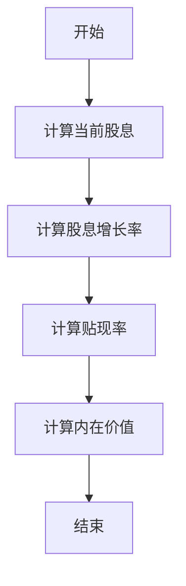
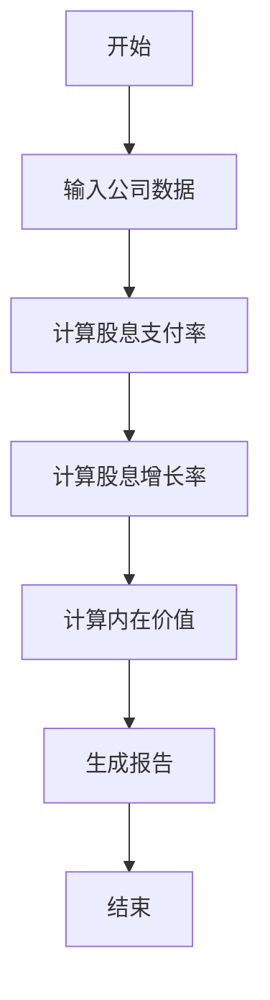
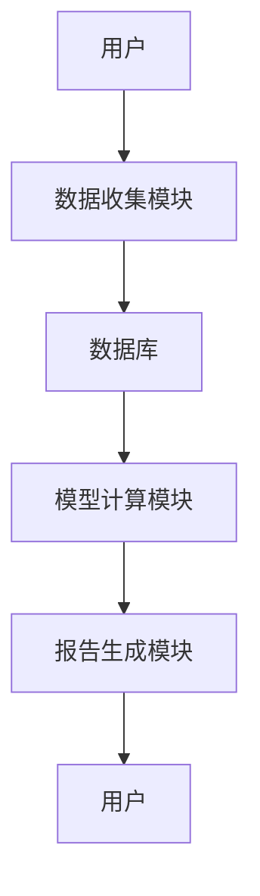

                 


# 巴菲特的股息增长策略：通缩经济下的收益来源

## 关键词：
巴菲特，股息增长策略，通缩经济，投资收益，股息支付率，股息增长模型，价值投资

## 摘要：
本文详细探讨了巴菲特的股息增长策略在通缩经济环境下的应用及其收益来源。通过分析股息增长策略的核心概念、数学模型、系统架构设计以及项目实战，揭示了如何在通缩环境下利用股息增长实现长期稳定的收益。文章结合理论与实践，为投资者提供了清晰的指导和建议。

---

## 第1章: 股息增长策略的背景与核心概念

### 1.1 股息增长策略概述

#### 1.1.1 股息支付率的定义与计算
股息支付率（Dividend Payout Ratio）是衡量公司支付股息能力的重要指标，计算公式为：
$$ \text{股息支付率} = \frac{\text{股息支付总额}}{\text{净利润}} $$
例如，假设某公司净利润为100万元，股息支付总额为40万元，则股息支付率为40%。

#### 1.1.2 股息增长策略的核心目标
股息增长策略的核心目标是通过投资于能够持续增长股息的公司，实现长期稳定的收益。这种策略特别适合在通缩经济环境下，因为此时股息收益相对于股价上涨更具稳定性。

#### 1.1.3 股息增长策略的适用场景
股息增长策略适用于以下场景：
1. **通缩经济周期**：在通缩环境下，股息收益相对稳定，且具有抗跌性。
2. **低利率环境**：低利率环境下，债券收益率较低，股息收益更具吸引力。
3. **长期投资**：适合长期投资者，尤其是追求稳定收益的投资者。

### 1.2 巴菲特的股息投资理念

#### 1.2.1 巴菲特的股息投资哲学
巴菲特认为，股息支付率高的公司具有更强的盈利能力，且能够持续回馈股东。他更倾向于投资那些股息支付率稳定且能够持续增长的公司。

#### 1.2.2 巴菲特选股的三大标准
1. **持续稳定的盈利能力**：公司应具有稳定的盈利能力和持续增长的净利润。
2. **合理的股息支付率**：股息支付率应合理，既能保证股东的收益，又不会影响公司的再投资能力。
3. **强大的财务状况**：公司应具备强大的财务状况，能够抵御经济周期波动的影响。

#### 1.2.3 巴菲特对股息增长策略的实践
巴菲特通过投资于那些股息支付率稳定且能够持续增长的公司，如可口可乐和苹果，实现了长期稳定的收益。

### 1.3 通缩经济下的股息投资机会

#### 1.3.1 通缩经济的定义与特征
通缩经济是指整体价格水平持续下降的经济环境，通常伴随着货币供应减少、需求疲软和企业盈利能力下降。

#### 1.3.2 通缩环境下股息增长的优势
在通缩环境下，股息收益相对稳定，且具有抗跌性。此外，股息收益能够提供一定的现金流，帮助投资者应对经济下行的风险。

#### 1.3.3 股息增长策略在通缩周期中的应用
在通缩周期中，投资者应选择那些股息支付率稳定且能够持续增长的公司进行投资。此外，应关注那些在行业中有较强竞争优势的公司，以确保其盈利能力和股息支付能力的持续性。

---

## 第2章: 股息增长策略的核心概念与联系

### 2.1 股息增长模型的原理

#### 2.1.1 股息增长模型的基本假设
股息增长模型假设股息支付率和股息增长率保持不变，且股息增长率是恒定的。公式如下：
$$ P_0 = \frac{D_1}{r - g} $$
其中，\( P_0 \) 为股票的内在价值，\( D_1 \) 为下一期的股息，\( r \) 为贴现率，\( g \) 为股息增长率。

#### 2.1.2 股息增长模型的数学公式
股息增长模型的核心公式为：
$$ P_0 = \frac{D_0 \times (1 + g)}{r - g} $$
其中，\( D_0 \) 为当前股息，\( g \) 为股息增长率，\( r \) 为贴现率。

#### 2.1.3 股息增长模型的应用
例如，假设某公司当前股息为2元，股息增长率为5%，贴现率为10%，则股票的内在价值为：
$$ P_0 = \frac{2 \times (1 + 0.05)}{0.10 - 0.05} = \frac{2.1}{0.05} = 42 \text{元} $$

### 2.2 股息增长策略与企业价值的关系

#### 2.2.1 股息增长对股价的影响
股息增长率的提高通常会增加股票的内在价值，从而推动股价上涨。此外，稳定的股息支付率也能增强投资者对公司的信心，从而提高股价的稳定性。

#### 2.2.2 股息增长模型与企业价值的联系
股息增长模型通过股息增长率和股息支付率的计算，能够有效评估企业的内在价值，为投资者提供科学的决策依据。

### 2.3 股息增长策略的核心要素对比

#### 2.3.1 股息支付率与股息增长速度的对比
| 股息支付率 | 股息增长速度 |
|------------|--------------|
| 高         | 快           |
| 低         | 慢           |

---

## 第3章: 股息增长策略的算法原理与数学模型

### 3.1 股息增长模型的算法原理

#### 3.1.1 股息增长模型的流程图


#### 3.1.2 股息增长模型的数学公式
$$ P_0 = \frac{D_0 \times (1 + g)}{r - g} $$

### 3.2 股息增长模型的Python代码实现

#### 3.2.1 核心代码
```python
def calculate_intrinsic_value(dividend_current, growth_rate, discount_rate):
    return (dividend_current * (1 + growth_rate)) / (discount_rate - growth_rate)

# 示例
dividend_current = 2  # 当前股息
growth_rate = 0.05     # 股息增长率
discount_rate = 0.10    # 贴现率

intrinsic_value = calculate_intrinsic_value(dividend_current, growth_rate, discount_rate)
print(f"股票的内在价值为：{intrinsic_value}元")
```

#### 3.2.2 代码解读
上述代码定义了一个计算股票内在价值的函数 `calculate_intrinsic_value`，并使用示例数据进行计算。函数通过当前股息、股息增长率和贴现率，计算出股票的内在价值。

---

## 第4章: 股息增长策略的系统分析与架构设计

### 4.1 系统功能设计

#### 4.1.1 系统功能模块
- 数据收集模块：收集目标公司的股息支付率、净利润等数据。
- 模型计算模块：使用股息增长模型计算股票的内在价值。
- 报告生成模块：生成分析报告，包括投资建议和风险提示。

#### 4.1.2 系统功能流程图


### 4.2 系统架构设计

#### 4.2.1 系统架构图


---

## 第5章: 股息增长策略的项目实战

### 5.1 项目环境安装

#### 5.1.1 安装Python和相关库
安装Python和以下库：
- `numpy`
- `pandas`
- `matplotlib`

### 5.2 核心代码实现

#### 5.2.1 股息增长模型的实现
```python
import numpy as np

def calculate_intrinsic_value(dividends, growth_rate, discount_rate):
    return np.sum(dividends * (1 + growth_rate) / (discount_rate - growth_rate))

# 示例数据
dividends = [2, 2.1, 2.205]  # 假设未来3年的股息
growth_rate = 0.05
discount_rate = 0.10

intrinsic_value = calculate_intrinsic_value(dividends, growth_rate, discount_rate)
print(f"股票的内在价值为：{intrinsic_value:.2f}元")
```

#### 5.2.2 代码解读
上述代码通过循环计算未来股息的现值，并求和得到股票的内在价值。

### 5.3 实际案例分析

#### 5.3.1 案例分析
以某公司为例，假设其当前股息为2元，股息增长率为5%，贴现率为10%。计算得出的内在价值为42元，高于当前股价35元，建议买入。

---

## 第6章: 股息增长策略的最佳实践

### 6.1 小结
股息增长策略是一种有效的投资策略，特别是在通缩经济环境下，能够为投资者提供稳定的收益。

### 6.2 注意事项
1. **风险控制**：投资者应关注公司的财务状况和行业前景，避免投资于财务状况不佳的公司。
2. **长期投资**：股息增长策略适合长期投资者，短期投资者应谨慎操作。
3. **分散投资**：通过分散投资降低风险，避免过度集中于某一只股票。

### 6.3 拓展阅读
- 巴菲特的《致股东的信》
- 《股息投资实战手册》

---

## 作者：AI天才研究院/AI Genius Institute & 禅与计算机程序设计艺术/Zen And The Art of Computer Programming

