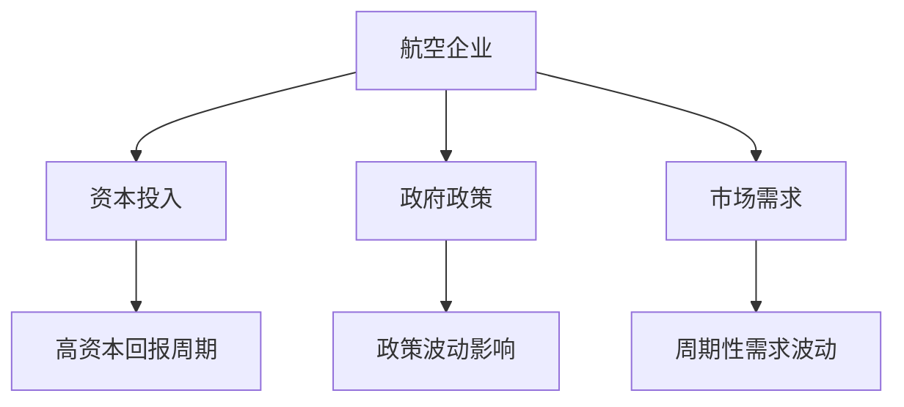
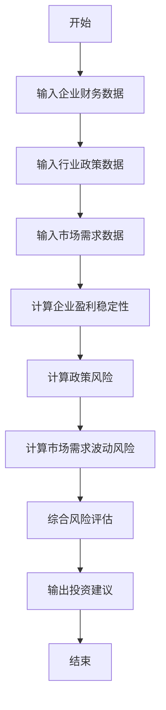
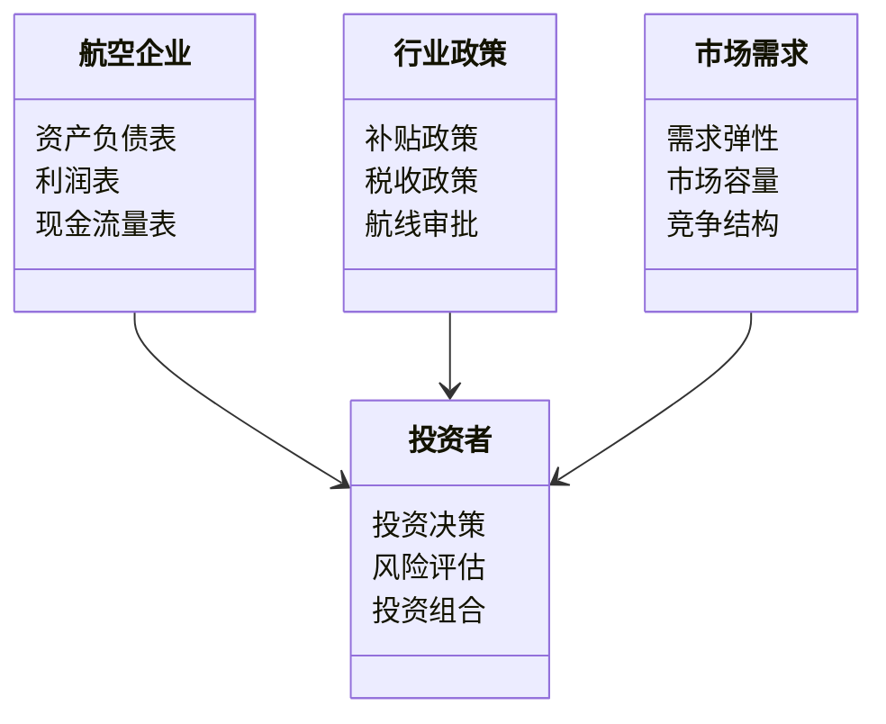
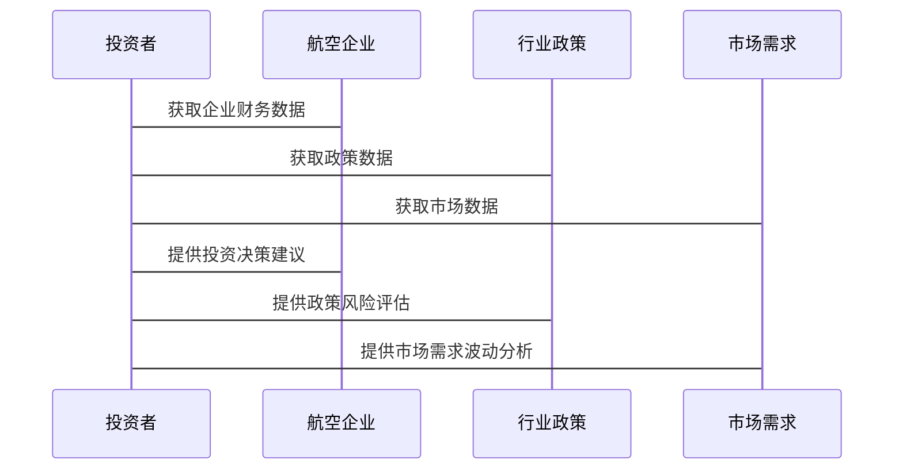

                 


# 巴菲特的航空业投资教训：行业特性的重要性

> 关键词：巴菲特，航空业，投资策略，行业特性，风险管理，价值投资

> 摘要：本文通过分析巴菲特在航空业投资中的失败教训，深入探讨了行业特性对投资决策的重要性。文章从巴菲特的投资哲学出发，分析了航空业的特殊性，总结了他在投资过程中忽视行业特性的教训，并提出了基于行业特性的投资策略优化方法。

---

# 引言

## 背景介绍

### 核心概念术语说明
- **巴菲特的投资哲学**：巴菲特以价值投资闻名，注重企业的基本面分析，寻找具有长期竞争优势的企业进行投资。
- **航空业的特殊性**：航空业具有高资本密集度、周期性强、政策依赖度高等特点，这些特性使其与其他行业在投资策略上存在显著差异。

### 问题背景
巴菲特在航空业投资中遭遇失败，这与他一贯的价值投资策略形成了鲜明对比。他的失败暴露了在特定行业特性下，传统投资策略可能失效的问题。

### 问题描述
巴菲特在2008年金融危机期间投资美国航空公司（AA）和美国运通（AXP），但由于航空业的特殊性，这些投资未能实现预期收益，甚至导致亏损。

### 问题解决
通过分析航空业的行业特性，识别其与传统投资策略的冲突，并提出基于行业特性的投资策略优化方法。

### 边界与外延
本文仅分析巴菲特在航空业投资中的失败案例，不涉及其在其他行业的成功经验，但这些教训可以为其他行业的投资策略提供参考。

### 概念结构与核心要素组成
- **行业特性**：周期性、资本密集度、政策依赖度
- **投资策略**：价值投资、长期投资、风险管理

---

## 核心概念与联系

### 核心概念原理
航空业的特殊性主要体现在以下几个方面：
1. **周期性**：航空业的需求受经济周期、油价波动和突发事件的影响较大，具有明显的周期性波动。
2. **资本密集度**：航空业需要大量资本投入飞机、机场和相关设施，资本回报周期长。
3. **政策依赖度**：航空业受政府政策（如补贴、税收、航线审批等）影响较大。

### 概念属性特征对比表

| 特性       | 传统制造业         | 航空业             |
|------------|------------------|------------------|
| 资本密集度 | 较低             | 极高             |
| 周期性     | 较弱             | 明显             |
| 政策依赖   | 较低             | 高               |

### ER实体关系图



---

## 算法原理讲解

### 航空业投资风险评估算法

#### 算法流程图



#### 核心数学模型

1. **盈利稳定性计算公式**：
   $$ \text{盈利稳定性} = \frac{\text{平均净利润}}{\text{净利润波动幅度}} $$

2. **政策风险评估公式**：
   $$ \text{政策风险} = \sum (\text{政策依赖度} \times \text{政策波动幅度}) $$

3. **市场需求波动风险评估公式**：
   $$ \text{市场需求波动风险} = \frac{\text{需求弹性}}{\text{市场容量}} $$

#### 实际案例分析

以巴菲特投资的美国航空公司为例：
- **企业财务数据**：高负债率，低自由现金流。
- **行业政策数据**：受政府补贴和税收政策影响大。
- **市场需求数据**：需求弹性高，市场容量受经济周期影响。

---

## 系统分析与架构设计方案

### 问题场景介绍
巴菲特在航空业投资失败的案例提示我们，忽视行业特性可能导致投资策略失效。

### 项目介绍
本文旨在通过分析航空业的特殊性，优化投资策略，降低投资风险。

### 系统功能设计（领域模型）



### 系统架构设计


### 系统接口设计
- **输入接口**：行业政策数据、市场需求数据、企业财务数据。
- **输出接口**：投资建议、风险评估报告。

### 系统交互设计



---

## 项目实战

### 环境安装
- 数据分析工具：Python（Pandas、NumPy）
- 图表绘制工具：Matplotlib、Seaborn
- 项目管理工具：Git

### 核心实现源代码

```python
# 数据分析代码示例
import pandas as pd
import numpy as np
import matplotlib.pyplot as plt

# 示例数据加载
data = pd.read_csv('airline.csv')

# 计算盈利稳定性
data['盈利稳定性'] = data['净利润'] / data['净利润波动幅度']

# 计算政策风险
data['政策风险'] = data['政策依赖度'] * data['政策波动幅度']

# 可视化
plt.figure(figsize=(10,6))
plt.plot(data['盈利稳定性'], label='盈利稳定性')
plt.plot(data['政策风险'], label='政策风险')
plt.legend()
plt.show()
```

### 代码解读与分析
- **数据加载**：从CSV文件加载航空业相关数据。
- **盈利稳定性计算**：通过净利润与净利润波动幅度的比值计算企业盈利稳定性。
- **政策风险评估**：结合政策依赖度和政策波动幅度计算政策风险。
- **可视化分析**：通过图表展示盈利稳定性与政策风险的关系。

### 案例分析
以巴菲特投资的美国航空公司为例，分析其财务数据和政策影响，评估其投资风险。

### 项目小结
通过代码实现，我们能够量化分析航空业的投资风险，为投资决策提供数据支持。

---

## 最佳实践 Tips

1. **行业特性分析**：在投资前，深入研究行业的特殊性，避免盲目应用通用投资策略。
2. **风险管理**：利用数学模型量化风险，制定应对策略。
3. **动态调整**：根据市场变化和企业表现，及时调整投资策略。

## 总结

### 问题回顾
巴菲特的航空业投资失败主要源于忽视行业特性。

### 知识总结
通过分析航空业的行业特性，我们总结出基于行业特性的投资策略优化方法。

### 经验教训
投资决策必须充分考虑行业特性，避免将通用策略应用于特殊行业。

### 展望
未来，随着技术进步和行业变化，行业特性的分析将更加重要，投资者需要不断优化其投资策略。

---

## 作者

作者：AI天才研究院/AI Genius Institute & 禅与计算机程序设计艺术 /Zen And The Art of Computer Programming

---

这篇文章通过详细分析巴菲特在航空业投资中的教训，深入探讨了行业特性对投资决策的重要性，并提出了基于行业特性的投资策略优化方法。

