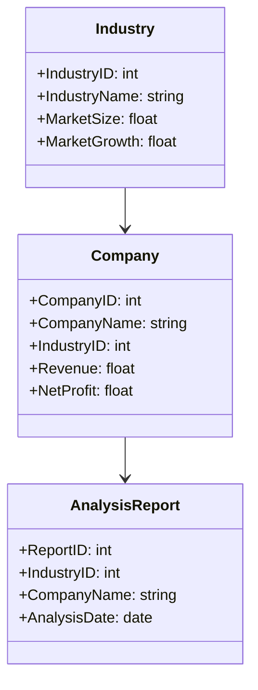
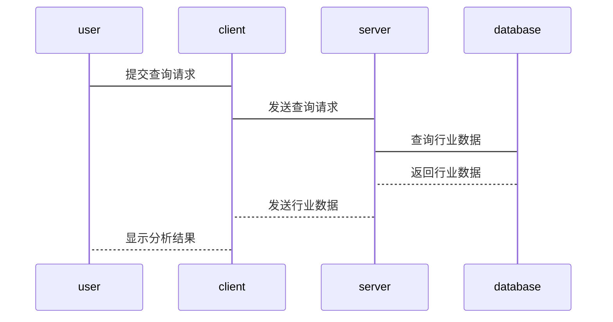

                 


```markdown
# 巴菲特的行业分析方法：了解商业模式

> 关键词：巴菲特，行业分析，商业模式，投资策略，竞争优势

> 摘要：本文深入探讨了巴菲特的行业分析方法，分析了如何通过这些方法来理解商业模式。文章从背景介绍、核心概念、分析方法、系统设计、实战案例、数学模型、最佳实践和扩展阅读等多个方面进行了详细阐述，帮助读者全面掌握巴菲特的投资策略和商业模式分析技巧。

---

# 第1章: 巴菲特投资理念与行业分析背景

## 1.1 巴菲特的投资哲学
### 1.1.1 价值投资的核心理念
价值投资的核心在于寻找市场低估的优质企业，长期持有，获得超额收益。巴菲特强调企业内在价值的重要性，认为市场价格波动不应影响长期投资决策。

### 1.1.2 投资中的安全边际概念
安全边际是指股票的内在价值高于其市场价格的部分。巴菲特认为，通过寻找具有安全边际的投资标的，可以有效降低投资风险，确保投资的稳健性。

### 1.1.3 巴菲特的投资风格与长期视角
巴菲特的投资风格以长期持有、价值导向为主。他注重企业的基本面分析，尤其是企业的商业模式和竞争优势，认为这些因素决定了企业的长期盈利能力。

## 1.2 为什么行业分析至关重要
### 1.2.1 行业分析在投资决策中的作用
行业分析帮助投资者了解行业的发展趋势、竞争格局和潜在风险，从而做出更明智的投资决策。通过对行业的深入了解，投资者可以更好地识别优质企业。

### 1.2.2 巴菲特对行业分析的重视
巴菲特认为，选择一个优质的行业是成功投资的关键。他通过行业分析来识别具有可持续竞争优势的企业，从而降低投资风险。

### 1.2.3 行业分析与企业竞争优势的关系
行业分析不仅仅是对企业所处环境的了解，更是对企业竞争优势的识别。通过行业分析，投资者可以更好地理解企业的商业模式和竞争优势，从而做出更明智的投资决策。

## 1.3 本书的目的与结构
### 1.3.1 本书的核心目标
本书旨在通过巴菲特的行业分析方法，帮助读者理解商业模式，掌握投资分析的核心技巧。通过对行业的深入分析，读者可以更好地识别优质企业，做出明智的投资决策。

### 1.3.2 目标读者与适用场景
本书适合对投资分析感兴趣的学生、投资者以及企业管理者。无论是个人投资还是企业战略决策，本书都能提供有价值的见解和方法。

### 1.3.3 本书的结构安排
本书分为多个章节，涵盖行业分析的核心概念、商业模式的解构与分析、系统设计与实战案例等内容，结构清晰，逻辑严密，帮助读者逐步掌握巴菲特的行业分析方法。

---

# 第2章: 行业分析的核心概念与框架

## 2.1 行业分析的基本框架
### 2.1.1 行业的定义与分类
行业是指从事相同性质的生产或服务的企业集合。行业分类通常基于企业的主营业务和产品类型。

### 2.1.2 行业分析的关键维度
行业分析的关键维度包括市场规模、市场结构、行业周期、竞争格局等。这些维度帮助投资者全面了解行业的发展状况和潜在风险。

### 2.1.3 行业分析的步骤与流程
行业分析的步骤通常包括数据收集、行业研究、竞争分析、趋势预测等。通过系统化的流程，投资者可以更全面地了解行业情况。

## 2.2 行业分析的核心指标
### 2.2.1 市场规模与增长潜力
市场规模是指行业内企业的总销售额或总产量。增长潜力则反映了行业未来的发展空间，通常通过行业增长率来衡量。

### 2.2.2 市场结构与竞争格局
市场结构反映了行业内企业的竞争状况，包括垄断、寡头垄断、完全竞争和不完全竞争等类型。竞争格局分析帮助企业了解行业内的主要竞争对手及其市场份额。

### 2.2.3 行业周期与宏观经济影响
行业周期分为衰退、复苏、增长和成熟四个阶段。宏观经济因素如GDP增长率、利率水平等都会对行业的发展产生重要影响。

## 2.3 巴菲特视角下的行业选择标准
### 2.3.1 高质量企业的定义
巴菲特认为，高质量企业是指具有持续竞争优势、稳定的盈利能力、良好的管理团队和健康的财务状况的企业。

### 2.3.2 行业的可持续性与抗风险能力
行业应具有较强的可持续性，能够在经济波动中保持稳定增长。抗风险能力是指行业在面对外部冲击时的适应能力和恢复能力。

### 2.3.3 企业的竞争优势与护城河
竞争优势是指企业在市场上相对于竞争对手的独特优势，包括成本优势、技术优势、品牌优势等。护城河是指企业竞争对手难以复制的核心竞争力，如专利、独特的商业模式等。

---

# 第3章: 巴菲特定价与商业模式分析方法

## 3.1 竞争优势分析
### 3.1.1 什么是竞争优势
竞争优势是指企业在市场上相对于竞争对手的独特优势，这些优势可以是成本优势、技术优势、品牌优势等。

### 3.1.2 巴菲特如何识别竞争优势
巴菲特通过分析企业的财务数据、市场地位、管理团队等因素来识别竞争优势。他特别关注企业的护城河，认为这是企业长期盈利能力的保障。

### 3.1.3 不同行业竞争优势的体现
竞争优势在不同行业中的体现有所不同。例如，在科技行业，技术优势是关键；在消费品行业，品牌优势更为重要。

## 3.2 财务指标分析
### 3.2.1 关键财务指标的解读
关键财务指标包括净利润率、ROE（净资产收益率）、ROA（资产回报率）、毛利率等。这些指标帮助投资者评估企业的盈利能力、资产使用效率和成本控制能力。

### 3.2.2 利润能力、周转率与杠杆率
盈利能力分析关注企业的净利润率和ROE，周转率分析关注资产周转率，杠杆率分析关注企业的债务水平和财务风险。

### 3.2.3 财务健康状况的评估
通过分析企业的财务报表，投资者可以评估企业的财务健康状况，包括流动性、偿债能力、运营效率等方面。

## 3.3 行业生命周期分析
### 3.3.1 行业生命周期的四个阶段
行业生命周期分为衰退、复苏、增长和成熟四个阶段。不同阶段的企业具有不同的特点和投资价值。

### 3.3.2 不同阶段的投资策略
在衰退阶段，企业可能面临利润率下降和市场份额流失的风险；复苏阶段是寻找抄底机会的阶段；增长阶段是投资具有广阔市场空间企业的阶段；成熟阶段则是寻找具有稳定收益的企业的阶段。

### 3.3.3 巴菲特如何判断行业生命周期
巴菲特通过分析行业的市场规模、增长潜力、市场结构等因素来判断行业所处的生命周期阶段。他更倾向于投资处于增长或成熟阶段的企业，以确保投资的安全性和稳定性。

---

# 第4章: 商业模式的解构与分析

## 4.1 商业模式的基本概念
### 4.1.1 商业模式的定义
商业模式是指企业如何创造价值、传递价值和获取价值的系统性描述。它包括企业的价值主张、客户关系、资源分配和收益方式等方面。

### 4.1.2 商业模式的构成要素
商业模式的构成要素包括价值主张、客户关系、资源分配、核心流程、收益方式等。这些要素共同决定了企业的盈利能力和市场竞争力。

### 4.1.3 商业模式与企业竞争优势的关系
商业模式是企业竞争优势的重要来源。通过优化商业模式，企业可以更好地满足客户需求，提高运营效率，从而获得竞争优势。

## 4.2 商业模式分析的步骤与方法
### 4.2.1 确定企业的价值主张
价值主张是指企业提供的产品或服务能够为客户创造的独特价值。通过分析企业的价值主张，投资者可以更好地理解企业的市场定位和竞争优势。

### 4.2.2 分析企业的客户关系
客户关系分析包括客户细分、客户忠诚度、客户满意度等方面。通过分析客户关系，投资者可以更好地理解企业的市场地位和客户基础。

### 4.2.3 评估企业的资源与能力
资源与能力分析包括企业的核心资源、技术优势、管理团队等方面。通过分析企业的资源与能力，投资者可以更好地理解企业的竞争优势和未来发展潜力。

## 4.3 巴菲特视角下的商业模式分析
### 4.3.1 高质量企业的商业模式特点
高质量企业的商业模式通常具有稳定的需求、清晰的价值主张、强大的客户关系和高效的运营能力。这些特点使企业能够在竞争激烈的市场中保持优势。

### 4.3.2 商业模式的可持续性与可扩展性
商业模式的可持续性是指企业能够长期维持其竞争优势和盈利能力。商业模式的可扩展性是指企业能够通过规模经济或范围经济实现增长。

### 4.3.3 巴菲特如何评估商业模式的价值
巴菲特通过分析企业的财务数据、市场地位、管理团队等因素来评估商业模式的价值。他特别关注企业的护城河和可持续竞争优势。

---

# 第5章: 系统分析与架构设计方案

## 5.1 系统分析的背景与目标
### 5.1.1 问题场景介绍
系统分析的目标是通过系统的视角，全面了解企业的商业模式和竞争优势，从而做出更明智的投资决策。

### 5.1.2 项目介绍
本项目旨在构建一个行业分析系统，帮助投资者系统化地分析企业的商业模式和竞争优势，从而做出更明智的投资决策。

## 5.2 系统功能设计
### 5.2.1 领域模型（Mermaid 类图）


### 5.2.2 系统架构设计（Mermaid 架构图）


### 5.2.3 系统接口设计
系统接口设计包括数据接口、用户界面和报告生成接口。数据接口用于获取行业数据，用户界面用于用户输入和查询，报告生成接口用于生成分析报告。

### 5.2.4 系统交互（Mermaid 序列图）


---

# 第6章: 项目实战——消费行业的商业模式分析

## 6.1 项目背景与目标
### 6.1.1 项目背景
消费行业是巴菲特关注的重点行业之一。通过对消费行业的商业模式分析，投资者可以更好地理解企业的竞争优势和市场地位。

### 6.1.2 项目目标
本项目旨在通过分析消费行业的商业模式，识别具有可持续竞争优势的企业，从而做出明智的投资决策。

## 6.2 数据收集与处理
### 6.2.1 数据来源
数据来源包括企业财报、行业报告、市场调研等。通过多渠道的数据收集，投资者可以全面了解行业的市场状况和企业表现。

### 6.2.2 数据清洗与预处理
数据清洗包括去除重复数据、处理缺失值和异常值。数据预处理包括数据标准化和特征提取，为后续分析提供高质量的数据支持。

## 6.3 模型实现与代码示例
### 6.3.1 Python代码实现
```python
import pandas as pd
import numpy as np

# 数据加载
df = pd.read_csv('consumption_industry.csv')

# 数据清洗
df.drop_duplicates(inplace=True)
df.dropna(inplace=True)

# 数据分析
revenue_growth = df.groupby('year')['revenue'].apply(lambda x: x.pct_change().mean())
profit_margin = df.groupby('year')['net_profit'].apply(lambda x: x.mean() / x['revenue'].mean())

# 可视化
import matplotlib.pyplot as plt

plt.figure(figsize=(10, 6))
plt.plot(df['year'], revenue_growth, label='Revenue Growth Rate')
plt.plot(df['year'], profit_margin, label='Net Profit Margin')
plt.xlabel('Year')
plt.ylabel('Ratio')
plt.title('Consumption Industry Analysis')
plt.legend()
plt.show()
```

### 6.3.2 模型实现与结果解读
通过上述代码，我们可以分析消费行业的收入增长率和净利润率，从而判断行业的增长潜力和盈利能力。收入增长率高且净利润率稳定的行业具有更大的投资价值。

## 6.4 案例分析与总结
### 6.4.1 案例分析
以某知名消费企业为例，分析其商业模式、竞争优势和财务表现。通过案例分析，读者可以更好地理解如何应用前面所学的方法进行实际分析。

### 6.4.2 实战小结
通过消费行业的实战分析，读者可以掌握行业分析的核心方法和技巧，从而更好地应用这些方法进行实际投资决策。

---

# 第7章: 数学模型与公式

## 7.1 财务指标分析的数学模型
### 7.1.1 净利润率公式
$$ \text{净利润率} = \frac{\text{净利润}}{\text{营业收入}} \times 100\% $$

### 7.1.2 ROE（净资产收益率）公式
$$ \text{ROE} = \frac{\text{净利润}}{\text{股东权益}} \times 100\% $$

### 7.1.3 ROA（资产回报率）公式
$$ \text{ROA} = \frac{\text{净利润}}{\text{总资产}} \times 100\% $$

## 7.2 行业增长潜力分析的数学模型
### 7.2.1 行业增长率公式
$$ \text{行业增长率} = \frac{\text{当前市场规模} - \text{上一期市场规模}}{\text{上一期市场规模}} \times 100\% $$

### 7.2.2 市场容量预测公式
$$ \text{市场容量} = \text{当前市场规模} \times (1 + \text{增长率})^n $$
其中，n为预测的年数。

---

# 第8章: 最佳实践与小结

## 8.1 最佳实践
### 8.1.1 持续学习与行业动态
投资者应持续关注行业动态，了解市场的最新趋势和企业的最新发展，从而不断更新和完善自己的分析方法。

### 8.1.2 数据驱动的决策
通过数据驱动的决策，投资者可以更客观地评估企业的商业模式和竞争优势，从而做出更明智的投资决策。

### 8.1.3 风险管理与安全边际
投资者应注重风险管理，合理配置资产，确保投资组合的稳健性。同时，安全边际的设置可以有效降低投资风险。

## 8.2 小结
通过本文的系统分析和实战案例，读者可以全面掌握巴菲特的行业分析方法，理解商业模式的核心要素，从而更好地进行投资决策。投资是一项长期的事业，需要持续学习和不断实践。

---

# 第9章: 注意事项与拓展阅读

## 9.1 注意事项
### 9.1.1 数据的准确性和时效性
投资者在进行行业分析时，应确保数据的准确性和时效性，避免因数据误差导致分析结果偏差。

### 9.1.2 分析的深度与广度
行业分析的深度和广度应根据具体的投资目标和需求来确定。投资者应根据实际情况，合理调整分析的范围和深度。

### 9.1.3 投资决策的综合考量
投资决策应综合考虑多个因素，包括行业分析、企业基本面、市场趋势、宏观经济环境等，避免因单一因素影响决策。

## 9.2 拓展阅读
### 9.2.1 推荐书籍
1. 《巴菲特致股东的信》
2. 《投资最重要的ことは何か》
3. 《The Intelligent Investor》

### 9.2.2 相关资源
投资者可以关注行业报告、财经新闻、投资博客等资源，获取最新的行业动态和投资见解。

---

# 作者：AI天才研究院 & 禅与计算机程序设计艺术

```

