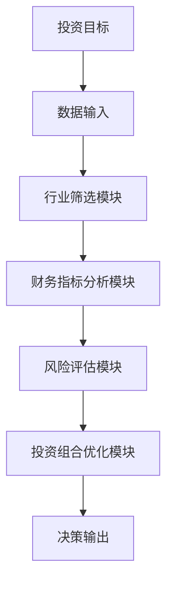

                 


# 巴菲特的行业选择：偏好稳定性

> 关键词：巴菲特，行业选择，稳定性，价值投资，长期投资，安全边际

> 摘要：本文深入分析巴菲特的行业选择策略，探讨其如何通过选择稳定性高的行业实现长期投资目标。文章结合技术语言，从投资哲学、行业分析、数学模型等多个维度展开，帮助读者理解巴菲特的投资逻辑。

---

## 第1章 巴菲特投资哲学概述

### 1.1 巴菲特投资的核心理念

#### 1.1.1 价值投资的定义与核心原则

价值投资是一种以内在价值为导向的投资策略，强调以低于内在价值的价格购买优质资产。巴菲特的价值投资原则可以总结为：

1. **安全边际**：买入价格低于内在价值，以降低风险。
2. **长期视角**：关注企业的长期盈利能力，而非短期市场波动。
3. **护城河**：选择具有强大竞争优势的企业。

#### 1.1.2 长期主义与复利效应

巴菲特的长期投资策略基于复利效应，通过长期持有优质资产实现财富增长。复利的数学公式为：

$$
A = P \times (1 + r)^t
$$

其中：
- \(A\)：最终金额
- \(P\)：本金
- \(r\)：年化收益率
- \(t\)：时间（年）

复利效应的核心在于时间，长期持有优质资产能够显著放大收益。

#### 1.1.3 安全边际与风险控制

安全边际是巴菲特投资策略的核心要素，通过预留安全空间降低投资风险。以下是安全边际的计算步骤：

1. 评估企业的内在价值。
2. 以低于内在价值的价格买入。
3. 设定止损点，控制潜在损失。

### 1.2 巴菲特的投资策略

#### 1.2.1 股票投资的三重标准：护城河、管理层、财务状况

巴菲特选择企业时关注以下三个标准：

1. **护城河**：企业的竞争优势，如专利、品牌、成本优势等。
2. **管理层**：管理层的诚信与能力。
3. **财务状况**：企业的财务健康状况，包括负债率、现金流等。

以下是护城河的五种类型及其优劣势对比：

| 护城河类型       | 优劣势分析                         |
|------------------|----------------------------------|
| 品牌优势         | 强大的品牌效应，难以被模仿         |
| 成本优势         | 规模经济带来的成本优势             |
| 技术专利         | 保护创新技术，防止竞争           |
| 网络效应         | 用户越多，平台价值越高             |
| 政策壁垒         | 政策支持带来竞争优势               |

#### 1.2.2 长期稳定的行业选择逻辑

巴菲特偏好稳定性高的行业，通常选择具有抗周期性的行业。以下是抗周期性行业的特征：

1. 需求稳定：如必需品行业（食品、医疗）。
2. 边际成本低：如公用事业、软件行业。
3. 市场份额集中：如烟草、消费品行业。

#### 1.2.3 投资组合管理与风险控制

巴菲特的投资组合管理策略包括：

1. 分散投资：避免过度集中。
2. 定期评估：定期审视投资组合。
3. 风险控制：设定止损点，避免重大损失。

---

## 第2章 巴菲特定行业选择标准与分析方法

### 2.1 行业稳定性与抗周期性分析

#### 2.1.1 行业稳定性的定义与衡量指标

行业稳定性衡量一个行业的抗波动能力，通常通过以下指标进行评估：

1. **需求弹性**：需求对价格变化的敏感度。
2. **市场集中度**：行业内的主要企业数量及其市场份额。
3. **现金流稳定性**：行业内的企业现金流波动情况。

#### 2.1.2 抗周期性行业的特征与案例

抗周期性行业通常包括：

1. 必需消费品：食品、日用品。
2. 医疗健康：药品、医疗服务。
3. 公用事业：电力、水务。

以下是抗周期性行业与周期性行业的对比分析：

| 行业类型       | 特征                          |
|----------------|------------------------------|
| 抗周期性行业     | 需求稳定，波动小                |
| 周期性行业       | 需求波动大，受经济周期影响      |

---

## 第3章 巴菲特长期投资策略与案例分析

### 3.1 长期投资的逻辑与优势

#### 3.1.1 长期投资与短期波动的对比

长期投资的优势在于复利效应和企业价值的长期增长。以下是长期投资与短期投资的对比：

| 投资策略       | 优劣势分析                         |
|----------------|----------------------------------|
| 长期投资         | 复利效应显著，风险分散           |
| 短期投资         | 灵活性高，但波动风险大           |

#### 3.1.2 长期复利效应的数学模型与公式

复利的数学模型为：

$$
A = P \times (1 + r)^t
$$

其中：
- \(P\)：本金
- \(r\)：年化收益率
- \(t\)：时间（年）

---

## 第4章 巴菲特投资策略的数学模型与算法原理

### 4.1 巴菲特投资策略的数学模型

#### 4.1.1 股票筛选的五项核心指标

巴菲特的股票筛选标准包括：

1. **ROE（净资产收益率）**：衡量企业的盈利能力。
2. **ROA（资产回报率）**：衡量资产的使用效率。
3. **毛利率**：衡量企业的定价能力。
4. **负债率**：衡量企业的财务健康状况。
5. **现金流**：衡量企业的造血能力。

以下是ROE与ROA的对比分析：

| 指标       | 定义                          | 用途                          |
|------------|-------------------------------|-------------------------------|
| ROE        | 净利润与净资产的比率          | 衡量股东资金的使用效率        |
| ROA        | 净利润与总资产的比率          | 衡量资产的使用效率            |

#### 4.1.2 投资组合优化的数学模型

投资组合优化的目标是最大化收益，同时最小化风险。数学模型为：

$$
\text{Maximize } \mu \times w - \frac{1}{2} \times \sigma^2 \times w^T \times w
$$

其中：
- \( \mu \)：资产的期望收益
- \( \sigma^2 \)：资产的方差
- \( w \)：投资权重

---

## 第5章 巴菲特投资策略的系统架构与实现

### 5.1 投资决策系统的系统架构设计

以下是投资决策系统的系统架构图：



### 5.2 投资组合优化的实现

以下是投资组合优化的代码实现：

```python
import numpy as np
import pandas as pd
from sklearn.linear_model import LinearRegression

# 示例数据
data = pd.DataFrame({
    'ROE': [0.15, 0.2, 0.1, 0.18],
    'ROA': [0.05, 0.08, 0.03, 0.06],
    '毛利率': [0.3, 0.4, 0.2, 0.35],
    '负债率': [0.5, 0.4, 0.6, 0.5],
    '现金流': [100, 200, 50, 150]
})

# 训练线性回归模型
model = LinearRegression()
model.fit(data[['ROE', 'ROA', '毛利率', '负债率']], data['现金流'])

# 预测现金流
predicted_cash = model.predict([[0.15, 0.05, 0.3, 0.5]])
print(predicted_cash)
```

---

## 结论

巴菲特的投资哲学以长期主义和价值投资为核心，通过选择稳定性高的行业和优质企业实现财富增长。本文从投资哲学、行业分析、数学模型等多个维度深入探讨了巴菲特的投资策略，并结合实际案例和系统架构进行了详细分析。希望本文能够为投资者提供有益的启示，帮助读者更好地理解巴菲特的投资智慧。

---

作者：AI天才研究院/AI Genius Institute & 禅与计算机程序设计艺术 /Zen And The Art of Computer Programming

