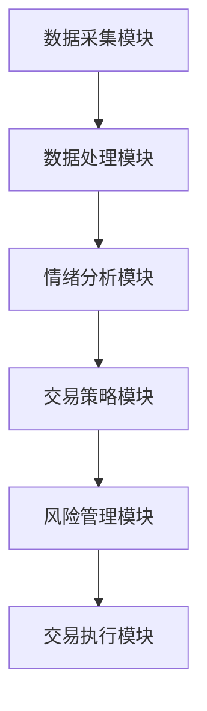
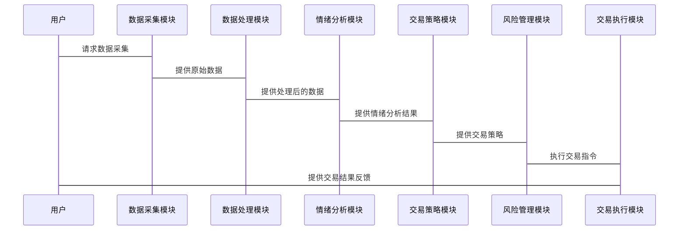

                 


# 巴菲特的行为金融学应用：元宇宙中的群体投资心理

## # 关键词

- 巴菲特
- 行为金融学
- 群体投资心理
- 元宇宙
- 虚拟经济
- 虚拟资产
- 投资策略

## # 摘要

本文探讨了巴菲特的价值投资理念与行为金融学在元宇宙中的结合，分析群体投资心理在虚拟经济环境中的表现和影响。通过行为金融学的理论框架，结合具体案例，深入剖析投资者心理偏差、情绪波动以及群体决策偏差在元宇宙中的具体表现，并提出了基于情绪分析的交易策略和投资决策算法。本文还设计了一个虚拟经济分析系统，帮助投资者更好地理解和应对元宇宙中的投资心理挑战。

---

## # 第一部分：巴菲特的投资理念与行为金融学基础

### # 第1章：巴菲特的投资理念概述

#### ## 1.1 巴菲特投资理念的核心思想

##### # 1.1.1 价值投资的定义与核心要素

- **价值投资**是指以低于内在价值的价格买入优质资产，长期持有的投资策略。其核心要素包括：
  - **内在价值**：资产未来现金流的现值。
  - **安全边际**：买入价格与内在价值之间的差距，确保投资的安全性。
  - **长期视角**：关注企业的长期盈利能力，而非短期市场波动。

##### # 1.1.2 巴菲特投资成功的关键因素

- **深度研究**：巴菲特强调对企业基本面的深入研究，包括财务状况、行业地位和竞争优势。
- **长期持有**：避免频繁交易，降低交易成本和情绪干扰。
- **安全边际**：在价格低于内在价值时买入，降低投资风险。

##### # 1.1.3 价值投资与市场波动的关系

- 价值投资强调逆市投资，即在市场恐慌时买入低估资产，在市场狂热时卖出高估资产。巴菲特认为市场波动为投资者提供了长期买入优质资产的机会。

---

#### ## 1.2 行为金融学的基本概念

##### # 1.2.1 行为金融学的定义与研究范围

- **行为金融学**是研究投资者心理、情绪和行为偏差对金融市场决策和资产定价影响的学科。
- 其研究范围包括：
  - **认知偏差**：投资者在信息处理中的系统性错误。
  - **情绪波动**：投资者情绪对投资决策的影响。
  - **群体心理**：投资者在群体决策中的行为偏差。

##### # 1.2.2 投资者心理与决策偏差

- **代表性偏差**：投资者倾向于根据有限的样本或经验做出决策。
- **确认偏差**：投资者倾向于寻找支持自己观点的信息，忽视相反证据。
- **过度自信**：投资者高估自己的能力，低估市场风险。

##### # 1.2.3 市场情绪与群体投资心理

- **市场情绪**：投资者整体情绪的集合，通常表现为乐观或悲观。
- **群体心理**：投资者在群体压力下可能做出非理性决策，如从众心理。

---

## # 第二部分：元宇宙中的虚拟经济与投资心理

### # 第2章：元宇宙的虚拟经济环境

#### ## 2.1 元宇宙的基本概念与特征

##### # 2.1.1 元宇宙的定义与技术基础

- **元宇宙**是一个虚拟的、持续的、三维的数字空间，通过区块链、AR/VR、人工智能等技术构建。
- **虚拟经济体系**：包括虚拟货币、数字资产、虚拟商品和虚拟服务。

##### # 2.1.2 元宇宙中的虚拟经济体系

- **虚拟货币**：如比特币、以太坊等，用于虚拟经济中的交易。
- **数字资产**：包括NFT（非同质化代币）、虚拟土地等，具有唯一性和可转让性。
- **虚拟商品**：如虚拟装备、虚拟道具等，具有使用价值。

##### # 2.1.3 元宇宙与现实经济的联系

- **经济体系的镜像**：元宇宙中的虚拟经济与现实经济具有相似的运作机制，包括价格波动、市场供需等。
- **技术驱动**：元宇宙的虚拟经济依赖于区块链、人工智能等技术，这些技术也推动了现实经济的发展。

---

#### ## 2.2 元宇宙中的虚拟资产与投资行为

##### # 2.2.1 虚拟货币与数字资产的投资行为

- **虚拟货币的波动性**：由于市场情绪的影响，虚拟货币价格波动剧烈。
- **投资者心理偏差**：投资者在虚拟货币市场中表现出过度自信、从众心理等行为偏差。

##### # 2.2.2 元宇宙中的虚拟经济心理

- **投机心理**：投资者在元宇宙中更多关注短期收益，而非长期价值。
- **羊群效应**：投资者跟随市场趋势，而非基于理性决策。

---

### # 第3章：行为金融学视角下的群体投资心理

#### ## 3.1 投资者心理偏差与群体决策

##### # 3.1.1 投资者心理偏差

- **认知偏差**：如代表性偏差、确认偏差等。
- **情绪波动**：如贪婪与恐惧。

##### # 3.1.2 群体决策偏差

- **从众心理**：投资者在群体压力下，倾向于跟随市场趋势。
- **羊群效应**：投资者跟随市场主流，忽视个体判断。

---

#### ## 3.2 元宇宙中的群体投资心理分析

##### # 3.2.1 虚拟货币市场的群体心理

- **市场泡沫**：投资者在虚拟货币市场中容易产生非理性行为，导致市场泡沫。
- **恐慌与贪婪**：市场下跌时，投资者恐慌抛售；市场上涨时，投资者贪婪追涨。

##### # 3.2.2 群体心理对虚拟资产价格的影响

- **价格波动**：群体心理导致市场情绪波动，进而影响虚拟资产价格。
- **市场周期**：从乐观到悲观，再到乐观，形成市场周期。

---

### # 第4章：巴菲特投资理念在元宇宙中的应用

#### ## 4.1 价值投资在虚拟经济中的体现

##### # 4.1.1 虚拟资产的内在价值

- **虚拟资产的价值**：包括使用价值、稀缺性和市场流动性。
- **内在价值的评估**：基于虚拟资产的未来收益和市场地位。

##### # 4.1.2 安全边际的应用

- **价格与价值的差异**：在虚拟资产价格低于内在价值时，买入并长期持有。

---

#### ## 4.2 市场波动与长期投资策略

##### # 4.2.1 市场波动的影响

- **短期波动**：虚拟资产价格受市场情绪影响，波动剧烈。
- **长期趋势**：虚拟资产价格最终由其内在价值决定。

##### # 4.2.2 长期投资策略

- **耐心投资**：坚持长期持有，忽略短期波动。
- **逆市投资**：在市场恐慌时买入低估资产，在市场狂热时卖出高估资产。

---

### # 第5章：基于行为金融学的交易策略设计

#### ## 5.1 行为金融学与交易策略

##### # 5.1.1 情绪分析在交易中的应用

- **情绪指标**：通过市场情绪指标，如恐慌指数、贪婪指数等，判断市场趋势。
- **情绪驱动的交易策略**：基于市场情绪变化，制定买入或卖出策略。

##### # 5.1.2 认知偏差与交易决策

- **认知偏差的识别**：识别投资者的偏见，避免非理性决策。
- **偏差修正策略**：通过理性分析，修正认知偏差。

---

#### ## 5.2 具体交易策略的设计

##### # 5.2.1 基于情绪分析的交易策略

- **情绪分析算法**：通过自然语言处理技术，分析社交媒体和新闻的情绪，判断市场趋势。
- **情绪驱动的买卖信号**：当市场情绪过于乐观时，卖出；当市场情绪过于悲观时，买入。

##### # 5.2.2 基于认知偏差的交易策略

- **认知偏差识别**：识别投资者的代表性偏差、确认偏差等，制定相应的交易策略。
- **偏差修正策略**：通过理性分析，避免认知偏差影响交易决策。

---

### # 第6章：虚拟经济分析系统的构建

#### ## 6.1 系统功能设计

##### # 6.1.1 系统功能模块

- **数据采集模块**：采集虚拟资产的价格数据、市场情绪数据等。
- **情绪分析模块**：分析市场情绪，生成情绪指标。
- **交易策略模块**：基于情绪分析结果，制定交易策略。
- **风险管理模块**：监控交易风险，制定风险控制策略。

##### # 6.1.2 功能模块的交互流程

- **数据采集**：采集虚拟资产价格和市场情绪数据。
- **情绪分析**：分析市场情绪，生成情绪指标。
- **交易策略**：基于情绪指标，制定交易策略。
- **风险管理**：监控交易风险，调整交易策略。

---

#### ## 6.2 系统架构设计

##### # 6.2.1 系统架构图



##### # 6.2.2 系统接口设计

- **数据接口**：与虚拟资产交易所接口对接，获取实时数据。
- **用户接口**：提供用户界面，展示市场情绪和交易建议。
- **交易接口**：与虚拟资产交易所对接，执行交易指令。

---

#### ## 6.3 系统交互流程

##### # 6.3.1 系统交互序列图



---

## # 第三部分：项目实战与总结

### # 第7章：项目实战

#### ## 7.1 项目背景与目标

- **项目背景**：分析虚拟货币市场的群体投资心理，验证巴菲特投资理念在元宇宙中的应用。
- **项目目标**：设计并实现一个基于情绪分析的虚拟货币交易系统。

#### ## 7.2 环境安装与配置

- **工具安装**：
  - Python 3.8+
  - Jupyter Notebook
  - NLTK（自然语言处理库）
  - Scikit-learn（机器学习库）
- **数据源**：
  - 虚拟货币价格数据：从虚拟货币交易所获取。
  - 市场情绪数据：从社交媒体和新闻网站获取。

#### ## 7.3 核心代码实现

##### # 7.3.1 数据采集代码

```python
import requests
from bs4 import BeautifulSoup

def get_market_sentiment():
    url = "https://www.example.com/market-sentiment"
    response = requests.get(url)
    soup = BeautifulSoup(response.text, 'html.parser')
    sentiment = soup.find('div', {'class': 'sentiment'}).text
    return sentiment
```

##### # 7.3.2 情绪分析代码

```python
from nltk.sentiment import SentimentIntensityAnalyzer

def analyze_sentiment(text):
    analyzer = SentimentIntensityAnalyzer()
    sentiment = analyzer.polarity_scores(text)
    return sentiment['compound']
```

##### # 7.3.3 交易策略代码

```python
def trading_strategy(sentiment_score):
    if sentiment_score > 0.5:
        return "买入"
    elif sentiment_score < -0.5:
        return "卖出"
    else:
        return "观望"
```

#### ## 7.4 项目总结

- **项目成果**：实现了基于情绪分析的虚拟货币交易系统，验证了群体投资心理对市场的影响。
- **经验总结**：情绪分析在虚拟货币交易中具有重要作用，但需要结合其他因素进行综合判断。

---

## # 第四部分：最佳实践与未来展望

### # 第8章：最佳实践

#### ## 8.1 投资心理注意事项

- **避免情绪驱动**：投资者应避免被市场情绪左右，坚持理性决策。
- **长期视角**：关注企业的长期价值，而非短期价格波动。

#### ## 8.2 系统设计与优化

- **数据优化**：提高数据采集和处理的效率，确保系统实时性。
- **算法优化**：改进情绪分析算法，提高交易策略的准确性。

---

### # 第9章：未来展望

#### ## 9.1 元宇宙中的虚拟经济趋势

- **虚拟资产的多样化**：虚拟资产种类将更加丰富，包括虚拟土地、虚拟服务等。
- **技术驱动**：区块链、人工智能等技术将推动虚拟经济的发展。

#### ## 9.2 投资心理研究的未来方向

- **跨学科研究**：结合心理学、行为学和经济学，深入研究投资者行为。
- **技术应用**：利用大数据和人工智能技术，分析投资者行为模式。

---

## # 作者：AI天才研究院/AI Genius Institute & 禅与计算机程序设计艺术/Zen And The Art of Computer Programming

