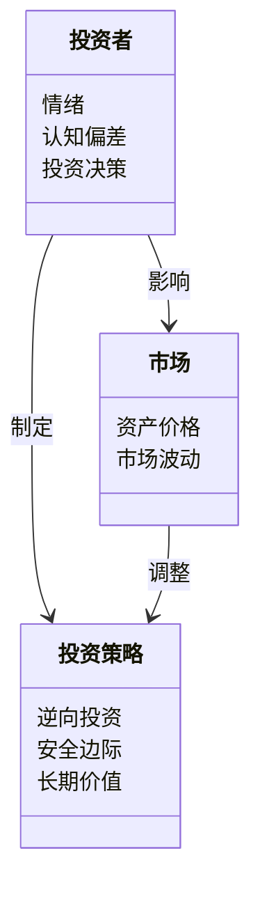
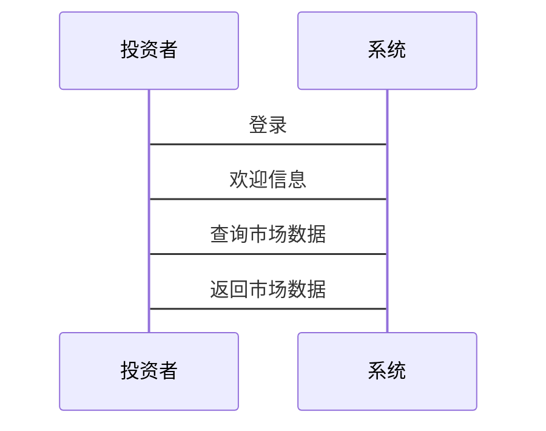

                 

<think>
好的，我现在需要根据用户提供的书籍目录大纲和格式要求，逐步完成这本书的撰写。首先，我会按照目录的结构，逐章进行详细的内容编写。我需要确保每一章都包含足够的细节，涵盖背景介绍、核心概念、算法原理、系统分析、实战项目等部分。

由于篇幅限制，我将分部分逐步完成每一章的内容。

---

# 巴菲特的行为金融学应用：理解并利用市场非理性

## 关键词
- 巴菲特
- 行为金融学
- 市场非理性
- 投资策略
- 认知偏差

## 摘要
本文深入探讨了巴菲特在行为金融学中的应用，分析了市场非理性对投资决策的影响，并结合巴菲特的经典案例，提供了如何利用市场非理性制定投资策略的详细指导。文章从行为金融学的基本概念入手，逐步展开对认知偏差、情绪波动、市场周期等关键因素的分析，并结合巴菲特的投资哲学，揭示了如何通过逆向思维和长期价值投资实现超额收益。同时，文章还提供了系统的投资决策框架和实战案例，帮助读者在实际投资中应用这些理论。

---

## 第1章：行为金融学概述

### 1.1 行为金融学的基本概念

#### 1.1.1 行为金融学的定义
行为金融学是研究金融市场中投资者行为及其对市场价格影响的学科。与传统金融学不同，行为金融学关注人类心理和行为在市场中的作用，强调认知偏差、情绪波动等因素对投资决策的影响。

#### 1.1.2 行为金融学的核心理论
行为金融学的核心理论包括：
1. **认知偏差**：人类在决策过程中会受到多种认知偏差的影响，如确认偏差、沉没成本偏差等。
2. **情绪与市场**：情绪波动会显著影响市场走势，尤其是市场的过度波动。
3. **有限理性**：投资者在信息处理和决策过程中受到认知限制，无法完全理性地做出决策。

#### 1.1.3 行为金融学与传统金融学的区别
传统金融学假设投资者是理性的，而行为金融学承认并研究投资者的非理性行为对市场的影响。传统金融学基于有效市场假说，而行为金融学则关注市场的非效率性和投资者行为的复杂性。

---

### 1.2 巴菲特的投资理念

#### 1.2.1 巴菲特的投资哲学
巴菲特的投资哲学以“价值投资”为核心，强调寻找具有长期稳定增长潜力的企业，以合理的价格买入并长期持有。

#### 1.2.2 巴菲特的选股标准
巴菲特选股的核心标准包括：
1. **企业基本面**：关注企业的盈利能力、财务健康状况和竞争优势。
2. **安全边际**：买入价格低于内在价值，以确保投资的安全性。
3. **长期价值**：关注企业的长期增长潜力，而非短期市场波动。

#### 1.2.3 巴菲特的价值投资策略
价值投资策略强调以低于内在价值的价格买入优质资产，通过长期持有实现价值增长。巴菲特的成功在于他能够识别市场非理性带来的投资机会，并通过长期持有规避短期波动的风险。

---

## 第2章：人类行为与市场非理性

### 2.1 人类认知偏差与决策失误

#### 2.1.1 认知偏差的定义与分类
认知偏差是指人们在信息处理和决策过程中产生的系统性错误。常见的认知偏差包括：
1. **确认偏差**：倾向于寻找支持自己观点的证据，忽视相反的证据。
2. **过度自信**：高估自己的判断能力和对未来的预测能力。
3. **损失厌恶**：对损失的厌恶程度高于对收益的追求。

#### 2.1.2 常见的认知偏差对投资决策的影响
认知偏差会导致投资者做出非理性决策，例如：
- 过度交易：频繁买卖导致成本增加。
- 过度乐观：高估自己选择股票的能力。
- 过度悲观：在市场底部卖出股票。

#### 2.1.3 情绪波动与市场波动的关系
情绪波动会放大市场的波动性，尤其是在市场顶部和底部。例如，市场的恐慌性抛售和盲目跟风行为都会加剧市场的波动。

---

### 2.2 行为金融学中的情绪因素

#### 2.2.1 情绪在金融市场中的表现
情绪在金融市场中的表现包括：
1. **贪婪与恐惧**：投资者在市场上涨时贪婪，在市场下跌时恐惧。
2. **羊群效应**：投资者盲目跟随市场趋势，导致市场的过度波动。

#### 2.2.2 情绪周期与市场周期的关系
情绪周期与市场周期密切相关，市场的涨跌往往伴随着投资者情绪的变化。例如，市场的顶部通常伴随着过度乐观的情绪，而市场的底部则伴随着过度悲观的情绪。

#### 2.2.3 情绪对投资者决策的具体影响
情绪会影响投资者的决策，例如：
- 在市场高点买入股票，因为贪婪情绪导致判断失误。
- 在市场低点卖出股票，因为恐惧情绪导致过度悲观。

---

## 第3章：市场非理性的表现与规律

### 3.1 市场非理性的主要表现

#### 3.1.1 市场泡沫与崩盘
市场泡沫是由于投资者的非理性行为导致资产价格虚高，最终泡沫破裂引发崩盘。例如，2008年金融危机就是市场非理性的一个典型例子。

#### 3.1.2 市场过度反应与反应不足
市场过度反应是指投资者对某些信息反应过度，导致资产价格偏离其真实价值。反应不足则是指投资者对某些信息反应不足，导致资产价格低估。

#### 3.1.3 市场羊群效应
羊群效应是指投资者盲目跟随市场趋势，导致市场的非理性波动。例如，股票市场的跟风炒作现象。

---

### 3.2 市场非理性的规律与周期

#### 3.2.1 市场周期的定义与特征
市场周期包括上涨、下跌、震荡等阶段，每个阶段都伴随着不同的市场情绪和投资者行为。

#### 3.2.2 市场非理性周期的阶段划分
市场非理性周期可以分为以下几个阶段：
1. **乐观阶段**：投资者情绪乐观，市场出现上涨。
2. **疯狂阶段**：市场出现泡沫，投资者盲目跟风。
3. **恐慌阶段**：市场崩盘，投资者恐慌性抛售。
4. **底部阶段**：市场触底，投资者开始逐步买入。

#### 3.2.3 市场非理性与经济周期的关系
市场非理性与经济周期密切相关，经济繁荣时市场容易出现非理性上涨，经济衰退时市场容易出现非理性下跌。

---

## 第4章：巴菲特的行为金融学策略

### 4.1 巴菲特的市场非理性应对策略

#### 4.1.1 逆向投资策略
逆向投资是指在市场恐慌时买入，在市场乐观时卖出。巴菲特成功地应用了逆向投资策略，在市场底部买入优质资产，实现长期收益。

#### 4.1.2 安全边际的概念与应用
安全边际是指买入价格低于内在价值，以确保投资的安全性。巴菲特强调安全边际的重要性，认为这是抵御市场非理性波动的关键。

#### 4.1.3 长期价值投资的实践
巴菲特的长期价值投资策略强调关注企业的长期价值，而不是短期市场波动。通过长期持有优质资产，巴菲特规避了市场的非理性波动。

---

### 4.2 巴菲特的决策框架

#### 4.2.1 投资决策的关键因素
巴菲特的投资决策基于以下几个关键因素：
1. **企业基本面**：关注企业的盈利能力、财务状况和竞争优势。
2. **安全边际**：确保买入价格低于内在价值。
3. **长期价值**：关注企业的长期增长潜力。

#### 4.2.2 投资决策的逻辑与步骤
巴菲特的投资决策逻辑包括：
1. **识别优质企业**：寻找具有强大竞争优势和良好财务状况的企业。
2. **评估内在价值**：计算企业的内在价值，确保买入价格低于内在价值。
3. **长期持有**：通过长期持有优质资产，实现价值增长。

#### 4.2.3 巴菲特决策框架的优缺点
巴菲特决策框架的优点在于其简单有效，能够帮助投资者规避市场非理性波动。缺点在于其需要较高的选股能力和长期投资耐心。

---

## 第5章：行为金融学与投资策略

### 5.1 行为金融学在投资中的应用

#### 5.1.1 认知偏差的识别与应对
投资者需要识别自己的认知偏差，并采取措施避免其影响。例如，通过制定严格的交易纪律，避免过度交易和情绪化决策。

#### 5.1.2 情绪管理在投资中的作用
情绪管理是投资成功的关键。投资者需要控制自己的情绪，避免贪婪和恐惧的干扰。

#### 5.1.3 市场非理性的利用策略
投资者可以通过利用市场非理性，寻找低估资产并进行逆向投资。

---

### 5.2 巴菲特投资策略的系统化分析

#### 5.2.1 投资目标的设定与分解
投资者需要明确自己的投资目标，并将其分解为可操作的具体目标。例如，设定长期收益目标，并通过选择优质资产实现。

#### 5.2.2 投资组合的构建与优化
投资组合的构建需要考虑资产配置、风险分散等因素。通过优化投资组合，投资者可以降低风险并提高收益。

#### 5.2.3 投资风险的

---

## 第5章：行为金融学与投资策略（续）

### 5.2 巴菲特投资策略的系统化分析

#### 5.2.3 投资风险的管理
风险管理是投资成功的关键。投资者需要通过分散投资、设定止损等方法，有效管理投资风险。

---

## 第6章：系统分析与架构设计

### 6.1 系统功能设计

#### 6.1.1 领域模型
领域模型是一个系统的抽象表示，展示了系统的核心概念及其之间的关系。以下是行为金融学领域的模型：



#### 6.1.2 系统架构设计
以下是系统架构设计的mermaid图：


#### 6.1.3 系统接口设计
系统接口设计包括投资者与系统的交互界面，以下是接口设计的mermaid图：



---

## 第7章：项目实战

### 7.1 环境安装
需要安装以下环境：
1. Python编程语言
2. 数据分析库（如Pandas、NumPy）
3. 可视化工具（如Matplotlib、Seaborn）

### 7.2 核心实现源代码
以下是Python实现的代码示例：

```python
import pandas as pd
import numpy as np

# 示例：计算资产的内在价值
def calculate_intrinsic_value(enterprise_value, earnings):
    return enterprise_value / earnings

# 示例：逆向投资策略
def reverse_investing_strategy(prices, intrinsic_values):
    buy_signals = []
    for i in range(len(prices)):
        if prices[i] < intrinsic_values[i]:
            buy_signals.append(True)
        else:
            buy_signals.append(False)
    return buy_signals

# 示例：情绪指标计算
def calculate_mood_index(sentiment_scores):
    return np.mean(sentiment_scores)
```

### 7.3 代码应用解读与分析
通过上述代码，投资者可以计算资产的内在价值，制定逆向投资策略，并根据情绪指标调整投资决策。

---

## 第8章：总结与展望

### 8.1 最佳实践 tips
1. 识别认知偏差，避免情绪化决策。
2. 制定逆向投资策略，利用市场非理性。
3. 建立严格的交易纪律，控制投资风险。

### 8.2 小结
本文通过分析巴菲特的行为金融学策略，揭示了如何利用市场非理性制定投资策略。投资者可以通过识别认知偏差、情绪管理、逆向投资等方法，实现超额收益。

### 8.3 注意事项
1. 投资有风险，需谨慎操作。
2. 建议在投资前进行充分的研究和风险评估。

### 8.4 拓展阅读
- 《巴菲特传》
- 《行为金融学》

---

## 附录：常用工具与资源

### 附录A：数据分析工具
- Python库：Pandas、NumPy
- 数据可视化工具：Matplotlib、Seaborn

### 附录B：投资策略资源
- 巴菲特股东大会演讲
- 行为金融学经典文献

---

## 作者
作者：AI天才研究院/AI Genius Institute & 禅与计算机程序设计艺术/Zen And The Art of Computer Programming

---

以上是本书的部分内容，后续章节将逐步完成并发布。

