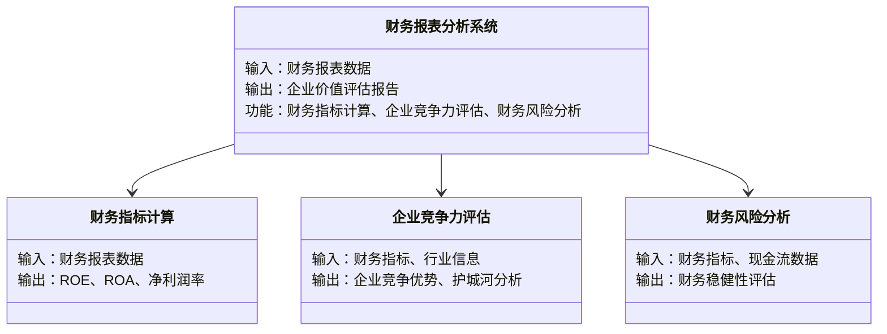
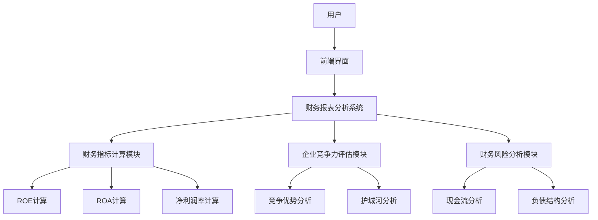
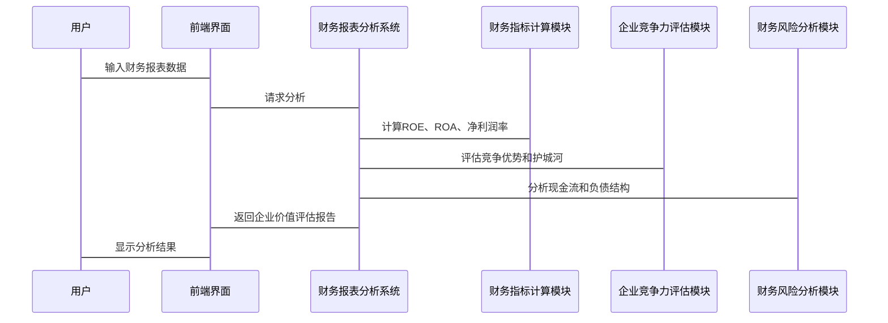

                 


# 巴菲特的读财报方法

## 关键词：
巴菲特、投资、财报分析、财务报表、价值投资、ROE、ROA、现金流、企业估值

## 摘要：
本文深入分析了巴菲特的读财报方法，从其投资理念到具体的财务指标分析，再到企业竞争力评估和财务风险分析，全面揭示了巴菲特如何通过财务报表来评估企业价值和投资决策。文章结合实际案例，详细讲解了巴菲特的选股标准、财报分析框架以及如何将这些方法应用于实际投资中。

---

## 第一部分：巴菲特投资理念与财报分析基础

### 第1章：巴菲特投资理念概述

#### 1.1 巴菲特的生平与投资风格
沃伦·巴菲特（Warren Buffett）是世界上最著名的投资者之一，他的投资理念以价值投资为核心，强调长期持有一个优秀企业的股份，而非频繁交易。巴菲特的投资哲学强调企业基本面分析，而财务报表分析是其中的核心部分。

- **1.1.1 巴菲特的生平**  
  沃伦·巴菲特出生于1930年，早年通过阅读投资经典书籍自学投资，25岁时开始管理合伙公司，积累了第一桶金。他的投资理念逐渐成熟，形成了以价值投资为核心的风格。

- **1.1.2 巴菲特投资理念的核心思想**  
  巴菲特认为，投资的本质是购买企业的一部分，而不是单纯买卖股票。他强调企业基本面分析，尤其是财务报表分析，是评估企业价值的关键。

- **1.1.3 财务报表在巴菲特投资中的重要性**  
  巴菲特认为，财务报表是了解企业财务状况的核心工具。通过分析资产负债表、利润表和现金流量表，可以评估企业的盈利能力、成长性和财务健康度。

#### 1.2 财务报表基础
财务报表是企业财务状况的总结，包括资产负债表、利润表和现金流量表。以下是三者的简要介绍：

- **1.2.1 资产负债表**  
  资产负债表反映了企业在某一特定时间点的资产、负债和所有者权益的状况。  
  $$资产 = 负债 + 所有者权益$$

- **1.2.2 利润表**  
  利润表反映了企业在一定会计期间内的收入和利润情况。  
  $$净利润 = 收入 - 成本 - 费用$$

- **1.2.3 现金流量表**  
  现金流量表反映了企业在一定会计期间内的现金流入和流出情况，分为经营活动、投资活动和筹资活动的现金流。

---

### 第2章：巴菲特读财报的核心方法论

#### 2.1 财务指标分析
巴菲特通过分析关键财务指标来评估企业的盈利能力、成长性和财务健康度。

- **2.1.1 资产回报率（ROA）**  
  ROA是衡量企业资产使用效率的重要指标。  
  $$ROA = \frac{净利润}{平均资产总额}$$

- **2.1.2 股东权益回报率（ROE）**  
  ROE是衡量企业盈利能力的重要指标，反映了企业每单位股东权益的收益能力。  
  $$ROE = \frac{净利润}{平均股东权益总额}$$

- **2.1.3 净利润率**  
  净利润率是衡量企业盈利能力的核心指标，反映了企业每单位收入的净利润。  
  $$净利润率 = \frac{净利润}{收入}$$

#### 2.2 企业竞争力评估
巴菲特注重分析企业的核心竞争力，包括市场地位、竞争优势和护城河。

- **2.2.1 核心竞争力的定义**  
  核心竞争力是企业在市场上长期竞争优势的来源，通常表现为企业的品牌、技术、成本优势或商业模式。

- **2.2.2 市场地位与竞争优势分析**  
  通过分析企业的市场份额、竞争对手情况和行业地位，评估企业的竞争优势。

- **2.2.3 企业护城河**  
  护城河是企业抵御竞争的核心能力，包括成本优势、品牌优势、技术壁垒和网络效应。

#### 2.3 财务风险与稳健性分析
巴菲特强调企业的财务稳健性，关注企业的偿债能力和现金流健康度。

- **2.3.1 负债结构分析**  
  通过分析企业的负债结构，评估企业的偿债能力和财务风险。  
  $$负债结构 = 短期负债 + 长期负债$$

- **2.3.2 现金流健康度评估**  
  现金流是企业的血液，巴菲特特别关注企业的自由现金流（FCF）。  
  $$自由现金流 = 净利润 - 投资活动现金流$$

---

### 第3章：巴菲特的选股标准与财报分析

#### 3.1 选股标准
巴菲特的选股标准以企业质量为核心，包括盈利能力、成长性和行业前景。

- **3.1.1 企业质量**  
  巴菲特注重企业的盈利能力、成长性和稳定性，尤其是企业的净利润率和ROE。

- **3.1.2 管理层能力**  
  巴菲特认为，优秀的管理层是企业成功的关键。他特别关注管理层的诚信和决策能力。

- **3.1.3 行业前景**  
  巴菲特倾向于投资具有长期增长潜力的行业，尤其是那些具有护城河的行业。

#### 3.2 财报分析中的关键指标
巴菲特在财报分析中重点关注以下指标：

- **3.2.1 收入质量分析**  
  收入质量是评估企业收入来源的重要指标，包括收入增长的可持续性和收入结构的合理性。

- **3.2.2 利润质量分析**  
  利润质量反映了企业的盈利能力，包括利润来源的可持续性和利润增长的合理性。

- **3.2.3 现金流质量分析**  
  现金流质量是评估企业财务健康度的关键指标，包括现金流的来源和用途。

---

### 第4章：巴菲特的财报分析框架

#### 4.1 财报分析的框架体系
巴菲特的财报分析框架以四维度模型为核心，包括盈利能力、成长性、财务稳健性和行业前景。

- **4.1.1 四维度模型**  
  1. **盈利能力**：ROE、净利润率、毛利率。  
  2. **成长性**：收入增长率、净利润增长率、资产增长率。  
  3. **财务稳健性**：负债率、现金流健康度、自由现金流。  
  4. **行业前景**：行业周期、竞争优势、护城河。

- **4.1.2 动态视角**  
  巴菲特强调动态分析，关注企业的长期发展趋势和周期性变化。

#### 4.2 财报分析中的关键问题
巴菲特在财报分析中重点关注以下问题：

- **4.2.1 企业盈利能力的可持续性**  
  通过分析企业的ROE、净利润率和毛利率，评估企业的盈利能力是否可持续。

- **4.2.2 企业成长性的评估与判断**  
  通过分析企业的收入增长率、净利润增长率和资产增长率，评估企业的成长潜力。

- **4.2.3 企业财务风险的预警与应对**  
  通过分析企业的负债结构、现金流健康度和自由现金流，评估企业的财务风险。

---

### 第5章：巴菲特的财报分析实战案例

#### 5.1 案例分析：巴菲特投资的经典案例
以下是巴菲特投资的经典案例分析：

- **案例1：可口可乐（Coca-Cola）**  
  可口可乐的财务报表显示其具有强大的品牌优势和稳定的现金流。巴菲特通过分析其ROE和现金流，判断其具有长期投资价值。

- **案例2：美国运通（American Express）**  
  美国运通的财务报表显示其具有强大的市场地位和竞争优势。巴菲特通过分析其利润表和现金流，判断其具有长期增长潜力。

---

## 第二部分：系统分析与架构设计

### 第6章：系统分析与架构设计方案

#### 6.1 问题场景介绍
本文通过分析巴菲特的读财报方法，构建了一个基于财务报表分析的企业价值评估系统。

#### 6.2 系统功能设计
以下是系统功能设计的领域模型：



#### 6.3 系统架构设计
以下是系统的架构设计：



#### 6.4 系统交互设计
以下是系统的交互设计：



---

## 第三部分：项目实战与总结

### 第7章：项目实战

#### 7.1 环境安装
本文基于Python 3.9及以上版本，使用pandas、numpy和matplotlib库。

#### 7.2 核心实现源代码
以下是Python实现的财务指标计算代码：

```python
import pandas as pd

def calculate_roe(net_profit, equity):
    return net_profit / equity

def calculate_roa(net_profit, total_assets):
    return net_profit / total_assets

def calculate_net_profit_margin(net_profit, revenue):
    return net_profit / revenue

# 示例数据
data = {
    'net_profit': [100, 200, 300],
    'equity': [500, 600, 700],
    'total_assets': [1000, 1200, 1400],
    'revenue': [2000, 2400, 2800]
}

df = pd.DataFrame(data)

# 计算ROE、ROA和净利润率
df['ROE'] = calculate_roe(df['net_profit'], df['equity'])
df['ROA'] = calculate_roa(df['net_profit'], df['total_assets'])
df['Net Profit Margin'] = calculate_net_profit_margin(df['net_profit'], df['revenue'])

print(df)
```

#### 7.3 代码应用解读与分析
通过上述代码，我们可以计算企业的ROE、ROA和净利润率，从而评估企业的盈利能力。代码中的数据可以替换成实际企业的财务数据，进行具体分析。

#### 7.4 实际案例分析
以某企业为例，分析其财务报表数据：

```python
# 示例数据
data = {
    'net_profit': [100],
    'equity': [500],
    'total_assets': [1000],
    'revenue': [2000]
}

df = pd.DataFrame(data)

# 计算ROE、ROA和净利润率
df['ROE'] = calculate_roe(df['net_profit'], df['equity'])
df['ROA'] = calculate_roa(df['net_profit'], df['total_assets'])
df['Net Profit Margin'] = calculate_net_profit_margin(df['net_profit'], df['revenue'])

print(df)
```

#### 7.5 项目小结
通过上述实战案例，我们可以看到，巴菲特的财报分析方法可以有效地应用于实际投资中。通过计算关键财务指标，评估企业的盈利能力、成长性和财务稳健性，从而做出科学的投资决策。

---

## 第四部分：总结与展望

### 第8章：总结与展望

#### 8.1 总结
本文详细分析了巴菲特的读财报方法，从其投资理念到具体的财务指标分析，再到企业竞争力评估和财务风险分析，全面揭示了巴菲特如何通过财务报表来评估企业价值和投资决策。通过实际案例分析和系统设计，展示了如何将巴菲特的方法应用于实际投资中。

#### 8.2 展望
未来，随着人工智能和大数据技术的发展，财务报表分析将更加智能化和自动化。投资者可以通过机器学习算法，自动计算财务指标、识别企业竞争优势和预测财务风险，从而进一步提升投资决策的科学性和准确性。

---

## 作者：AI天才研究院/AI Genius Institute & 禅与计算机程序设计艺术 /Zen And The Art of Computer Programming

