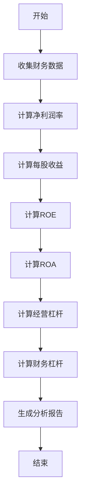
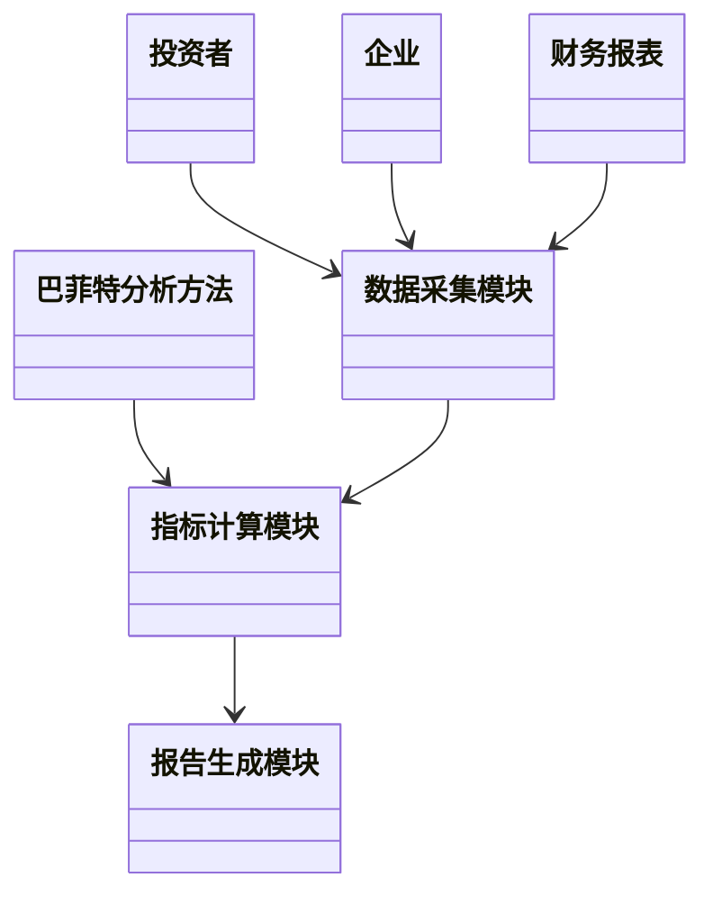

                 


# 巴菲特的财务报表分析：解读数据驱动企业的新指标

## 关键词：巴菲特、财务报表、数据驱动、企业分析、投资策略、价值评估

## 摘要：本文结合巴菲特的财务报表分析方法，探讨数据驱动企业中的新指标，通过详细分析核心概念、算法原理、系统架构及项目实战，揭示这些新指标如何赋能企业价值评估。

---

# 引言：背景介绍

## 第一部分：背景介绍

### 第1章：巴菲特的财务报表分析方法

#### 1.1 财务报表分析的重要性

财务报表分析是评估企业财务健康状况的核心工具。通过对资产负债表、利润表和现金流量表的分析，投资者和管理层能够洞悉企业的盈利能力和财务风险。巴菲特作为价值投资的倡导者，其财务分析方法在投资界享有盛誉。

**关键点**：财务报表分析不仅仅是数字游戏，更是解读企业经营状况的窗口。巴菲特的分析方法强调对企业基本面的深入理解，尤其是ROE和ROA等关键指标。

#### 1.2 巴菲特的投资理念与财务分析框架

巴菲特的投资理念以“价值投资”为核心，强调长期持有优质资产。他的财务分析框架包括对企业盈利能力、资产效率和资本结构的全面评估。他倾向于选择那些具备持续盈利能力、良好财务状况和稳定管理团队的企业。

**关键点**：巴菲特的分析框架将财务指标与企业基本面相结合，注重企业的长期成长潜力。

#### 1.3 数据驱动企业在现代经济中的重要性

随着数字化转型的深入，数据驱动企业逐渐成为经济的核心。这些企业利用数据和先进技术优化运营、创新业务模式，并通过数据驱动的决策提升竞争力。在这种环境下，传统的财务指标可能无法全面反映企业的价值，新的指标体系应运而生。

**关键点**：数据驱动企业的崛起要求我们重新审视财务指标，引入更具前瞻性的新指标来评估企业的数据驱动能力。

---

## 第二部分：核心概念与联系

### 第2章：巴菲特分析财务报表的核心指标

#### 2.1 核心指标解析

**2.1.1 净利润率（Net Profit Margin）**

净利润率=净利润/收入

净利润率衡量企业将收入转化为利润的能力。高净利润率表明企业具有较强的盈利能力。例如，假设一家企业收入为1000万元，净利润为200万元，其净利润率为20%。

**2.1.2 每股收益（EPS）**

每股收益=净利润/平均股数

每股收益是衡量企业盈利能力的重要指标，反映了每股的盈利能力。例如，某企业净利润为500万元，发行在外的普通股为1000万股，则EPS为0.5元。

**2.1.3 股东权益回报率（ROE）**

股东权益回报率=净利润/股东权益

ROE衡量企业使用股东资金的效率。例如，某企业净利润为1000万元，股东权益为5000万元，则ROE为20%。

**2.1.4 资产回报率（ROA）**

资产回报率=净利润/总资产

ROA衡量企业利用资产产生收益的能力。例如，某企业净利润为800万元，总资产为4000万元，则ROA为20%。

**2.1.5 经营杠杆与财务杠杆**

经营杠杆=营业收入变化% / 净利润变化%

财务杠杆=息税前利润变化% / 净利润变化%

经营杠杆衡量销售变化对利润的影响，财务杠杆衡量债务对企业利润的影响。

#### 2.2 新指标的引入

**2.2.1 数据驱动企业的关键指标**

数据驱动企业的关键指标包括：

- 数据处理能力（Data Processing Capacity）
- 数据资产价值（Data Asset Value）
- 数据驱动决策的速度（Data-Driven Decision Velocity）
- 数据创新指数（Data Innovation Index）

**2.2.2 新指标与传统指标的对比**

新指标与传统指标的对比如下：

| 指标名称         | 定义                                                                 | 主要用途                     | 巴菲特的视角       |
|------------------|----------------------------------------------------------------------|------------------------------|-------------------|
| 净利润率           | 净利润 / 收入                                                       | 评估盈利能力               | 核心指标之一       |
| 每股收益           | 净利润 / 平均股数                                                   | 评估每股价值               | 关键指标           |
| 股东权益回报率     | 净利润 / 股东权益                                                   | 评估资本效率               | 至关重要           |
| 资产回报率         | 净利润 / 总资产                                                     | 评估资产使用效率           | 用于杠杆分析       |
| 数据处理能力       | 数据吞吐量 / 数据处理时间                                         | 评估数据处理效率           | 新指标             |
| 数据资产价值       | 数据资产的市场价值                                                 | 评估数据资产的价值           | 新增指标           |
| 数据驱动决策速度   | 决策时间从数据收集到执行的平均时间                                 | 评估数据驱动决策的效率       | 新增指标           |

#### 2.3 ER实体关系图

```mermaid
er
actor 投资者
actor 企业
actor 财务报表
actor 巴菲特分析方法
```

---

## 第三部分：算法原理讲解

### 第3章：财务报表分析算法的数学模型

#### 3.1 净利润率的计算

$$ \text{净利润率} = \frac{\text{净利润}}{\text{收入}} $$

例如，净利润为200万元，收入为1000万元，则净利润率为20%。

#### 3.2 每股收益的计算

$$ \text{每股收益} = \frac{\text{净利润}}{\text{平均股数}} $$

例如，净利润为500万元，平均股数为1000万股，则每股收益为0.5元。

#### 3.3 股东权益回报率的计算

$$ \text{股东权益回报率} = \frac{\text{净利润}}{\text{股东权益}} $$

例如，净利润为1000万元，股东权益为5000万元，则股东权益回报率为20%。

#### 3.4 资产回报率的计算

$$ \text{资产回报率} = \frac{\text{净利润}}{\text{总资产}} $$

例如，净利润为800万元，总资产为4000万元，则资产回报率为20%。

#### 3.5 经营杠杆的计算

$$ \text{经营杠杆} = \frac{\Delta \text{营业收入}}{\Delta \text{净利润}} $$

例如，营业收入增长10%，净利润增长20%，则经营杠杆为200%。

#### 3.6 财务杠杆的计算

$$ \text{财务杠杆} = \frac{\Delta \text{息税前利润}}{\Delta \text{净利润}} $$

例如，息税前利润增长20%，净利润增长15%，则财务杠杆为150%。

### 第4章：财务报表分析算法的实现

#### 4.1 算法流程图



#### 4.2 Python代码实现

```python
import pandas as pd

def calculate_financial_ratios(financial_data):
    # 计算净利润率
    net_profit_margin = financial_data['净利润'] / financial_data['收入']
    
    # 计算每股收益
    eps = financial_data['净利润'] / financial_data['平均股数']
    
    # 计算ROE
    roe = financial_data['净利润'] / financial_data['股东权益']
    
    # 计算ROA
    roa = financial_data['净利润'] / financial_data['总资产']
    
    # 计算经营杠杆
    operating_leverage = (financial_data['Δ营业收入'] / financial_data['Δ净利润']).mean()
    
    # 计算财务杠杆
    financial_leverage = (financial_data['Δ息税前利润'] / financial_data['Δ净利润']).mean()
    
    return {
        '净利率': net_profit_margin,
        '每股收益': eps,
        'ROE': roe,
        'ROA': roa,
        '经营杠杆': operating_leverage,
        '财务杠杆': financial_leverage
    }
```

---

## 第四部分：系统分析与架构设计方案

### 第5章：系统功能设计

#### 5.1 系统功能模块



#### 5.2 系统架构设计


---

## 第五部分：项目实战

### 第6章：基于新指标的财务分析案例

#### 6.1 案例分析

假设我们分析一家科技公司，其财务数据如下：

| 指标       | 数值     |
|------------|----------|
| 净利润     | 500万元  |
| 收入       | 2500万元 |
| 平均股数     | 1000万股|
| 股东权益     | 3000万元|
| 总资产       | 5000万元|
| 数据处理能力   | 1000条/秒|
| 数据资产价值   | 500万元|
| 数据驱动决策速度 | 1天 |

#### 6.2 代码实现

```python
financial_data = {
    '净利润': 500,
    '收入': 2500,
    '平均股数': 1000,
    '股东权益': 3000,
    '总资产': 5000,
    '数据处理能力': 1000,
    '数据资产价值': 500,
    '数据驱动决策速度': 1
}

ratios = calculate_financial_ratios(financial_data)
print(ratios)
```

---

## 第六部分：总结与展望

### 第7章：总结

通过本文的详细分析，我们了解到巴菲特的财务报表分析方法在数据驱动企业中的新指标应用。这些新指标不仅丰富了传统的财务分析体系，还为企业价值评估提供了新的视角。

### 第8章：注意事项

- 数据质量是财务分析的基础，确保数据的准确性和完整性。
- 结合企业实际业务场景，灵活运用新指标。
- 定期更新和优化分析模型，适应市场变化。

### 第9章：拓展阅读

- 《巴菲特传》：深入了解巴菲特的投资哲学。
- 《财务报表分析与应用》：系统学习财务报表分析方法。
- 《数据驱动决策》：探索数据驱动企业的管理实践。

---

# 作者：AI天才研究院/AI Genius Institute & 禅与计算机程序设计艺术 /Zen And The Art of Computer Programming

