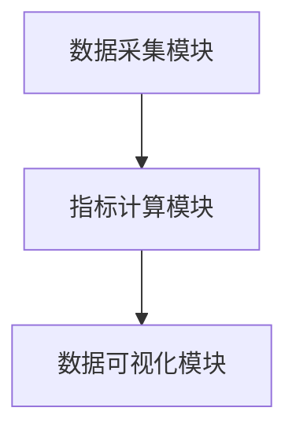
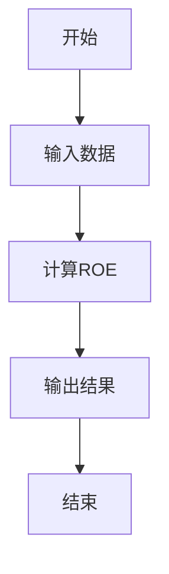

                 


# 巴菲特的财务报表分析：解读量子科技公司的新指标

## 关键词：巴菲特，财务报表分析，量子科技，投资指标，价值投资

## 摘要：  
本文深入探讨巴菲特的财务报表分析方法，并结合量子科技公司的特点，提出新的财务指标分析方法。通过系统化的分析框架，结合实际案例和代码实现，帮助读者掌握如何利用财务数据评估量子科技公司的投资价值。

---

## 第一部分: 巴菲特投资理念与财务报表分析概述

### 第1章: 巴菲特投资理念概述

#### 1.1 巴菲特的价值投资理论
##### 1.1.1 价值投资的核心理念
价值投资的核心在于寻找被市场低估的公司，关注其内在价值而非短期市场波动。巴菲特强调企业基本面分析，包括盈利能力、财务健康和管理团队。

##### 1.1.2 巴菲特的投资策略与选股标准
巴菲特偏好具有持续盈利能力、高ROE（净资产收益率）和稳定现金流的企业。他倾向于投资熟悉的行业，如消费、金融和能源，并关注企业的竞争优势（如护城河）。

##### 1.1.3 巴菲特投资理念的演变与应用
巴菲特的投资策略从早期的烟蒂股策略逐渐转向买入优质企业，强调长期持有和复利效应。他的成功证明了基本面分析的重要性。

---

### 第2章: 财务报表分析的基本方法

#### 2.1 财务报表分析的定义与作用
##### 2.1.1 财务报表分析的基本概念
财务报表分析是通过对企业财务报表（资产负债表、利润表、现金流量表）的解读，评估企业的财务状况、盈利能力和未来发展前景。

##### 2.1.2 财务报表分析在投资决策中的作用
财务报表分析帮助投资者评估企业的偿债能力、盈利能力、营运效率和现金流健康，从而做出明智的投资决策。

##### 2.1.3 财务报表分析的三大报表概述
- **资产负债表**：展示企业在特定时点的资产、负债和所有者权益。
- **利润表**：展示企业在一定会计期间的收入、费用和利润。
- **现金流量表**：展示企业在一定会计期间的现金流入和流出情况。

---

### 第3章: 量子科技公司的财务特征

#### 3.1 量子科技行业的特点与挑战
##### 3.1.1 量子科技行业的技术门槛
量子科技行业具有高技术门槛，研发投入大，技术壁垒高，且产品周期长。

##### 3.1.2 量子科技公司的研发投入与资本结构
量子科技公司通常具有高研发投入，资本结构轻资产，依赖技术和人才。

##### 3.1.3 量子科技公司的轻资产模式与高成长性
量子科技公司依赖知识产权和技术创新，资产较轻，但成长性高，未来收益潜力大。

---

## 第二部分: 财务报表分析的核心指标与方法

### 第4章: 财务报表分析的核心指标

#### 4.1 资产负债表分析
##### 4.1.1 资产结构分析
分析企业的资产构成，关注流动资产与非流动资产的比例，评估企业的流动性风险。

##### 4.1.2 负债结构分析
分析企业的负债构成，关注流动负债与非流动负债的比例，评估企业的偿债能力。

##### 4.1.3 股东权益分析
分析股东权益的构成，关注资本公积、盈余公积和未分配利润的变化，评估企业的资本结构和盈利能力。

---

#### 4.2 利润表分析
##### 4.2.1 收入与成本分析
分析收入来源和成本结构，关注收入增长和成本控制能力。

##### 4.2.2 毛利率与净利率分析
毛利率=（营业收入-营业成本）/营业收入，净利率=净利润/营业收入。高毛利率和高净利率表明企业盈利能力强。

##### 4.2.3 盈利能力分析
分析企业的盈利能力，关注ROE（净资产收益率）、ROA（资产净利率）和ROCE（资本回报率）。

---

#### 4.3 现金流量表分析
##### 4.3.1 经营活动现金流分析
经营活动现金流是企业核心业务的现金流，反映企业的盈利能力和现金流健康。

##### 4.3.2 投资活动现金流分析
投资活动现金流反映企业投资活动的现金流情况，关注企业的扩张能力和资金需求。

##### 4.3.3 筹资活动现金流分析
筹资活动现金流反映企业通过融资活动获得的现金流，关注企业的债务负担和融资能力。

---

### 第5章: 量子科技公司的新指标分析

#### 5.1 新指标的定义与计算
##### 5.1.1 研发投入占收入比例
研发占比=研发费用/营业收入，用于评估企业在技术研发上的投入力度。

##### 5.1.2 技术成果转化率
技术成果转化率=已商业化技术数量/研发项目总数，用于评估企业的技术转化能力。

##### 5.1.3 专利持有量与质量
专利数量和质量是衡量企业技术竞争力的重要指标。

---

#### 5.2 新指标的分析与应用
##### 5.2.1 研发投入与企业成长性
高研发投入通常意味着企业具有更强的技术储备和未来增长潜力。

##### 5.2.2 技术成果转化对企业盈利能力的影响
技术成果转化能力强的企业，能够更快地将研发成果转化为收入，提升盈利能力。

##### 5.2.3 专利对企业竞争力的影响
高质量的专利布局可以为企业提供技术壁垒，增强市场竞争力。

---

### 第6章: 系统架构与实现

#### 6.1 系统架构设计
##### 6.1.1 系统功能模块
- 数据采集模块：从财务报表中提取数据。
- 指标计算模块：计算新指标。
- 数据可视化模块：生成图表和报告。

##### 6.1.2 系统架构图


##### 6.1.3 系统接口设计
- 数据接口：与财务系统对接，获取实时数据。
- 用户接口：提供指标分析和可视化功能。

---

#### 6.2 算法实现
##### 6.2.1 Python代码实现
```python
def calculate_roe(net_profit, equity):
    return net_profit / equity
```

##### 6.2.2 算法流程图


---

## 第三部分: 项目实战与总结

### 第7章: 项目实战

#### 7.1 环境安装
安装Python和必要的库（Pandas、Matplotlib）。

#### 7.2 核心代码实现
```python
import pandas as pd
import matplotlib.pyplot as plt

# 示例数据
data = {
    '公司': ['量子科技A', '量子科技B'],
    '研发占比': [0.25, 0.3],
    '专利数量': [15, 20]
}

df = pd.DataFrame(data)
```

#### 7.3 代码解读与分析
分析代码功能，生成图表展示研发占比和专利数量。

#### 7.4 实际案例分析
以某量子科技公司为例，分析其财务指标，评估投资价值。

---

### 第8章: 总结与展望

#### 8.1 总结
本文通过巴菲特的财务报表分析方法，结合量子科技公司的特点，提出了新的财务指标分析方法，并通过系统设计和项目实战，验证了方法的有效性。

#### 8.2 展望
未来可以进一步研究更多量子科技公司的财务指标，优化分析模型，提升投资决策的准确性。

---

## 作者：AI天才研究院/AI Genius Institute & 禅与计算机程序设计艺术 /Zen And The Art of Computer Programming

