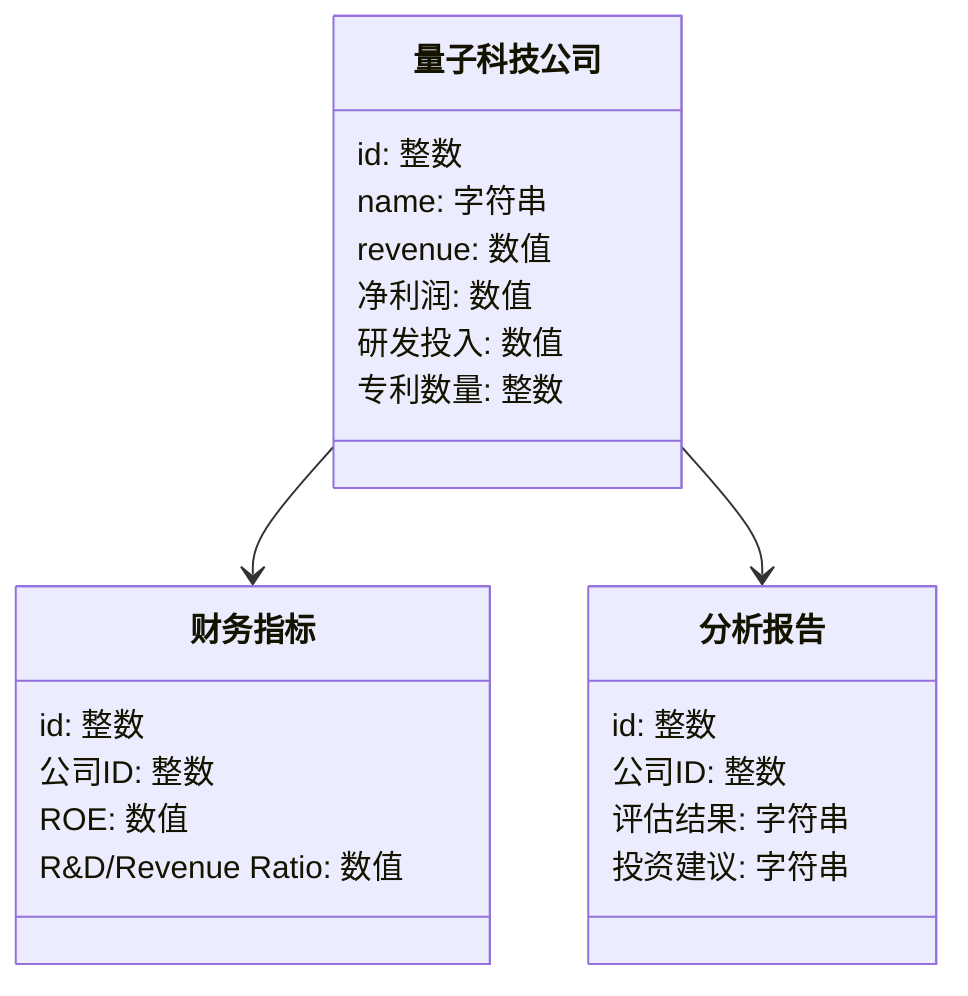
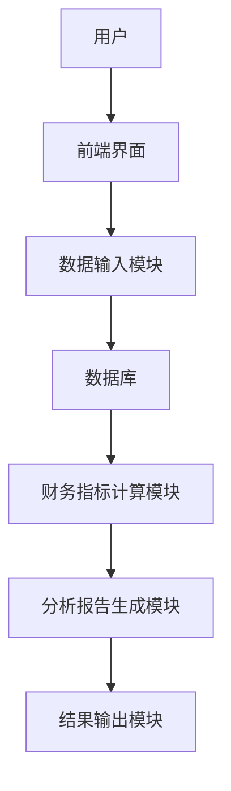

                 


# 巴菲特的财务报表分析：解读量子科技初创公司的新指标

**关键词：** 巴菲特，财务报表分析，量子科技，初创公司，新指标

**摘要：** 本文将探讨如何将巴菲特的价值投资理念与财务报表分析方法应用于量子科技初创公司，提出新的财务指标，帮助投资者更准确地评估这类公司的财务健康状况和投资潜力。

---

## 第一部分：巴菲特的财务报表分析基础

### 第1章：巴菲特的价值投资理念与财务报表分析

#### 1.1 巴菲特的价值投资概述

- **1.1.1 巴菲特的价值投资核心理念**  
  巴菲特的价值投资理念强调长期投资、安全边际和内在价值。他通过分析企业的财务报表，寻找那些具有持续竞争优势、良好治理结构和合理估值的企业。

- **1.1.2 财务报表分析在巴菲特投资中的重要性**  
  财务报表是巴菲特评估企业的重要工具，他关注企业的盈利能力、资产质量、资本结构和现金流情况。

- **1.1.3 价值投资与成长投资的对比**  
  价值投资注重低估值和安全边际，而成长投资注重高增长潜力。巴菲特的投资方法结合了两者，注重企业在合理估值下的可持续增长。

#### 1.2 财务报表分析的基本概念

- **1.2.1 财务报表的构成与作用**  
  财务报表包括资产负债表、利润表和现金流量表，分别反映企业的财务状况、经营成果和现金流情况。

- **1.2.2 主要财务指标的定义与计算公式**  
  - 净利润（Net Income）：企业一定会计期间的经营成果，计算公式为：$$ \text{净利润} = \text{营业收入} - \text{营业成本} - \text{税金及附加} - \text{期间费用} $$  
  - 资产负债率（Debt-to-Asset Ratio）：计算公式为：$$ \text{资产负债率} = \frac{\text{总负债}}{\text{总资产}} $$  
  - 净资产收益率（ROE）：计算公式为：$$ \text{ROE} = \frac{\text{净利润}}{\text{股东权益}} $$  

- **1.2.3 财务报表分析的常见方法**  
  包括横向比较、纵向比较、趋势分析和比率分析等方法。

### 第2章：量子科技行业的特点与挑战

#### 2.1 量子科技行业的基本特点

- **2.1.1 量子科技的定义与技术现状**  
  量子科技是基于量子力学原理的技术，包括量子计算、量子通信和量子传感等领域。目前仍处于发展初期，技术尚未完全成熟。

- **2.1.2 量子科技行业的商业模式**  
  量子科技公司通常以技术开发、服务提供和硬件销售为主要收入来源。由于技术门槛高，市场竞争相对较小。

- **2.1.3 量子科技行业的市场潜力**  
  量子科技在解决复杂问题方面具有巨大潜力，尤其是在计算、通信和传感领域。

#### 2.2 初创公司的财务特点

- **2.2.1 初创公司的财务报表特征**  
  初创公司通常资产规模小、负债较少、营业收入低，但研发投入较高。

- **2.2.2 初创公司财务风险的来源**  
  初创公司面临技术失败、市场需求不确定和资金链断裂等风险。

- **2.2.3 初创公司财务健康度的评估指标**  
  包括流动比率、速动比率、研发投入占营业收入比例等指标。

### 第3章：巴菲特分析方法的适应性

#### 3.1 巴菲特分析方法的普适性

- **3.1.1 巴菲特分析方法的核心要素**  
  包括盈利能力、资产质量、资本结构和现金流状况。

- **3.1.2 巴菲特分析方法的适用范围**  
  主要适用于传统行业，如制造业、消费品行业等。

- **3.1.3 巴菲特分析方法的局限性**  
  巴菲特的方法更适合稳定发展的企业，而对快速变化和技术驱动型行业可能不够适用。

#### 3.2 量子科技初创公司的特殊性

- **3.2.1 量子科技初创公司的财务特征**  
  投资高、回报周期长，研发投入占比较高。

- **3.2.2 量子科技初创公司的业务模式**  
  以技术开发和服务为主，收入来源不稳定。

- **3.2.3 量子科技初创公司的估值挑战**  
  由于技术不确定性和市场需求的不确定性，传统的估值方法难以适用。

---

## 第二部分：财务指标分析与量子科技初创公司

### 第4章：核心财务指标的分析与解读

#### 4.1 核心财务指标的定义与计算

- **4.1.1 净利润与利润结构**  
  净利润是企业盈利能力的核心指标，反映了企业的经营效率和成本控制能力。

- **4.1.2 营业收入与成本结构**  
  营业收入是企业主要的收入来源，成本结构影响企业的利润率。

- **4.1.3 股东权益与资本结构**  
  股东权益反映了企业的净资产价值，资本结构影响企业的财务风险。

#### 4.2 量子科技初创公司的特殊指标

- **4.2.1 研发投入与技术壁垒**  
  研发投入是量子科技公司核心竞争力的体现，技术壁垒决定了企业的竞争优势。

- **4.2.2 专利数量与技术优势**  
  专利数量反映了企业的技术储备和创新能力。

- **4.2.3 市场拓展与客户黏性**  
  市场拓展能力决定了企业的收入增长潜力，客户黏性反映了企业的市场地位。

### 第5章：财务指标的量化分析与对比

#### 5.1 量子科技初创公司与传统企业的对比

- **5.1.1 利润结构对比**  
  量子科技初创公司研发投入高，而传统企业研发投入相对较低。

- **5.1.2 资产结构对比**  
  量子科技初创公司资产轻量化，而传统企业资产较重。

- **5.1.3 财务风险对比**  
  量子科技初创公司财务风险较高，而传统企业财务风险相对较低。

#### 5.2 新指标的提出与应用

- **5.2.1 研发投入占营业收入比例（R&D/Revenue Ratio）**  
  计算公式为：$$ \text{R&D/Revenue Ratio} = \frac{\text{研发投入}}{\text{营业收入}} $$  
  该指标反映了企业在技术研发上的投入程度。

- **5.2.2 专利数量与企业规模的对比**  
  通过对比企业的专利数量与营业收入、员工数量等指标，评估企业的技术创新能力。

---

## 第三部分：系统分析与架构设计

### 第6章：系统功能设计与实现

#### 6.1 问题场景介绍

- **6.1.1 问题背景**  
  量子科技初创公司财务分析的复杂性要求一个高效的分析系统。

- **6.1.2 项目介绍**  
  开发一个基于巴菲特分析方法的量子科技初创公司财务分析系统。

#### 6.2 系统功能设计

- **6.2.1 领域模型设计**  
  使用Mermaid绘制领域模型类图，展示系统的核心实体和关系。



- **6.2.2 系统架构设计**  
  使用Mermaid绘制系统架构图，展示系统的模块划分和交互流程。



---

## 第四部分：项目实战与总结

### 第7章：项目实战

#### 7.1 环境安装与配置

- **7.1.1 安装Python与相关库**  
  安装Python 3.8以上版本，安装pandas、numpy、matplotlib等库。

#### 7.2 核心代码实现

- **7.2.1 数据处理代码**  
  读取财务数据并计算相关指标。

```python
import pandas as pd

# 读取数据
df = pd.read_csv('quantum_company.csv')

# 计算ROE
df['ROE'] = df['净利润'] / df['股东权益']

# 计算R&D/Revenue Ratio
df['R&D/Revenue Ratio'] = df['研发投入'] / df['营业收入']
```

- **7.2.2 可视化代码**  
  绘制财务指标对比图。

```python
import matplotlib.pyplot as plt

plt.figure(figsize=(10, 6))
plt.plot(df['公司名称'], df['ROE'], 'b-', label='ROE')
plt.plot(df['公司名称'], df['R&D/Revenue Ratio'], 'r-', label='R&D/Revenue Ratio')
plt.xlabel('公司名称')
plt.ylabel('指标值')
plt.title('量子科技初创公司财务指标对比')
plt.legend()
plt.show()
```

#### 7.3 项目总结

- **7.3.1 实验结果分析**  
  通过分析得出，量子科技初创公司的ROE普遍较低，但R&D/Revenue Ratio较高。

- **7.3.2 投资建议**  
  对于投资者来说，应关注那些具有高研发投入和良好市场前景的量子科技初创公司。

---

## 第五部分：最佳实践与拓展

### 第8章：最佳实践

#### 8.1 小结

- 巴菲特的财务报表分析方法可以应用于量子科技初创公司，但需要结合行业特点提出新的指标。

#### 8.2 注意事项

- 投资者应关注企业的技术研发能力、市场前景和财务健康状况。

#### 8.3 拓展阅读

- 建议阅读巴菲特的《聪明的投资者》和相关量子科技行业的研究报告。

---

## 作者信息

作者：AI天才研究院 & 禅与计算机程序设计艺术

---

**摘要：** 本文通过分析巴菲特的财务报表分析方法，提出适用于量子科技初创公司的新指标，帮助投资者更准确地评估这类公司的财务健康状况和投资潜力。

---

希望这篇文章能够为您提供有价值的信息和见解，如果您有任何问题或需要进一步探讨，请随时联系我。

