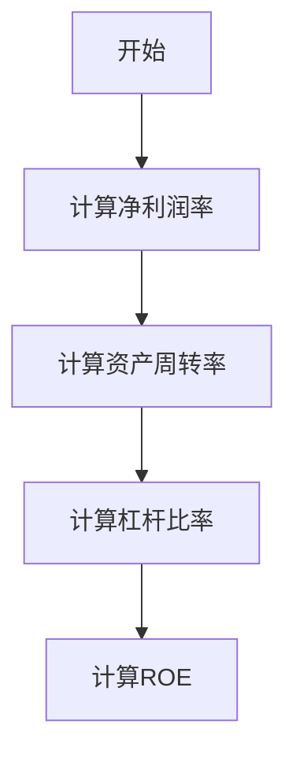
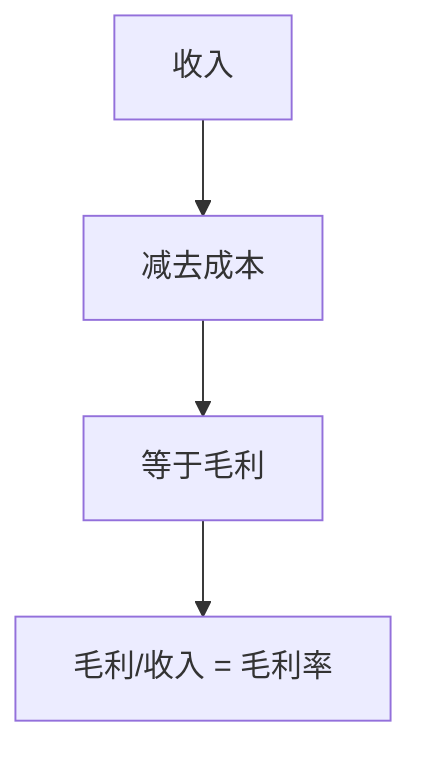
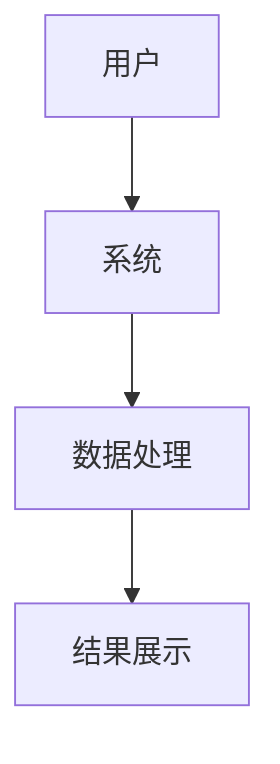

                 


# 巴菲特的财务报表深度解析：洞察公司真实价值

---

## 关键词：
- 巴菲特
- 财务报表分析
- 公司价值评估
- 股权投资
- 杜邦分析法

---

## 摘要：
本文通过深度解析巴菲特的财务报表分析方法，揭示其如何通过财务报表洞察公司的真实价值。文章从财务报表的核心概念、分析方法、数学模型、系统架构到实际案例，全面介绍巴菲特的投资哲学和分析技巧，帮助读者掌握财务报表分析的精髓，从而在股权投资中做出明智决策。

---

## 第一部分：财务报表分析概述

### 第1章：财务报表分析概述

#### 1.1 财务报表分析的背景与意义
财务报表是企业经营状况的晴雨表，是投资者评估公司价值的重要工具。巴菲特作为投资大师，深谙财务报表分析之道，他通过分析财务报表发现企业的内在价值，从而做出明智的投资决策。

##### 1.1.1 财务报表分析的定义与作用
财务报表分析是通过对企业的财务报表（如资产负债表、利润表、现金流量表）进行解读，评估企业的财务状况、经营成果和现金流量的过程。其作用在于帮助投资者发现企业的核心竞争力、财务健康状况和未来发展潜力。

##### 1.1.2 财务报表分析的核心要素
- **财务报表的完整性**：确保报表数据真实、准确、完整。
- **财务报表的可比性**：通过时间序列分析，比较不同期间的财务数据，发现趋势和变化。
- **财务报表的可理解性**：报表信息需清晰易懂，便于分析者理解企业的财务状况。

##### 1.1.3 财务报表分析的边界与外延
财务报表分析不仅仅是对数字的计算，更需要结合企业的行业背景、经营环境和管理特点。外延包括对企业未来发展的预测和对投资价值的评估。

#### 1.2 巴菲特的财务报表分析方法
巴菲特的财务报表分析方法以基本面分析为核心，注重企业的内在价值和长期盈利能力。

##### 1.2.1 巴菲特的 investing 模式
巴菲特的投资理念是“以合理的价格买入优秀的公司”。他注重企业的财务健康、管理层素质和行业地位。

##### 1.2.2 巴菲特的财务报表分析框架
巴菲特的分析框架包括以下几个步骤：
1. **分析企业的财务状况**：通过资产负债表评估企业的资产质量、负债结构和股东权益。
2. **分析企业的盈利能力**：通过利润表评估企业的收入来源、成本结构和利润质量。
3. **分析企业的现金流**：通过现金流量表评估企业的现金流健康状况和未来现金流的可持续性。

##### 1.2.3 巴菲特分析方法的适用场景
巴菲特的分析方法适用于长期股权投资，尤其适合分析那些具有持续竞争优势和稳定现金流的公司。

#### 1.3 本书的核心内容与目标
本书旨在通过巴菲特的财务报表分析方法，帮助读者掌握财务报表分析的精髓，从而在股权投资中做出明智决策。

##### 1.3.1 本书的核心目标
- 传授巴菲特的财务报表分析方法。
- 帮助读者理解财务报表的核心概念和分析技巧。
- 提供实际案例，展示如何通过财务报表分析发现投资机会。

##### 1.3.2 本书的分析框架
- **理论基础**：财务报表分析的基本概念和方法。
- **实战技巧**：巴菲特的分析框架和具体操作步骤。
- **案例分析**：通过具体案例，展示如何应用巴菲特的分析方法。

##### 1.3.3 本书的读者群体
- 投资爱好者
- 专业投资者
- 财务分析人员
- 对巴菲特投资理念感兴趣的读者

#### 1.4 本章小结
本章从财务报表分析的背景和意义出发，介绍了巴菲特的财务报表分析方法及其适用场景，为后续章节的学习奠定了基础。

---

## 第二部分：财务报表核心概念与联系

### 第2章：财务报表结构与核心要素

#### 2.1 资产负债表的核心要素
资产负债表反映了企业在某一特定时点的财务状况，包括资产、负债和所有者权益三个部分。

##### 2.1.1 资产的分类与特征
- **流动资产**：易于变现，如现金、应收账款、存货。
- **非流动资产**：不易变现，如固定资产、无形资产、长期投资。

##### 2.1.2 负债的分类与特征
- **流动负债**：短期负债，如应付账款、短期借款。
- **非流动负债**：长期负债，如长期借款、债券 payable。

##### 2.1.3 所有者权益的分类与特征
所有者权益包括股本、资本公积、盈余公积和未分配利润等。

#### 2.2 利润表的核心要素
利润表反映了企业在一定会计期间的经营成果，包括收入、成本和利润三个部分。

##### 2.2.1 收入的分类与特征
- **营业收入**：主营业务收入和其他业务收入。
- **其他收入**：如投资收益、利息收入。

##### 2.2.2 成本与费用的分类与特征
- **成本**：与收入直接相关的成本，如销售成本。
- **费用**：企业运营过程中发生的各项费用，如管理费用、销售费用。

##### 2.2.3 利润的计算与分析
利润 = 收入 - 成本 - 费用

#### 2.3 现金流量表的核心要素
现金流量表反映了企业在一定会计期间的现金流入和流出情况。

##### 2.3.1 经营活动现金流的分析
经营活动现金流包括销售商品、提供劳务所收到的现金，以及支付的现金。

##### 2.3.2 投资活动现金流的分析
投资活动现金流包括购买和出售长期资产、股权投资所收到或支付的现金。

##### 2.3.3 筹资活动现金流的分析
筹资活动现金流包括吸收投资、发行债券、偿还债务所收到或支付的现金。

#### 2.4 财务报表之间的勾稽关系
财务报表之间的勾稽关系是财务报表分析的重要内容，主要包括：

##### 2.4.1 资产负债表与利润表的关系
利润表中的净利润会影响资产负债表中的所有者权益。

##### 2.4.2 利润表与现金流量表的关系
利润表中的收入和成本会影响现金流量表中的经营活动现金流。

##### 2.4.3 财务报表整体的勾稽关系
通过财务报表之间的勾稽关系，可以验证财务报表数据的准确性。

#### 2.5 本章小结
本章详细介绍了财务报表的核心要素及其之间的关系，为后续的财务报表分析奠定了基础。

---

## 第三部分：财务报表分析的算法原理

### 第3章：财务报表分析的算法原理

#### 3.1 财务报表分析的核心算法
杜邦分析法是财务报表分析中最重要的方法之一，它通过分解净资产收益率（ROE）来评估企业的盈利能力。

##### 3.1.1 杜邦分析法
杜邦分析法将ROE分解为三个部分：
$$
ROE = \text{净利润率} \times \text{资产周转率} \times \text{杠杆比率}
$$

##### 3.1.2 帕斯卡模型
帕斯卡模型是一种基于概率的财务分析方法，常用于评估企业的风险和不确定性。

##### 3.1.3 其他相关算法
包括财务比率分析、趋势分析、情景分析等。

#### 3.2 杜邦分析法的详细讲解
杜邦分析法通过分解ROE，帮助分析者发现企业盈利能力的瓶颈。

##### 3.2.1 杜邦分析法的定义与原理
杜邦分析法由杜邦公司于1924年提出，主要用于评估企业的财务状况。

##### 3.2.2 杜邦分析法的公式推导
$$
ROE = \frac{\text{净利润}}{\text{净资产}} = \frac{\text{净利润}}{\text{收入}} \times \frac{\text{收入}}{\text{总资产}} \times \frac{\text{总资产}}{\text{净资产}}
$$

##### 3.2.3 杜邦分析法的步骤与流程
1. 计算净利润率：$\text{净利润率} = \frac{\text{净利润}}{\text{收入}}$
2. 计算资产周转率：$\text{资产周转率} = \frac{\text{收入}}{\text{总资产}}$
3. 计算杠杆比率：$\text{杠杆比率} = \frac{\text{总资产}}{\text{净资产}}$
4. 计算ROE：$\text{ROE} = \text{净利润率} \times \text{资产周转率} \times \text{杠杆比率}$

#### 3.3 算法原理的 mermaid 流程图


#### 3.4 本章小结
本章详细介绍了杜邦分析法及其应用，帮助读者理解财务报表分析的核心算法。

---

## 第四部分：财务报表分析的数学模型与公式

### 第4章：财务报表分析的数学模型

#### 4.1 财务比率分析的数学模型
财务比率分析是财务报表分析的重要方法，主要包括以下几类比率：

##### 4.1.1 股东权益比率
$$
\text{股东权益比率} = \frac{\text{股东权益}}{\text{总资产}}
$$

##### 4.1.2 负债比率
$$
\text{负债比率} = \frac{\text{负债}}{\text{总资产}}
$$

##### 4.1.3 资产周转率
$$
\text{资产周转率} = \frac{\text{收入}}{\text{平均总资产}}
$$

#### 4.2 利润分析的数学模型
利润分析主要关注企业的盈利能力，常用的指标包括：

##### 4.2.1 净利润公式
$$
\text{净利润} = \text{收入} - \text{成本} - \text{费用}
$$

##### 4.2.2 毛利率公式
$$
\text{毛利率} = \frac{\text{毛利}}{\text{收入}} = \frac{\text{收入} - \text{成本}}{\text{收入}}
$$

##### 4.2.3 净利率公式
$$
\text{净利率} = \frac{\text{净利润}}{\text{收入}}
$$

#### 4.3 现金流量分析的数学模型
现金流量分析关注企业的现金流健康状况，常用的指标包括：

##### 4.3.1 现金净流量公式
$$
\text{现金净流量} = \text{现金流入} - \text{现金流出}
$$

##### 4.3.2 现金周转率公式
$$
\text{现金周转率} = \frac{\text{收入}}{\text{平均应收账款}}
$$

##### 4.3.3 现金流量比率公式
$$
\text{现金流量比率} = \frac{\text{经营活动现金流净额}}{\text{流动负债}}
$$

#### 4.4 数学公式的 mermaid 图


#### 4.5 本章小结
本章详细介绍了财务比率分析、利润分析和现金流量分析的数学模型，帮助读者掌握财务报表分析的核心公式。

---

## 第五部分：财务报表分析的系统架构与设计

### 第5章：财务报表分析的系统架构与设计

#### 5.1 系统分析与架构设计
财务报表分析的系统架构设计包括以下几个步骤：

##### 5.1.1 问题场景介绍
假设我们需要设计一个财务报表分析系统，帮助投资者快速分析企业的财务状况。

##### 5.1.2 系统功能设计
系统功能包括：
1. 数据输入与处理
2. 财务比率计算
3. 杜邦分析
4. 现金流分析
5. 报表可视化

##### 5.1.3 系统架构设计
使用分层架构：
- **数据层**：数据存储和处理。
- **业务逻辑层**：财务比率计算和杜邦分析。
- **用户界面层**：报表可视化和结果展示。

##### 5.1.4 系统接口设计
系统接口包括：
- 数据输入接口
- 数据处理接口
- 结果展示接口

##### 5.1.5 系统交互 mermaid 序列图


#### 5.2 本章小结
本章详细介绍了财务报表分析系统的架构设计，包括功能设计、系统架构和接口设计。

---

## 第六部分：项目实战

### 第6章：项目实战

#### 6.1 环境安装
安装必要的工具和软件，如Python、Pandas、Matplotlib等。

#### 6.2 系统核心实现源代码
以下是杜邦分析法的Python实现代码：

```python
import pandas as pd

def dupont_analysis(financial_data):
    # 计算净利润率
    net_profit_margin = financial_data['净利润'] / financial_data['收入']
    # 计算资产周转率
    asset_turnover = financial_data['收入'] / financial_data['平均总资产']
    # 计算杠杆比率
    leverage = financial_data['平均总资产'] / financial_data['净资产']
    # 计算ROE
    roe = net_profit_margin * asset_turnover * leverage
    return roe

# 示例数据
data = {
    '收入': [100, 200, 300],
    '净利润': [10, 20, 30],
    '平均总资产': [50, 100, 150],
    '净资产': [20, 40, 60]
}

financial_data = pd.DataFrame(data)
roe = dupont_analysis(financial_data)
print("ROE:", roe)
```

#### 6.3 代码应用解读与分析
上述代码通过杜邦分析法计算企业的ROE，帮助投资者评估企业的盈利能力。

#### 6.4 实际案例分析
以苹果公司为例，分析其财务报表数据，计算其ROE。

#### 6.5 项目小结
本章通过实际案例展示了如何应用杜邦分析法进行财务报表分析。

---

## 第七部分：最佳实践与注意事项

### 第7章：最佳实践与注意事项

#### 7.1 最佳实践 tips
- **数据准确性**：确保财务数据的准确性和完整性。
- **行业特点**：结合企业的行业特点进行分析。
- **长期视角**：关注企业的长期发展，而不仅仅是短期表现。

#### 7.2 小结
通过本文的分析，读者可以掌握巴菲特的财务报表分析方法，并在实际投资中加以应用。

#### 7.3 注意事项
- **数据来源**：确保数据来源可靠。
- **分析方法**：根据具体情况选择合适的分析方法。
- **风险控制**：在投资过程中注意风险控制。

#### 7.4 拓展阅读
推荐阅读巴菲特的《聪明的投资者》和《证券分析》，深入理解财务报表分析的精髓。

---

## 作者信息

作者：AI天才研究院/AI Genius Institute & 禅与计算机程序设计艺术 /Zen And The Art of Computer Programming

