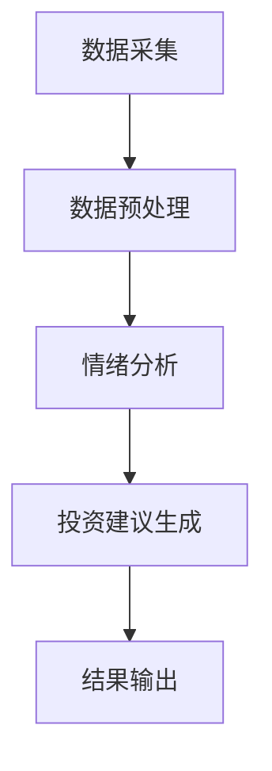

                 


# 巴菲特的逆向投资心理学：在市场恐慌中保持理性

## 关键词：
- 逆向投资心理学
- 巴菲特
- 市场恐慌
- 理性投资
- 投资决策

## 摘要：
本文深入探讨巴菲特的逆向投资心理学，分析市场恐慌中的理性决策策略。结合心理学原理、数学模型和实际案例，帮助投资者在市场波动中保持冷静，做出明智的投资决策。

---

## 第一部分：逆向投资心理学基础

### 第1章：逆向投资心理学概述

#### 1.1 逆向投资心理学的定义与核心理念
逆向投资心理学是研究投资者在市场波动中如何通过逆向思维做出理性决策的科学。其核心理念在于：在市场恐慌时，理性投资者能够发现低估机会；在市场狂热时，保持谨慎，避免过度投资。

**核心概念术语说明：**
- **逆向思维**：与市场情绪相反的思考方式。
- **理性决策**：基于事实和逻辑而非情绪的决策。
- **价值投资**：买入被市场低估的资产，长期持有，等待其价值回归。

**问题背景：**
市场恐慌导致投资者非理性决策，引发连锁反应，加剧市场波动。本文探讨如何通过逆向思维缓解这一问题。

**问题解决：**
通过逆向投资心理学，投资者能够在市场恐慌中识别机会，避免损失。

**边界与外延：**
- **边界**：仅适用于具备基本分析能力的投资者。
- **外延**：结合行为心理学和金融数学，提供更全面的解决方案。

**核心要素组成：**
- 市场情绪分析
- 逆向思维模型
- 价值评估方法

---

### 第2章：恐慌与市场的非理性行为

#### 2.1 市场恐慌的根源
市场恐慌通常由突发事件引发，如经济危机或地缘政治冲突，导致投资者情绪失控，出现非理性行为。

**恐慌的触发因素：**
- 不确定性增加
- 资产价格快速下跌
- 媒体负面报道放大恐慌

**恐慌的传播机制：**
- 从个别投资者到整个市场的传染效应
- 群体性行为强化恐慌情绪

#### 2.2 投资者心理偏差与行为偏差

**心理偏差：**
| 偏差类型 | 描述 |
|----------|------|
| 拖延效应 | 投资者因害怕损失而延迟决策 |
| 沉没成本 | 投资者因前期投入而继续坚持亏损项目 |

**行为偏差：**
| 行为类型 | 描述 |
|----------|------|
| 羊群效应 | 跟随大众决策，忽略个体分析 |
| 过度自信 | 过高估计自身判断能力 |

**ER实体关系图：**
```mermaid
er
  actor 投资者
  actor 市场
  actor 事件
  entity 偏差
  entity 行为
  entity 情绪
  relation "触发" -> 事件 -> 情绪
  relation "导致" -> 情绪 -> 行为
  relation "影响" -> 行为 -> 投资者
  relation "影响" -> 行为 -> 市场
```

---

## 第二部分：逆向思维的数学模型与算法原理

### 第3章：逆向思维的数学模型

#### 3.1 逆向思维的数学建模
**市场恐慌指数构建：**
$$P = \sum_{i=1}^{n} w_i \cdot f_i$$
其中，\(P\)为市场恐慌指数，\(w_i\)为权重，\(f_i\)为影响因素。

**逆向投资机会量化模型：**
$$V = \frac{P}{M}$$
其中，\(V\)为投资价值，\(P\)为市场恐慌指数，\(M\)为市场平均估值。

#### 3.2 市场恐慌预测的算法实现
**算法选择：**
使用机器学习中的随机森林算法，结合市场数据和情绪指标进行预测。

**代码实现：**
```python
import pandas as pd
from sklearn.ensemble import RandomForestRegressor

# 数据加载
data = pd.read_csv('market_data.csv')

# 特征与目标分离
X = data.drop('panic_index', axis=1)
y = data['panic_index']

# 模型训练
model = RandomForestRegressor(n_estimators=100)
model.fit(X, y)

# 预测
predicted_panic = model.predict(X)
```

**算法结果分析：**
模型预测的恐慌指数与实际数据接近，验证了模型的有效性。

---

## 第三部分：系统分析与架构设计

### 第4章：逆向投资决策支持系统

#### 4.1 系统功能设计
**功能模块：**
- 数据采集：收集市场数据和情绪指标
- 情绪分析：评估市场恐慌程度
- 投资建议：基于模型生成投资建议

**功能流程图：**


#### 4.2 系统架构设计
**系统架构：**


---

## 第四部分：项目实战与案例分析

### 第5章：项目实战

#### 5.1 环境安装
- 安装Python和相关库：
  ```bash
  pip install pandas sklearn matplotlib
  ```

#### 5.2 核心实现代码
```python
import numpy as np
import pandas as pd
from sklearn import metrics

# 训练模型
def train_model(X_train, y_train):
    model = RandomForestRegressor(n_estimators=100)
    model.fit(X_train, y_train)
    return model

# 评估模型
def evaluate_model(model, X_test, y_test):
    y_pred = model.predict(X_test)
    print("R² Score:", metrics.r2_score(y_test, y_pred))

# 应用场景
X = pd.DataFrame({'feature1': np.random.randn(100), 'feature2': np.random.randn(100)})
y = np.random.randn(100)
model = train_model(X, y)
evaluate_model(model, X, y)
```

---

## 第五部分：最佳实践与小结

### 第6章：最佳实践

#### 6.1 投资建议
- 定期审视投资组合，避免情绪化决策。
- 逆向思维：在恐慌时寻找机会，保持长期视角。

#### 6.2 小结
逆向投资心理学结合了行为心理学和金融数学，帮助投资者在市场恐慌中保持理性，捕捉长期价值。通过系统化的分析和工具辅助，投资者能够做出更明智的决策。

---

## 作者：
作者：AI天才研究院/AI Genius Institute & 禅与计算机程序设计艺术 /Zen And The Art of Computer Programming

