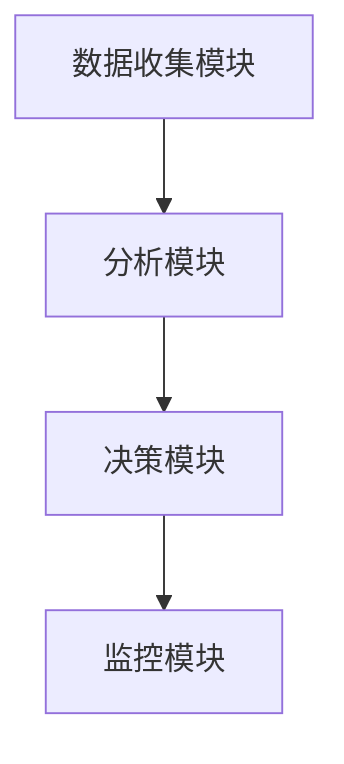

                 

# 巴菲特的逆向投资艺术：在社交媒体时代的执行挑战

---

## 关键词：
- 巴菲特, 逆向投资, 社交媒体, 投资策略, 市场波动, 信息过载

---

## 摘要：
本文探讨了巴菲特的逆向投资艺术在社交媒体时代的执行挑战。逆向投资作为一种有效的投资策略，依赖于市场参与者在恐慌时买入、在乐观时卖出的反向操作。然而，社交媒体的兴起带来了信息过载、情绪传染和虚假信息等问题，这些挑战使得逆向投资的执行变得更加复杂。本文通过分析社交媒体对投资决策的影响，探讨了逆向投资在信息爆炸环境下的应对策略，结合数学模型和系统架构，为投资者提供了在社交媒体时代成功执行逆向投资的实践指南。

---

## 第一部分：引言

### 第1章：逆向投资概述
#### 1.1 逆向投资的定义与核心理念
逆向投资是一种投资策略，强调在市场低迷时买入，在市场繁荣时卖出。其核心理念是利用市场的非理性波动，寻找被低估的投资机会，同时避免市场高峰期的过度风险。逆向投资的关键在于对市场情绪的反向操作，以及对长期价值的坚守。

#### 1.2 巴菲特的逆向投资哲学
巴菲特是逆向投资的代表人物，他强调价值投资，即购买那些具有持续竞争优势和良好治理结构的公司股票，并以合理的价格买入，长期持有。巴菲特的成功在于他对市场波动的忽视，专注于公司的内在价值，而非市场的短期波动。

#### 1.3 逆向投资的适用场景
逆向投资在市场恐慌、资产价格被低估时尤其有效。例如，在2008年金融危机期间，巴菲特大量买入银行股票，因为他认为这些股票的市场价格低于其内在价值。

---

### 第2章：社交媒体对投资决策的影响
#### 2.1 信息过载与投资者情绪
社交媒体的兴起使得信息传播速度空前加快，投资者可以即时获取市场动态和各种观点。然而，信息过载可能导致投资者决策疲劳，难以有效筛选和分析信息，从而影响判断。

#### 2.2 情绪传染与从众心理
社交媒体上的舆论往往具有传染性，投资者容易受到市场情绪的影响，从众心理可能导致非理性决策。例如，市场的乐观情绪可能被社交媒体放大，导致资产价格泡沫的形成。

#### 2.3 噪声信息与虚假新闻
社交媒体上的信息鱼龙混杂，虚假新闻和误导性内容可能引发市场的短期波动，投资者需要具备辨别信息真假的能力，避免被误导。

---

## 第二部分：逆向投资的核心要素

### 第3章：逆向投资的核心要素
#### 3.1 价值评估
逆向投资的关键在于准确评估公司的内在价值。巴菲特使用基本面分析，重点关注企业的盈利能力、财务状况和竞争优势。

#### 3.2 安全边际
安全边际是逆向投资中的重要概念，指以低于内在价值的价格买入资产，以降低市场波动带来的风险。安全边际的存在为投资者提供了保护，避免因市场价格波动而产生损失。

#### 3.3 时间周期
逆向投资通常需要较长的时间周期，因为资产价格的回归需要时间。投资者需要具备耐心，避免因短期波动而放弃长期投资目标。

---

### 第4章：逆向投资的数学模型
#### 4.1 市场估值模型
市场估值模型用于判断市场的整体估值是否被低估。例如，使用市盈率（P/E）和市净率（P/B）等指标，与历史平均水平进行比较。

$$ P/E = \frac{\text{股价}}{\text{每股收益}} $$

$$ P/B = \frac{\text{股价}}{\text{每股净资产}} $$

#### 4.2 安全边际计算
安全边际可以通过以下公式计算：

$$ \text{安全边际} = \text{内在价值} - \text{市场价格} $$

当市场价格低于内在价值时，安全边际为正，说明资产被低估。

#### 4.3 投资组合优化
投资组合优化是通过合理配置资产，降低投资组合的整体风险。可以使用均值-方差优化模型来实现。

$$ \text{风险} = \sqrt{\sum_{i=1}^{n} w_i^2 \sigma_i^2 + 2 \sum_{i < j} w_i w_j \sigma_i \sigma_j \rho_{ij}}} $$

其中，\( w_i \) 是资产i的权重，\( \sigma_i \) 是资产i的波动率，\( \rho_{ij} \) 是资产i和资产j的相关系数。

---

### 第5章：逆向投资的系统架构
#### 5.1 投资决策系统
投资决策系统包括数据收集、分析、决策和监控模块。

- **数据收集模块**：从社交媒体和其他金融数据源获取信息。
- **分析模块**：使用算法分析市场趋势和资产价值。
- **决策模块**：根据分析结果生成买卖信号。
- **监控模块**：实时跟踪投资组合的表现。

#### 5.2 系统架构图

#### 5.3 系统接口设计
系统接口设计包括数据接口和用户接口。数据接口用于连接外部数据源，用户接口用于展示分析结果和决策建议。

---

### 第6章：逆向投资的实战案例
#### 6.1 巴菲特的经典投资案例
在2008年金融危机期间，巴菲特大量买入高盛和摩根士丹利的股票。他认为这些银行的内在价值被市场低估，具备较大的安全边际。

#### 6.2 社交媒体时代的新案例
在2020年新冠疫情初期，社交媒体上的恐慌情绪导致市场下跌，许多优质资产的价格被低估，投资者可以利用这一机会进行逆向投资。

#### 6.3 失败案例分析
投资者在社交媒体上看到某公司的利好消息后迅速买入，但随后发现消息是虚假的，导致股价下跌。这说明投资者需要具备辨别信息真假的能力。

---

## 第三部分：逆向投资在社交媒体时代的执行策略

### 第7章：逆向投资的执行策略
#### 7.1 建立信息筛选机制
投资者需要建立有效的信息筛选机制，避免被情绪化和虚假信息影响。可以通过关注可靠的金融媒体和专家观点来提高信息筛选的准确性。

#### 7.2 保持理性和耐心
在社交媒体时代，投资者需要保持理性和耐心，避免被市场的短期波动所左右。逆向投资需要时间来验证，投资者需要坚持长期价值投资的理念。

#### 7.3 利用社交媒体进行研究
社交媒体可以作为研究工具，帮助投资者获取更多的信息和观点。例如，可以通过社交媒体关注公司的新闻、管理层动态和行业趋势。

---

### 第8章：逆向投资的最佳实践
#### 8.1 小结
逆向投资在社交媒体时代仍然具有其价值，但执行起来需要更加谨慎和科学。投资者需要结合传统的方法和现代的工具，才能在信息爆炸的时代中找到真正的投资机会。

#### 8.2 注意事项
- 避免情绪化决策
- 建立有效的信息筛选机制
- 保持长期投资的耐心

#### 8.3 拓展阅读
- 巴菲特的《投资之道》
- 彼得·林奇的《投资实战与思考》
- 纳西姆·尼古拉斯·塔勒布的《黑天鹅》

---

## 结语

逆向投资是一种有效的投资策略，但在社交媒体时代，执行起来需要面对更多的挑战。投资者需要结合传统的方法和现代的工具，利用数学模型和系统架构来提高决策的科学性。未来，随着技术的进步，逆向投资可能会更加依赖于数据驱动的决策，而不仅仅是依靠个人的直觉和经验。

---

## 作者：
**AI天才研究院/AI Genius Institute & 禅与计算机程序设计艺术 /Zen And The Art of Computer Programming**

