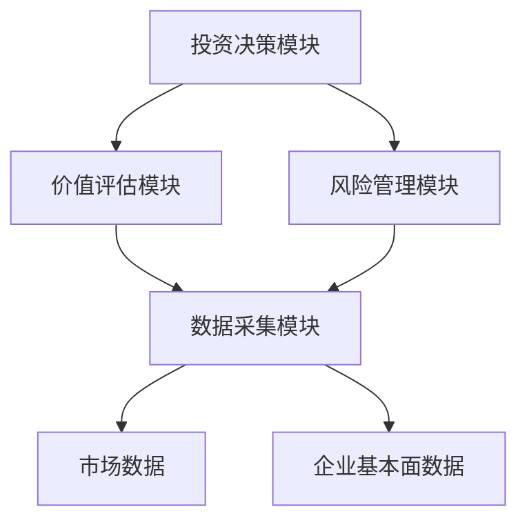

                 


# 巴菲特的长期主义在快速迭代的量子创业生态中的调整

## 关键词：巴菲特，长期主义，量子创业，投资策略，系统架构，风险管理，价值创造

## 摘要：本文探讨了巴菲特的长期主义投资理念在快速迭代的量子创业环境中的应用与调整。通过分析长期主义与量子创业生态的核心概念、算法原理、系统架构，结合实际案例，展示如何在高速变化的技术环境中实现长期价值创造。文章最后总结了最佳实践和未来趋势。

---

## # 引言

在当前快速迭代的技术环境下，量子创业生态的崛起为传统投资理念带来了新的挑战。巴菲特的长期主义强调稳健投资和长期价值，但在量子创业的快速变化中，这一理念需要进行相应的调整。本文将深入探讨长期主义在量子创业生态中的应用，分析其在技术驱动环境中的适应性。

---

## # 第一部分：背景介绍

### # 第1章：巴菲特的长期主义概述

#### ## 1.1 长期主义的定义与核心理念

- **1.1.1 长期主义的起源与发展**  
  长期主义起源于20世纪，巴菲特是其最著名的实践者。它强调投资的长期价值，而非短期收益。

- **1.1.2 巴菲特长期主义的核心原则**  
  巴菲特的投资策略基于内在价值评估、安全边际和长期持有。他选择具有持续竞争优势和良好管理的公司。

- **1.1.3 长期主义在投资中的应用**  
  通过长期持有优质资产，巴菲特实现了稳定的回报。他注重公司的基本面分析，而非市场的短期波动。

#### ## 1.2 量子创业生态的特点

- **1.2.1 量子创业的定义与特征**  
  量子创业是指利用量子技术进行创新的企业活动。其特点是快速迭代、技术驱动和高不确定性。

- **1.2.2 量子创业生态的构成要素**  
  包括量子技术、创新模式、网络效应和生态系统。量子创业依赖于技术突破和生态系统支持。

- **1.2.3 量子创业与传统创业的对比**  
  量子创业强调技术创新和快速迭代，而传统创业更注重市场和商业模式。

#### ## 1.3 长期主义与量子创业生态的结合

- **1.3.1 长期主义在快速迭代环境中的挑战**  
  快速变化的技术可能导致传统长期投资策略失效。

- **1.3.2 量子创业生态中的长期价值创造**  
  长期主义在量子创业中的应用需要关注技术的持续创新和生态系统的稳定性。

- **1.3.3 长期主义与量子创业生态的协同效应**  
  长期主义为量子创业提供稳健的资本支持，而量子创业为长期主义创造新的增长点。

---

## # 第二部分：核心概念与联系

### # 第2章：长期主义与量子创业生态的核心概念

#### ## 2.1 长期主义的核心要素

- **2.1.1 长期目标的设定**  
  长期目标应基于对技术和市场的深刻理解。

- **2.1.2 风险管理与价值评估**  
  通过分散投资和严格的风险评估，降低投资风险。

- **2.1.3 投资策略与决策逻辑**  
  长期投资策略强调选择具有持续竞争优势的企业。

#### ## 2.2 量子创业生态的核心要素

- **2.2.1 量子技术的驱动作用**  
  量子计算和量子通信等技术推动创新。

- **2.2.2 快速迭代与创新模式**  
  量子创业强调快速试错和持续创新。

- **2.2.3 创业生态的网络效应**  
  生态系统的协同效应加速技术的商业化。

#### ## 2.3 长期主义与量子创业生态的联系

- **2.3.1 长期主义对量子创业生态的影响**  
  长期资本支持和技术研发推动量子创业的发展。

- **2.3.2 量子创业生态对长期主义的挑战**  
  技术快速变化可能导致投资策略失效。

- **2.3.3 两者的协同优化路径**  
  通过动态调整投资策略和加强风险管理，实现长期价值。

---

## # 第三部分：算法原理讲解

### # 第3章：巴菲特投资策略的数学模型

#### ## 3.1 价值评估模型

- **3.1.1 价值评估公式：$$价值 = 资产 + 收益 - 成本$$**
  - 该公式用于评估企业的内在价值，帮助投资者做出决策。

- **3.1.2 模型的适用场景与限制**  
  适用于成熟企业，不适用于高波动的技术型公司。

#### ## 3.2 投资决策的优化算法

- **3.2.1 算法流程：$$
\text{输入：企业基本面数据} \\
\text{输出：投资建议} \\
\text{步骤：} \\
1. \text{计算内在价值} \\
2. \text{比较市场价格与内在价值} \\
3. \text{决定是否投资}
$$**

- **3.2.2 代码实现示例**

```python
def value_investment(fundamentals):
    assets = fundamentals['assets']
    earnings = fundamentals['earnings']
    costs = fundamentals['costs']
    market_price = fundamentals['market_price']
    intrinsic_value = assets + earnings - costs
    if intrinsic_value > market_price:
        return "买入"
    else:
        return "观望"

# 示例使用
fundamentals = {
    'assets': 1000000,
    'earnings': 200000,
    'costs': 150000,
    'market_price': 1200000
}
print(value_investment(fundamentals))  # 输出：观望
```

---

## # 第四部分：系统分析与架构设计

### # 第4章：量子创业生态系统中的长期主义架构

#### ## 4.1 问题场景介绍

- **系统目标：** 在量子创业环境中实现长期投资策略。
- **主要挑战：** 快速变化的技术和市场波动。

#### ## 4.2 系统功能设计

- **功能模块：**
  - 数据采集模块：收集企业基本面数据和市场数据。
  - 价值评估模块：计算内在价值。
  - 投资决策模块：基于模型做出投资建议。
  - 风险管理模块：监控投资风险。

#### ## 4.3 系统架构设计



#### ## 4.4 系统交互设计

```mermaid
sequenceDiagram
    actor 投资者
    participant 系统：投资决策模块
    participant 模块：价值评估模块
    participant 模块：风险管理模块
    投资者 -> 系统：请求投资建议
    系统 -> 模块：评估企业价值
    模块 -> 系统：返回价值评估结果
    系统 -> 模块：评估风险
    模块 -> 系统：返回风险评估结果
    系统 -> 投资者：投资建议
```

---

## # 第五部分：项目实战

### # 第5章：量子创业中的长期主义策略实现

#### ## 5.1 环境安装

- **工具安装：**
  - Python 3.8+
  - Jupyter Notebook
  - pandas, numpy库

#### ## 5.2 核心代码实现

```python
import pandas as pd
import numpy as np

def calculate_intrinsic_value(fundamentals):
    return fundamentals['assets'] + fundamentals['earnings'] - fundamentals['costs']

def investment_decision(fundamentals, market_price):
    iv = calculate_intrinsic_value(fundamentals)
    if iv > market_price:
        return "买入"
    elif iv == market_price:
        return "观望"
    else:
        return "卖出"

# 示例数据
data = pd.DataFrame({
    'assets': [1000000],
    'earnings': [200000],
    'costs': [150000],
    'market_price': [1200000]
})

# 应用策略
decision = investment_decision(data.iloc[0].to_dict(), data['market_price'][0])
print(f"投资决策：{decision}")
```

#### ## 5.3 案例分析与解读

- **案例背景：** 某量子计算初创公司，基本面数据良好，但市场波动较大。
- **策略应用：** 通过模型计算内在价值，做出投资决策。

---

## # 第六部分：总结与展望

### # 第6章：长期主义在量子创业中的未来展望

#### ## 6.1 最佳实践 tips

- **动态调整策略：** 定期评估投资组合，适应技术变化。
- **风险管理：** 使用多元化投资降低风险。
- **持续学习：** 关注行业趋势和技术发展。

#### ## 6.2 项目小结

- 本文探讨了长期主义在量子创业环境中的应用，展示了如何通过数学模型和系统设计实现稳健投资。

#### ## 6.3 未来展望

- 随着量子技术的发展，长期主义将在更多领域发挥重要作用。

---

## # 结语

巴菲特的长期主义理念在量子创业生态中依然具有重要价值，但需要根据环境的变化进行调整。通过系统的分析和实践，投资者可以在快速变化的环境中实现长期价值创造。

---

## # 作者：AI天才研究院 & 禅与计算机程序设计艺术

---

通过以上结构，我们可以系统地探讨巴菲特的长期主义在量子创业环境中的应用，从理论到实践，为读者提供深入的见解和实际指导。

