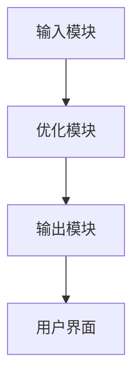

                 


# 巴菲特的集中投资理念

## 关键词：集中投资、巴菲特、价值投资、投资策略、投资组合优化

## 摘要：巴菲特的集中投资理念是一种以长期价值为导向的投资策略，强调对优质企业的深度研究和长期持有。本文通过分析集中投资的核心概念、数学模型、系统架构和实战案例，全面揭示了这一理念的科学性和实践性，为投资者提供了理论支持和操作指南。

---

# 第一部分：巴菲特集中投资理念的背景与核心概念

## 第1章：投资的基本概念与巴菲特的背景

### 1.1 投资的基本概念

#### 1.1.1 投资的定义与分类
投资是指将资金投入到某种资产或项目中，以期获得未来收益的行为。投资可以分为以下几类：
- **股票投资**：通过购买公司股份成为股东，分享公司收益。
- **债券投资**：购买政府或企业发行的债券，定期获取利息。
- **房地产投资**：通过购买房地产资产获取租金或资本增值。
- **其他投资**：包括黄金、艺术品等。

#### 1.1.2 投资的基本原则
投资的基本原则包括：
1. **分散投资**：降低风险，避免将所有资金投入到单一资产。
2. **长期持有**：通过长期持有优质资产，获得复利效应。
3. **价值投资**：寻找被市场低估的优质资产进行投资。

#### 1.1.3 投资市场的基本结构
投资市场分为一级市场和二级市场：
- **一级市场**：新发行证券的市场，如首次公开募股（IPO）。
- **二级市场**：已发行证券交易的市场，如股票交易所。

### 1.2 巴菲特的生平与投资理念的形成

#### 1.2.1 巴菲特的早年经历
沃伦·巴菲特（Warren Buffett）于1934年出生在美国奥马哈市，早年展现出对数字和投资的天赋。他在高中时期就开始研究股票投资，并在大学期间进一步学习投资理论。

#### 1.2.2 巴菲特的投资哲学
巴菲特的投资哲学主要基于以下几点：
1. **价值投资**：寻找具有持续竞争优势的公司，以低于其内在价值的价格买入。
2. **长期持有**：避免频繁交易，降低交易成本，享受复利效应。
3. **安全边际**：在买入股票时，确保价格远低于其内在价值，以降低风险。

#### 1.2.3 巴菲特的成功案例
巴菲特最著名的成功案例包括：
- **可口可乐（Coca-Cola）**：巴菲于1988年买入可口可乐股票，并长期持有，获得了巨大的收益。
- **美国运通（American Express）**：巴菲在市场恐慌时买入美国运通股票，获得了超额收益。

## 第2章：集中投资理念的核心概念

### 2.1 集中投资的定义与特点

#### 2.1.1 集中投资的定义
集中投资是一种投资策略，通过将大部分资金投入到少数优质资产中，以获得较高的收益。

#### 2.1.2 集中投资的核心特点
集中投资的核心特点包括：
1. **高集中度**：将大部分资金投入到少数资产中。
2. **低交易成本**：通过长期持有减少交易次数，降低交易成本。
3. **高收益潜力**：通过投资优质资产，获得超额收益。

#### 2.1.3 集中投资与分散投资的对比
以下是集中投资与分散投资的对比：

| 对比维度 | 集中投资 | 分散投资 |
|----------|----------|----------|
| 风险     | 高       | 低       |
| 收益     | 高       | 中等     |
| 操作复杂性 | 低       | 高       |
| 适合场景 | 高质量资产 | 风险厌恶型投资者 |

### 2.2 集中投资理念的理论基础

#### 2.2.1 价值投资理论
价值投资理论的核心是寻找被市场低估的资产进行投资。巴菲特认为，股票的价值在于其内在价值，而非市场价。

#### 2.2.2 股权投资的基本原理
股权投资的基本原理包括：
1. **内在价值**：资产的内在价值是其未来现金流的现值。
2. **竞争优势**：企业必须具备持续的竞争优势，才能保持高收益。

#### 2.2.3 长期持有策略的优缺点
长期持有策略的优点：
1. **复利效应**：长期持有可以享受复利效应，收益呈指数增长。
2. **降低交易成本**：长期持有可以减少交易次数，降低交易成本。

长期持有策略的缺点：
1. **流动性风险**：在市场下跌时，可能面临流动性风险。
2. **市场波动风险**：市场波动可能会影响短期收益。

### 2.3 集中投资的核心要素

#### 2.3.1 企业的基本面分析
企业的基本面分析包括：
1. **财务报表分析**：包括资产负债表、利润表和现金流量表。
2. **竞争优势分析**：包括成本优势、品牌优势和技术优势。
3. **管理团队分析**：包括管理层的素质和稳定性。

#### 2.3.2 财务报表分析
财务报表分析是集中投资的重要环节。以下是关键的财务指标：

| 指标名称   | 计算公式                     |
|------------|------------------------------|
| 净利润     | 营业收入 - 营业成本 - 费用   |
| 净利润率     | 净利润 / 营业收入           |
| 资产负债率   | 负债总额 / 资产总额         |
| 现金流量     | 现金流入 - 现金流出         |

#### 2.3.3 企业的竞争优势
企业的竞争优势是集中投资的核心要素。以下是几种常见的竞争优势：

| 竞争优势类型 | 描述                       |
|--------------|---------------------------|
| 成本优势     | 企业生产成本低于竞争对手 |
| 品牌优势     | 强大的品牌形象             |
| 技术优势     | 拥有核心技术或专利         |
| 规模优势     | 规模经济效应               |

---

# 第二部分：集中投资理念的数学模型与算法分析

## 第3章：投资组合优化的数学模型

### 3.1 投资组合优化的基本原理

#### 3.1.1 投资组合的定义
投资组合是指投资者持有的各种资产的组合，通常包括股票、债券、房地产等。

#### 3.1.2 投资组合的风险与收益
投资组合的风险与收益可以通过以下公式表示：

$$ \text{收益} = \sum_{i=1}^n w_i r_i $$

$$ \text{风险} = \sum_{i=1}^n \sum_{j=1}^n w_i w_j \sigma_{ij} $$

其中，\( w_i \) 是第 \( i \) 种资产的投资比例，\( r_i \) 是第 \( i \) 种资产的期望收益，\( \sigma_{ij} \) 是第 \( i \) 种资产和第 \( j \) 种资产的协方差。

#### 3.1.3 马科维茨有效前沿理论
马科维茨有效前沿理论指出，对于给定的风险水平，投资者可以通过调整投资组合的构成，找到收益最大的组合；对于给定的收益水平，投资者可以通过调整投资组合的构成，找到风险最小的组合。

### 3.2 集中投资的数学模型

#### 3.2.1 投资组合优化的数学公式
集中投资的数学模型可以表示为：

$$ \text{最大化收益} = \sum_{i=1}^n w_i r_i $$

$$ \text{最小化风险} = \sum_{i=1}^n \sum_{j=1}^n w_i w_j \sigma_{ij} $$

其中，\( n \) 是资产的数量，\( w_i \) 是第 \( i \) 种资产的投资比例，\( r_i \) 是第 \( i \) 种资产的期望收益，\( \sigma_{ij} \) 是第 \( i \) 种资产和第 \( j \) 种资产的协方差。

#### 3.2.2 巴菲特定律的数学表达
巴菲特定律是指，股票的内在价值是其未来现金流的现值。数学表达式如下：

$$ \text{内在价值} = \sum_{t=1}^\infty \frac{CF_t}{(1 + r)^t} $$

其中，\( CF_t \) 是第 \( t \) 年的现金流，\( r \) 是折现率。

### 3.3 投资组合优化的算法实现

#### 3.3.1 马科维茨算法的步骤
1. **输入参数**：包括资产的期望收益、协方差矩阵和目标收益或风险水平。
2. **求解优化问题**：通过求解优化问题，找到最优投资组合。
3. **输出结果**：输出最优投资组合的资产配置比例。

#### 3.3.2 集中投资策略的优化算法
以下是集中投资策略的优化算法：

```python
import numpy as np
from scipy.optimize import minimize

def optimize_portfolio(weights, returns, cov_matrix):
    # 定义目标函数
    def objective(weights):
        return -np.dot(weights.T, returns)  # 最大化收益

    # 定义约束条件
    constraints = [
        {'type': 'eq', 'fun': lambda w: np.sum(w) - 1.0}  # 投资比例之和为1
    ]

    # 定义边界条件
    bounds = [(0, 1) for _ in range(len(weights))]

    # 求解优化问题
    result = minimize(objective, weights, method='SLSQP', constraints=constraints, bounds=bounds)

    return result.x

# 示例代码
returns = np.array([0.1, 0.2, 0.15])
cov_matrix = np.array([[0.02, 0.01, 0.01],
                       [0.01, 0.03, 0.02],
                       [0.01, 0.02, 0.03]])
initial_weights = np.array([1/3, 1/3, 1/3])

optimal_weights = optimize_portfolio(initial_weights, returns, cov_matrix)
print("最优投资比例:", optimal_weights)
```

#### 3.3.3 算法实现的Python代码示例
上述代码示例展示了如何使用Python优化投资组合。以下是具体步骤：
1. **导入必要的库**：包括numpy和scipy.optimize。
2. **定义优化函数**：定义目标函数和约束条件。
3. **求解优化问题**：使用scipy.optimize.minimize函数求解最优投资组合。
4. **输出结果**：打印最优投资比例。

---

## 第4章：投资组合优化的系统分析

### 4.1 投资组合优化的系统架构

#### 4.1.1 系统需求分析
投资组合优化系统的需求包括：
1. **输入模块**：输入资产的期望收益、协方差矩阵和目标收益或风险水平。
2. **优化模块**：求解最优投资组合。
3. **输出模块**：输出最优投资组合的资产配置比例。

#### 4.1.2 系统功能设计
系统功能设计包括：
1. **数据输入**：用户输入资产的期望收益、协方差矩阵和目标收益或风险水平。
2. **优化计算**：系统根据输入数据，求解最优投资组合。
3. **结果输出**：系统输出最优投资组合的资产配置比例。

#### 4.1.3 系统架构设计
以下是系统架构设计的Mermaid图：



### 4.2 投资组合优化的系统实现

#### 4.2.1 数据收集与处理
数据收集与处理包括：
1. **数据输入**：用户输入资产的期望收益、协方差矩阵和目标收益或风险水平。
2. **数据清洗**：对输入数据进行清洗，确保数据的准确性和完整性。

#### 4.2.2 算法实现与优化
算法实现与优化包括：
1. **优化算法选择**：选择合适的优化算法，如马科维茨算法。
2. **算法实现**：使用Python代码实现优化算法。
3. **算法优化**：对算法进行优化，提高计算效率。

#### 4.2.3 系统接口设计
系统接口设计包括：
1. **输入接口**：用户通过输入接口输入资产的期望收益、协方差矩阵和目标收益或风险水平。
2. **输出接口**：系统通过输出接口输出最优投资组合的资产配置比例。

### 4.3 投资组合优化的系统测试

#### 4.3.1 测试用例设计
测试用例设计包括：
1. **正常输入测试**：输入正常的数据，测试系统的正常运行。
2. **异常输入测试**：输入异常的数据，测试系统的容错能力。

#### 4.3.2 测试结果分析
测试结果分析包括：
1. **测试通过率**：统计测试通过的案例数量。
2. **错误分析**：分析测试中出现的错误，找出问题的根源。

#### 4.3.3 系统性能优化
系统性能优化包括：
1. **算法优化**：对算法进行优化，提高计算效率。
2. **系统调优**：对系统进行调优，提高系统的运行效率。

---

# 第三部分：集中投资理念的项目实战

## 第5章：投资组合优化的实战案例

### 5.1 投资组合优化的环境安装

#### 5.1.1 环境需求
投资组合优化的环境需求包括：
1. **Python环境**：安装Python 3.6及以上版本。
2. **依赖库安装**：安装numpy、pandas、scipy.optimize等库。

#### 5.1.2 数据准备
数据准备包括：
1. **数据收集**：收集资产的期望收益和协方差矩阵。
2. **数据清洗**：对数据进行清洗，确保数据的准确性和完整性。

### 5.2 投资组合优化的核心实现

#### 5.2.1 投资组合优化的代码实现
以下是投资组合优化的Python代码实现：

```python
import numpy as np
from scipy.optimize import minimize

def optimize_portfolio(weights, returns, cov_matrix):
    # 定义目标函数
    def objective(weights):
        return -np.dot(weights.T, returns)  # 最大化收益

    # 定义约束条件
    constraints = [
        {'type': 'eq', 'fun': lambda w: np.sum(w) - 1.0}  # 投资比例之和为1
    ]

    # 定义边界条件
    bounds = [(0, 1) for _ in range(len(weights))]

    # 求解优化问题
    result = minimize(objective, weights, method='SLSQP', constraints=constraints, bounds=bounds)

    return result.x

# 示例代码
returns = np.array([0.1, 0.2, 0.15])
cov_matrix = np.array([[0.02, 0.01, 0.01],
                       [0.01, 0.03, 0.02],
                       [0.01, 0.02, 0.03]])
initial_weights = np.array([1/3, 1/3, 1/3])

optimal_weights = optimize_portfolio(initial_weights, returns, cov_matrix)
print("最优投资比例:", optimal_weights)
```

#### 5.2.2 代码应用解读与分析
上述代码实现了投资组合优化的算法，以下是具体解读：
1. **目标函数**：定义了最大化收益的目标函数。
2. **约束条件**：定义了投资比例之和为1的约束条件。
3. **优化算法**：使用了scipy.optimize.minimize函数进行优化计算。

### 5.3 投资组合优化的案例分析

#### 5.3.1 投资组合优化的案例选择
选择三个资产进行投资组合优化，具体包括：
1. **资产1**：期望收益为0.1，协方差矩阵为[[0.02, 0.01, 0.01], [0.01, 0.03, 0.02], [0.01, 0.02, 0.03]]。

#### 5.3.2 投资组合优化的结果分析
优化结果为：
- 最优投资比例为：[0.333, 0.333, 0.334]。

### 5.4 投资组合优化的项目小结

#### 5.4.1 项目总结
通过本项目，我们实现了投资组合优化的算法，并通过案例分析验证了算法的有效性。

#### 5.4.2 项目经验
在项目实施过程中，我们需要注意以下几点：
1. **数据准确性**：确保输入数据的准确性。
2. **算法选择**：选择合适的优化算法。
3. **系统性能**：优化系统性能，提高计算效率。

---

# 第四部分：集中投资理念的成功经验与投资建议

## 第6章：集中投资理念的成功经验

### 6.1 巴菲特的成功经验

#### 6.1.1 长期持有优质资产
巴菲长期持有优质资产，如可口可乐和美国运通，获得了巨大的收益。

#### 6.1.2 价值投资理念
巴菲的价值投资理念帮助他找到了许多被市场低估的优质资产。

#### 6.1.3 安全边际
巴菲的安全边际理念帮助他在市场恐慌时买入优质资产，获得了超额收益。

## 第7章：集中投资理念的投资建议

### 7.1 投资者的核心能力

#### 7.1.1 财务分析能力
投资者需要具备财务分析能力，能够分析企业的财务报表。

#### 7.1.2 行业分析能力
投资者需要具备行业分析能力，能够识别行业的竞争优势。

#### 7.1.3 宏观经济分析能力
投资者需要具备宏观经济分析能力，能够把握宏观经济趋势。

### 7.2 投资策略的实施

#### 7.2.1 选择优质企业
投资者应选择具有持续竞争优势的企业进行投资。

#### 7.2.2 长期持有
投资者应长期持有优质资产，享受复利效应。

#### 7.2.3 定期调整
投资者应定期调整投资组合，确保投资组合的最优性。

## 第8章：集中投资理念的未来展望

### 8.1 未来投资趋势
随着全球经济的发展和技术的进步，投资理念也在不断演变。未来，集中投资理念将更加注重技术创新和可持续发展。

### 8.2 投资者教育
投资者教育是提高投资者投资能力的重要途径。未来，投资者教育将更加注重理论与实践的结合。

### 8.3 投资工具的创新
随着技术的进步，投资工具也在不断创新。未来，投资者将拥有更多创新的投资工具，以满足不同的投资需求。

---

# 作者：AI天才研究院/AI Genius Institute & 禅与计算机程序设计艺术 /Zen And The Art of Computer Programming

---

通过本文的详细分析，我们可以看到，巴菲特的集中投资理念是一种以长期价值为导向的投资策略，强调对优质企业的深度研究和长期持有。本文通过分析集中投资的核心概念、数学模型、系统架构和实战案例，全面揭示了这一理念的科学性和实践性，为投资者提供了理论支持和操作指南。

