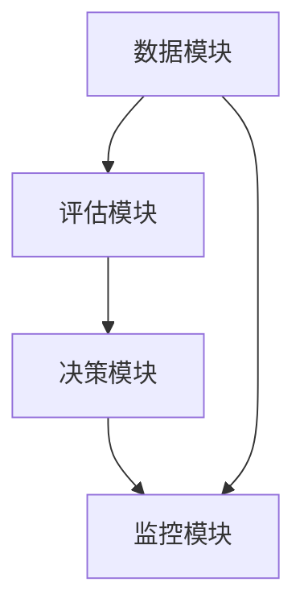
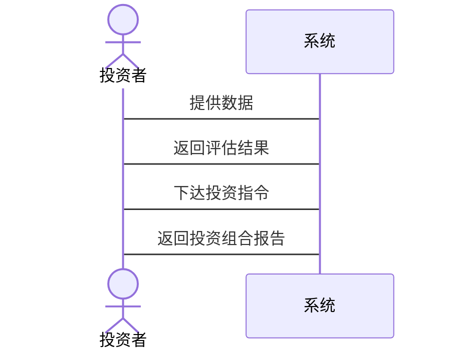

                 

# 巴菲特的集中投资策略：高确信度机会的重要性

> 关键词：巴菲特，集中投资策略，高确信度机会，价值投资，投资组合优化

> 摘要：本文深入探讨了巴菲特的集中投资策略，分析了高确信度机会在投资中的重要性。通过数学模型、系统架构和实际案例的分析，详细阐述了如何识别和利用高确信度机会，构建最优投资组合。文章还讨论了集中投资的风险管理、心理因素和长期视角，提供了实际的应用建议和最佳实践。

---

## 第1章 巴菲特投资理念的背景与核心思想

### 1.1 巴菲特的投资哲学

#### 1.1.1 价值投资的起源与演变

价值投资是一种以基本面分析为基础的投资策略，起源于20世纪初。本杰明·格雷厄姆是这一理论的鼻祖，他强调以低于内在价值的价格买入优质资产。巴菲特早期的投资理念深受格雷厄姆影响，但他后来发展了自己的方法，加入了对管理层质量、竞争优势和长期价值的关注。

**背景介绍：**
- 价值投资的核心在于寻找市场低估的股票，通过长期持有实现收益。
- 巴菲特将价值投资与成长投资结合，形成了独特的策略。

#### 1.1.2 巴菲特的投资理念与个人经历

巴菲特的投资理念深受其个人经历影响。他从早期的合伙人制度开始，逐步发展出集中投资的策略。他强调“以合理的价格买入优秀的公司”，而非“以便宜的价格买入平庸的公司”。

**核心概念：**
- **优秀公司**：具有强大的竞争优势、稳固的管理层和持续的盈利能力。
- **合理价格**：低于内在价值的价格。

#### 1.1.3 价值投资的核心原则

价值投资的核心原则包括：
1. **安全边际**：买入价格低于内在价值，以降低风险。
2. **长期视角**：关注企业的长期盈利能力，而非短期波动。
3. **集中投资**：将大部分资金投入到少数高确信度的机会中。

---

### 1.2 集中投资策略的背景

#### 1.2.1 传统投资策略的局限性

传统投资策略通常分散投资以降低风险，但这种方法可能导致收益被稀释。巴菲特认为，通过集中投资于少数高质企业，可以获得更高的收益。

**背景介绍：**
- 分散投资的收益上限：收益受制于市场平均回报。
- 集中投资的优势：通过投资少数优秀企业，获得超越市场的回报。

#### 1.2.2 巴菲特集中投资的逻辑

集中投资的核心逻辑是通过深入研究，找到那些具有强大竞争优势、管理层优秀且估值合理的公司。通过集中投资，投资者可以最大限度地利用这些公司的长期增长潜力。

**核心概念：**
- **竞争优势**：企业在市场中独有的优势，如成本优势、品牌优势等。
- **管理层质量**：管理层的诚信、能力和决策能力直接影响企业的长期发展。

#### 1.2.3 集中投资与风险控制的平衡

集中投资虽然风险较高，但通过选择高确信度的机会，可以有效降低风险。巴菲特强调，集中投资需要严格的风险管理，避免过度集中在单一行业或企业。

**数学模型：**
- 风险调整后的收益模型：$$ \text{风险调整收益} = \text{预期收益} - \text{风险权重} \times \text{标准差} $$

---

## 第2章 集中投资策略的核心概念

### 2.1 集中投资的核心要素

#### 2.1.1 投资标的的选择标准

巴菲特选择投资标的时，重点关注以下几个方面：
1. **护城河**：企业是否具有难以被竞争对手复制的竞争优势。
2. **管理层**：管理层是否诚信、有能力且以股东利益为导向。
3. **财务状况**：企业是否有健康的财务状况，包括低债务和稳定的现金流。

**核心概念：**
- **护城河**：企业竞争优势的体现，如品牌、技术、成本优势等。
- **财务健康**：健康的财务状况是企业长期发展的基础。

#### 2.1.2 投资标的的内在价值评估

内在价值是企业未来现金流的现值。巴菲特通过DCF模型（ discounted cash flow model）评估企业的内在价值。

**数学模型：**
- 现金流折现模型：$$ \text{内在价值} = \sum_{t=1}^{n} \frac{CF_t}{(1 + r)^t} $$

其中，\( CF_t \) 是第 \( t \) 年的现金流，\( r \) 是折现率。

#### 2.1.3 投资标的的市场地位与竞争优势

企业市场地位和竞争优势决定了其在行业中的地位。巴菲特倾向于投资那些具有行业领导地位的企业。

**核心概念：**
- **市场地位**：企业在市场中的影响力，包括市场份额、品牌认知度等。
- **竞争优势**：企业相对于竞争对手的独特优势，如成本优势、技术创新等。

---

### 2.2 高确信度机会的识别与筛选

#### 2.2.1 企业基本面分析

基本面分析是评估企业内在价值的核心方法，包括盈利能力、财务状况和成长能力。

**核心指标：**
- **盈利能力**：ROE（净资产收益率）、净利润率。
- **财务状况**：资产负债率、流动比率。
- **成长能力**：收入增长率、净利润增长率。

#### 2.2.2 企业竞争优势分析

竞争优势分析包括企业是否具有护城河，如专利、品牌、成本优势等。

**核心概念：**
- **护城河**：企业的竞争优势，防止竞争对手侵蚀市场份额。
- **可持续性**：竞争优势是否能够在长期内持续存在。

#### 2.2.3 管理层质量评估

管理层的质量直接影响企业的长期发展。巴菲特重视管理层的诚信、能力和决策能力。

**核心指标：**
- **管理层稳定性**：管理层是否长期稳定。
- **管理层动机**：管理层是否以股东利益为导向。

---

### 2.3 集中投资的风险与收益权衡

#### 2.3.1 集中投资的潜在收益

集中投资于少数高质企业，可以获得超越市场的收益，特别是当这些企业具有强大的竞争优势时。

**数学模型：**
- 集中投资收益模型：$$ R = \sum_{i=1}^{n} w_i \times r_i $$

其中，\( w_i \) 是第 \( i \) 个投资标的权重，\( r_i \) 是其预期收益。

#### 2.3.2 集中投资的主要风险

集中投资的主要风险包括市场波动风险、行业风险和个股风险。

**核心概念：**
- **市场波动风险**：市场整体波动对集中投资的影响。
- **行业风险**：集中于某一行业的投资可能面临行业衰退的风险。
- **个股风险**：单一股票的波动可能对投资组合造成重大影响。

#### 2.3.3 风险控制的策略与方法

巴菲特的风险控制策略包括：
1. **分散投资于少数优质企业**：通过选择高确信度的机会，降低个股风险。
2. **长期持有**：避免频繁交易带来的短期波动风险。
3. **严格估值纪律**：确保买入价格低于内在价值，控制估值风险。

---

## 第3章 巴菲特集中投资策略的数学模型与分析

### 3.1 投资组合的数学模型

#### 3.1.1 投资组合的收益计算

投资组合的预期收益可以通过各投资标的权重和预期收益计算。

**数学公式：**
$$ \text{投资组合收益} = \sum_{i=1}^{n} w_i \times r_i $$

其中，\( w_i \) 是第 \( i \) 个投资标的权重，\( r_i \) 是其预期收益。

#### 3.1.2 投资组合的风险评估

投资组合的风险可以通过标准差衡量。

**数学公式：**
$$ \text{投资组合风险} = \sqrt{\sum_{i=1}^{n} \sum_{j=1}^{n} w_i w_j \sigma_i \sigma_j \rho_{ij}} $$

其中，\( \sigma_i \) 和 \( \sigma_j \) 是第 \( i \) 和 \( j \) 个投资标的收益率标准差，\( \rho_{ij} \) 是相关系数。

#### 3.1.3 集中投资的数学优化模型

集中投资可以通过优化模型选择最优投资组合。

**数学公式：**
$$ \max \sum_{i=1}^{n} w_i r_i \quad \text{subject to} \quad \sum_{i=1}^{n} w_i = 1 $$

---

### 3.2 高确信度机会的量化评估

#### 3.2.1 企业估值的数学公式

企业内在价值可以通过DCF模型计算。

**数学公式：**
$$ \text{内在价值} = \frac{CF_1}{1 + r} + \frac{CF_2}{(1 + r)^2} + \dots + \frac{CF_n}{(1 + r)^n} $$

#### 3.2.2 投资标的权重分配模型

集中投资策略下，投资标的的权重通常较高，且集中在少数几只股票上。

**数学公式：**
$$ w_i = \frac{E_i}{\sum_{j=1}^{n} E_j} $$

其中，\( E_i \) 是第 \( i \) 个投资标的评估价值。

#### 3.2.3 投资组合的风险调整收益模型

通过风险调整后的收益模型，选择最优投资组合。

**数学公式：**
$$ \text{风险调整收益} = \text{预期收益} - \text{风险权重} \times \text{标准差} $$

---

## 第4章 巴菲特集中投资策略的系统架构与设计

### 4.1 投资系统的需求分析

#### 4.1.1 投资目标与约束条件

- **目标**：实现长期稳定的收益。
- **约束**：集中投资于少数高质企业，严格控制风险。

#### 4.1.2 投资策略与系统功能

系统需要具备以下功能：
1. **数据收集**：收集企业的财务数据、行业信息等。
2. **评估模型**：计算企业的内在价值和竞争优势。
3. **投资决策**：基于模型结果，选择高确信度的机会。
4. **风险控制**：监控投资组合的风险，并进行动态调整。

#### 4.1.3 系统性能与可扩展性

系统需要具备高效的数据处理能力，并支持大规模数据的分析。

---

### 4.2 投资系统的功能设计

#### 4.2.1 系统功能模块

- **数据模块**：负责数据的采集、存储和处理。
- **评估模块**：基于DCF模型评估企业的内在价值。
- **决策模块**：根据评估结果，选择高确信度的机会。
- **监控模块**：实时监控投资组合的风险，并进行动态调整。

#### 4.2.2 系统架构设计

**系统架构图：**

---

### 4.3 系统接口设计

#### 4.3.1 数据接口

- **输入接口**：接收企业的财务数据和市场数据。
- **输出接口**：输出评估结果和投资决策。

#### 4.3.2 系统交互设计

**交互流程图：**

---

## 第5章 巴菲特集中投资策略的实战与案例分析

### 5.1 集中投资的实战技巧

#### 5.1.1 制定明确的投资计划

投资计划应包括：
1. **投资目标**：明确投资的收益目标。
2. **投资策略**：选择高确信度的机会。
3. **风险控制**：设定止损和止盈点。

#### 5.1.2 长期视角与持续学习

集中投资需要长期视角，并不断学习和调整。

---

### 5.2 实际案例分析

#### 5.2.1 巴菲特的经典投资案例

**案例：可口可乐**

- **背景**：可口可乐是巴菲特的经典投资案例。
- **分析**：可口可乐具有强大的品牌优势和稳定的现金流。
- **结果**：投资获得长期稳定的收益。

#### 5.2.2 现实中的应用案例

**案例：苹果公司**

- **背景**：苹果公司是巴菲特近年来关注的科技股。
- **分析**：苹果具有强大的品牌和技术优势。
- **结果**：通过长期持有，获得可观的收益。

---

## 第6章 巴菲特集中投资策略的总结与展望

### 6.1 总结与反思

集中投资策略的核心在于选择高确信度的机会，并通过长期持有实现收益。巴菲特的成功证明了这一策略的有效性。

---

### 6.2 展望与挑战

未来，集中投资策略需要应对更多挑战，包括全球经济的变化和技术的进步。投资者需要不断学习和调整策略，以应对新的挑战。

---

## 附录

### 附录A 巴菲特的经典语录

1. “价格是你支付的，价值是你得到的。”
2. “投资的第一原则是保护本金，第二原则是长期增长。”
3. “成功的投资 = 优秀的企业 + 合理的价格。”

### 附录B 进一步阅读的书单

1. 《巴菲特传》
2. 《价值投资实战手册》
3. 《投资的智慧》

### 附录C 工具与资源推荐

1. **投资工具**：Morningstar、FactSet。
2. **学习资源**：投资论坛、在线课程。

---

## 作者：AI天才研究院/AI Genius Institute & 禅与计算机程序设计艺术/Zen And The Art of Computer Programming

---

这篇文章系统地介绍了巴菲特的集中投资策略，从理论到实践，从数学模型到系统架构，提供了全面的分析和深入的案例研究。通过本文，读者可以更好地理解高确信度机会的重要性，并在实际投资中应用这些策略。

