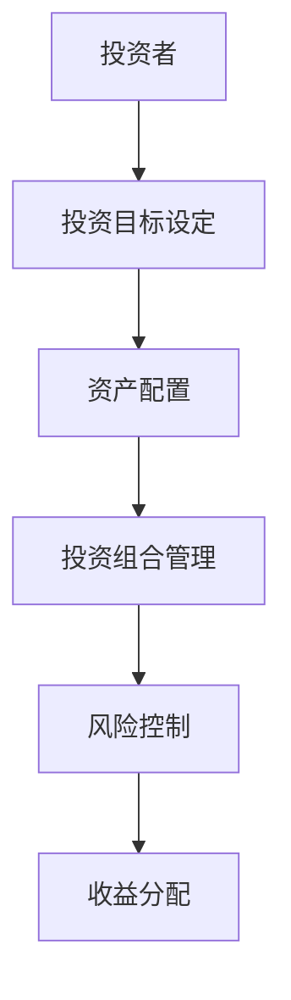

                 

# 巴菲特的雪球理论：复利效应在投资中的应用

> 关键词：巴菲特，雪球理论，复利效应，投资策略，价值投资，财富增长，长期投资

> 摘要：本文将详细探讨巴菲特的雪球理论及其在投资中的应用。通过分析复利效应的数学模型、雪球理论的核心原理、实际案例和系统架构，我们将揭示如何通过长期价值投资实现财富的几何级数增长。本文旨在为投资者提供一套科学的投资方法，帮助他们在复杂多变的市场中实现稳健的财富增长。

---

## 第1章：雪球理论的背景与核心概念

### 1.1 投资的基本概念

#### 1.1.1 投资的定义与分类

投资是指将资金投入到某一领域或资产中，以期在未来获得收益或资本增值的行为。投资可以分为以下几类：

1. **实物投资**：如房地产、基础设施等。
2. **金融投资**：如股票、债券、基金等。
3. **货币投资**：如银行存款、货币市场基金等。

#### 1.1.2 投资的基本原则

1. **分散投资**：不要把所有资金投入到单一资产中，以降低风险。
2. **长期投资**：避免频繁交易，减少交易成本和税收。
3. **价值投资**：选择具有长期增长潜力的优质资产。

#### 1.1.3 投资与投机的区别

- **投资**：基于基本面分析，追求长期稳定的收益。
- **投机**：基于市场波动，追求短期价格变化的收益。

### 1.2 巴菲特的生平简介

#### 1.2.1 巴菲特的成长经历

沃伦·巴菲特（Warren Buffett）于1934年8月30日出生在美国内布拉斯州奥马哈市。他从小就展现出了对数字和金融的天赋，12岁时已经完成了第一笔股票投资。

#### 1.2.2 巴菲特的投资理念形成

巴菲特的投资理念深受本杰明·格雷厄姆（Benjamin Graham）的影响，他提出的“价值投资”理论强调以低于内在价值的价格购买股票。

#### 1.2.3 巴菲特的影响力与地位

作为全球最成功的投资者之一，巴菲特不仅是伯克希尔哈撒韦公司（Berkshire Hathaway）的董事长兼首席执行官，还是股神的代名词。

### 1.3 雪球理论的提出与核心思想

#### 1.3.1 雪球理论的定义

雪球理论是指通过复利效应，将初始资金不断滚雪球式地增长，从而实现财富的几何级数增长。

#### 1.3.2 雪球理论的核心要素

1. **初始本金**：投资的起点资金。
2. **年化收益率**：投资的年化回报率。
3. **投资时间**：投资的持续时间。

#### 1.3.3 雪球理论的数学模型与公式

雪球效应的复利公式：

$$ A = P \times (1 + r)^n $$

其中：
- \( A \) 表示最终的雪球大小（投资收益）。
- \( P \) 表示初始本金。
- \( r \) 表示年化收益率。
- \( n \) 表示投资时间（年）。

---

## 第2章：复利效应的数学模型与公式

### 2.1 复利的定义与公式推导

#### 2.1.1 单利与复利的区别

- **单利**：只计算初始本金的利息，即 \( A = P \times (1 + r \times t) \)。
- **复利**：将每期的利息加入本金，计算下一期的利息，即 \( A = P \times (1 + r)^t \)。

#### 2.1.2 复利的数学公式

$$ 复利计算公式：$$

$$ A = P \times (1 + r)^n $$

### 2.2 复利的几何增长模型

#### 2.2.1 几何增长的定义

几何增长是指每一期的增长率相同，且增长是基于前一期的总值。

#### 2.2.2 几何增长与复利的关系

复利效应本质上是一种几何增长过程，其增长速度取决于初始本金、年化收益率和投资时间。

### 2.3 复利的几何级数模型

#### 2.3.1 几何级数的定义

几何级数是指每一项与前一项的比值相同，即 \( r \) 是一个常数。

#### 2.3.2 复利与几何级数的关系

复利的计算公式可以表示为一个几何级数：

$$ A = P \times (1 + r)^n = P \times \sum_{k=0}^{n} (1 + r)^k $$

### 2.4 复利的连续复利模型

#### 2.4.1 连续复利的定义

连续复利是指在无限短的时间间隔内不断计算利息，其数学公式为：

$$ A = P \times e^{rt} $$

其中：
- \( e \) 是自然对数的底数。
- \( r \) 是年化收益率。
- \( t \) 是投资时间。

#### 2.4.2 连续复利与离散复利的对比

- **离散复利**：按固定的时间间隔计算利息。
- **连续复利**：在任何时间点都可能计算利息，增长速度更快。

---

## 第3章：雪球理论的核心原理

### 3.1 雪球理论的复利效应

#### 3.1.1 雪球理论的核心要素

1. **初始本金**：投资的起点资金。
2. **年化收益率**：投资的年化回报率。
3. **投资时间**：投资的持续时间。

#### 3.1.2 复利效应在雪球理论中的作用

复利效应通过几何增长的方式，将初始本金不断滚雪球式地增长，从而实现财富的指数级增长。

### 3.2 雪球理论的数学模型

#### 3.2.1 雪球理论的复利公式

雪球效应的复利公式：

$$ A = P \times (1 + r)^n $$

---

## 第4章：雪球理论在投资中的应用

### 4.1 投资策略的选择

#### 4.1.1 价值投资的定义

价值投资是指以低于资产内在价值的价格买入股票，长期持有，等待其价值回归的过程。

#### 4.1.2 长期投资的重要性

长期投资可以避免短期市场的波动，充分利用复利效应，实现财富的稳步增长。

### 4.2 投资组合的构建

#### 4.2.1 分散投资的重要性

通过分散投资，可以降低投资组合的整体风险，同时利用复利效应实现财富增长。

#### 4.2.2 优质资产的选择

选择具有长期增长潜力的优质资产，如蓝筹股、国债等。

### 4.3 投资时间的选择

#### 4.3.1 长期投资的优势

长期投资可以最大化复利效应，实现财富的几何级数增长。

#### 4.3.2 短期投资的风险

短期投资容易受到市场波动的影响，复利效应难以发挥。

---

## 第5章：实际案例分析

### 5.1 雪球理论在实际投资中的应用

#### 5.1.1 案例背景

假设投资者初始本金为10万元，年化收益率为10%，投资时间为30年。

#### 5.1.2 计算过程

根据复利公式：

$$ A = 100000 \times (1 + 0.1)^{30} $$

$$ A \approx 2158925.04 \text{元} $$

#### 5.1.3 结果分析

经过30年的投资，初始本金10万元增长到了约215.89万元，实现了21.58倍的收益。

---

## 第6章：雪球理论的系统架构设计

### 6.1 系统功能设计

#### 6.1.1 投资者画像

- 初级投资者：适合选择低风险、低收益的投资方式。
- 中级投资者：适合选择中风险、中等收益的投资方式。
- 高级投资者：适合选择高风险、高收益的投资方式。

#### 6.1.2 投资目标

- 短期目标：追求短期收益。
- 中期目标：实现资产增值。
- 长期目标：实现财富传承。

### 6.2 系统架构设计

#### 6.2.1 系统架构图

#### 6.2.2 投资组合管理

- 资产分配：根据投资者的风险承受能力和收益目标，分配股票、债券、现金等资产的比例。
- 定期 rebalance：定期调整投资组合，以保持预定的资产分配比例。

---

## 第7章：雪球理论的总结与展望

### 7.1 本章总结

雪球理论通过复利效应，将初始本金不断滚雪球式地增长，从而实现财富的几何级数增长。投资者应选择优质资产，长期持有，避免频繁交易，以最大化复利效应。

### 7.2 未来展望

随着金融市场的不断发展，雪球理论的应用也将更加广泛。投资者应不断学习和提升自己的投资能力，以应对市场的变化和挑战。

### 7.3 最佳实践 tips

- **长期投资**：避免短期市场的波动，充分利用复利效应。
- **分散投资**：降低投资组合的整体风险。
- **选择优质资产**：投资具有长期增长潜力的优质资产。

---

作者：AI天才研究院/AI Genius Institute & 禅与计算机程序设计艺术/Zen And The Art of Computer Programming

