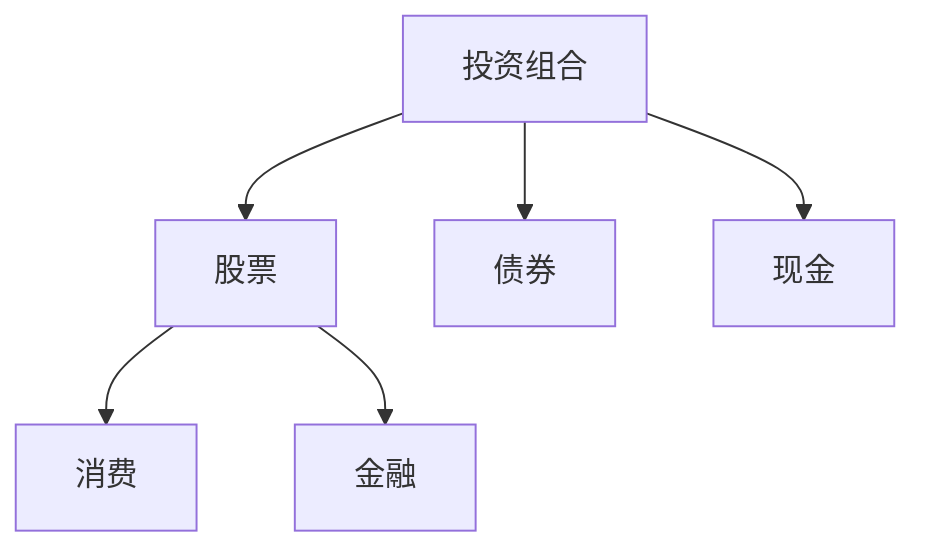
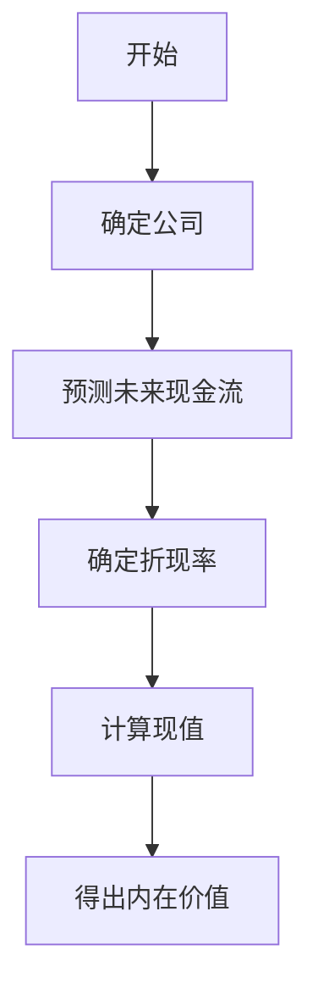
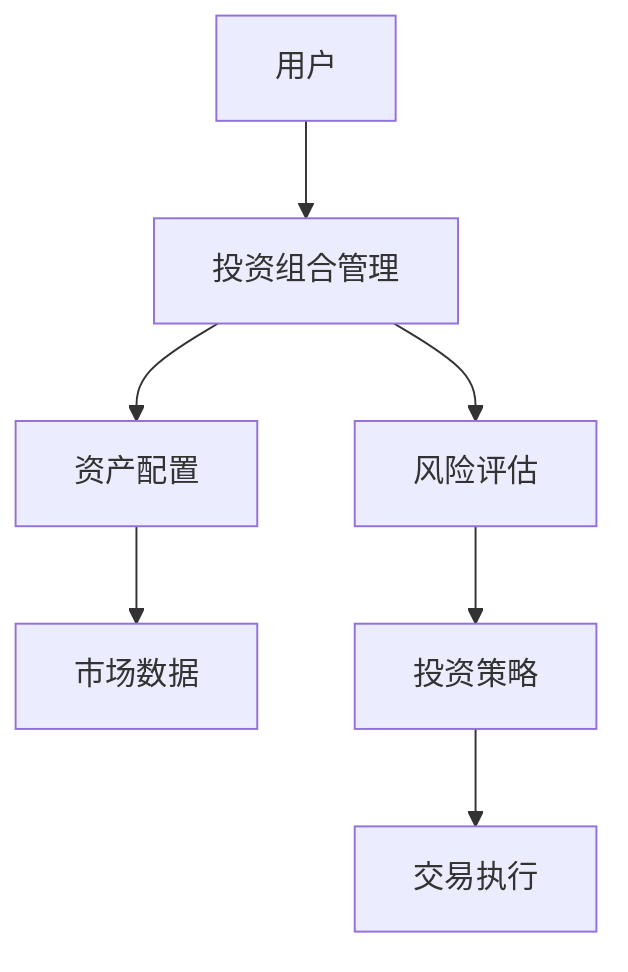
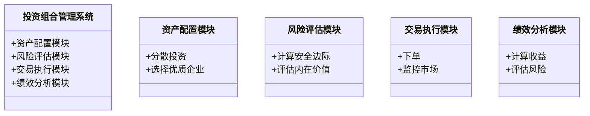

                 


# 巴菲特的风险管理：如何避免永久性资本损失

## 关键词：巴菲特，风险管理，资本损失，价值投资，安全边际，投资策略，风险控制

## 摘要：本文深入探讨了巴菲特的风险管理策略，分析了他如何通过价值投资和安全边际来避免永久性资本损失。文章详细介绍了风险管理的核心概念、算法原理、系统架构及实际案例，为投资者提供了实用的建议。

---

## 第一部分：背景介绍

### 第1章：巴菲特的生平与投资理念

#### 1.1 巴菲特的早年经历
沃伦·巴菲特（Warren Buffett）出生于1930年，早年展现出对投资的浓厚兴趣。他在青少年时期就开始进行股票交易，并在哥伦比亚大学获得了经济学学位。这段经历为他后来的投资理念奠定了基础。

#### 1.2 巴菲特的投资哲学
巴菲特的价值投资理念强调购买低于内在价值的股票，长期持有，避免频繁交易。他认为市场波动是机会而非风险，真正的风险来自投资标的本身的质量和价值。

#### 1.3 巴菲特的价值投资理念
价值投资的核心在于寻找市场低估的公司，关注其财务状况、盈利能力和发展前景。巴菲特强调安全边际的重要性，即买入价格远低于内在价值，以确保在市场波动中不会遭受永久性损失。

### 第2章：风险管理的重要性

#### 2.1 风险管理的定义
风险管理是通过识别、评估和控制潜在风险，以最小化损失并确保投资目标的实现。它不仅关注潜在收益，还注重潜在损失的控制。

#### 2.2 投资中的风险类型
投资风险包括市场风险、流动性风险、信用风险等。市场风险指市场波动对资产价值的影响；流动性风险指资产难以快速变现的风险；信用风险则涉及债务人违约的可能性。

#### 2.3 风险管理的目标
风险管理的目标是通过分散投资、控制杠杆和设定止损点等方法，降低投资组合的整体风险，避免永久性资本损失。

### 第3章：巴菲特的风险管理策略

#### 3.1 避免永久性资本损失的原则
巴菲特强调避免购买自己不理解的公司，坚持安全边际，确保买入价格远低于内在价值，从而在市场下跌时保护资本。

#### 3.2 安全边际的概念
安全边际是巴菲特投资策略的核心。他通过购买价格低于内在价值的股票，为投资组合提供缓冲空间，以应对市场波动和潜在风险。

#### 3.3 长期投资与风险管理
巴菲特倡导长期投资，认为短期波动不应影响长期投资决策。他通过分散投资于不同行业和公司的优质股票，降低单一投资的风险。

---

## 第二部分：风险管理的核心概念与联系

### 第4章：风险管理的核心要素

#### 4.1 投资组合的风险评估
通过分析投资组合中各资产的风险和收益，评估整体风险水平。常用工具包括标准差、贝塔系数等，用于衡量波动性和系统性风险。

#### 4.2 资产配置的重要性
合理的资产配置可以分散风险，降低单一资产波动对整体投资的影响。巴菲特通常将资金分配到多个优质企业，降低风险集中度。

#### 4.3 风险与收益的平衡
在投资决策中，需权衡风险与收益。巴菲特强调选择具有稳定收益和较低风险的公司，避免高风险高回报的投资。

### 第5章：巴菲特的风险管理策略

#### 5.1 安全边际的数学模型
巴菲特的安全边际可以通过以下公式计算：安全边际 = 内在价值 - 市场价格。确保市场价格低于内在价值时，投资风险较低。

#### 5.2 价值投资的内在价值计算
内在价值是公司未来现金流的现值。巴菲特使用DCF模型进行计算，公式如下：
$$
\text{内在价值} = \sum_{t=1}^{\infty} \frac{\text{现金流}_t}{(1 + r)^t}
$$
其中，r为折现率，现金流为公司未来产生的现金流。

#### 5.3 投资组合的风险分散
通过投资于不同行业和公司的优质股票，分散投资风险。巴菲特的多样化投资策略通过类图展示：



---

## 第三部分：算法原理讲解

### 第6章：内在价值计算的算法

#### 6.1 算法流程图
以下是计算内在价值的mermaid流程图：



#### 6.2 内在价值计算公式
$$
\text{内在价值} = \frac{\text{现金流}}{(1 + r)^n}
$$
其中，r为折现率，n为年数。

#### 6.3 风险评估指标
使用夏普比率和最大回撤等指标评估投资组合风险：

$$
\text{夏普比率} = \frac{\text{收益} - \text{无风险利率}}{\text{收益波动性}}
$$

$$
\text{最大回撤} = \text{最大损失}
$$

---

## 第四部分：系统分析与架构设计方案

### 第7章：投资组合管理系统

#### 7.1 系统架构图
以下是投资组合管理系统的架构图：



#### 7.2 功能设计
系统功能包括资产配置、风险评估、交易执行和绩效分析。通过类图展示：



---

## 第五部分：项目实战

### 第8章：巴菲特式投资策略的实战应用

#### 8.1 环境设置
需要安装Python、Pandas、NumPy等工具，用于数据分析和计算。

#### 8.2 核心代码实现
以下是计算内在价值和风险评估的Python代码示例：

```python
def calculate_intrinsic_value(cash_flows, discount_rate):
    return sum(cash_flow / (1 + discount_rate) ** year for year, cash_flow in enumerate(cash_flows))

def calculate_sharpe_ratio(return_series, risk_free_rate):
    return (return_series.mean() - risk_free_rate) / return_series.std()

# 示例数据
cash_flows = [100, 120, 140, 160, 180]
discount_rate = 0.10
intrinsic_value = calculate_intrinsic_value(cash_flows, discount_rate)
print("内在价值:", intrinsic_value)

returns = [0.05, 0.03, 0.07, 0.02, 0.06]
risk_free_rate = 0.02
sharpe_ratio = calculate_sharpe_ratio(returns, risk_free_rate)
print("夏普比率:", sharpe_ratio)
```

#### 8.3 案例分析
以可口可乐为例，分析巴菲特的投资策略。通过计算内在价值和安全边际，展示如何避免永久性资本损失。

---

## 第六部分：最佳实践与总结

### 第9章：风险管理的实用建议

#### 9.1 最佳实践
- 选择具有强大财务状况和竞争优势的公司。
- 设定合理的价格界限，避免过度杠杆。
- 定期评估投资组合，调整风险敞口。

#### 9.2 小结
通过巴菲特的风险管理策略，投资者可以有效避免永久性资本损失，实现稳健投资回报。

#### 9.3 注意事项
- 避免盲目跟风，深入研究投资标的。
- 合理分散投资，降低集中风险。
- 定期复盘，及时调整策略。

#### 9.4 拓展阅读
建议阅读巴菲特的《聪明的投资者》和《投资最重要的简单常识》等书籍，深入理解其投资哲学和风险管理方法。

---

## 结语

通过本文的详细分析，读者可以全面了解巴菲特的风险管理策略，并将其应用于实际投资中。遵循这些原则，投资者可以在复杂多变的市场中保护资本，实现长期稳健的投资回报。

---

## 作者：AI天才研究院/AI Genius Institute & 禅与计算机程序设计艺术 /Zen And The Art of Computer Programming

