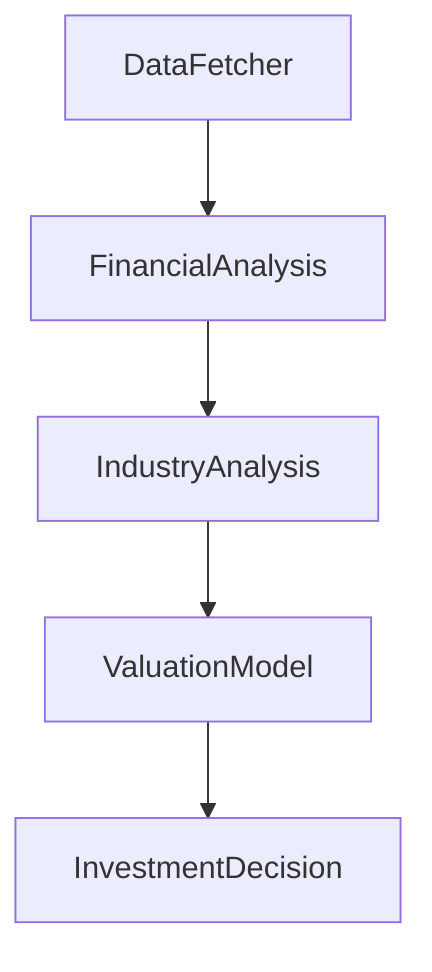

                 


# 布鲁斯·伯克维茨的集中型价值投资：深度研究的重要性

---

## 关键词：  
集中型价值投资、深度研究、布鲁斯·伯克维茨、投资策略、DCF模型、内在价值、风险管理

---

## 摘要：  
本文深入探讨了布鲁斯·伯克维茨的集中型价值投资理念，重点分析了深度研究在投资决策中的核心作用。通过结合数学模型、系统架构和实际案例，本文详细解析了集中型投资的策略优势、深度研究的方法论、以及如何通过系统化的分析框架来实现长期投资收益的最大化。

---

## 第一部分：集中型价值投资的背景与核心理念

### 第1章：集中型价值投资的起源与核心理念

#### 1.1 集中型价值投资的起源  
集中型价值投资由布鲁斯·伯克维茨提出，是一种不同于传统分散投资的策略。其核心理念是通过深度研究，集中投资于少数优质标的，以实现长期超额收益。这种方法强调对企业的内在价值进行精确评估，并在市场低估时进行重仓投资。  

#### 1.2 集中型价值投资的核心理念  
- **集中投资**：通过减少投资标的数量，提高对每个标的的研究深度，降低交易成本和时间成本。  
- **深度研究**：强调对企业基本面、行业趋势和宏观经济环境的全面分析，以找到具有长期竞争优势的企业。  
- **安全边际**：通过低估买入价与内在价值的差距，降低投资风险，确保投资的安全性。  

#### 1.3 集中型价值投资与传统投资的区别  
| 方面       | 集中型价值投资            | 传统分散投资            |  
|------------|---------------------------|--------------------------|  
| 投资标的数量 | 少数优质标的              | 多个分散标的            |  
| 研究深度   | 深度研究                  | 浅度研究或依赖市场数据    |  
| 风险管理   | 通过安全边际降低风险      | 通过分散投资降低风险    |  

---

## 第二部分：深度研究的核心方法论

### 第2章：深度研究的方法论与框架

#### 2.1 深度研究的基本原则  
- **系统性**：从行业、企业、财务等多维度全面分析。  
- **深度与广度结合**：既要深入研究单个企业，又要关注行业和宏观经济趋势。  
- **持续性**：随着市场变化持续跟踪和调整研究结论。  

#### 2.2 深度研究的框架  
##### 2.2.1 公司基本面分析  
- **财务报表分析**：重点关注利润表、资产负债表和现金流量表。  
- **管理层分析**：评估管理层的诚信、能力和战略眼光。  
- **竞争优势分析**：分析企业的核心竞争力和护城河。  

##### 2.2.2 行业分析与竞争格局  
- **行业趋势**：分析行业周期、增长潜力和竞争格局。  
- **竞争优势分析**：评估企业在行业中的地位和竞争优势。  

##### 2.2.3 财务指标的深度解读  
- **盈利能力**：ROE（净资产收益率）、ROA（资产净利率）、净利润率。  
- **成长能力**：收入增长率、净利润增长率。  
- **财务健康状况**：负债率、现金流情况。  

#### 2.3 深度研究的核心要素  
- **财务报表分析**：通过杜邦分析法分解ROE，评估企业的盈利能力。  
- **管理层分析**：通过财报附注和管理层讨论与分析（MD&A）了解管理层的策略和风险。  
- **行业趋势与宏观经济环境**：结合宏观经济指标（如GDP增长率、利率、通胀率）分析行业前景。  

---

## 第三部分：集中型价值投资的数学模型与算法

### 第3章：价值投资的数学模型

#### 3.1 价值投资的核心公式  
##### 3.1.1 内在价值的计算公式  
$$ \text{内在价值} = \sum_{t=1}^{\infty} \frac{CF_t}{(1 + r)^t} $$  
其中，\( CF_t \) 是第 \( t \) 年的现金流，\( r \) 是折现率。  

##### 3.1.2 股票估值的简化模型  
$$ \text{股价} = \text{每股收益} \times \text{合理市盈率} $$  

#### 3.2 贴现现金流模型（DCF）  
##### 3.2.1 DCF模型的步骤  
1. 预测未来自由现金流（FCFF）。  
2. 计算终端价值（TV）。  
3. 折现现金流至现值，计算内在价值。  

##### 3.2.2 现金流预测  
通过对企业历史财务数据和行业趋势进行分析，预测未来5-10年的现金流。  

##### 3.2.3 折现率的确定  
折现率通常采用无风险利率加风险溢价。  

#### 3.3 股票估值的敏感性分析  
##### 3.3.1 贴现率变化的影响  
贴现率上升会导致内在价值下降。  
##### 3.3.2 现金流量变化的影响  
未来现金流增加会提升内在价值。  
##### 3.3.3 估值区间与安全边际  
内在价值区间为 $20-30，安全边际为 $20，买入价为 $18。  

---

## 第四部分：集中型价值投资的系统架构

### 第4章：投资决策的系统架构

#### 4.1 投资决策系统的模块划分  
- **数据获取模块**：收集企业财务数据、行业数据、宏观经济数据。  
- **分析模块**：包括财务分析、行业分析和估值模型计算。  
- **决策模块**：根据分析结果生成投资建议。  

#### 4.2 数据流与模块交互  


---

## 第五部分：集中型价值投资的项目实战

### 第5章：项目实战与案例分析

#### 5.1 环境安装  
- **工具**：Python、Excel、数据分析库（如Pandas、NumPy）。  
- **数据源**：公司财报、行业报告、宏观经济数据。  

#### 5.2 核心实现源代码  
##### 5.2.1 DCF模型代码  
```python
def calculate_intrinsic_value(fcf, discount_rate, terminal_value):
    present_value = 0
    for year in range(1, 11):
        if year == 10:
            cash_flow = terminal_value
        else:
            cash_flow = fcf * (1 + 0.05)**year
        present_value += cash_flow / (1 + discount_rate)**year
    return present_value
```

##### 5.2.2 财务指标分析  
```python
import pandas as pd

def analyze_financials(finance_data):
    roe = finance_data['net_profit'] / finance_data['equity']
    roa = finance_data['net_profit'] / finance_data['total_assets']
    growth_rate = (finance_data['revenue'][2023] - finance_data['revenue'][2022]) / finance_data['revenue'][2022]
    return {'ROE': roe, 'ROA': roa, 'Revenue Growth Rate': growth_rate}
```

#### 5.3 案例分析  
以苹果公司为例，分析其财务数据、行业地位和竞争优势。通过DCF模型计算其内在价值，并结合市场价判断是否低估。  

#### 5.4 小结  
通过实战项目，验证集中型价值投资策略的有效性，并总结深度研究在实际投资中的重要性。  

---

## 第六部分：总结与最佳实践

### 第6章：总结与注意事项

#### 6.1 本章总结  
- 集中型价值投资通过深度研究和集中投资，实现长期超额收益。  
- 深度研究是投资决策的核心，需要系统性、持续性和全面性。  
- 数学模型和系统架构是实现投资决策的重要工具。  

#### 6.2 注意事项  
- 风险管理：通过安全边际降低投资风险。  
- 持续学习：市场变化快，需持续跟踪和调整研究框架。  

#### 6.3 拓展阅读  
推荐阅读《价值》（《The Value》）和《投资最重要的事情》（《The Most Important Thing》）。

---

## 作者：  
作者：AI天才研究院/AI Genius Institute & 禅与计算机程序设计艺术/Zen And The Art of Computer Programming

