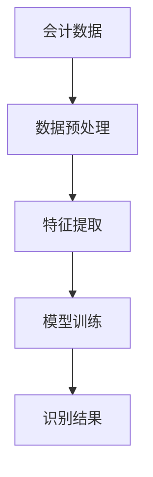
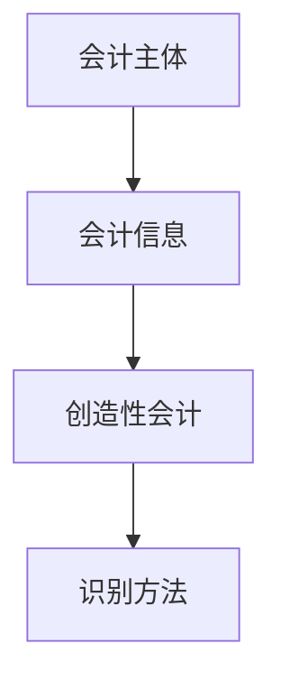
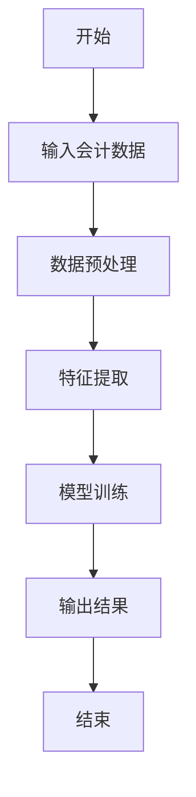
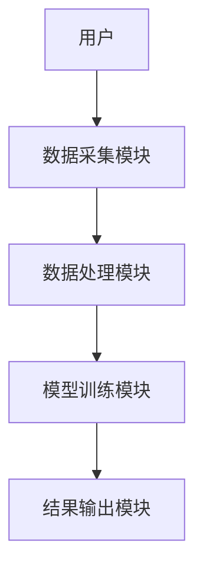
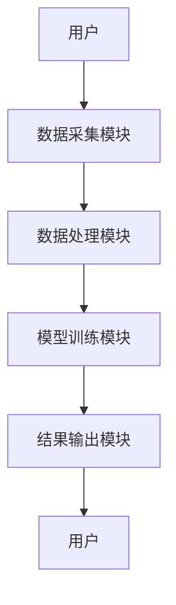

                 


# 布鲁斯·格林沃尔德的创造性会计识别方法

> 关键词：创造性会计识别、会计信息失真、会计识别方法、会计模型、会计算法、会计系统设计

> 摘要：本文深入探讨了布鲁斯·格林沃尔德提出的创造性会计识别方法，从背景介绍、核心概念、算法原理、系统设计、项目实战等多个维度，全面解析了该方法的理论基础、实现路径和实际应用。文章结合理论与实践，通过详细的技术分析和案例解读，揭示了创造性会计识别方法在会计领域的创新价值和应用潜力。

---

# 第一部分: 创造性会计识别方法的背景与基础

## 第1章: 创造性会计识别方法的背景介绍

### 1.1 问题背景

#### 1.1.1 会计识别的基本概念
会计识别是通过对会计数据的分析和处理，识别出会计信息中包含的特定模式、特征或异常值。它是会计学与数据科学交叉领域的重要研究方向。

#### 1.1.2 创造性会计的定义与特征
创造性会计是一种通过人为调整或构造会计数据，使其符合特定目的或预期结果的会计行为。其主要特征包括：
- **目的性**：创造性会计通常是为了达到特定目标，如规避财务规则或优化财务表现。
- **隐蔽性**：创造性会计往往通过复杂的会计处理手段掩盖其真实性。
- **合法性边缘**：创造性会计可能接近甚至挑战会计规则的边界。

#### 1.1.3 创造性会计识别方法的必要性
在财务报表分析、审计和监管等领域，创造性会计识别方法能够帮助识别虚假信息，确保会计数据的准确性和可靠性。

### 1.2 问题描述

#### 1.2.1 会计信息失真的现状
随着企业规模的扩大和业务复杂性的增加，会计信息失真问题日益严重。企业通过创造性会计手段 manipulate财务数据，导致财务报表无法真实反映企业实际情况。

#### 1.2.2 创造性会计的常见形式
- 利润操纵
- 资产重估
- 成本转移
- 税务优化

#### 1.2.3 创造性会计识别的挑战
- 数据复杂性：会计数据涉及多个科目和业务环节，识别难度大。
- 方法多样性：创造性会计手段多样化，难以统一识别。
- 数据量大：企业会计数据量庞大，人工识别效率低。

### 1.3 问题解决

#### 1.3.1 创造性会计识别的目标
通过技术手段识别会计数据中的异常值和虚假信息，确保会计数据的真实性和准确性。

#### 1.3.2 创造性会计识别的核心原则
- 数据完整性：确保会计数据的完整性和一致性。
- 方法多样性：采用多种识别方法，提高识别准确率。
- 实时性：通过实时监控识别创造性会计行为。

#### 1.3.3 创造性会计识别的实现路径
- 数据预处理：清洗和标准化会计数据。
- 特征提取：提取与创造性会计相关的特征。
- 模型训练：训练识别模型并优化参数。

### 1.4 边界与外延

#### 1.4.1 创造性会计识别的边界
创造性会计识别仅关注会计数据的异常性和虚假性，不涉及其他领域的问题。

#### 1.4.2 创造性会计识别的外延
创造性会计识别可以扩展到其他领域，如金融数据识别、经济数据识别等。

#### 1.4.3 创造性会计识别与其他会计方法的区别
- 传统会计方法关注数据的记录和处理，而创造性会计识别方法关注数据的异常识别。
- 传统会计方法注重合规性，而创造性会计识别方法注重数据真实性。

### 1.5 概念结构与核心要素

#### 1.5.1 创造性会计识别的核心要素
- 数据来源：会计数据的采集和处理。
- 数据特征：与创造性会计相关的特征。
- 识别模型：用于识别创造性会计行为的算法。

#### 1.5.2 创造性会计识别的结构模型


#### 1.5.3 创造性会计识别的实现框架
- 数据预处理：清洗、标准化。
- 特征提取：提取关键特征。
- 模型训练：训练识别模型。

---

## 第2章: 创造性会计识别的核心概念与联系

### 2.1 核心概念原理

#### 2.1.1 创造性会计识别的基本原理
通过分析会计数据的特征，识别出与创造性会计相关的模式和异常值。

#### 2.1.2 创造性会计识别的核心算法
- 异常检测算法
- 分类算法
- 聚类算法

#### 2.1.3 创造性会计识别的数学模型
$$ y = f(x) $$

### 2.2 核心概念对比表

| 对比维度 | 创造性会计 | 传统会计 |
|----------|------------|----------|
| 目标     | 识别异常   | 记录数据  |
| 方法     | 数据分析   | 会计处理 |
| 工具     | 数据挖掘   | 会计软件 |

### 2.3 ER实体关系图



---

## 第3章: 创造性会计识别的算法原理

### 3.1 算法原理概述

#### 3.1.1 创造性会计识别的基本流程
1. 数据预处理
2. 特征提取
3. 模型训练
4. 结果输出

#### 3.1.2 创造性会计识别的核心算法
- 异常检测算法
- 分类算法
- 聚类算法

#### 3.1.3 创造性会计识别的实现步骤
1. 数据预处理
2. 特征提取
3. 模型训练
4. 结果输出

### 3.2 算法流程图



### 3.3 核心算法的数学模型和公式

#### 3.3.1 异常检测算法
$$ y = f(x) $$

#### 3.3.2 分类算法
$$ y = \max(f(x)) $$

#### 3.3.3 聚类算法
$$ x' = x - \mu $$

---

## 第4章: 创造性会计识别的数学模型

### 4.1 数学模型概述

#### 4.1.1 数学模型的基本原理
通过数学方法描述会计数据的特征和关系，用于识别创造性会计行为。

#### 4.1.2 数学模型的实现步骤
1. 数据预处理
2. 模型构建
3. 模型优化
4. 模型应用

### 4.2 数学模型的详细讲解

#### 4.2.1 数据预处理
- 数据清洗
- 数据标准化
- 数据转换

#### 4.2.2 模型构建
- 特征选择
- 模型训练
- 模型验证

#### 4.2.3 模型优化
- 参数调整
- 模型评估
- 模型部署

---

## 第5章: 创造性会计识别的系统分析与架构设计

### 5.1 系统分析

#### 5.1.1 问题场景介绍
- 企业财务报表分析
- 审计与监管
- 金融风险控制

#### 5.1.2 系统功能设计
- 数据采集
- 数据处理
- 模型训练
- 结果输出

#### 5.1.3 系统架构设计


### 5.2 系统架构设计

#### 5.2.1 系统架构图


#### 5.2.2 系统接口设计
- 数据输入接口
- 模型训练接口
- 结果输出接口

#### 5.2.3 系统交互图


---

## 第6章: 创造性会计识别的项目实战

### 6.1 环境安装

#### 6.1.1 环境要求
- Python 3.8及以上
- NumPy
- Pandas
- Scikit-learn

### 6.2 核心代码实现

#### 6.2.1 数据预处理代码
```python
import numpy as np
import pandas as pd

# 数据预处理
data = pd.read_csv('accounting_data.csv')
data = data.dropna()
data = (data - data.mean()) / data.std()
```

#### 6.2.2 模型训练代码
```python
from sklearn.

