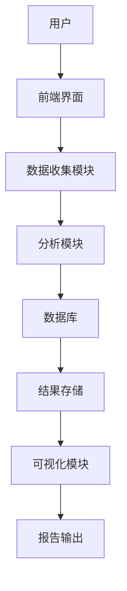

                 


# 布鲁斯·格林沃尔德的隐蔽价值：发掘资产负债表中的秘密

> **关键词**：隐蔽价值、资产负债表、企业价值评估、财务分析、资产评估  
> 
> **摘要**：本文深入探讨了布鲁斯·格林沃尔德提出的“隐蔽价值”概念，通过分析资产负债表的核心要素，揭示企业价值中的隐藏部分。文章从理论基础到实践应用，详细阐述了如何识别和衡量这些隐蔽价值，并提供了具体的财务分析方法和系统架构设计，帮助读者全面理解如何在实际工作中应用这些概念。

---

# 第一部分: 隐蔽价值与资产负债表分析基础

## 第1章: 隐蔽价值的定义与重要性

### 1.1 隐蔽价值的定义

- **定义**：隐蔽价值是指企业在资产负债表中未直接反映，但对企业整体价值有重要影响的潜在资源或能力。这些价值通常体现在企业的品牌、客户关系、研发能力、人力资源等方面。
- **重要性**：隐蔽价值是企业核心竞争力的体现，能够显著影响企业的市场地位、盈利能力和发展潜力。
- **区别**：与传统财务指标（如净利润、资产总额）不同，隐蔽价值更关注企业的无形资产和潜在资源。

### 1.2 隐蔽价值的重要性

- **对企业竞争力的影响**：隐蔽价值决定了企业的差异化优势，例如品牌影响力、客户忠诚度等。
- **对投资者决策的意义**：识别隐蔽价值有助于投资者更准确地评估企业的长期发展潜力。
- **在企业并购中的应用**：隐蔽价值是企业并购定价的重要参考，能够帮助买家评估目标企业的潜在价值。

---

## 第2章: 资产负债表的核心要素

### 2.1 资产负债表的基本结构

- **资产**：包括流动资产（现金、应收账款）和非流动资产（固定资产、无形资产）。
- **负债**：包括流动负债（应付账款、短期借款）和非流动负债（长期借款、债券）。
- **所有者权益**：包括股本、资本公积、盈余公积和未分配利润。

### 2.2 隐蔽价值在资产负债表中的体现

- **隐蔽资产**：如品牌价值、客户关系、研发能力等，通常不在资产负债表中直接反映。
- **隐蔽负债**：如或有负债、未来承诺，可能对企业的财务状况产生重大影响。

---

# 第二部分: 隐蔽价值的识别与衡量

## 第3章: 隐蔽价值的识别方法

### 3.1 隐蔽资产的识别

- **无形资产**：品牌价值、专利技术、商标等。
- **递延资产**：长期研发支出、市场推广费用等。
- **其他隐蔽资产**：客户关系、员工忠诚度、管理团队能力等。

### 3.2 隐蔽负债的识别

- **或有负债**：可能的诉讼赔偿、担保责任。
- **递延负债**：未来承诺、期权合约等。
- **其他隐蔽负债**：潜在的环境责任、产品质量问题等。

### 3.3 隐蔽价值的衡量标准

- **定性标准**：企业的市场地位、竞争优势、管理能力等。
- **定量标准**：通过财务模型估算隐蔽价值的大小，例如使用多因子回归模型。

---

## 第4章: 隐蔽价值的财务分析方法

### 4.1 财务比率分析

- **偿债能力分析**：通过流动比率、速动比率等指标评估企业的短期偿债能力。
- **营运能力分析**：通过存货周转率、应收账款周转率等指标评估企业的运营效率。
- **盈利能力分析**：通过净利率、ROE等指标评估企业的盈利能力。

### 4.2 资产负债表信号分析

- **资产结构异常信号**：资产结构过于保守或激进，可能反映企业隐藏的资产或负债。
- **负债结构异常信号**：负债比例过高或过低，可能暗示企业的财务风险。
- **所有者权益结构异常信号**：所有者权益变动频繁，可能反映企业隐藏的资本运作。

---

## 第5章: 隐蔽价值的量化方法

### 5.1 估算模型

- **多因子回归模型**：通过多个财务指标的回归分析，估算隐蔽价值的大小。
- **期权定价模型**：将企业的潜在价值看作一种期权，通过期权定价公式估算其价值。

### 5.2 数学模型

$$ V = \beta \cdot (R_m - R_f) + \alpha $$

其中：
- \( V \) 表示企业价值
- \( \beta \) 表示企业的系统性风险系数
- \( R_m \) 表示市场平均收益率
- \( R_f \) 表示无风险利率
- \( \alpha \) 表示企业的特异风险溢价

---

## 第6章: 系统分析与架构设计

### 6.1 问题场景介绍

- **目标**：开发一个基于资产负债表的隐蔽价值评估系统。
- **用户需求**：企业财务分析师、投资者需要快速识别和量化企业的隐蔽价值。

### 6.2 系统功能设计

- **数据收集模块**：收集企业的财务报表数据和市场数据。
- **分析模块**：通过多因子模型和回归分析，识别隐蔽价值。
- **可视化模块**：生成图表和报告，帮助用户理解结果。

### 6.3 系统架构设计



---

## 第7章: 项目实战

### 7.1 环境配置

- **工具安装**：安装Python、Pandas、NumPy、Scikit-learn等库。
- **数据获取**：收集某企业的财务报表数据。

### 7.2 核心实现

```python
import pandas as pd
import numpy as np

# 数据预处理
data = pd.read_csv('financial_data.csv')
data_cleaned = data.dropna()

# 多因子回归模型
from sklearn.linear_model import LinearRegression
model = LinearRegression()
model.fit(data_cleaned[['资产', '负债']], data_cleaned['价值'])

# 评估结果
print(model.predict([[资产_new, 负债_new]]))
```

### 7.3 案例分析

- **背景**：某高科技公司，资产负债表显示较低的资产和负债，但实际具有较高的品牌价值和客户忠诚度。
- **分析**：通过多因子模型估算，发现公司的隐蔽价值远高于账面价值。

---

## 第8章: 总结与展望

### 8.1 小结

- 隐蔽价值是企业价值的重要组成部分，通过资产负债表分析可以有效识别和衡量这些价值。
- 结合财务模型和系统设计，可以帮助企业和投资者更好地评估企业的潜在价值。

### 8.2 注意事项

- 隐蔽价值的估算需要结合企业的实际情况，避免过于简化或复杂化。
- 在实际操作中，应综合考虑市场环境和企业战略。

### 8.3 拓展阅读

- 布鲁斯·格林沃尔德的《企业价值评估》
- 其他相关文献和案例研究。

---

# 作者：AI天才研究院/AI Genius Institute & 禅与计算机程序设计艺术 /Zen And The Art of Computer Programming

