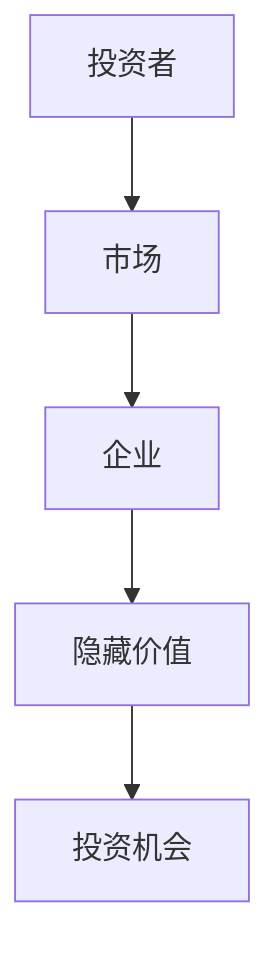
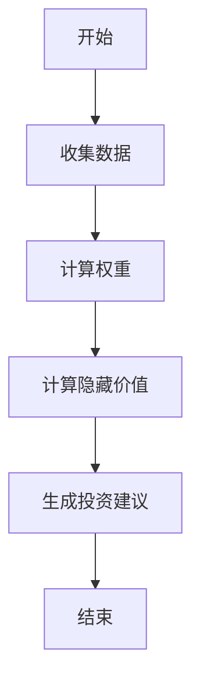
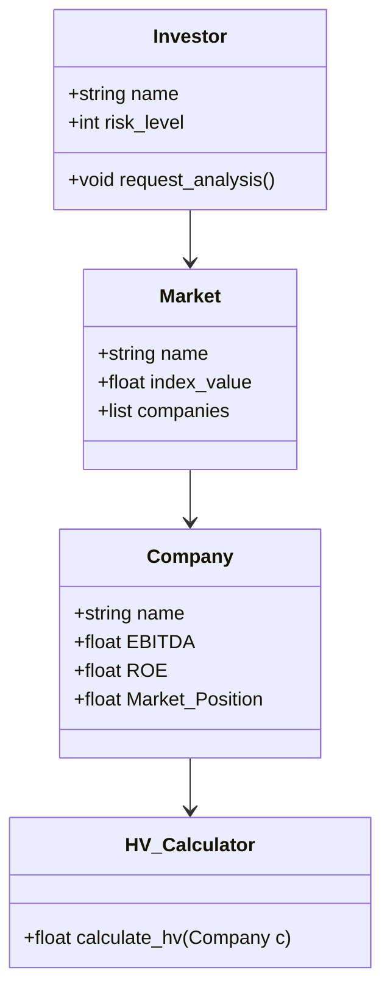
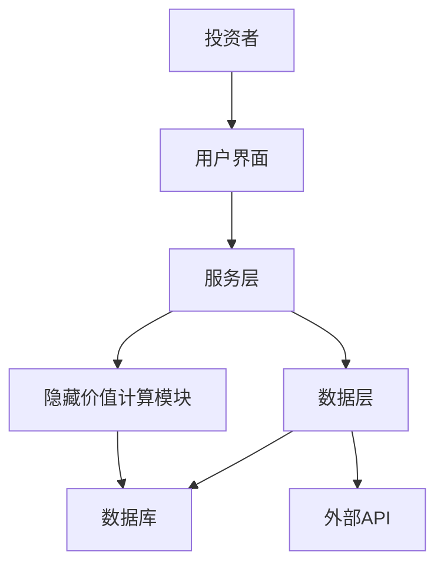
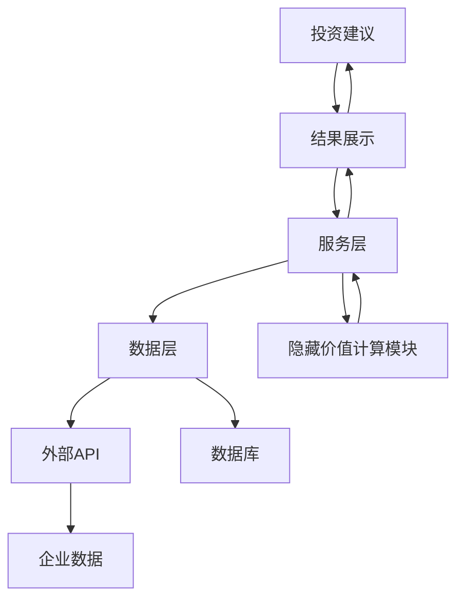

                 


# 布鲁斯·格林沃尔德的隐藏价值投资策略

> **关键词**：隐藏价值投资、布鲁斯·格林沃尔德、价值投资、投资策略、算法原理、系统架构、实战案例

> **摘要**：本文深入探讨了布鲁斯·格林沃尔德提出的隐藏价值投资策略，从其核心概念、算法原理、系统架构到实战案例进行了全面分析。通过详细的技术分析和实际应用，展示了如何在投资领域中发现并利用隐藏价值，为投资者提供了新的视角和策略。

---

## 第一部分：隐藏价值投资的背景与概念

### 第1章：隐藏价值投资的定义与意义

#### 1.1 投资领域的传统策略与局限性
- **传统价值投资的定义与特点**
  - 价值投资的核心理念：寻找被市场低估的企业。
  - 传统价值投资的局限性：
    - 市场波动对估值的影响。
    - 信息不对称带来的挑战。
    - 企业基本面变化的不可预测性。
- **隐藏价值投资的提出背景**
  - 隐藏价值的定义：未被市场充分认知的企业内在价值。
  - 隐藏价值投资的意义：
    - 发现市场中被忽视的投资机会。
    - 提高投资组合的抗风险能力。

#### 1.2 隐藏价值投资的核心概念
- **隐藏价值的特征**
  - 表格对比：
    | 特性       | 隐藏价值       | 显性价值       |
    |------------|----------------|----------------|
    | 定价机制    | 市场低估        | 市场充分定价    |
    | 发现难度    | 较高           | 较低           |
    | 投资回报    | 高             | 中等           |
  - 隐藏价值与显性价值的联系：
    - 隐藏价值是显性价值的潜在延伸。
    - 隐藏价值的发现依赖于深入的市场分析和企业研究。
- **隐藏价值投资的目标**
  - 发现具有潜在增长空间的企业。
  - 通过长期持有实现超额收益。

#### 1.3 隐藏价值投资的市场背景
- 当前市场的特点与趋势：
  - 市场波动加剧，投资者需要新的策略。
  - 数据驱动的投资决策逐渐普及。
- 隐藏价值投资的适用场景：
  - 初级市场或新兴行业。
  - 经济低迷时期的逆周期投资。
- 隐藏价值投资的未来展望：
  - 数据分析技术的进步将推动隐藏价值的发现。
  - 投资者的认知升级将带来更多机会。

### 第2章：隐藏价值投资的核心概念与联系

#### 2.1 隐藏价值的核心原理
- **隐藏价值的生成机制**
  - 市场信息不对称导致的价值低估。
  - 企业基本面改善带来的价值重估。
- **隐藏价值与市场信息的关系**
  - 信息不对称是隐藏价值存在的基础。
  - 数据分析是发现隐藏价值的关键工具。
- **隐藏价值与企业基本面的关系**
  - 企业基本面是隐藏价值的物质基础。
  - 通过基本面分析发现隐藏价值。

#### 2.2 隐藏价值与传统价值投资的对比
- **对比分析**
  | 比较维度       | 隐藏价值投资               | 传统价值投资               |
  |----------------|----------------------------|-----------------------------|
  | 估值方法       | 基于潜在价值重估             | 基于当前市场估值             |
  | 投资策略       | 寻找市场低估的潜在价值       | 寻找市场低估的显性价值       |
  | 投资周期       | 更长，注重长期价值增长       | 中长期，注重估值修复         |
  | 风险承受能力   | 较高，需承担较高的不确定性风险 | 中等，风险相对可控           |

#### 2.3 ER实体关系图架构


---

## 第二部分：隐藏价值投资的算法原理

### 第3章：隐藏价值投资的算法原理

#### 3.1 算法原理概述
- **隐藏价值评估的数学模型**
  - HV（隐藏价值）= Σ（权重 × 特征值）
  - 权重基于企业基本面、市场趋势和行业地位等因素。
- **算法的输入与输出**
  - 输入：企业财务数据、市场数据、行业数据。
  - 输出：隐藏价值评分、投资建议。
- **算法的步骤与流程**
  1. 收集相关数据。
  2. 计算各因素的权重。
  3. 计算隐藏价值评分。
  4. 生成投资建议。

#### 3.2 算法流程图


#### 3.3 隐藏价值评估公式
- 示例公式：
  $$ HV = w_1 \cdot EBITDA + w_2 \cdot ROE + w_3 \cdot Market_Position $$
  其中，$w_1, w_2, w_3$ 是各因素的权重，$EBITDA$ 是息税折旧前利润，$ROE$ 是净资产收益率，$Market_Position$ 是市场地位评分。

- 示例计算：
  $$ HV = 0.4 \cdot 50 + 0.3 \cdot 20 + 0.3 \cdot 70 = 47 $$

#### 3.4 算法实现代码
- 示例代码：
```python
def calculate_hv(company_data):
    # 公司数据包括：EBITDA, ROE, Market_Position
    weights = {'EBITDA': 0.4, 'ROE': 0.3, 'Market_Position': 0.3}
    hv = 0
    for factor in company_data:
        hv += weights[factor] * company_data[factor]
    return hv

# 示例数据
company_data = {
    'EBITDA': 50,
    'ROE': 20,
    'Market_Position': 70
}

# 计算隐藏价值
hv_score = calculate_hv(company_data)
print(f"隐藏价值评分：{hv_score}")
```

---

## 第三部分：隐藏价值投资的系统分析与架构设计

### 第4章：隐藏价值投资的系统分析与架构设计

#### 4.1 系统分析
- **投资分析系统的需求分析**
  - 系统需支持多数据源的接入。
  - 系统需具备数据清洗、分析和建模功能。
  - 系统需生成投资建议并可视化结果。
- **系统功能设计**
  - 数据采集模块：收集企业财务数据、市场数据等。
  - 数据分析模块：计算隐藏价值评分。
  - 投资建议模块：生成投资策略。
  - 可视化模块：展示分析结果。

#### 4.2 系统架构设计
- **领域模型类图**


- **系统架构图**


#### 4.3 接口设计与交互流程
- **交互流程图**


---

## 第四部分：隐藏价值投资的实战案例

### 第5章：隐藏价值投资的实战应用

#### 5.1 环境安装与数据准备
- **环境安装**
  - 安装Python和相关库（Pandas, NumPy, Scikit-learn）。
  - 安装Jupyter Notebook用于数据分析。
- **数据准备**
  - 下载企业财务数据（如EBITDA、ROE等）。
  - 获取市场数据和行业地位评分。

#### 5.2 系统核心实现
- **代码实现**
```python
import pandas as pd
from sklearn.metrics import mean_squared_error

def calculate_hv(company_data):
    weights = {'EBITDA': 0.4, 'ROE': 0.3, 'Market_Position': 0.3}
    hv = 0
    for factor in company_data:
        hv += weights[factor] * company_data[factor]
    return hv

# 示例数据
data = {
    '公司A': {'EBITDA': 50, 'ROE': 20, 'Market_Position': 70},
    '公司B': {'EBITDA': 30, 'ROE': 25, 'Market_Position': 60}
}

# 计算隐藏价值
hv_scores = {}
for company in data:
    hv = calculate_hv(data[company])
    hv_scores[company] = hv

print(hv_scores)
```

- **代码解读**
  - 数据准备：加载企业财务数据和市场数据。
  - 隐藏价值计算：基于权重计算每家公司的隐藏价值评分。
  - 结果分析：对比不同公司的隐藏价值，找出潜在投资机会。

#### 5.3 案例分析
- **实际案例分析**
  - 案例背景：假设一家新兴科技公司，其EBITDA为30，ROE为25，市场地位评分为60。
  - 计算结果：HV = 0.4×30 + 0.3×25 + 0.3×60 = 21 + 7.5 + 18 = 46.5。
  - 投资建议：基于计算结果，该公司的隐藏价值较高，适合长期投资。

#### 5.4 项目小结
- 通过隐藏价值投资策略，投资者可以发现市场中被低估的企业。
- 数据分析技术是实现隐藏价值投资的关键工具。
- 需要结合市场环境和企业基本面进行综合判断。

---

## 第五部分：总结与展望

### 第6章：隐藏价值投资的总结与展望

#### 6.1 最佳实践 tips
- **数据驱动决策**：利用数据分析工具发现隐藏价值。
- **长期投资视角**：关注企业基本面的长期改善。
- **风险管理**：合理控制投资组合的风险。

#### 6.2 小结
- 隐藏价值投资是一种新兴的投资策略。
- 通过数据分析和模型计算，投资者可以发现市场中被低估的投资机会。
- 隐藏价值投资的成功依赖于对市场的深入理解和对企业基本面的准确评估。

#### 6.3 注意事项
- 隐藏价值投资需要结合市场环境和企业基本面进行综合判断。
- 投资者需具备较强的数据分析能力和市场敏感性。
- 需要长期关注企业的经营状况和市场变化。

#### 6.4 拓展阅读
- 推荐书籍：《隐藏价值投资：发现市场中的未被认知的机会》。
- 推荐博客：深入探讨隐藏价值投资的实践与理论。

---

**作者：AI天才研究院/AI Genius Institute & 禅与计算机程序设计艺术 /Zen And The Art of Computer Programming**

---

通过以上目录结构和内容安排，我们可以系统地了解布鲁斯·格林沃尔德的隐藏价值投资策略，并通过实际案例和代码实现，深入掌握其核心思想和应用场景。

