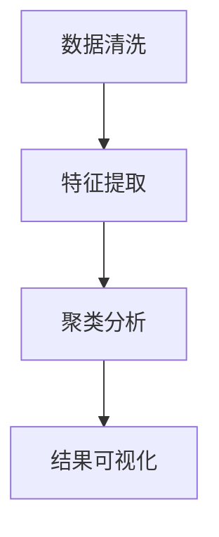
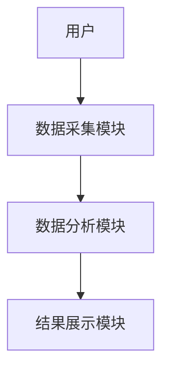

                 


# 布鲁斯·贝克威斯的隐藏资产价值发掘

## 关键词：隐藏资产、数据挖掘、价值评估、系统架构、项目实战

## 摘要：  
本文通过分析隐藏资产的发现与价值评估，结合数据挖掘算法和系统架构设计，深入探讨如何发现和利用隐藏资产为企业创造价值。文章从背景介绍、核心概念、算法原理、系统架构、项目实战到最佳实践，系统地阐述了隐藏资产的发掘过程。

---

## 第一部分：隐藏资产的背景与概念

### 第1章：隐藏资产的背景介绍

#### 1.1 问题背景  
隐藏资产是指未在企业财务报表中明确列出，但对企业价值有重要影响的资源或权利。这些资产可能包括数据资产、知识产权、品牌价值等。随着数字化转型的推进，隐藏资产的重要性日益凸显。

#### 1.2 问题描述  
隐藏资产的识别和评估是企业价值管理中的难题。传统财务报表仅关注有形资产，而隐藏资产的潜在价值往往被忽视，导致企业错失提升价值的机会。

#### 1.3 问题解决  
通过数据挖掘、机器学习等技术手段，可以发现和评估隐藏资产。企业需要建立系统化的流程来识别和利用这些资产。

#### 1.4 边界与外延  
隐藏资产的边界包括数据隐私、法律合规等，外延涉及企业内部数据、外部市场数据等。

#### 1.5 概念结构与核心要素  
- 核心要素：数据资产、知识产权、品牌价值等。
- 分类：内部隐藏资产、外部隐藏资产。

---

## 第二部分：隐藏资产的核心概念与联系

### 第2章：隐藏资产的核心概念原理

#### 2.1 隐藏资产的属性特征对比  

| 资产类型 | 传统资产 | 隐藏资产 |
|----------|----------|----------|
| 形式     | 有形     | 无形     |
| 可见性   | 显性     | 隐性     |
| 价值     | 稳定     | 变动     |

#### 2.2 ER实体关系图  
```mermaid
erDiagram
    customer[客户] {
        name : 字符串
        id : 整数
    }
    asset[资产] {
        id : 整数
        value : 整数
    }
    relation[关系] {
        id : 整数
        type : 字符串
    }
    customer --> relation: "拥有"
    asset --> relation: "属于"
```

---

## 第三部分：隐藏资产的算法原理

### 第3章：隐藏资产的发现算法

#### 3.1 数据挖掘算法  
使用数据挖掘技术发现隐藏资产。流程如下：



代码示例：

```python
import pandas as pd
from sklearn.cluster import KMeans

# 数据清洗
data = pd.read_csv('assets.csv')
data.dropna()

# 特征提取
features = data[['value', 'type']]

# 聚类分析
kmeans = KMeans(n_clusters=3).fit(features)
clusters = kmeans.labels_

# 结果可视化
import matplotlib.pyplot as plt
plt.scatter(features['value'], features['type'], c=clusters)
plt.show()
```

#### 3.2 价值评估算法  
使用回归分析模型：

$$ y = \beta_0 + \beta_1x_1 + \beta_2x_2 + \epsilon $$

代码示例：

```python
from sklearn.linear_model import LinearRegression

model = LinearRegression().fit(features, target)
print('回归系数:', model.coef_)
```

---

## 第四部分：隐藏资产的系统架构设计

### 第4章：系统分析与架构设计

#### 4.1 问题场景介绍  
企业需要通过系统发现和评估隐藏资产，提升企业价值。

#### 4.2 系统功能设计  
- 数据采集模块
- 数据分析模块
- 结果展示模块

#### 4.3 系统架构设计  


#### 4.4 系统接口设计  
接口定义：

```json
{
  "type": "GET",
  "url": "/api/assets",
  "body": {
    "method": "get_assets"
  }
}
```

---

## 第五部分：项目实战

### 第5章：项目实战与案例分析

#### 5.1 安装环境  
安装Python和相关库。

#### 5.2 核心代码实现  
```python
def discover_hidden_assets(data):
    # 数据预处理
    processed_data = data.dropna()
    # 聚类分析
    clusters = KMeans(n_clusters=3).fit(processed_data)
    return clusters.labels_
```

#### 5.3 案例分析  
案例：某企业品牌价值评估。

---

## 第六部分：最佳实践

### 第6章：最佳实践与小结

#### 6.1 小结  
隐藏资产的价值挖掘需要系统化的方法和技术支持。

#### 6.2 注意事项  
数据隐私、模型精度、持续优化。

#### 6.3 未来研究方向  
高级算法、实时分析、跨领域应用。

---

## 作者：AI天才研究院 & 禅与计算机程序设计艺术

