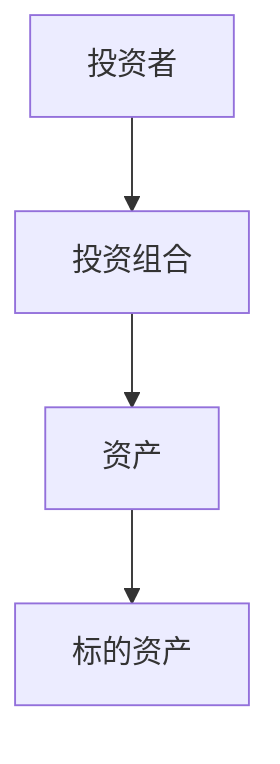
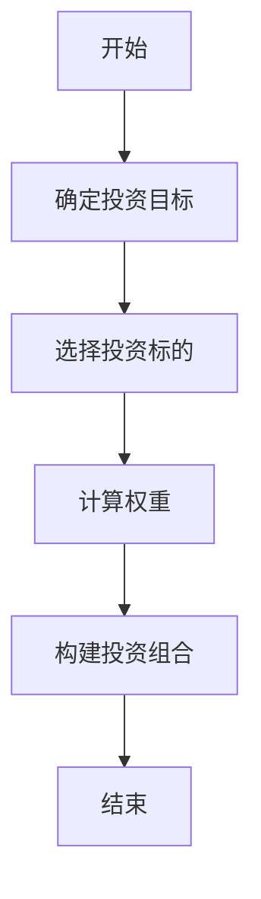
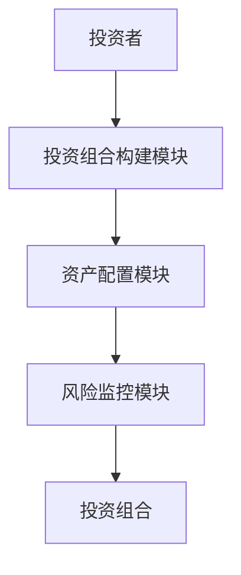

                 


# 平均分配投资：巴菲特的风险管理策略

> 关键词：平均分配投资、巴菲特、风险管理、投资策略、资产配置

> 摘要：本文详细分析了巴菲特的平均分配投资策略，探讨其背后的数学原理、系统架构和实际应用，帮助投资者理解如何通过分散化降低风险，实现稳健投资。

---

## 第一部分: 平均分配投资的背景与核心概念

### 第1章: 平均分配投资的背景介绍

#### 1.1 问题背景与问题描述

- **问题背景**：投资市场的不确定性导致高风险，投资者如何平衡风险与收益？
- **问题描述**：单一投资高波动，分散投资能否降低风险？
- **解决方案**：平均分配投资策略，通过分散化降低波动性。

#### 1.2 问题解决与边界

- **解决方案**：构建多样化的投资组合，降低单一资产的风险。
- **边界与外延**：适用于多种资产类别，避免过度集中。
- **对比其他策略**：均值-方差优化、现代投资组合理论（MPT）。

#### 1.3 核心要素与概念结构

- **核心要素**：投资目标、风险承受能力、资产选择。
- **概念结构**：投资者 -> 投资组合 -> 资产 -> 标的资产。

### 第2章: 平均分配投资的核心概念与联系

#### 2.1 核心概念原理

- **分散化原理**：通过投资多个不相关的资产降低整体风险。
- **风险与收益平衡**：平均分配降低极端波动，保持稳定收益。

#### 2.2 核心概念属性特征对比表格

| 概念       | 高风险 | 高波动 | 高不确定性 |
|------------|--------|--------|------------|
| 单一投资    | 是     | 是     | 是         |
| 投资组合   | 否     | 否     | 否         |

#### 2.3 ER实体关系图



### 第3章: 平均分配投资的算法原理

#### 3.1 算法原理流程图



#### 3.2 算法实现代码

```python
def average_distribution投资组合(投资标的, 目标风险):
    投资组合 = []
    for 标的资产 in 投资标的:
        权重 = 1 / len(投资标的)
        投资组合.append(标的资产 * 权重)
    return 投资组合
```

#### 3.3 数学模型与公式

$$ \text{投资组合收益} = \sum_{i=1}^{n} w_i \times r_i $$
其中：
- \( w_i \) 是第i个资产的权重
- \( r_i \) 是第i个资产的预期收益

#### 3.4 举例说明

假设投资三个资产，权重均为1/3，预期收益分别为5%、7%、9%，则投资组合的预期收益为：
$$ \frac{1}{3} \times 5\% + \frac{1}{3} \times 7\% + \frac{1}{3} \times 9\% = 7\% $$

### 第4章: 平均分配投资的系统分析与架构设计

#### 4.1 问题场景介绍

- **投资组合构建**：如何选择资产？
- **资产配置**：如何分配权重？
- **风险监控**：如何调整组合？

#### 4.2 系统功能设计

- **投资组合构建模块**：选择和配置资产。
- **资产配置模块**：计算权重。
- **风险监控模块**：定期评估和调整。

#### 4.3 系统架构设计



---

## 第二部分: 平均分配投资的系统实现与实战应用

### 第5章: 系统实现

#### 5.1 环境安装

- **工具**：Python、Jupyter Notebook
- **库**：pandas, numpy, matplotlib

#### 5.2 核心实现

```python
import pandas as pd
import numpy as np

def compute_weights(assets):
    return [1/len(assets) for _ in range(len(assets))]

assets = ['股票', '债券', '现金']
weights = compute_weights(assets)
portfolio = pd.DataFrame({'资产': assets, '权重': weights})
print(portfolio)
```

### 第6章: 项目实战

#### 6.1 投资组合构建案例

- **目标**：构建一个三资产组合，权重均为1/3。
- **步骤**：
  1. 选择资产：股票、债券、现金。
  2. 计算权重。
  3. 构建组合。
  4. 监控表现。

#### 6.2 投资组合调整案例

- **目标**：应对市场变化调整权重。
- **步骤**：
  1. 评估当前组合表现。
  2. 分析市场趋势。
  3. 调整权重，保持分散。

### 第7章: 系统优化与注意事项

#### 7.1 系统优化

- **动态调整**：定期再平衡，保持权重。
- **风险管理**：设置止损，避免重大损失。

#### 7.2 注意事项

- **市场风险**：不可忽视整体市场波动。
- **流动性**：确保资产易于变现。
- **长期视角**：避免频繁调整。

---

## 第三部分: 总结与展望

### 第8章: 总结

- **核心观点**：平均分配投资降低风险，提高稳定性。
- **成功关键**：分散化、定期调整、长期持有。

### 第9章: 展望

- **技术进步**：AI优化投资组合。
- **未来趋势**：动态再平衡和自动化投资。

---

## 作者

作者：AI天才研究院/AI Genius Institute & 禅与计算机程序设计艺术 /Zen And The Art of Computer Programming

---

通过详细分析巴菲特的平均分配投资策略，本文为投资者提供了理论与实践相结合的指导，帮助他们在复杂市场中稳健投资。

