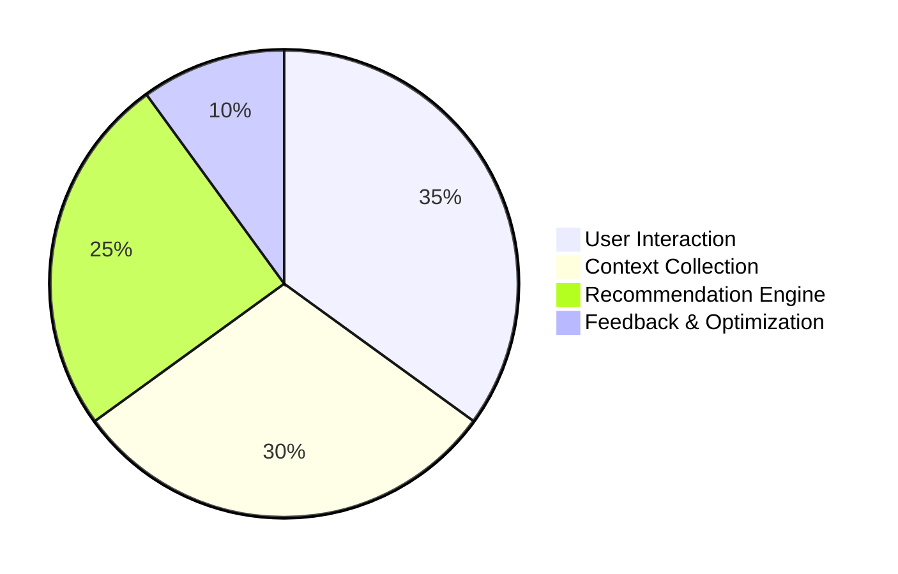
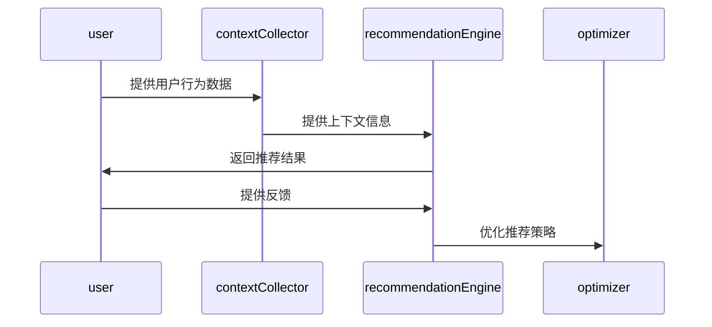

                 


# 开发AI Agent的上下文感知推荐系统

## 关键词
- AI Agent
- 上下文感知
- 推荐系统
- 算法原理
- 系统架构

## 摘要
本文详细探讨了开发AI Agent的上下文感知推荐系统的各个方面，从基础概念到系统架构，再到实际项目实现，层层深入，帮助读者全面理解并掌握相关技术。

---

# 第一部分: AI Agent与上下文感知推荐系统概述

# 第1章: AI Agent与上下文感知推荐系统背景

## 1.1 AI Agent的基本概念
### 1.1.1 AI Agent的定义与特点
AI Agent（智能体）是指在计算机系统中能够感知环境并采取行动以实现目标的实体。其特点包括自主性、反应性、主动性、社会性等。

### 1.1.2 AI Agent的分类与应用场景
AI Agent可分为简单反射型、基于模型的反射型、目标驱动型和效用驱动型。应用场景包括智能推荐、自动驾驶、智能助手等。

### 1.1.3 上下文感知推荐系统的定义
上下文感知推荐系统是一种能够根据用户的行为、环境和时间等因素，动态调整推荐结果的推荐系统。

## 1.2 上下文感知推荐系统的背景与重要性
### 1.2.1 推荐系统的发展历程
从早期的协同过滤到现代的深度学习推荐系统，推荐系统经历了多次演变。

### 1.2.2 上下文感知推荐系统的优势
通过考虑上下文信息，推荐系统能够提供更精准和个性化的推荐。

### 1.2.3 当前面临的挑战与机遇
挑战包括数据稀疏性、实时性要求高等，机遇则是技术的进步和应用场景的扩展。

## 1.3 问题背景与目标
### 1.3.1 当前推荐系统的局限性
传统推荐系统难以处理实时变化和复杂上下文信息。

### 1.3.2 上下文感知推荐系统的目标
通过结合上下文信息，提升推荐的准确性和用户体验。

### 1.3.3 问题解决的思路与方法
采用AI Agent技术，实时感知上下文并动态调整推荐策略。

## 1.4 本章小结

---

# 第二部分: 核心概念与联系

# 第2章: AI Agent与上下文感知推荐系统的结合

## 2.1 AI Agent的核心原理
### 2.1.1 AI Agent的决策机制
基于感知环境信息，通过推理和规划模块做出决策。

### 2.1.2 知识表示与推理方法
使用知识图谱和逻辑推理技术，处理上下文信息。

### 2.1.3 多智能体协作模型
通过多智能体协作，提升推荐系统的多样性和鲁棒性。

## 2.2 上下文感知推荐系统的原理
### 2.2.1 上下文信息的收集与处理
通过传感器、日志分析等方式收集上下文信息，并进行特征提取。

### 2.2.2 上下文与推荐结果的关联机制
利用关联规则挖掘和注意力机制，将上下文与推荐结果建立关联。

### 2.2.3 动态调整推荐策略的方法
基于时间序列分析和强化学习，动态优化推荐策略。

## 2.3 AI Agent与上下文感知推荐系统的结合方式
### 2.3.1 AI Agent作为推荐系统的驱动
AI Agent负责感知上下文并驱动推荐过程。

### 2.3.2 上下文感知推荐系统为AI Agent提供决策支持
推荐系统为AI Agent提供多样化的选项，辅助决策。

### 2.3.3 两者的协同优化
通过协同设计，提升推荐系统的准确性和实时性。

## 2.4 核心概念对比与ER实体关系图
### 2.4.1 核心概念对比表格
| 比较维度 | AI Agent | 上下文感知推荐系统 |
|----------|-----------|--------------------|
| 核心功能 | 感知环境、决策 | 推荐个性化内容     |
| 输入     | 上下文信息 | 用户行为、环境数据 |
| 输出     | 行动决策   | 推荐结果           |

### 2.4.2 ER实体关系图（Mermaid）

```mermaid
erDiagram
    user {
        <User ID> int PK
        <User Name> string
        <User Preferences> string
    }
    context {
        <Context ID> int PK
        <Context Type> string
        <Context Data> string
    }
    recommendation {
        <Recommendation ID> int PK
        <Item ID> int
        <User ID> int
        <Context ID> int
    }
    user Recommends context
    context RecommendTo user
    user RECOMMENDATION recommendation
    context RECOMMENDATION recommendation
```

---

# 第三部分: 算法原理

# 第3章: 上下文感知推荐系统的算法原理

## 3.1 协同过滤算法
### 3.1.1 基于用户的协同过滤
通过计算用户相似度，推荐相似用户的物品。

### 3.1.2 基于物品的协同过滤
基于物品相似度，推荐相关物品。

## 3.2 基于内容的推荐算法
### 3.2.1 文本挖掘与特征提取
使用TF-IDF或Word2Vec提取物品特征。

### 3.2.2 基于余弦相似度的推荐
通过计算物品特征向量的相似度，进行推荐。

## 3.3 深度学习推荐模型
### 3.3.1 基于神经网络的推荐
使用DNN、RNN等模型，学习用户-物品交互的隐式表示。

### 3.3.2 注意力机制在推荐中的应用
通过注意力机制，捕捉上下文中的关键信息。

## 3.4 结合上下文的推荐算法
### 3.4.1 时间序列分析
考虑时间因素，动态调整推荐权重。

### 3.4.2 强化学习应用
通过Q-learning等方法，优化推荐策略。

## 3.5 算法实现示例（Python代码）
```python
import numpy as np

def collaborative_filtering(user_matrix, item_matrix):
    # 计算相似度矩阵
    similarity = np.dot(user_matrix, item_matrix.T)
    return similarity

def content_based_recommendation(items, user_profile):
    # 特征提取与相似度计算
    item_features = extract_features(items)
    user_vector = extract_features([user_profile])
    similarity = np.dot(user_vector, item_features.T)
    return similarity
```

---

# 第四部分: 系统架构与设计

# 第4章: 上下文感知推荐系统的架构设计

## 4.1 系统功能设计
### 4.1.1 用户信息收集模块
收集用户行为、偏好等信息。

### 4.1.2 上下文信息处理模块
处理环境、时间等上下文数据。

### 4.1.3 推荐算法模块
执行推荐算法，生成推荐结果。

### 4.1.4 优化与反馈模块
根据反馈优化推荐策略。

## 4.2 系统架构设计（Mermaid图）



## 4.3 系统接口设计
### 4.3.1 用户接口
RESTful API，如`POST /api/recommend`

### 4.3.2 系统接口
模块间接口，如`/api/process_context`

## 4.4 系统交互流程（Mermaid序列图）



---

# 第五部分: 项目实战

# 第5章: 上下文感知推荐系统项目实战

## 5.1 项目环境搭建
### 5.1.1 工具安装
安装Python、TensorFlow、Flask等工具。

## 5.2 系统核心实现
### 5.2.1 数据预处理
清洗和特征工程。

### 5.2.2 模型训练
训练推荐模型，如协同过滤或深度学习模型。

## 5.3 代码实现
```python
from flask import Flask, request, jsonify
import pandas as pd

app = Flask(__name__)

@app.route('/api/recommend', methods=['POST'])
def recommend():
    user_id = request.json['user_id']
    context = request.json['context']
    # 调用推荐算法
    recommendations = model.recommend(user_id, context)
    return jsonify({'recommendations': recommendations})

if __name__ == '__main__':
    app.run(debug=True)
```

## 5.4 案例分析
### 5.4.1 数据分析
分析用户行为和上下文数据，提取特征。

### 5.4.2 算法比较
对比不同算法的效果，选择最优方案。

## 5.5 项目小结
总结项目经验，提出改进建议。

---

# 第六部分: 总结与展望

# 第6章: 总结与展望

## 6.1 本章总结
回顾全文内容，总结开发AI Agent的上下文感知推荐系统的要点。

## 6.2 未来展望
探讨技术的发展趋势，如多模态推荐、边缘计算等。

---

# 附录

## 附录A: 工具安装指南
安装Python、TensorFlow、Flask等工具的步骤。

## 附录B: 参考文献
列出相关书籍和论文。

---

# 作者

作者：AI天才研究院/AI Genius Institute & 禅与计算机程序设计艺术 /Zen And The Art of Computer Programming

