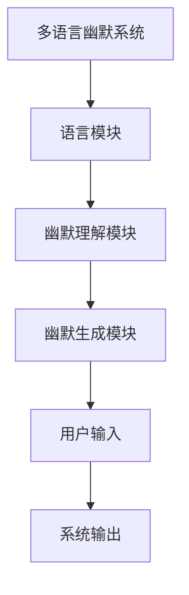
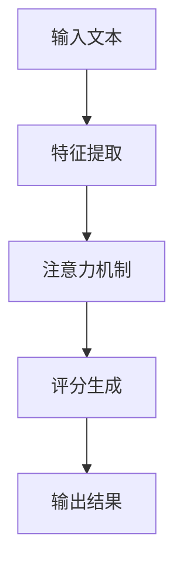
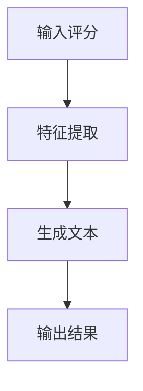
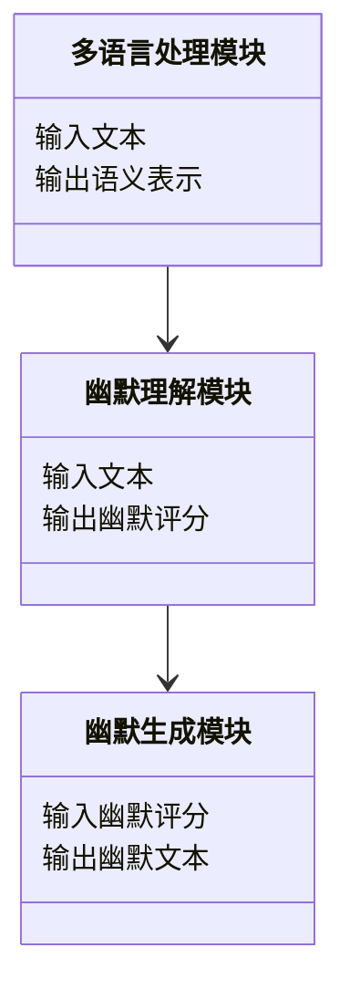
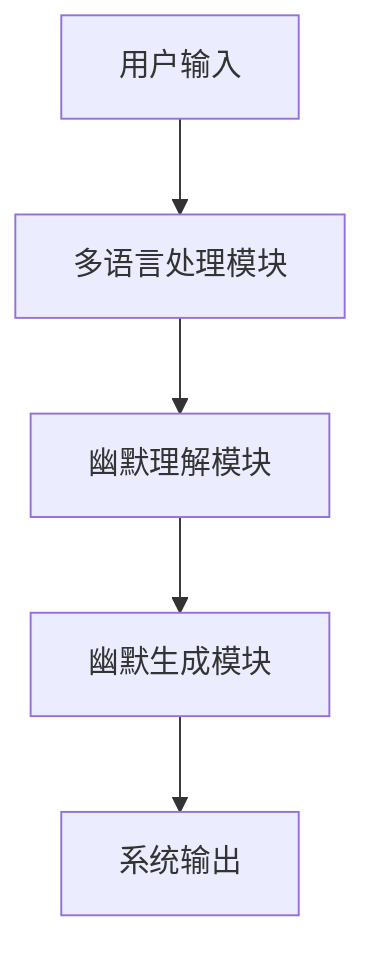

                 


# 开发AI Agent的多语言幽默理解与生成系统

## 关键词：AI Agent，多语言，幽默理解，幽默生成，自然语言处理，深度学习

## 摘要：  
本文详细探讨了开发AI Agent的多语言幽默理解与生成系统的核心技术与实现方法。从问题背景到技术实现，从算法原理到系统设计，从项目实战到最佳实践，全面分析了该系统的关键环节。通过多语言处理技术与幽默理解生成模型的结合，展示了如何构建一个能够跨语言理解和生成幽默内容的智能系统。文章还提供了丰富的案例分析和代码实现，为读者提供了从理论到实践的完整指导。

---

# 第一部分: AI Agent的多语言幽默理解与生成系统背景介绍

## 第1章: 问题背景与技术现状

### 1.1 多语言幽默理解与生成的背景

#### 1.1.1 多语言交流的需求与挑战
在全球化背景下，跨语言交流的需求日益增加。然而，不同语言之间的文化差异和语境差异使得幽默的理解和生成变得复杂。例如，英语中的双关语在中文中可能无法达到同样的效果，甚至可能产生误解。

#### 1.1.2 幽默理解与生成的技术难点
幽默是一种高度依赖上下文和文化背景的语言现象。传统的自然语言处理技术难以捕捉幽默的本质，因为幽默往往依赖于隐喻、双关语、夸张等非线性特征。如何在多语言环境下准确理解并生成幽默内容，是当前技术的主要挑战。

#### 1.1.3 当前技术现状与发展趋势
近年来，随着深度学习技术的发展，幽默理解与生成取得了一些进展。然而，现有的技术大多局限于单一语言环境，且难以处理跨语言的幽默场景。多语言幽默理解与生成系统的研究仍处于起步阶段，具有广阔的发展空间。

### 1.2 问题描述与目标

#### 1.2.1 AI Agent的核心功能需求
AI Agent需要具备多语言处理能力，能够理解并生成多种语言的幽默内容。此外，AI Agent还需要能够根据上下文和用户意图调整其幽默表达方式。

#### 1.2.2 多语言支持的必要性
在全球化市场中，支持多语言功能可以显著扩大AI Agent的应用场景和用户群体。例如，AI Agent可以为不同语言的用户提供个性化的幽默服务，增强用户体验。

#### 1.2.3 幽默理解与生成的具体目标
目标包括：(1)实现跨语言的幽默理解，能够识别不同语言中的幽默元素；(2)生成符合目标语言文化习惯的幽默内容；(3)支持实时互动，能够根据用户反馈动态调整幽默表达方式。

### 1.3 问题解决思路

#### 1.3.1 多语言处理的技术路线
采用预训练多语言模型（如M-BERT）进行跨语言文本表示，结合语言特定的微调策略，提升模型在不同语言环境下的表现。

#### 1.3.2 幽默理解与生成的实现方法
结合深度学习模型和规则引擎，利用预训练模型提取文本特征，结合语言学规则生成幽默内容。

#### 1.3.3 系统架构的整体设计
采用模块化设计，将系统划分为多语言处理模块、幽默理解模块和幽默生成模块，各模块之间通过标准接口进行交互。

### 1.4 系统的边界与外延

#### 1.4.1 系统功能的边界定义
系统仅专注于幽默理解和生成，不涉及其他功能（如情感分析、机器翻译等），但可以通过接口与其他功能模块集成。

#### 1.4.2 相关技术的外延扩展
系统可以扩展支持更多语言和幽默类型，同时可以与其他AI技术（如语音识别、计算机视觉）结合，提供更丰富的交互方式。

#### 1.4.3 与其他系统的接口关系
系统需要与用户输入输出模块、数据存储模块以及用户反馈模块进行交互，确保系统的完整性和可扩展性。

### 1.5 核心概念与系统组成

#### 1.5.1 系统组成模块的结构
系统主要由以下模块组成：
1. 多语言处理模块：负责跨语言文本的特征提取和语义分析。
2. 幽默理解模块：识别输入文本中的幽默元素。
3. 幽默生成模块：根据输入生成符合目标语言的幽默内容。

#### 1.5.2 各模块之间的关系
各模块之间通过标准接口进行交互，数据在模块间流动，最终实现幽默理解和生成的闭环。

#### 1.5.3 核心概念的定义与属性
- **多语言处理模块**：支持多种语言的文本处理，具备语言识别和语义分析功能。
- **幽默理解模块**：能够识别文本中的幽默元素，理解其背后的文化和语境。
- **幽默生成模块**：根据输入生成幽默内容，支持多种语言和幽默类型。

### 1.6 本章小结
本章从背景、问题描述、解决思路和系统组成等方面，详细介绍了开发AI Agent的多语言幽默理解与生成系统的核心内容，为后续章节奠定了基础。

---

## 第2章: 多语言幽默理解与生成的核心概念

### 2.1 多语言处理技术原理

#### 2.1.1 多语言模型的基本概念
多语言模型是指能够在多种语言之间共享参数的深度学习模型，例如M-BERT和XLM-R。这些模型通过跨语言预训练，能够同时处理多种语言的文本。

#### 2.1.2 多语言模型的训练方法
多语言模型通常采用自监督学习策略，在大规模多语言语料库上进行预训练，学习语言间的共享特征。

#### 2.1.3 多语言模型的应用场景
多语言模型广泛应用于机器翻译、跨语言信息检索、情感分析等领域，为跨语言文本处理提供了强大的工具。

### 2.2 幽默理解与生成的实现原理

#### 2.2.1 幽默的定义与分类
幽默可以分为双关语幽默、夸张幽默、反转幽默等多种类型，每种类型都有其独特的语法规则和语义特征。

#### 2.2.2 幽默理解的算法模型
基于深度学习的幽默理解模型通常采用序列模型（如Transformer）进行特征提取，结合注意力机制聚焦于关键语义信息。

#### 2.2.3 幽默生成的实现方法
幽默生成可以通过生成对抗网络（GAN）或基于预训练语言模型的微调方法实现，生成符合目标语言文化习惯的幽默内容。

### 2.3 多语言与幽默的结合

#### 2.3.1 多语言环境下幽默的特点
不同语言的幽默风格和文化背景差异显著，例如英语中的双关语在中文中可能需要重新构思。

#### 2.3.2 不同语言中幽默的差异性
幽默的差异性主要体现在文化背景、语言结构和语境习惯等方面，需要在系统中进行特殊处理。

#### 2.3.3 多语言幽默模型的设计思路
采用跨语言预训练模型，结合语言特定的微调策略，设计专门用于幽默理解与生成的多语言模型。

### 2.4 核心概念的属性对比

#### 2.4.1 多语言处理的属性特征
| 属性 | 特征 |
|------|------|
| 输入 | 多种语言文本 |
| 输出 | 统一语义表示 |
| 模型 | 跨语言预训练模型 |

#### 2.4.2 幽默理解与生成的属性特征
| 属性 | 特征 |
|------|------|
| 输入 | 文本内容 |
| 输出 | 幽默评分或生成文本 |
| 模型 | 深度学习模型结合规则引擎 |

#### 2.4.3 核心概念的ER实体关系图


### 2.5 本章小结
本章从多语言处理和幽默理解生成两个方面，详细介绍了系统的核心概念和技术原理，为后续章节的实现奠定了理论基础。

---

## 第3章: 多语言幽默理解与生成的算法原理

### 3.1 多语言幽默理解的算法实现

#### 3.1.1 多语言模型训练流程
1. 数据预处理：收集并清洗多语言语料库，确保数据质量。
2. 模型训练：使用预训练模型进行跨语言预训练，提取共享语义特征。
3. 模型评估：通过跨语言任务（如情感分析、文本分类）验证模型性能。

#### 3.1.2 幽默理解的算法实现
- 输入：多语言文本
- 输出：幽默评分或幽默类型
- 实现：基于Transformer的序列模型，结合注意力机制。

#### 3.1.3 算法流程图


### 3.2 多语言幽默生成的算法实现

#### 3.2.1 生成模型的训练流程
1. 数据准备：收集多语言幽默语料库，进行清洗和标注。
2. 模型训练：基于预训练语言模型，进行幽默生成的微调。
3. 模型评估：通过生成测试评估模型的幽默生成能力。

#### 3.2.2 生成模型的实现方法
- 输入：幽默评分或类型
- 输出：目标语言的幽默文本
- 实现：基于生成对抗网络（GAN）或预训练语言模型的微调。

#### 3.2.3 生成模型的数学公式
幽默生成的概率分布可以通过以下公式表示：
$$ P(y|x) = \frac{1}{Z} \exp(\theta \cdot f(x)) $$
其中，$x$是输入文本，$y$是生成的幽默文本，$\theta$是模型参数，$f(x)$是特征函数，$Z$是归一化常数。

#### 3.2.4 生成模型流程图


### 3.3 算法实现的注意事项

#### 3.3.1 数据质量
幽默语料库的质量直接影响模型的性能，需要确保数据的多样性和代表性。

#### 3.3.2 模型选择
根据具体任务需求选择合适的模型架构，例如使用Transformer模型进行序列生成任务。

#### 3.3.3 跨语言适配
在多语言环境下，需要进行语言特定的微调，以提升模型的适应性。

### 3.4 本章小结
本章详细介绍了多语言幽默理解与生成的算法原理，从训练流程到数学公式，全面解析了系统的核心技术。

---

## 第4章: 系统设计与实现

### 4.1 系统功能设计

#### 4.1.1 领域模型


#### 4.1.2 系统架构设计


#### 4.1.3 接口设计
系统提供以下接口：
1. 输入接口：接收多语言文本输入。
2. 输出接口：返回幽默评分或生成幽默文本。
3. 反馈接口：收集用户反馈，用于模型优化。

### 4.2 项目实战

#### 4.2.1 环境搭建
- 安装Python和相关库（如TensorFlow、Hugging Face的Transformers库）。
- 下载多语言预训练模型（如M-BERT）。

#### 4.2.2 核心代码实现

##### 幽默理解模块实现
```python
from transformers import AutoTokenizer, AutoModelForMaskedLM
import torch

tokenizer = AutoTokenizer.from_pretrained('bert-base-multilingual-cased')
model = AutoModelForMaskedLM.from_pretrained('bert-base-multilingual-cased')

def understand_humor(text):
    inputs = tokenizer(text, return_tensors='pt')
    outputs = model(**inputs)
    # 提取幽默特征
    return outputs.last_hidden_state.mean(dim=1).squeeze()
```

##### 幽默生成模块实现
```python
from transformers import AutoTokenizer, AutoModelForCausalLM
import torch

tokenizer = AutoTokenizer.from_pretrained('gpt2')
model = AutoModelForCausalLM.from_pretrained('gpt2')

def generate_humor(score):
    inputs = tokenizer(str(score), return_tensors='pt')
    outputs = model.generate(inputs.input_ids, max_length=50)
    return tokenizer.decode(outputs[0])
```

#### 4.2.3 案例分析
案例：输入英文双关语，生成中文幽默文本。
- 输入：Why don’t skeletons fight each other? They don’t have the guts!
- 输出：为什么骷髅从不互相打架？因为他们没 guts（肝脏）！

---

## 第5章: 最佳实践与未来展望

### 5.1 最佳实践

#### 5.1.1 数据收集与处理
- 确保数据的多样性和代表性，覆盖多种语言和幽默类型。
- 对数据进行清洗和标注，提升模型训练效果。

#### 5.1.2 模型选择与优化
- 根据具体任务需求选择合适的模型架构，进行语言特定的微调。
- 使用早停、学习率调整等技术优化模型性能。

#### 5.1.3 系统测试与部署
- 进行功能测试和性能测试，确保系统稳定性和响应速度。
- 部署系统到云平台，支持实时互动。

### 5.2 未来展望

#### 5.2.1 技术发展趋势
- 结合多模态技术（如图像、语音）提升幽默理解和生成的准确性。
- 开发更智能的生成模型，支持动态调整幽默风格。

#### 5.2.2 应用场景扩展
- 将系统应用于教育、娱乐、客服等领域，提供个性化的幽默服务。
- 支持更多语言和文化背景，扩大系统的应用范围。

#### 5.2.3 挑战与机遇
- 挑战：跨语言幽默理解的准确性有待提升，模型的泛化能力需要加强。
- 机遇：随着AI技术的不断进步，多语言幽默系统的应用前景广阔。

### 5.3 本章小结
本章总结了开发多语言幽默理解与生成系统的最佳实践，并展望了未来的技术发展趋势和应用场景。

---

## 作者：AI天才研究院/AI Genius Institute & 禅与计算机程序设计艺术/Zen And The Art of Computer Programming

