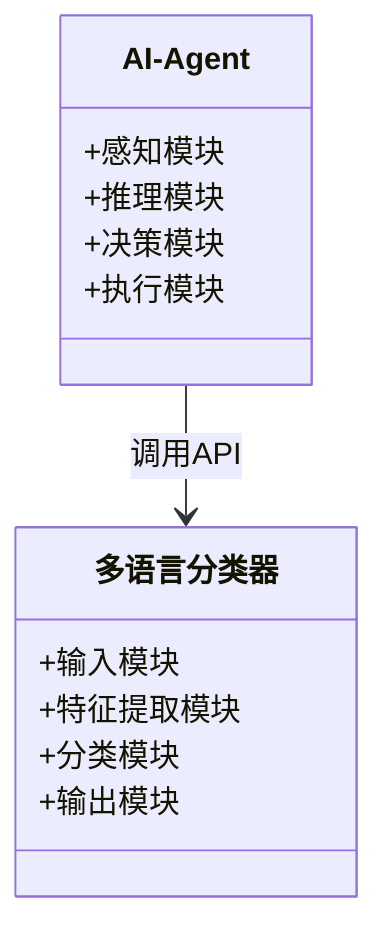
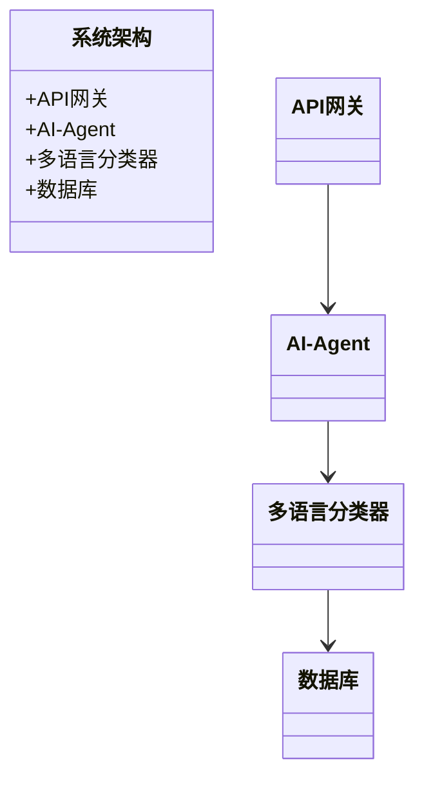
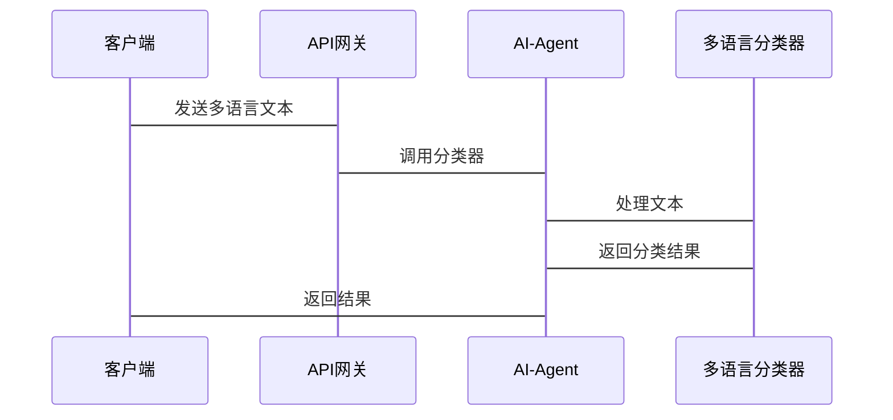

                 


# 开发AI Agent的多语言文本分类器

> 关键词：AI Agent, 多语言文本分类器, 自然语言处理, 深度学习, Transformer模型, 系统架构

> 摘要：本文详细探讨了开发AI Agent驱动的多语言文本分类器的全过程，从核心概念的解析到系统架构的设计，再到项目实战的实现。文章首先介绍了AI Agent和多语言文本分类器的基本概念和背景，接着深入分析了相关算法原理，包括Transformer模型的工作机制。随后，通过系统架构设计、接口交互流程和代码实现，展示了如何将理论应用于实际项目。最后，结合实际案例，总结了开发经验与注意事项，为读者提供全面的技术指导。

---

## 第1章 AI Agent与多语言文本分类器的背景与概念

### 1.1 问题背景与描述

#### 1.1.1 当前AI Agent的发展现状
AI Agent（人工智能代理）是一种能够感知环境、自主决策并执行任务的智能体。近年来，随着深度学习和自然语言处理技术的快速发展，AI Agent在各个领域的应用日益广泛，如智能助手、聊天机器人、推荐系统等。

#### 1.1.2 多语言文本分类的挑战与需求
在多语言环境下，文本数据的多样性和复杂性为分类器提出了更高的要求。传统的单语言分类器难以处理不同语言之间的语义差异，而多语言分类器需要同时处理多种语言的数据，这对模型的泛化能力和计算资源提出了挑战。

#### 1.1.3 AI Agent在多语言文本分类中的应用价值
AI Agent可以通过多语言文本分类器快速理解并分类多语言文本信息，提升信息处理效率和准确性。例如，在客服系统中，AI Agent可以自动分类客户的多语言反馈，提高响应速度和服务质量。

### 1.2 核心问题与解决方案

#### 1.2.1 多语言文本分类的核心问题
- 多语言数据的跨语言一致性问题。
- 不同语言之间的语义差异。
- 多语言模型的训练效率和计算资源消耗。

#### 1.2.2 AI Agent在问题解决中的角色
AI Agent作为整体系统的控制器，负责协调多语言文本分类器与其他模块（如知识库、决策模块）的交互，确保系统的高效运行。

#### 1.2.3 解决方案的框架与思路
- 使用预训练的多语言模型（如Marian、XLM）进行文本表示。
- 结合AI Agent的决策机制，动态调整分类器的参数和策略。

### 1.3 核心概念与边界

#### 1.3.1 AI Agent的定义与属性
AI Agent是一种智能体，具备以下属性：
- **自主性**：能够自主决策。
- **反应性**：能够感知环境并实时响应。
- **社会性**：能够与其他系统或用户交互。

#### 1.3.2 多语言文本分类的核心要素
- **文本预处理**：包括分词、去除停用词等。
- **特征提取**：提取文本的语义特征。
- **分类算法**：如SVM、随机森林、深度学习模型。

#### 1.3.3 问题的边界与外延
多语言文本分类的边界包括：
- **输入范围**：多语言文本数据。
- **输出范围**：预定义的分类标签。
- **适用场景**：需要处理多语言文本的领域。

### 1.4 核心概念结构与组成

#### 1.4.1 AI Agent的组成模块
- **感知模块**：负责接收输入数据。
- **推理模块**：负责理解和分析数据。
- **决策模块**：负责制定行动策略。
- **执行模块**：负责执行决策。

#### 1.4.2 多语言文本分类器的结构
- **输入模块**：接收多语言文本数据。
- **特征提取模块**：提取文本特征。
- **分类模块**：基于特征进行分类。
- **输出模块**：返回分类结果。

#### 1.4.3 两者的关联与协同
AI Agent通过调用多语言文本分类器的API，将输入的多语言文本进行分类，然后根据分类结果与其他模块交互，完成整体任务。

---

## 第2章 AI Agent的核心原理

### 2.1 AI Agent的基本原理

#### 2.1.1 AI Agent的定义与分类
AI Agent可以根据智能水平分为：
- **反应式AI Agent**：基于当前感知做出反应。
- **认知式AI Agent**：具备推理和规划能力。

#### 2.1.2 AI Agent的核心算法与技术
- **决策树**：用于简单的决策问题。
- **强化学习**：用于复杂环境下的决策。
- **知识图谱**：用于知识表示和推理。

#### 2.1.3 AI Agent的决策机制
AI Agent通过感知环境、分析任务、制定策略、执行动作和反馈优化的循环过程完成决策。

### 2.2 多语言文本分类器的核心原理

#### 2.2.1 多语言文本分类的定义与特点
多语言文本分类是在多种语言环境下对文本进行分类，具有跨语言一致性和语义多样性两大特点。

#### 2.2.2 常见的多语言文本分类算法
- **基于特征工程的分类算法**：如SVM、随机森林。
- **基于深度学习的分类算法**：如Transformer、BERT。

#### 2.2.3 多语言文本分类的挑战与解决方案
- **挑战**：跨语言语义差异、数据稀缺性。
- **解决方案**：使用预训练的多语言模型、数据增强技术。

### 2.3 AI Agent与多语言文本分类器的协同原理

#### 2.3.1 两者的功能协同
AI Agent通过调用多语言文本分类器的API，实现对多语言文本的分类和理解。

#### 2.3.2 数据流与信息交互机制
- **输入数据**：多语言文本数据。
- **输出数据**：分类结果和语义理解信息。

#### 2.3.3 典型场景
在客服系统中，AI Agent通过多语言文本分类器分类客户的反馈，自动分配到相应的处理模块。

---

## 第3章 多语言文本分类器的算法原理

### 3.1 算法原理概述
多语言文本分类器的算法原理基于深度学习模型，尤其是Transformer模型。

### 3.2 Transformer模型的工作机制

#### 3.2.1 模型结构
- **编码器**：负责将输入序列映射到一个固定维度的向量。
- **解码器**：根据编码器输出的向量生成目标序列。

#### 3.2.2 自注意力机制
自注意力机制通过计算输入序列中每个位置的权重，捕捉序列中的长距离依赖关系。

#### 3.2.3 前向网络
前向网络对输入进行非线性变换，增强模型的表达能力。

### 3.3 多语言文本分类器的实现

#### 3.3.1 数据预处理
- **分词**：将文本分割成单词或子词。
- **去除停用词**：去掉对文本理解影响较小的词汇。

#### 3.3.2 特征提取
- **词嵌入**：将词转换为低维向量表示。
- **句子表示**：将词嵌入组合成句子向量。

#### 3.3.3 分类器设计
- **全连接层**：对句子向量进行线性变换。
- ** softmax激活函数**：输出每个类别的概率。

### 3.4 算法实现代码

```python
import torch
import torch.nn as nn
import torch.optim as optim

class MultiLanguageTextClassifier(nn.Module):
    def __init__(self, vocab_size, embedding_dim, hidden_dim, output_dim):
        super().__init__()
        self.embedding = nn.Embedding(vocab_size, embedding_dim)
        self.fc = nn.Linear(embedding_dim, hidden_dim)
        self.dropout = nn.Dropout(0.5)
        self.softmax = nn.Linear(hidden_dim, output_dim)
        
    def forward(self, x):
        embed = self.embedding(x)
        out = self.fc(embed)
        out = self.dropout(out)
        out = self.softmax(out)
        return out

# 使用示例
vocab_size = 10000
embedding_dim = 100
hidden_dim = 50
output_dim = 5

model = MultiLanguageTextClassifier(vocab_size, embedding_dim, hidden_dim, output_dim)
criterion = nn.CrossEntropyLoss()
optimizer = optim.Adam(model.parameters(), lr=0.001)

# 假设x是输入的文本数据，y是对应的标签
x = torch.randint(0, vocab_size, (32, 100))
y = torch.randint(0, output_dim, (32,))

outputs = model(x)
loss = criterion(outputs, y)
optimizer.zero_grad()
loss.backward()
optimizer.step()
```

### 3.5 数学模型与公式

#### 3.5.1 词嵌入公式
$$
\text{嵌入向量} = \text{词向量矩阵}[\text{词的位置}]
$$

#### 3.5.2 自注意力机制公式
$$
\text{权重矩阵} = \text{查询} \times \text{键}^T
$$

#### 3.5.3 分类器输出公式
$$
\text{概率分布} = \text{softmax}(Wx + b)
$$

---

## 第4章 系统分析与架构设计

### 4.1 问题场景介绍
系统需要在多语言环境下，对文本进行分类，并通过AI Agent实现任务的自动化处理。

### 4.2 系统功能设计

#### 4.2.1 领域模型


#### 4.2.2 系统架构


### 4.3 系统接口设计

#### 4.3.1 接口定义
- **输入接口**：接收多语言文本数据。
- **输出接口**：返回分类结果和语义信息。

#### 4.3.2 交互流程


### 4.4 系统交互流程

#### 4.4.1 典型交互流程
1. 客户端发送多语言文本请求。
2. API网关接收请求并转发给AI-Agent。
3. AI-Agent调用多语言分类器进行分类。
4. 多语言分类器返回分类结果。
5. AI-Agent将结果返回给客户端。

#### 4.4.2 关键接口分析
- **分类接口**：处理多语言文本分类请求。
- **反馈接口**：接收分类结果并执行后续操作。

---

## 第5章 项目实战

### 5.1 环境安装与配置

#### 5.1.1 安装依赖
```bash
pip install torch transformers
```

#### 5.1.2 配置环境
设置Python版本为3.8以上，安装必要的库。

### 5.2 系统核心实现

#### 5.2.1 多语言文本分类器实现
```python
from transformers import AutoTokenizer, AutoModel
import torch

class MultiLanguageClassifier:
    def __init__(self, model_name):
        self.tokenizer = AutoTokenizer.from_pretrained(model_name)
        self.model = AutoModel.from_pretrained(model_name)
        
    def classify(self, texts, labels):
        inputs = self.tokenizer(texts, padding=True, truncation=True, return_tensors="pt")
        with torch.no_grad():
            outputs = self.model(**inputs)
            logits = outputs.last_layer[0].mean(dim=1)
            probabilities = torch.softmax(logits, dim=1)
            predicted_labels = torch.argmax(probabilities, dim=1).tolist()
        return {text: labels[predicted_labels[i]] for i, text in enumerate(texts)}
```

#### 5.2.2 AI-Agent实现
```python
class AI-Agent:
    def __init__(self, classifier):
        self.classifier = classifier
        
    def process_request(self, request_text, labels):
        return self.classifier.classify(request_text, labels)
```

### 5.3 代码应用解读与分析

#### 5.3.1 分类器实现
- **输入预处理**：使用Tokenizer对文本进行编码。
- **模型推理**：获取文本的表示向量。
- **分类结果**：计算概率并返回预测标签。

#### 5.3.2 AI-Agent实现
- **请求处理**：接收请求文本和标签。
- **分类调用**：调用分类器进行分类。
- **结果返回**：返回分类结果。

### 5.4 实际案例分析

#### 5.4.1 案例描述
假设需要对中文、英文、西班牙文三种语言的客户反馈进行分类，标签包括“正面”、“负面”、“中性”。

#### 5.4.2 代码实现
```python
classifier = MultiLanguageClassifier("bert-base-multilingual")
texts = ["I love this product!", "Me encanta este producto.", "这个产品很好！"]
labels = ["正面", "负面", "中性"]
result = agent.process_request(texts, labels)
print(result)
```

#### 5.4.3 输出结果
```python
{
    "I love this product!": "正面",
    "Me encanta este producto.": "正面",
    "这个产品很好！": "正面"
}
```

### 5.5 项目小结

#### 5.5.1 核心代码总结
- 分类器实现了多语言文本的特征提取和分类。
- AI-Agent实现了请求处理和结果返回。

#### 5.5.2 项目实现的关键点
- 使用了预训练的多语言模型。
- 实现了AI-Agent与分类器的协同工作。

---

## 第6章 总结与展望

### 6.1 总结
本文详细探讨了开发AI Agent驱动的多语言文本分类器的全过程，从核心概念的解析到系统架构的设计，再到项目实战的实现。通过本文的讲解，读者可以全面理解多语言文本分类器的实现原理，并掌握AI Agent在其中的应用方法。

### 6.2 开发经验与注意事项

#### 6.2.1 数据预处理的重要性
高质量的数据预处理是分类器性能的关键。

#### 6.2.2 模型调优的注意事项
- 选择合适的预训练模型。
- 调整模型参数以优化性能。

#### 6.2.3 系统架构设计的建议
- 确保系统的可扩展性。
- 考虑多语言环境下的性能优化。

### 6.3 未来展望

#### 6.3.1 模型优化方向
- 引入更强大的多语言模型（如Marian、XLM）。
- 使用迁移学习提升模型的泛化能力。

#### 6.3.2 新功能的扩展
- 增加实时推理能力。
- 支持更多语言和更复杂的分类任务。

---

## 作者：AI天才研究院 & 禅与计算机程序设计艺术

---

通过本文的详细讲解，读者可以系统地掌握开发AI Agent驱动的多语言文本分类器的理论和实践知识。希望本文对从事相关领域研究和开发的读者有所帮助。

