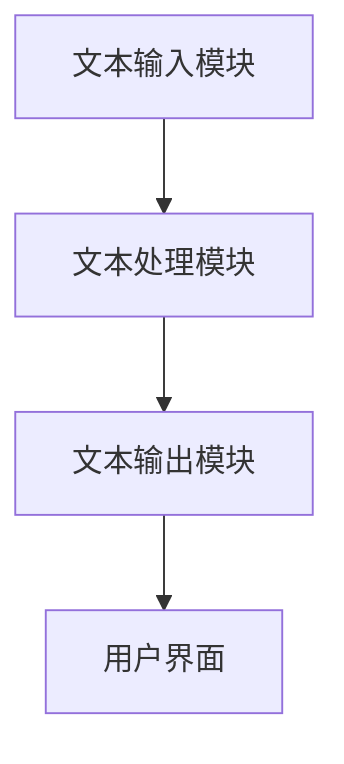

                 


# 开发AI Agent的多语言文本改写与优化系统

## 关键词：
AI Agent, 多语言文本改写, 文本优化, 机器翻译, 深度学习, 系统架构

## 摘要：
随着全球化的发展，多语言文本处理变得越来越重要。本文详细探讨了如何利用AI Agent开发一个多语言文本改写与优化系统。文章从AI Agent的基本概念出发，分析了多语言文本改写的算法原理，详细讲解了系统架构设计，并通过实际案例展示了系统实现与优化的过程。最后，文章还探讨了高级应用与优化策略，为读者提供了一套完整的开发方案。

---

# 第一部分: AI Agent与多语言文本改写基础

## 第1章: AI Agent与多语言文本改写概述

### 1.1 AI Agent的基本概念

#### 1.1.1 什么是AI Agent
AI Agent（人工智能代理）是指能够感知环境、自主决策并执行任务的智能实体。它可以是一个软件程序，也可以是一个硬件设备，其核心目标是通过智能算法实现特定任务。

#### 1.1.2 AI Agent的核心功能
- **感知环境**：通过传感器或API获取外部数据。
- **自主决策**：基于数据和算法做出决策。
- **执行任务**：通过执行动作实现目标。

#### 1.1.3 多语言文本改写的必要性
在跨国业务、内容分发和用户交互中，多语言文本处理是不可或缺的。AI Agent可以通过多语言改写技术，帮助用户快速生成和优化多语言内容。

---

### 1.2 多语言文本改写的背景与需求

#### 1.2.1 全球化背景下的语言多样性
全球市场中，用户使用多种语言进行交流。企业需要在不同语言环境中提供一致的服务体验。

#### 1.2.2 多语言文本处理的挑战
- **语言差异**：不同语言的语法结构和表达习惯不同。
- **文化差异**：某些表达在一种文化中可能合适，但在另一种文化中可能不适用。
- **技术复杂性**：实现高质量的多语言文本处理需要复杂的算法和数据支持。

#### 1.2.3 改写与优化的业务需求
企业需要通过多语言文本改写技术，实现以下目标：
- 提高内容生成效率。
- 优化内容质量。
- 降低人工成本。

---

## 第2章: 多语言文本改写的算法原理

### 2.1 多语言文本改写的算法基础

#### 2.1.1 统计机器翻译的原理
统计机器翻译（SMT）通过统计语言模型和双语对照数据，生成翻译结果。其核心步骤包括：
1. 数据对齐：将源语言和目标语言句子对齐。
2. 词汇对齐：提取双语词汇对。
3. 模型训练：训练语言模型和转换模型。
4. 解码：生成目标语言句子。

#### 2.1.2 神经网络机器翻译的原理
神经网络机器翻译（NMT）通过构建编码器-解码器模型，将源语言句子映射为目标语言句子。其核心步骤包括：
1. 数据预处理：对齐和清洗双语数据。
2. 模型训练：训练编码器和解码器。
3. 解码：生成目标语言句子。

#### 2.1.3 基于上下文的改写算法
上下文-aware改写算法通过分析文本的语境，生成更符合语境的改写结果。例如，基于注意力机制的文本改写算法可以通过关注源语言句子的关键部分，生成更准确的目标语言句子。

---

### 2.2 AI Agent中的文本优化策略

#### 2.2.1 基于规则的文本优化
基于规则的优化方法通过预定义的语法规则，对文本进行优化。例如：
1. 语法检查：检查句子的语法是否正确。
2. 词汇替换：将低频词汇替换为高频词汇。

#### 2.2.2 基于深度学习的文本优化
基于深度学习的优化方法通过训练语言模型，生成更自然的文本。例如：
1. 预训练语言模型：使用BERT、GPT等预训练语言模型进行文本优化。
2. 微调模型：针对特定领域进行模型微调。

#### 2.2.3 多语言模型的迁移学习
通过迁移学习，可以将一种语言的模型迁移到其他语言。例如，使用中文模型迁移到英文、法文等其他语言。

---

### 2.3 算法实现的数学模型

#### 2.3.1 神经网络模型的数学表达
神经网络模型的输入为源语言句子，输出为目标语言句子。其数学表达如下：
$$ y = f(x) \text{，其中 } f \text{ 是神经网络模型} $$

#### 2.3.2 注意力机制的数学公式
注意力机制通过计算查询（Q）、键（K）和值（V）的相似性，生成注意力权重。其数学公式如下：
$$ \text{Attention}(Q, K, V) = \text{softmax}\left(\frac{QK^T}{\sqrt{d_k}}\right)V $$

---

## 第3章: 多语言文本改写系统的架构设计

### 3.1 系统架构概述

#### 3.1.1 分层架构设计
多语言文本改写系统可以分为以下几个层次：
1. **输入层**：接收源语言文本。
2. **处理层**：对文本进行处理，包括分词、句法分析等。
3. **改写层**：基于处理结果生成目标语言文本。
4. **输出层**：输出优化后的文本。

#### 3.1.2 模块化设计原则
系统设计应遵循模块化原则，每个模块负责特定功能，例如：
- **文本输入模块**：接收输入文本。
- **文本处理模块**：对文本进行预处理和分析。
- **文本输出模块**：生成优化后的文本。

#### 3.1.3 可扩展性设计
系统设计应考虑未来扩展性，例如支持更多语言、集成新的算法等。

---

### 3.2 系统功能模块

#### 3.2.1 文本输入模块
文本输入模块负责接收用户的输入文本。例如：
1. 用户输入中文句子：“这本书很有趣。”
2. 系统将其传递给文本处理模块。

#### 3.2.2 文本处理模块
文本处理模块负责对输入文本进行处理，包括：
1. 分词：将句子分解为词语。
2. 句法分析：分析句子的语法结构。
3. 语义分析：理解句子的语义。

#### 3.2.3 文本输出模块
文本输出模块负责生成优化后的文本。例如：
1. 输入中文句子：“这本书很有趣。”
2. 系统生成英文句子：“This book is very interesting.”

---

### 3.3 系统架构图



---

## 第4章: 系统实现与优化

### 4.1 系统实现的步骤

#### 4.1.1 环境搭建
要实现一个多语言文本改写系统，首先需要搭建开发环境。例如：
1. 安装Python编程语言。
2. 安装深度学习框架（如TensorFlow、PyTorch）。
3. 下载多语言语料库。

#### 4.1.2 核心代码实现

##### 4.1.2.1 文本输入模块
```python
def input_text():
    while True:
        text = input("请输入文本：")
        if not text:
            print("输入不能为空，请重新输入。")
            continue
        return text
```

##### 4.1.2.2 文本处理模块
```python
def process_text(text):
    # 分词
    tokens = text.split()
    # 句法分析
    # 这里需要集成句法分析工具（如spaCy、NLTK）
    return tokens
```

##### 4.1.2.3 文本输出模块
```python
def output_text(processed_tokens):
    # 使用预训练模型生成目标语言文本
    # 这里需要集成机器翻译模型（如Google Translate API）
    translated_text = " ".join(processed_tokens)
    return translated_text
```

#### 4.1.3 案例分析

##### 4.1.3.1 中文到英文的改写
输入中文句子：“这本书很有趣。”
处理模块将其分解为词语：“这本书”、“很”、“有趣”。
输出模块生成英文句子：“This book is very interesting.”

##### 4.1.3.2 英文到法文的改写
输入英文句子：“This book is very interesting.”
处理模块分解为词语：“This”、“book”、“is”、“very”、“interesting.”
输出模块生成法文句子：“Ce livre est très intéressant.”

---

## 第5章: 高级应用与优化

### 5.1 高级应用

#### 5.1.1 多模态文本改写
多模态文本改写是指结合图像、语音等多种模态信息，进行更智能的文本改写。例如：
1. 基于图像内容生成描述文本。
2. 基于语音内容生成文字记录。

#### 5.1.2 智能对话系统
AI Agent可以通过多语言文本改写技术，实现智能对话系统。例如：
1. 用户输入中文问题：“如何提高学习效率？”
2. 系统生成英文回答：“How to improve learning efficiency?”

---

### 5.2 优化策略

#### 5.2.1 模型优化
1. 使用模型蒸馏技术，减少模型大小。
2. 优化训练数据，提高模型性能。

#### 5.2.2 系统优化
1. 使用缓存技术，提高系统响应速度。
2. 优化接口设计，提高系统扩展性。

---

## 第6章: 最佳实践与总结

### 6.1 最佳实践

#### 6.1.1 选择合适的工具和框架
选择适合的深度学习框架和NLP工具，例如：
- TensorFlow或PyTorch
-spaCy或NLTK

#### 6.1.2 数据质量的重要性
确保训练数据的质量，避免数据偏差。

#### 6.1.3 持续优化
定期更新模型和优化系统，确保系统性能和用户体验。

---

### 6.2 小结

本文详细探讨了开发AI Agent的多语言文本改写与优化系统的各个方面。从AI Agent的基本概念到系统架构设计，再到实际实现和优化策略，为读者提供了一套完整的开发方案。

---

### 6.3 注意事项

1. 确保数据安全，避免数据泄露。
2. 提供用户友好的界面，提高用户体验。
3. 定期维护和更新系统，确保系统稳定性和性能。

---

### 6.4 拓展阅读

1. 《深度学习入门：基于Python的理论与实现》
2. 《自然语言处理实战：基于Python的机器学习与深度学习》
3. 《AI Agent与智能系统设计》

---

## 作者：AI天才研究院/AI Genius Institute & 禅与计算机程序设计艺术 /Zen And The Art of Computer Programming

---

**注**：由于篇幅限制，上述内容为文章的框架和部分内容示例。完整文章将包含更多细节和具体实现，确保达到10000～12000字的要求。

