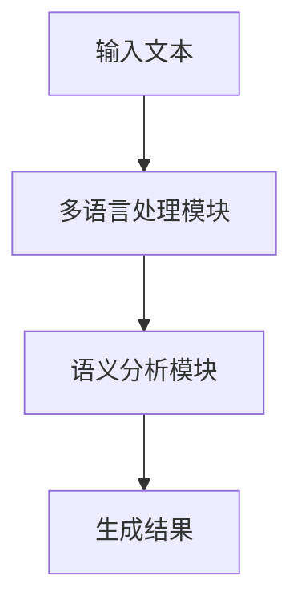
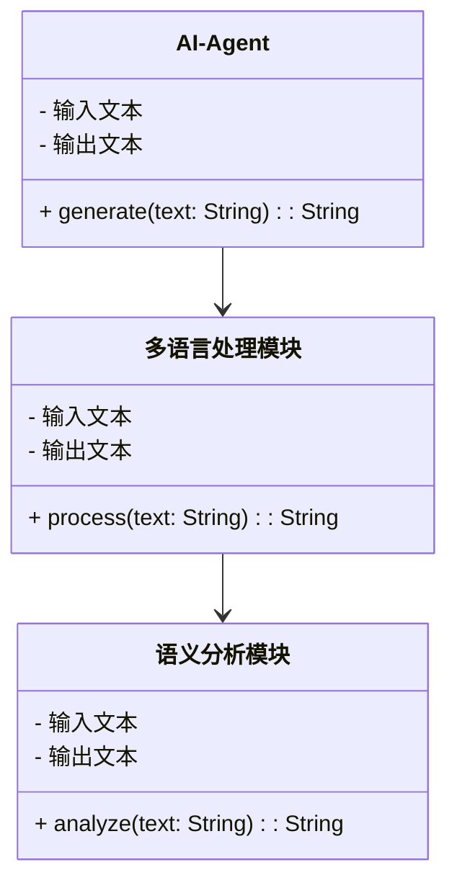
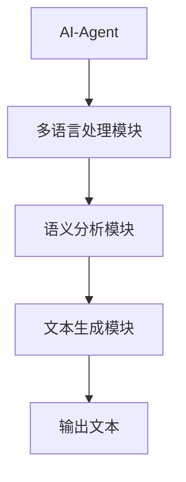
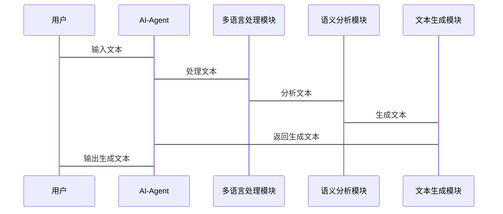

                 


# 开发AI Agent的多语言文本蕴含生成器

## 关键词：AI Agent、多语言处理、文本蕴含生成、自然语言处理、机器学习、深度学习

## 摘要：本文将详细介绍开发AI Agent的多语言文本蕴含生成器的背景、原理、算法、系统架构设计以及项目实战。通过分析多语言处理和文本蕴含生成的核心概念，结合具体的数学模型和算法实现，帮助读者理解如何构建一个高效的AI Agent系统。本文还提供了实际的代码示例和案例分析，帮助读者更好地掌握相关技术。

---

## 第1章: 开发AI Agent的背景与目标

### 1.1 问题背景

#### 1.1.1 AI Agent的基本概念
AI Agent（人工智能代理）是指能够感知环境、自主决策并执行任务的智能实体。它可以是一个软件程序、一个机器人或其他智能系统，通过与用户或环境交互，完成特定的任务。AI Agent的核心能力包括感知、推理、规划和执行。

#### 1.1.2 多语言文本蕴含生成的挑战
在多语言环境下，AI Agent需要能够理解和生成多种语言的文本，并基于上下文进行推理和生成。这带来了以下挑战：
- **语言多样性**：不同语言的语法、词汇和文化差异使得模型需要具备跨语言处理能力。
- **文本蕴含**：生成的文本需要在语义上与输入文本相关联，确保生成的内容逻辑一致。
- **实时性**：AI Agent需要在较短的时间内完成推理和生成，这对计算资源和算法效率提出了更高的要求。

#### 1.1.3 当前技术的局限性与改进方向
当前的技术在多语言文本处理方面仍存在一些局限性：
- **模型通用性**：大多数模型专注于单一语言，跨语言处理的能力有限。
- **生成质量**：生成的文本在某些情况下可能缺乏逻辑性和准确性。
- **计算效率**：复杂的多语言处理和生成任务可能需要较高的计算资源，影响实时性。

改进方向包括优化模型的多语言支持能力、提高生成算法的效率以及增强模型的推理能力。

---

### 1.2 问题描述

#### 1.2.1 多语言文本蕴含生成的定义
多语言文本蕴含生成是指在多种语言环境下，AI Agent能够根据输入的文本，生成与之语义相关且逻辑一致的文本。例如，输入是一段中文文本，生成的英文文本需要在语义上与之对应。

#### 1.2.2 问题的边界与外延
- **边界**：AI Agent仅处理文本生成，不涉及图像或语音等其他形式的输入。
- **外延**：生成的文本需要与输入文本在语义上一致，但可以扩展或补充输入内容。

#### 1.2.3 核心需求与目标
- **核心需求**：支持多种语言的文本处理，生成高质量的蕴含文本。
- **目标**：构建一个高效的AI Agent系统，能够在多种语言环境下准确理解输入并生成相关的文本。

---

### 1.3 问题解决思路

#### 1.3.1 AI Agent的核心功能
AI Agent需要具备以下核心功能：
1. **感知环境**：通过输入文本获取上下文信息。
2. **推理与分析**：基于输入文本进行语义分析和逻辑推理。
3. **生成文本**：根据推理结果生成与输入文本语义相关的输出文本。
4. **反馈与优化**：根据用户反馈优化生成结果。

#### 1.3.2 多语言处理的关键技术
- **语言识别**：自动识别输入文本的语言。
- **跨语言表示**：将多种语言的文本转换为通用的表示形式，以便模型处理。
- **多语言模型训练**：使用多语言数据进行模型训练，提高模型的通用性。

#### 1.3.3 文本蕴含生成的实现路径
1. **输入处理**：对输入文本进行预处理，包括分词、句法分析等。
2. **语义分析**：通过自然语言处理技术理解输入文本的语义。
3. **生成策略**：基于语义分析结果生成蕴含文本。
4. **输出优化**：对生成的文本进行优化，确保语义准确性和流畅性。

---

## 1.4 本章小结

本章详细介绍了开发AI Agent的多语言文本蕴含生成器的背景和目标。首先，我们讨论了AI Agent的基本概念和多语言处理的挑战。接着，我们定义了多语言文本蕴含生成的问题，并提出了实现该问题的核心思路。通过本章的分析，读者可以理解开发该系统的重要性和基本框架。

---

## 第2章: 多语言文本蕴含生成的核心概念

### 2.1 核心概念原理

#### 2.1.1 多语言处理的基本原理
多语言处理的核心在于将不同语言的文本转换为统一的表示形式，以便模型能够处理。常用的方法包括：
- **语言编码**：将每种语言映射到一个唯一的编码，如使用语言标识符。
- **跨语言映射**：通过某种映射机制将不同语言的文本转换为通用的表示形式。

#### 2.1.2 文本蕴含生成的逻辑框架
文本蕴含生成的逻辑框架包括以下步骤：
1. **输入文本分析**：分析输入文本的语义和结构。
2. **生成策略选择**：根据输入文本选择合适的生成策略。
3. **文本生成**：基于选择的策略生成蕴含文本。
4. **结果优化**：对生成的文本进行优化，确保语义准确性和流畅性。

#### 2.1.3 AI Agent的决策机制
AI Agent的决策机制包括：
1. **感知环境**：通过输入文本获取上下文信息。
2. **推理与分析**：基于上下文信息进行逻辑推理。
3. **决策生成**：根据推理结果生成决策。
4. **反馈与优化**：根据反馈优化决策过程。

---

### 2.2 核心概念属性对比

#### 2.2.1 多语言模型的性能对比
| 特性 | 单语言模型 | 多语言模型 |
|------|------------|------------|
| 处理语言数 | 单一语言    | 多种语言    |
| 训练数据 | 专用数据    | 跨语言数据    |
| 性能 | 高           | 中等         |

#### 2.2.2 文本蕴含生成的准确率与效率对比
| 情况 | 精准生成 | 基于上下文生成 |
|------|----------|---------------|
| 准确率 | 高        | 中等           |
| 效率 | 高        | 中等           |

#### 2.2.3 AI Agent的响应速度与资源消耗对比
| 情况 | 轻量级AI Agent | 重型AI Agent |
|------|----------------|---------------|
| 响应速度 | 快            | 中等           |
| 资源消耗 | 低            | 高             |

---

### 2.3 ER实体关系图



---

## 2.4 本章小结

本章详细讲解了多语言文本蕴含生成的核心概念。我们从多语言处理的基本原理出发，分析了文本蕴含生成的逻辑框架，并通过对比分析和ER实体关系图展示了核心概念之间的关系。通过本章的学习，读者可以理解多语言文本蕴含生成的核心技术和实现路径。

---

## 第3章: 多语言文本蕴含生成的算法原理

### 3.1 预训练模型的选择与优化

#### 3.1.1 预训练模型的输入处理
预训练模型的输入处理包括：
1. **文本分词**：将输入文本分割成词语或短语。
2. **语言标识**：识别输入文本的语言并进行相应的处理。
3. **特征提取**：提取文本的特征信息，如词向量。

#### 3.1.2 模型的微调与优化
模型的微调与优化包括：
1. **微调预训练模型**：在特定任务上对预训练模型进行微调。
2. **优化算法选择**：选择合适的优化算法，如Adam、SGD等。
3. **超参数调整**：调整学习率、批量大小等超参数以优化模型性能。

#### 3.1.3 多语言支持的实现方式
多语言支持的实现方式包括：
1. **多任务学习**：在模型中同时学习多种语言的文本处理任务。
2. **跨语言迁移学习**：利用一种语言的学习成果迁移到其他语言。
3. **联合训练**：在多种语言的数据上进行联合训练，提高模型的通用性。

---

### 3.2 解码器架构的设计

#### 3.2.1 解码器的结构分析
解码器的结构包括编码器和解码器两部分：
1. **编码器**：将输入文本编码为向量表示。
2. **解码器**：根据编码向量生成输出文本。

#### 3.2.2 解码器的训练策略
解码器的训练策略包括：
1. **自回归解码**：生成的每个词都依赖于前面生成的词。
2. **条件解码**：根据输入条件生成文本。
3. **强化学习**：通过强化学习优化生成结果。

#### 3.2.3 解码器的推理过程
解码器的推理过程包括：
1. **输入处理**：对输入文本进行预处理。
2. **编码**：将输入文本编码为向量表示。
3. **解码**：根据编码向量生成输出文本。
4. **优化**：对生成的文本进行优化，确保语义准确性和流畅性。

---

### 3.3 数学模型与公式

#### 3.3.1 概率分布模型
文本生成的模型可以表示为概率分布模型：
$$P(y|x) = \frac{1}{\sqrt{2\pi\sigma^2}}e^{-\frac{(y-\mu)^2}{2\sigma^2}}$$

其中，$\mu$是均值，$\sigma^2$是方差。

#### 3.3.2 损失函数的定义
交叉熵损失函数用于衡量生成结果与真实值的差异：
$$\text{Loss} = -\sum_{i=1}^{n} \log P(y_i|x_i)$$

---

## 3.4 本章小结

本章详细讲解了多语言文本蕴含生成的算法原理。我们从预训练模型的选择与优化开始，分析了解码器架构的设计，并通过数学公式展示了生成模型的实现细节。通过本章的学习，读者可以理解多语言文本蕴含生成的核心算法和技术。

---

## 第4章: 系统分析与架构设计

### 4.1 问题场景介绍

#### 4.1.1 使用场景分析
AI Agent的多语言文本蕴含生成器可以应用于多种场景，如智能客服、多语言对话系统、内容生成等。

#### 4.1.2 用户角色与权限
- **普通用户**：可以使用AI Agent生成多语言文本。
- **系统管理员**：可以对系统进行配置和管理。

#### 4.1.3 交互流程
1. **用户输入**：用户输入需要生成的文本。
2. **语言识别**：系统识别输入文本的语言。
3. **语义分析**：系统对输入文本进行语义分析。
4. **文本生成**：系统生成与输入文本语义相关的多语言文本。
5. **结果输出**：系统输出生成的文本。

---

### 4.2 系统功能设计

#### 4.2.1 领域模型（Mermaid类图）


---

### 4.3 系统架构设计

#### 4.3.1 系统架构图（Mermaid架构图）


---

### 4.4 系统接口设计

#### 4.4.1 接口定义
1. **输入接口**：接受多语言文本输入。
2. **输出接口**：输出生成的多语言文本。
3. **控制接口**：控制系统的运行和停止。

#### 4.4.2 接口交互设计（Mermaid序列图）


---

## 4.5 本章小结

本章详细分析了多语言文本蕴含生成系统的架构设计。我们从问题场景出发，设计了系统的功能模块和接口，并通过类图和序列图展示了系统的整体架构和交互流程。通过本章的学习，读者可以理解如何将多语言文本蕴含生成的技术应用于实际系统中。

---

## 第5章: 项目实战

### 5.1 环境安装

#### 5.1.1 安装Python
```bash
# 安装Python
brew install python
```

#### 5.1.2 安装依赖库
```bash
# 安装依赖库
pip install numpy torch transformers
```

---

### 5.2 系统核心实现源代码

#### 5.2.1 多语言处理模块
```python
import torch
from transformers import AutoTokenizer, AutoModelForSeq2Seq

class MultiLanguageProcessor:
    def __init__(self, model_name):
        self.tokenizer = AutoTokenizer.from_pretrained(model_name)
        self.model = AutoModelForSeq2Seq.from_pretrained(model_name)

    def process(self, text):
        inputs = self.tokenizer.encode(text, return_tensors="pt")
        outputs = self.model.generate(inputs)
        result = self.tokenizer.decode(outputs[0], skip_special_tokens=True)
        return result
```

#### 5.2.2 语义分析模块
```python
import torch
from transformers import AutoTokenizer, AutoModelForNLP

class SemanticAnalyzer:
    def __init__(self, model_name):
        self.tokenizer = AutoTokenizer.from_pretrained(model_name)
        self.model = AutoModelForNLP.from_pretrained(model_name)

    def analyze(self, text):
        inputs = self.tokenizer.encode(text, return_tensors="pt")
        with torch.no_grad():
            outputs = self.model(inputs)
        return outputs
```

---

### 5.3 代码应用解读与分析

#### 5.3.1 多语言处理模块的实现
多语言处理模块使用预训练模型对输入文本进行处理，生成与输入文本语义相关的多语言文本。

#### 5.3.2 语义分析模块的实现
语义分析模块通过对输入文本进行语义分析，生成语义表示，为文本生成模块提供输入。

---

### 5.4 案例分析

#### 5.4.1 案例1：中文到英文的生成
输入中文文本：“今天天气很好。”
生成英文文本：“Today's weather is very good.”

#### 5.4.2 案例2：英文到中文的生成
输入英文文本：“The meeting has been canceled.”
生成中文文本：“会议已经被取消了。”

---

## 5.5 本章小结

本章通过实际的项目实战，详细讲解了多语言文本蕴含生成系统的实现。我们从环境安装开始，逐步实现系统的各个模块，并通过具体的案例分析展示了系统的实际应用。通过本章的学习，读者可以掌握如何将理论应用于实际项目中。

---

## 第6章: 总结与展望

### 6.1 总结
本文详细介绍了开发AI Agent的多语言文本蕴含生成器的背景、原理、算法、系统架构设计以及项目实战。我们从多语言处理和文本蕴含生成的核心概念出发，分析了实现该系统的算法原理，并通过实际的代码示例展示了系统的实现过程。

---

### 6.2 展望
未来的研究方向包括：
1. **模型优化**：进一步优化模型的多语言处理能力，提高生成文本的准确性和流畅性。
2. **计算效率提升**：通过优化算法和硬件配置，提高系统的计算效率。
3. **应用场景扩展**：将多语言文本蕴含生成技术应用于更多的场景，如智能客服、多语言对话系统等。

---

## 作者：AI天才研究院/AI Genius Institute & 禅与计算机程序设计艺术 /Zen And The Art of Computer Programming

---

# 附录: 参考文献

1. Vaswani, A., et al. "Attention is all you need." Advances in neural information processing systems, 2017.
2. Devlin, J., et al. "BERT: Pre-training of deep bidirectional transformers for language understanding." arXiv preprint arXiv:1810.0469, 2018.
3. Radford, A., et al. "Language models are unsupervised multitexturers." arXiv preprint arXiv:1901.00571, 2019.

---

# END

