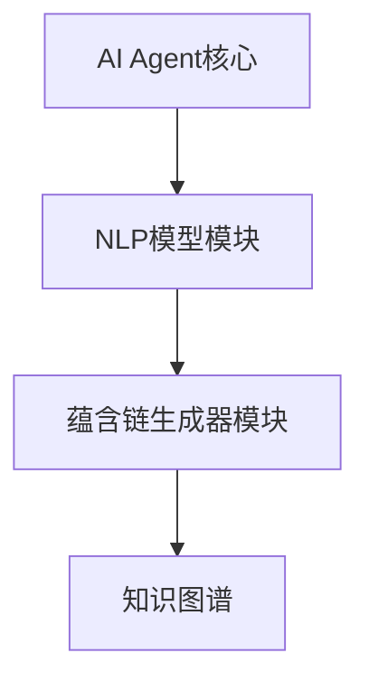

                 


# 开发AI Agent的多语言文本蕴含链生成器

## 关键词：AI Agent, 多语言文本处理, 蕴含链生成, 知识图谱, 深度学习, 自然语言处理

## 摘要：  
本文详细探讨了开发AI Agent的多语言文本蕴含链生成器的关键技术与实现方法。首先，我们从AI Agent的定义与特点出发，分析了多语言文本处理的复杂性与蕴含链生成的必要性。接着，我们深入探讨了蕴含链生成的核心算法原理，包括基于规则、统计和深度学习的方法。随后，我们详细讲解了系统的架构设计，包括NLP模型、AI Agent核心与蕴含链生成器的交互流程。最后，我们通过具体的项目实战，展示了如何实现一个高效的多语言文本蕴含链生成器，并提供了实际案例分析与最佳实践建议。

---

# 第一部分: AI Agent与多语言文本蕴含链生成器的背景介绍

## 第1章: 问题背景与定义

### 1.1 AI Agent的定义与特点
AI Agent（人工智能代理）是指能够感知环境、自主决策并执行任务的智能实体。其特点包括：
- **自主性**：能够在无外部干预的情况下运行。
- **反应性**：能够实时感知环境并做出响应。
- **目标导向**：基于目标进行决策和行动。

### 1.2 多语言文本处理的必要性
随着全球化的推进，跨语言信息处理的需求日益增加。多语言文本处理能够帮助AI Agent在不同语言的文本中提取信息，实现跨语言的知识整合。

### 1.3 蕴含链生成的核心问题
蕴含链是指从一段文本中推断出的逻辑链条，能够帮助AI Agent理解文本之间的隐含关系。蕴含链生成的核心问题包括：
- 如何从多语言文本中提取语义信息。
- 如何建立文本片段之间的逻辑关系。

## 第2章: 问题描述与挑战

### 2.1 多语言文本处理的复杂性
多语言文本处理的复杂性主要体现在：
- 不同语言的语法结构差异。
- 文化背景对语义的影响。

### 2.2 蕴含链生成的挑战
蕴含链生成的挑战包括：
- 如何处理多语言文本中的语义模糊性。
- 如何高效地生成长链蕴含关系。

### 2.3 AI Agent在多语言处理中的目标
AI Agent的目标是通过多语言文本处理和蕴含链生成，实现跨语言的知识图谱构建与智能推理。

---

# 第二部分: 核心概念与算法原理

## 第3章: 多语言文本蕴含链生成器的核心原理

### 3.1 基于规则的蕴含链生成
基于规则的方法通过预定义的语法规则来生成蕴含链。例如，使用句法分析工具（如依存句法树）来识别句子中的主谓关系，进而生成蕴含链。

### 3.2 基于统计的蕴含链生成
基于统计的方法利用概率模型来推断文本中的蕴含关系。例如，使用条件概率公式：
$$ P(h | t) = \frac{P(t, h)}{P(t)} $$
其中，$h$表示蕴含关系，$t$表示文本片段。

### 3.3 基于深度学习的蕴含链生成
基于深度学习的方法通过训练神经网络模型来生成蕴含链。常用的模型包括Transformer架构和图神经网络。

## 第4章: 算法原理的数学模型

### 4.1 基于Transformer的蕴含链生成模型
Transformer模型的注意力机制公式为：
$$ \text{Attention}(Q, K, V) = \text{softmax}\left(\frac{QK^T}{\sqrt{d_k}}\right)V $$
其中，$Q$、$K$、$V$分别为查询、键和值向量，$d_k$为键的维度。

### 4.2 图神经网络中的蕴含关系表示
图神经网络通过节点嵌入和边关系来表示蕴含链。节点嵌入公式为：
$$ h_i = \sum_{j \in \text{neighbor}(i)} W_{ij} h_j $$
其中，$h_i$表示节点$i$的嵌入向量，$W_{ij}$表示边权重。

---

# 第三部分: 系统架构与项目实战

## 第5章: 系统架构设计

### 5.1 系统功能模块
系统主要包括以下模块：
- **NLP模型模块**：负责多语言文本的分词、句法分析与语义理解。
- **AI Agent核心模块**：负责接收输入、调用NLP模块并生成决策。
- **蕴含链生成器模块**：负责从NLP模块输出中提取蕴含关系。

### 5.2 系统架构图


### 5.3 系统接口设计
- **输入接口**：接收多语言文本输入。
- **输出接口**：输出蕴含链结果和决策建议。

## 第6章: 项目实战

### 6.1 环境安装
安装Python、TensorFlow、PyTorch等依赖库。

### 6.2 核心代码实现
```python
def generate_inference_chain(text1, text2):
    # 处理text1和text2，生成蕴含关系
    return chain
```

### 6.3 案例分析
以中文和英文文本为例，展示蕴含链生成的全过程。

---

# 第四部分: 总结与展望

## 第7章: 总结与最佳实践

### 7.1 小结
本文详细探讨了开发AI Agent的多语言文本蕴含链生成器的关键技术，包括算法原理、系统架构与项目实战。

### 7.2 最佳实践
- **数据预处理**：确保多语言文本的清洗与标注。
- **模型优化**：结合领域知识优化模型参数。
- **性能测试**：定期测试系统性能并进行调优。

### 7.3 注意事项
- 注意多语言文本处理中的文化差异。
- 确保模型的可解释性与鲁棒性。

## 第8章: 未来展望

### 8.1 拓展方向
- **跨语言知识图谱构建**。
- **动态适应的蕴含链生成模型**。

### 8.2 建议
- 加强多语言NLP模型的研究。
- 探索更高效的蕴含链生成算法。

---

# 作者信息

作者：AI天才研究院 & 禅与计算机程序设计艺术

