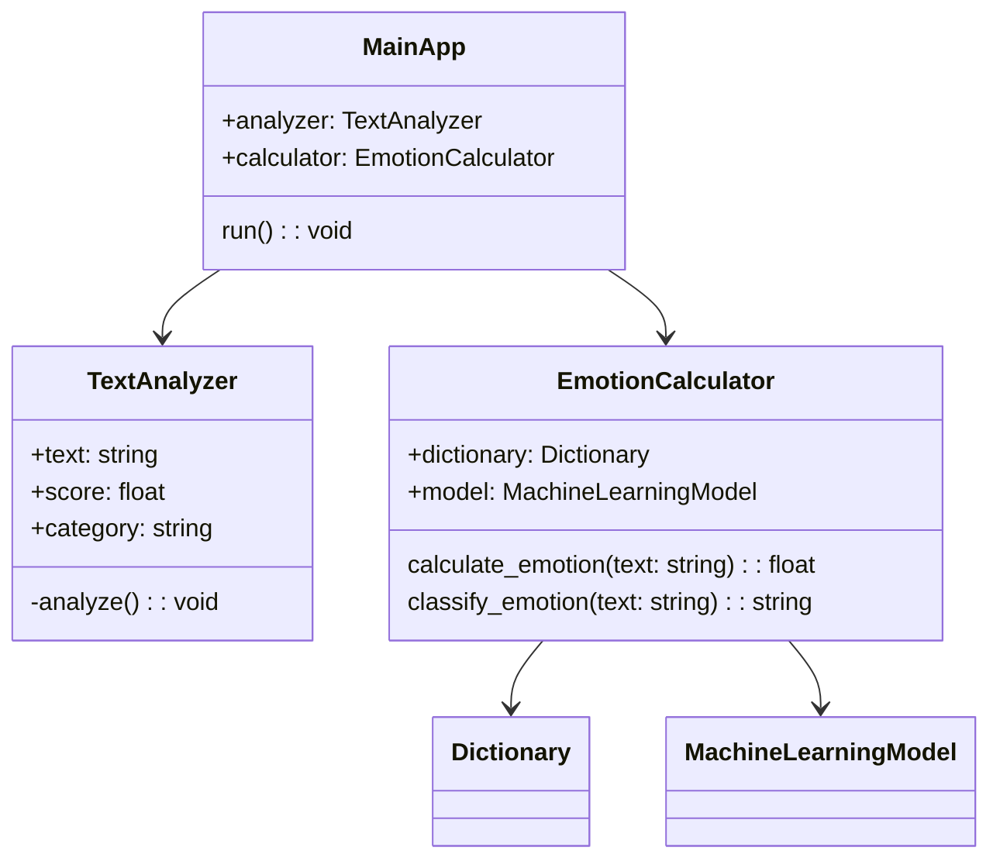
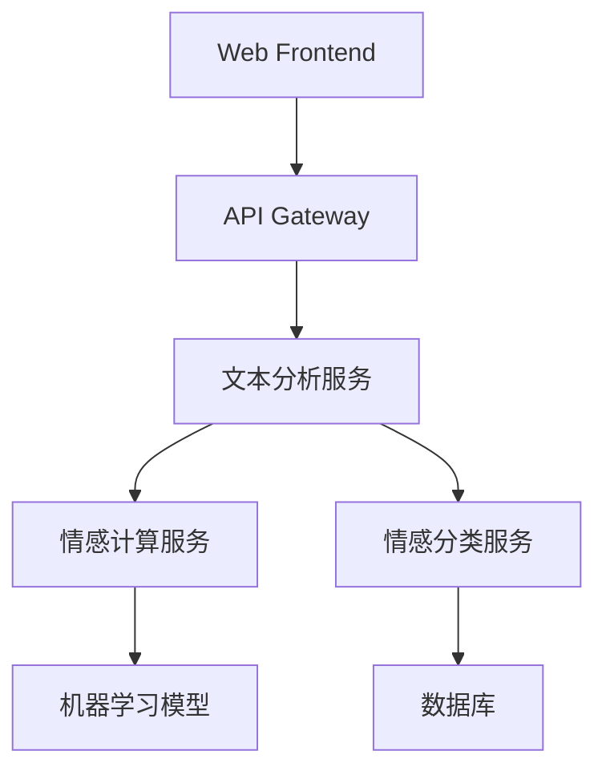
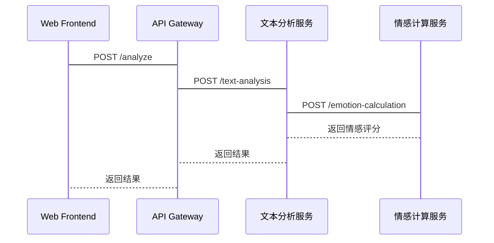

                 


# 开发AI Agent的情感计算在社交媒体分析中的应用

**关键词**：情感计算，社交媒体分析，AI Agent，自然语言处理，深度学习，情感评分，社交媒体营销

**摘要**：  
本文深入探讨了AI Agent在情感计算与社交媒体分析中的应用，从理论基础到实际案例，系统性地分析了情感计算的核心概念、算法原理、系统架构及项目实战。文章首先介绍了情感计算和社交媒体分析的背景与核心概念，随后详细讲解了情感计算的算法原理与数学模型，接着分析了系统设计与架构方案，最后通过项目实战展示了如何在实际场景中应用这些技术。本文旨在帮助读者全面理解情感计算在社交媒体分析中的应用，并为开发者提供实践指导。

---

## 第一部分：情感计算与社交媒体分析的背景介绍

### 第1章：情感计算与社交媒体分析的背景介绍

#### 1.1 情感计算的定义与核心概念

##### 1.1.1 情感计算的定义  
情感计算（Emotion Computing）是一种通过计算机技术分析、识别和理解人类情感状态的方法。它结合了自然语言处理（NLP）、机器学习和心理学知识，旨在从文本、语音或图像中提取情感信息，从而实现对人类情感的量化分析。

##### 1.1.2 情感计算的核心要素  
- **情感信息提取**：从文本中提取情感相关特征，如关键词、句式结构等。  
- **情感分类**：将文本划分为积极、消极或中性情感类别。  
- **情感强度分析**：量化情感的强度，如从0到1的强度评分。  
- **情感推理**：基于上下文理解更复杂的情感关系，如讽刺、反语等。

##### 1.1.3 情感计算在社交媒体分析中的应用前景  
社交媒体平台每天产生海量数据，包括评论、点赞、分享等互动行为。情感计算可以帮助企业从这些数据中提取用户情感，用于品牌监测、舆情分析和市场调研。此外，情感计算还可以用于个性化推荐、客户服务优化等领域。

#### 1.2 社交媒体分析的背景与挑战

##### 1.2.1 社交媒体数据的特点  
- **多样性**：社交媒体数据包括文本、图片、视频等多种形式。  
- **实时性**：社交媒体数据更新速度快，需要实时处理。  
- **情感丰富性**：社交媒体文本中蕴含大量情感信息，是情感计算的理想数据来源。

##### 1.2.2 情感分析在社交媒体中的重要性  
- **品牌声誉管理**：通过分析用户评论，帮助企业了解品牌形象。  
- **市场趋势预测**：基于用户情感数据，预测市场趋势。  
- **用户行为分析**：通过情感数据理解用户行为动机。

##### 1.2.3 情感计算在社交媒体分析中的边界与外延  
- **边界**：情感计算主要关注文本中的情感信息，不涉及图像或语音分析。  
- **外延**：情感计算可以与其他技术结合，如用户画像、行为预测等。

---

### 第2章：情感计算与社交媒体分析的核心概念

#### 2.1 情感计算的原理与方法

##### 2.1.1 基于词典的情感计算方法  
- **词典构建**：使用情感词典（如Afinn、SentiWordNet等）对文本中的关键词进行情感评分。  
- **情感评分计算**：对文本中的关键词进行加权求和，得到整体情感评分。  
- **优缺点分析**：词典方法简单高效，但难以处理复杂的情感表达（如讽刺、反语）。

##### 2.1.2 基于机器学习的情感计算方法  
- **特征提取**：将文本转换为数值特征，如TF-IDF、词嵌入（Word2Vec）。  
- **模型训练**：使用机器学习算法（如SVM、随机森林、神经网络）训练情感分类器。  
- **深度学习进展**：基于Transformer的模型（如BERT）在情感计算中的应用。

##### 2.1.3 混合模型在情感计算中的应用  
- **混合模型的优势**：结合词典方法和机器学习方法，兼顾效率与准确性。  
- **混合模型的实现**：先使用词典方法提取初步情感评分，再通过机器学习模型进行调整。

#### 2.2 情感计算与社交媒体分析的联系

##### 2.2.1 情感计算在社交媒体中的应用场景  
- **品牌监测**：实时监测品牌在社交媒体上的口碑。  
- **舆情分析**：分析公众对某一事件的情感态度。  
- **市场调研**：通过用户评论了解产品优缺点。

##### 2.2.2 情感计算与用户行为分析的结合  
- **情感与行为的关系**：情感评分可以预测用户的后续行为（如购买、分享）。  
- **行为数据的融合**：结合点击率、停留时间等行为数据，提升情感分析的准确性。

##### 2.2.3 情感计算在社交媒体营销中的作用  
- **精准营销**：根据用户情感偏好推荐相关内容。  
- **内容优化**：分析用户情感反馈，优化社交媒体内容策略。

---

## 第二部分：情感计算的算法原理与数学模型

### 第3章：情感计算的算法原理

#### 3.1 基于词典的情感计算算法

##### 3.1.1 词典构建的步骤与方法  
1. **词典收集**：收集已有的情感词典（如Afinn、SentiWordNet）。  
2. **词典扩展**：根据领域需求扩展词典，增加专业术语。  
3. **词典优化**：根据实际数据调整词典权重。

##### 3.1.2 基于词典的情感评分计算  
公式：  
$$ \text{情感评分} = \sum (\text{关键词权重} \times \text{情感极性}) $$  
例如：  
$$ \text{情感评分} = 0.5 \times (\text{“满意”} + 0.3 \times \text{“不好”}) $$  

##### 3.1.3 词典方法的优缺点分析  
- **优点**：简单高效，适用于小规模数据。  
- **缺点**：难以处理复杂情感（如讽刺、反语）。

#### 3.2 基于机器学习的情感计算算法

##### 3.2.1 机器学习在情感计算中的应用  
- **特征提取**：使用TF-IDF提取关键词特征。  
- **模型训练**：训练一个二分类模型（如SVM）进行情感分类。

##### 3.2.2 常见的情感计算算法  
- **SVM**：适合小规模数据，分类准确率高。  
- **随机森林**：适合特征较多的情况，鲁棒性强。  
- **神经网络**：适合大规模数据，可以捕捉复杂的模式。

##### 3.2.3 深度学习在情感计算中的最新进展  
- **BERT模型**：通过预训练语言模型捕捉上下文信息。  
- **情感分析任务**：使用BERT进行文本分类，效果显著提升。

---

### 第4章：情感计算的数学模型与公式

#### 4.1 情感评分计算公式

##### 4.1.1 基于词典的情感评分公式  
$$ \text{情感评分} = \sum_{i=1}^{n} (w_i \times s_i) $$  
其中，$w_i$ 是第$i$个关键词的权重，$s_i$ 是情感极性（+1表示积极，-1表示消极）。

##### 4.1.2 基于权重的改进公式  
$$ \text{情感评分} = \sum_{i=1}^{n} (w_i \times s_i \times t_i) $$  
其中，$t_i$ 是关键词的情感强度因子。

##### 4.1.3 深度学习模型中的情感评分计算  
$$ \text{情感评分} = \text{模型输出} $$  
例如，使用BERT模型进行情感分类，输出结果为积极、消极或中性。

#### 4.2 情感计算的分类模型

##### 4.2.1 二分类情感分析模型  
- **输入**：文本数据。  
- **输出**：积极（1）或消极（0）。  
- **公式**：  
  $$ y = \text{sigmoid}(w_1x_1 + w_2x_2 + \dots + w_nx_n) $$  

##### 4.2.2 多分类情感分析模型  
- **输入**：文本数据。  
- **输出**：情感类别（如积极、中性、消极）。  
- **公式**：  
  $$ y = \text{softmax}(w_1x_1 + w_2x_2 + \dots + w_nx_n) $$  

---

## 第三部分：系统分析与架构设计方案

### 第5章：系统分析与架构设计

#### 5.1 问题场景介绍  
假设我们开发一个社交媒体情感分析系统，用户可以通过输入文本获取情感评分和情感分类结果。

#### 5.2 系统功能设计

##### 5.2.1 领域模型类图  


##### 5.2.2 系统架构图  


##### 5.2.3 系统接口设计  
- **输入接口**：文本输入接口。  
- **输出接口**：情感评分输出接口、情感分类结果输出接口。  
- **API接口**：提供RESTful API，供其他系统调用。

##### 5.2.4 系统交互序列图  


---

## 第四部分：项目实战

### 第6章：项目实战

#### 6.1 环境安装

##### 6.1.1 安装Python环境  
- 使用Anaconda安装Python 3.8及以上版本。

##### 6.1.2 安装依赖库  
- 安装必要的库：  
  ```bash
  pip install numpy pandas scikit-learn transformers
  ```

#### 6.2 核心代码实现

##### 6.2.1 词典方法实现  
```python
from afinn import Afinn

af = Afinn()
text = "This product is great!"
score = af.score_words(text)
print(score)  # 输出情感评分
```

##### 6.2.2 机器学习方法实现  
```python
from sklearn.feature_extraction.text import TfidfVectorizer
from sklearn.svm import SVC

vectorizer = TfidfVectorizer()
X = vectorizer.fit_transform(text_list)
model = SVC()
model.fit(X, labels)
```

##### 6.2.3 深度学习方法实现  
```python
from transformers import pipeline

classifier = pipeline("text-classification", model="bert-base-uncased")
result = classifier("This product is great!")
print(result)  # 输出情感分类结果
```

##### 6.2.4 情感评分计算  
```python
def calculate_emotion(text):
    # 使用词典方法计算情感评分
    score = af.score(text)
    # 使用机器学习模型进行分类
    prediction = model.predict(vectorizer.transform([text]))
    return score, prediction[0]
```

#### 6.3 代码应用解读与分析  
- **词典方法**：简单高效，适合小规模数据。  
- **机器学习方法**：准确率高，适合中等规模数据。  
- **深度学习方法**：效果最优，适合大规模数据。

#### 6.4 实际案例分析  
- **案例背景**：分析用户对某产品的评论。  
- **案例分析**：通过情感计算，发现用户普遍对产品质量满意，但对售后服务不满。  
- **案例结果**：企业可以优化售后服务策略。

#### 6.5 项目小结  
通过本项目，我们学会了如何在实际场景中应用情感计算技术，从数据处理到模型训练，再到结果分析，完整地实现了一个社交媒体情感分析系统。

---

## 第五部分：结论与展望

### 第7章：结论与展望

#### 7.1 最佳实践

##### 7.1.1 小结  
情感计算在社交媒体分析中具有重要的应用价值，可以帮助企业更好地理解用户情感，优化产品和服务。

##### 7.1.2 注意事项  
- 数据预处理是关键，需注意停用词处理和特征提取。  
- 模型选择需根据数据规模和任务需求灵活调整。  
- 实际应用中需考虑模型的可解释性和鲁棒性。

##### 7.1.3 未来趋势  
- **多模态情感计算**：结合文本、图像、语音等多种模态信息。  
- **实时情感分析**：提升模型的实时性，适用于直播、实时舆情分析等场景。  
- **个性化情感计算**：根据用户特征提供个性化情感分析服务。

##### 7.1.4 拓展阅读  
- 《Deep Learning for NLP》  
- 《自然语言处理实战》  
- 《情感计算与人机交互》

---

## 作者信息

作者：AI天才研究院/AI Genius Institute  
联系邮箱：contact@aicourse.com  
版权所有：© 2023 AI天才研究院

