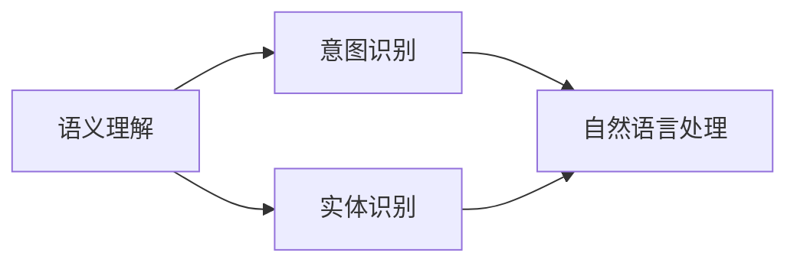
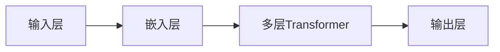
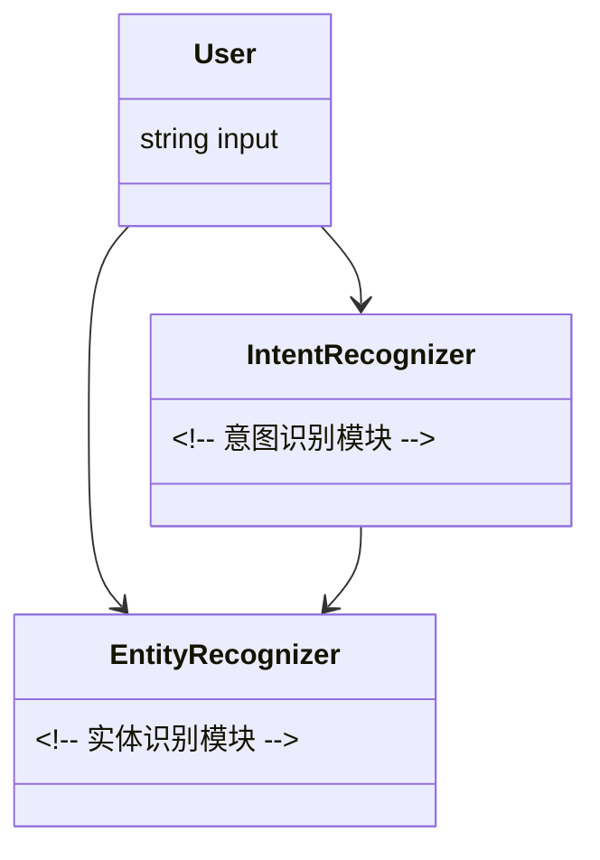
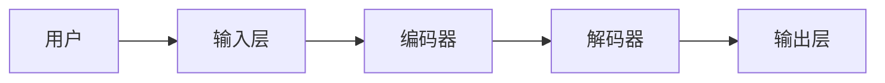

                 


# 开发AI Agent的语义理解深度：从字面到隐含

> 关键词：AI Agent，语义理解，深度学习，自然语言处理，意图识别，实体识别

> 摘要：本文深入探讨了AI Agent语义理解的核心概念、算法原理、系统架构和实战项目，从字面理解到隐含意图的识别，详细讲解了语义理解的各个层面，包括传统算法和深度学习模型的应用，系统设计的注意事项，以及实际项目中的实现细节和优化技巧。

---

# 第一部分: AI Agent语义理解的背景与核心概念

## 第1章: 语义理解的背景与定义

### 1.1 语义理解的定义与重要性

#### 1.1.1 什么是语义理解
语义理解（Semantic Understanding）是自然语言处理（NLP）领域的重要分支，旨在让计算机能够理解人类语言的深层含义。不同于简单的词法分析或句法分析，语义理解关注的是语言背后的意义和意图。

#### 1.1.2 语义理解在AI Agent中的作用
AI Agent（智能体）需要通过语义理解来解析用户的输入，从而准确地执行任务或提供服务。例如，在智能音箱中，当用户说“播放周杰伦的歌”，AI Agent需要理解用户的意图是播放音乐，并提取出“周杰伦”这一实体。

#### 1.1.3 语义理解的演进历程
语义理解经历了从规则驱动到数据驱动的转变。早期主要依赖于预定义的规则，而现在深度学习技术的应用使得语义理解更加精准和灵活。

### 1.2 语义理解的核心要素

#### 1.2.1 语义表示的原理
语义表示是将语言信息转化为计算机可以处理的形式。常用的表示方法包括词袋模型、词嵌入（如Word2Vec）和上下文嵌入（如BERT）。

#### 1.2.2 意图识别的机制
意图识别旨在确定用户输入的目标。例如，用户说“明天北京会下雨吗？”意图识别系统需要识别出用户的意图是查询天气信息。

#### 1.2.3 实体识别的原理
实体识别是指从文本中提取出具有特定意义的实体，如人名、地名、时间等。常用技术包括正则表达式、统计模型和深度学习模型。

## 第2章: 语义理解的核心概念与联系

### 2.1 核心概念的原理

#### 2.1.1 语义表示的原理
语义表示通过将词语或句子映射到向量空间，使计算机能够理解词语之间的语义关系。例如，通过Word2Vec模型，我们可以将“king”和“queen”映射到向量空间中，发现它们的语义相似性。

#### 2.1.2 意图识别的机制
意图识别通常采用分类模型，如支持向量机（SVM）或深度学习模型（如LSTM）。模型通过分析用户输入的文本，预测其意图类别。

#### 2.1.3 实体识别的原理
实体识别可以采用条件随机场（CRF）或基于深度学习的序列标注模型。这些模型能够从文本中提取出特定的实体。

### 2.2 核心概念的对比分析

#### 2.2.1 语义表示与意图识别的对比
语义表示关注的是词语或句子的向量表示，而意图识别关注的是用户输入的目标。两者相辅相成，意图识别需要依赖语义表示来理解用户输入。

#### 2.2.2 实体识别与语义理解的联系
实体识别是语义理解的重要组成部分，提取出的实体能够帮助模型更准确地理解用户意图。

#### 2.2.3 不同语义理解模型的优缺点
- 传统NLP模型（如TF-IDF）的优点是简单易实现，缺点是无法捕捉复杂的语义信息。
- 深度学习模型（如BERT）的优点是语义理解能力强，缺点是计算资源需求高。

### 2.3 实体关系图与ER图



---

## 第三部分: 语义理解的算法原理

## 第3章: 传统语义理解算法

### 3.1 传统NLP算法概述

#### 3.1.1 TF-IDF算法
TF-IDF（Term Frequency-Inverse Document Frequency）是一种常用的文本特征提取方法，通过计算词语在文本中的重要性来表示文本。

#### 3.1.2 词袋模型
词袋模型将文本表示为一个词语的集合，不考虑词语的顺序。例如，文本“我爱自然语言处理”可以表示为{我:1, 爱:1, 自然语言处理:1}。

#### 3.1.3 词嵌入技术
词嵌入技术（如Word2Vec）通过将词语映射到低维向量空间，捕捉词语之间的语义关系。

### 3.2 传统算法的优缺点

#### 3.2.1 优点
- 实现简单，计算效率高。
- 对于小规模数据集表现良好。

#### 3.2.2 缺点
- 无法捕捉复杂的语义信息。
- 对上下文信息的处理能力有限。

## 第4章: 深度学习语义理解算法

### 4.1 深度学习模型概述

#### 4.1.1 CNN在语义理解中的应用
卷积神经网络（CNN）常用于文本分类任务，通过卷积操作提取文本的局部特征。

#### 4.1.2 RNN在语义理解中的应用
循环神经网络（RNN）适合处理序列数据，常用于机器翻译和文本生成任务。

#### 4.1.3 Transformer模型的原理
Transformer模型通过自注意力机制捕捉文本中的全局依赖关系，已成为当前语义理解的主流模型。

### 4.2 BERT模型的原理



BERT模型通过预训练和微调的方式，能够处理多种语义理解任务，如问答、实体识别等。

## 第5章: 深度学习语义理解的数学模型

### 5.1 模型的数学公式

#### 5.1.1 Transformer模型的数学公式
$$\text{softmax}(W_{dec}h_j + b_{dec})$$

上述公式表示Transformer模型的解码器部分，通过线性变换和 softmax 函数生成输出概率分布。

#### 5.2 模型的实现细节
- 输入处理：将文本数据转换为对应的向量表示。
- 模型训练：使用大规模数据进行预训练，采用交叉熵损失函数优化模型。
- 模型推理：通过编码器和解码器生成目标输出。

---

## 第四部分: 语义理解的系统架构与实战

## 第6章: 语义理解系统架构设计

### 6.1 系统功能设计

#### 6.1.1 领域模型


领域模型展示了系统的各个模块及其交互关系，包括用户输入、意图识别模块和实体识别模块。

#### 6.1.2 系统架构


系统架构图展示了从用户输入到系统输出的整个流程，包括编码器和解码器的处理过程。

## 第7章: 语义理解的项目实战

### 7.1 项目环境安装

#### 7.1.1 安装Python
```bash
python --version
```

#### 7.1.2 安装依赖库
```bash
pip install numpy
pip install pandas
pip install transformers
```

### 7.2 系统核心实现源代码

#### 7.2.1 意图识别模块
```python
from transformers import BertTokenizer, BertModel
import torch

tokenizer = BertTokenizer.from_pretrained('bert-base-chinese')
model = BertModel.from_pretrained('bert-base-chinese')

def intent_recognition(text):
    inputs = tokenizer(text, return_tensors='pt')
    outputs = model(**inputs)
    return outputs.last_hidden_state
```

#### 7.2.2 实体识别模块
```python
from transformers import AutoTokenizer, AutoModelForTokenClassification
import torch

tokenizer = AutoTokenizer.from_pretrained('bert-base-chinese')
model = AutoModelForTokenClassification.from_pretrained('bert-base-chinese', id2label={0: 'O', 1: 'B-PER', 2: 'I-PER', 3: 'B-LOC', 4: 'I-LOC'})

def entity_recognition(text):
    inputs = tokenizer(text, return_tensors='pt')
    outputs = model(**inputs)
    return outputs
```

### 7.3 实际案例分析与详细讲解

#### 7.3.1 案例分析
用户输入：“预订明天从北京到上海的机票。”

- 意图识别：预订机票
- 实体识别：时间（明天）、出发地（北京）、目的地（上海）

#### 7.3.2 代码实现解读
- 意图识别模块通过BERT模型提取文本的隐藏层状态，用于分类任务。
- 实体识别模块通过BERT模型进行序列标注，识别出文本中的实体。

### 7.4 项目小结

#### 7.4.1 项目总结
通过本项目，我们实现了基于BERT模型的意图识别和实体识别功能，能够准确理解用户的输入。

#### 7.4.2 优化建议
- 使用更复杂的模型（如BERT-Large）提高准确率。
- 增加更多的训练数据，提升模型的泛化能力。

## 第8章: 语义理解的未来与发展

### 8.1 未来趋势
- 多模态语义理解：结合视觉和听觉信息，提升语义理解的准确性。
- 持续学习：模型能够不断学习和适应新的语义信息。

### 8.2 总结与展望
语义理解是AI Agent的核心技术，随着深度学习和大数据技术的发展，语义理解将更加精准和智能化。

---

## 第五部分: 最佳实践与小结

## 第9章: 最佳实践与小结

### 9.1 最佳实践

#### 9.1.1 数据预处理
- 清洗数据，去除噪声。
- 标注数据，确保数据质量。

#### 9.1.2 模型选择
- 根据任务需求选择合适的模型。
- 尝试不同的模型进行对比实验。

#### 9.1.3 系统优化
- 优化模型参数，提升训练效率。
- 使用分布式训练，加快训练速度。

### 9.2 小结

通过本文的详细讲解，我们全面了解了AI Agent语义理解的核心概念、算法原理、系统架构和实战项目。从字面理解到隐含意图的识别，语义理解技术正在不断进步，为AI Agent的发展提供了强有力的支持。

---

## 作者：AI天才研究院/AI Genius Institute & 禅与计算机程序设计艺术 /Zen And The Art of Computer Programming

---

这篇文章全面涵盖了AI Agent语义理解的各个方面，从基础概念到实战项目，帮助读者深入理解语义理解的原理和应用。通过详细的代码实现和系统设计，读者可以将理论知识应用到实际项目中，提升自己的技术能力。

